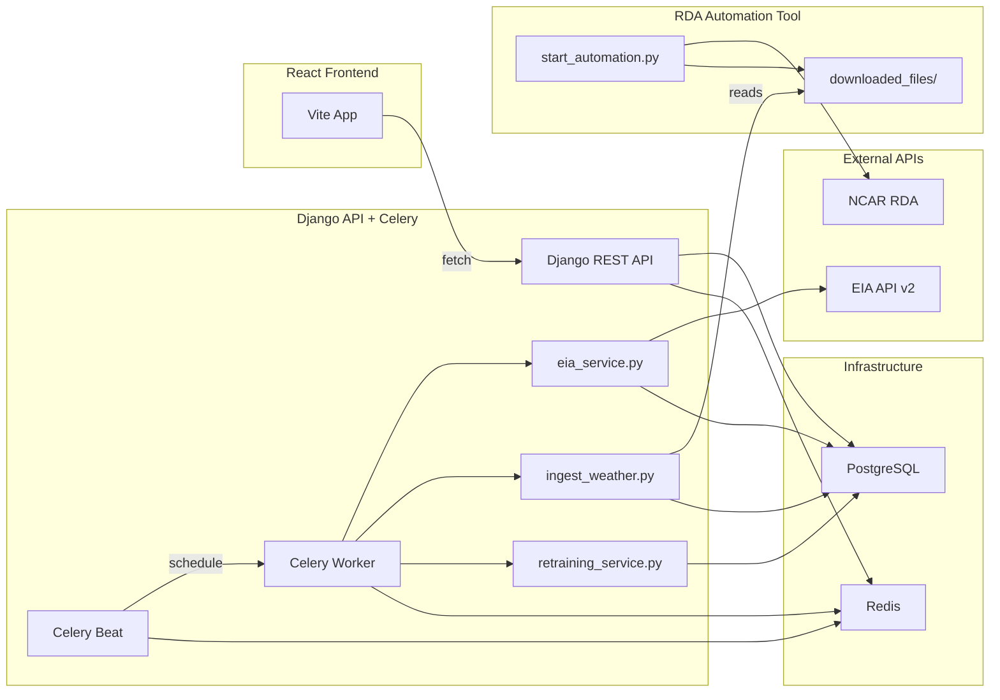

# Deployment and Integration Steps

All code is written. This plan covers the runtime steps to make everything actually run, how to verify each layer, and the one remaining code gap (ML pipeline wiring).

## Architecture overview



---

## Step 1: Install system dependencies

You need three things running on your machine: PostgreSQL, Redis, and the eccodes C library (for weather GRIB parsing).

```bash
brew install postgresql@16 redis eccodes
brew services start postgresql@16
brew services start redis
```

Verify they're running:
```bash
pg_isready          # should print "accepting connections"
redis-cli ping      # should print "PONG"
python -m cfgrib selfcheck   # should print version info (after pip install)
```

---

## Step 2: Create the PostgreSQL database

```bash
createdb carboncast
createuser carboncast
psql -c "ALTER USER carboncast WITH PASSWORD 'your_password_here';"
psql -c "GRANT ALL PRIVILEGES ON DATABASE carboncast TO carboncast;"
```

---

## Step 3: Create your `.env` file

Copy the example and fill in real values:

```bash
cd UCSC_CarbonCast_API/CarbonCast/src/CarbonCastAPI
cp .env.example .env
```

At minimum, set these in `.env`:
- `DJANGO_SECRET_KEY` -- generate with `python -c "from django.core.management.utils import get_random_secret_key; print(get_random_secret_key())"`
- `DJANGO_DEBUG=True` (for local dev)
- `DB_NAME=carboncast`, `DB_USER=carboncast`, `DB_PASSWORD=your_password_here`
- `EIA_API_KEY` -- your actual EIA key
- `RDA_DOWNLOAD_DIR` -- absolute path to `UCSC_OSRE_CC_automation_tool/CarbonCast/downloaded_files`
- `RDA_CONFIG_PATH` -- absolute path to `UCSC_OSRE_CC_automation_tool/CarbonCast/config/automation_config.json`

You also need a way to load the `.env` file. Options:
- Install `python-dotenv` and add `from dotenv import load_dotenv; load_dotenv()` at the top of `manage.py` and `celery.py`
- Or `export $(cat .env | xargs)` before running commands
- Or use `direnv`

---

## Step 4: Install Python dependencies and run migrations

```bash
cd UCSC_CarbonCast_API/CarbonCast
pip install -r requirements.txt

cd src/CarbonCastAPI
python manage.py makemigrations CarbonCastRESTAPI
python manage.py migrate
```

`makemigrations` will detect: `WeatherForecast`, `ModelRun`, and the new `forecast_horizon` + `batch_id` fields on `Forecast96`. Confirm the migration file looks right, then `migrate` applies everything to PostgreSQL.

---

## Step 5: Verify Django starts and endpoints work

```bash
python manage.py runserver
```

Then test in another terminal:
```bash
curl http://localhost:8000/v1/SupportedRegions
curl http://localhost:8000/v1/DataFreshness
```

Both should return valid JSON. `DataFreshness` will show empty lists since there's no data yet -- that's expected.

---

## Step 6: Verify Celery starts and the heartbeat fires

Terminal 1 -- worker:
```bash
celery -A CarbonCastAPI worker --loglevel=info
```

Terminal 2 -- beat:
```bash
celery -A CarbonCastAPI beat --loglevel=info --scheduler django_celery_beat.schedulers:DatabaseScheduler
```

Terminal 3 -- trigger heartbeat manually:
```bash
python manage.py shell -c "from CarbonCastRESTAPI.tasks import heartbeat; print(heartbeat.delay().get(timeout=10))"
```

Should print `ok`. If it does, Celery + Redis + Django ORM are all connected.

---

## Step 7: Test daily EIA ingestion end-to-end

```bash
python manage.py shell -c "
from CarbonCastRESTAPI.tasks import fetch_daily_energy_data
result = fetch_daily_energy_data.delay('2025-12-01')
print(result.get(timeout=120))
"
```

This will call the EIA API for all 32 balancing authorities for that date. Check:
```bash
python manage.py shell -c "
from CarbonCastRESTAPI.models import EmissionActual
print('Rows:', EmissionActual.objects.count())
print('Regions:', list(EmissionActual.objects.values_list('region', flat=True).distinct()[:5]))
"
```

Re-run for the same date -- row count should stay the same (idempotent).

Then verify the endpoint reflects the data:
```bash
curl http://localhost:8000/v1/DataFreshness
```

---

## Step 8: Test the weather bridge

If the RDA automation tool has already downloaded files into `downloaded_files/`:

```bash
python manage.py ingest_weather --path /path/to/UCSC_OSRE_CC_automation_tool/CarbonCast/downloaded_files
```

Check:
```bash
python manage.py shell -c "
from CarbonCastRESTAPI.models import WeatherForecast
print('Weather rows:', WeatherForecast.objects.count())
"
```

If the automation tool hasn't run yet, start it in its own venv first:
```bash
cd UCSC_OSRE_CC_automation_tool/CarbonCast
python -m venv .venv && source .venv/bin/activate
pip install -r requirements.txt
cd src/python
python start_automation.py --start
```

---

## Step 9: Wire the ML pipeline (the one code gap)

The retraining service at [retraining_service.py](UCSC_CarbonCast_API/CarbonCast/src/CarbonCastAPI/CarbonCastRESTAPI/services/retraining_service.py) currently prepares data but stubs the actual ML calls. To close the loop, `_retrain_region()` needs to:

1. Write a temporary JSON config file matching the structure of [firstTierConfig.json](UCSC_CarbonCast_API/CarbonCast/src/firstTierConfig.json) -- populated with the temp CSV paths and region info
2. Add `CarbonCast/src/` to `sys.path` and call `runFirstTier(temp_config_path)` from [firstTierForecasts.py](UCSC_CarbonCast_API/CarbonCast/src/firstTierForecasts.py)
3. Call `runSecondTier(temp_config_path, '-l', False)` from [secondTierForecasts.py](UCSC_CarbonCast_API/CarbonCast/src/secondTierForecasts.py) for lifecycle, and `('-d', False)` for direct
4. Read the output CSVs and write rows to `Forecast96` with `forecast_horizon=168` and the `batch_id`

Key config fields the ML scripts expect:
- `REGION`: list of region codes
- `TRAINING_WINDOW_HOURS`, `PREDICTION_WINDOW_HOURS`, `MODEL_SLIDING_WINDOW_LEN`
- Per-region: `IN_FILE_NAME_PREFIX`, `WEATHER_FORECAST_IN_FILE_NAME`, `SAVED_MODEL_LOCATION`, `OUT_FILE_NAME_PREFIX`

This is the most complex remaining work because it requires understanding the exact CSV column formats that `firstTierForecasts.py` expects and matching the DB export to those formats.

---

## Step 10: Verify the frontend connects

```bash
cd CarbonCastUI/web
echo "VITE_API_BASE_URL=http://localhost:8000" > .env.local
npm install
npm run dev
```

Open the browser and check that Past/Now/Future toggles show data (assuming Step 7 populated some emission rows).

---

## Step 11: Set up periodic task schedules

Once everything works manually, register the schedules via Django admin or shell:

```bash
python manage.py shell -c "
from django_celery_beat.models import PeriodicTask, CrontabSchedule

# Daily EIA ingestion at 6 AM UTC
daily, _ = CrontabSchedule.objects.get_or_create(hour=6, minute=0)
PeriodicTask.objects.get_or_create(
    name='Daily EIA ingestion',
    defaults={'task': 'CarbonCastRESTAPI.tasks.fetch_daily_energy_data', 'crontab': daily}
)

# Weather bridge every 2 hours
every2h, _ = CrontabSchedule.objects.get_or_create(hour='*/2', minute=0)
PeriodicTask.objects.get_or_create(
    name='Weather bridge',
    defaults={'task': 'CarbonCastRESTAPI.tasks.ingest_rda_weather_data', 'crontab': every2h}
)

# Monday 3 AM: generate control files
mon3am, _ = CrontabSchedule.objects.get_or_create(hour=3, minute=0, day_of_week=1)
PeriodicTask.objects.get_or_create(
    name='Weekly CTL generation',
    defaults={'task': 'CarbonCastRESTAPI.tasks.trigger_rda_control_files', 'crontab': mon3am}
)

# Monday 5 AM: weather freshness check
mon5am, _ = CrontabSchedule.objects.get_or_create(hour=5, minute=0, day_of_week=1)
PeriodicTask.objects.get_or_create(
    name='Weather freshness check',
    defaults={'task': 'CarbonCastRESTAPI.tasks.check_weather_freshness_and_fallback', 'crontab': mon5am}
)

# Monday 6 AM: model retraining
mon6am, _ = CrontabSchedule.objects.get_or_create(hour=6, minute=0, day_of_week=1)
PeriodicTask.objects.get_or_create(
    name='Weekly model retraining',
    defaults={'task': 'CarbonCastRESTAPI.tasks.retrain_models', 'crontab': mon6am}
)

print('All schedules registered')
"
```

---

## Step 12: Fix docker-compose (optional, for deployment)

The existing [docker-compose.yml](UCSC_CarbonCast_API/CarbonCast/docker-compose.yml) references a non-existent Dockerfile and mounts `db.sqlite3`. It needs to be updated to:
- Point to a real Dockerfile (or create one)
- Add `postgres` and `redis` services
- Add a `celery-worker` and `celery-beat` service
- Remove the `db.sqlite3` volume mount
- Pass `.env` to all services

---

## Verification checklist (in order)

1. `pg_isready` prints "accepting connections"
2. `redis-cli ping` prints "PONG"
3. `python manage.py migrate` exits 0
4. `python manage.py runserver` starts without errors
5. `curl /v1/SupportedRegions` returns JSON
6. `celery -A CarbonCastAPI worker` starts without import errors
7. `heartbeat.delay().get()` returns "ok"
8. `fetch_daily_energy_data` for a past date inserts rows
9. Re-running for the same date does not change row count
10. `curl /v1/DataFreshness` shows timestamps
11. `ingest_weather` processes downloaded files (if available)
12. Frontend `npm run dev` loads and shows data
13. Celery Beat fires scheduled tasks on cron
