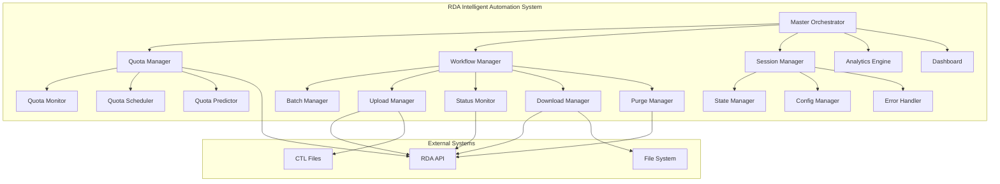
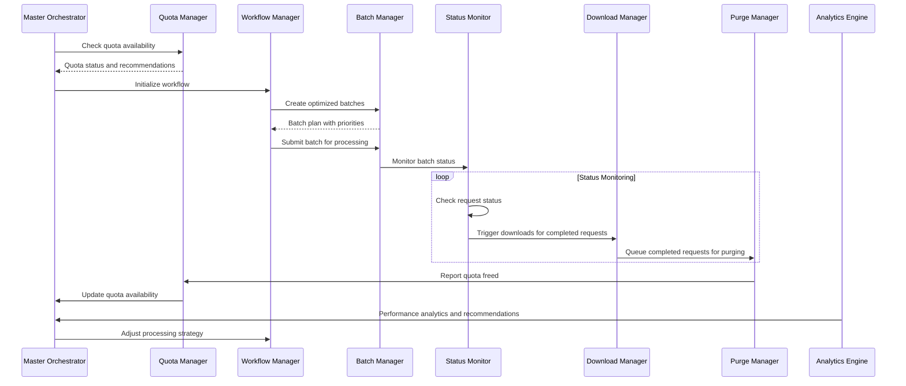
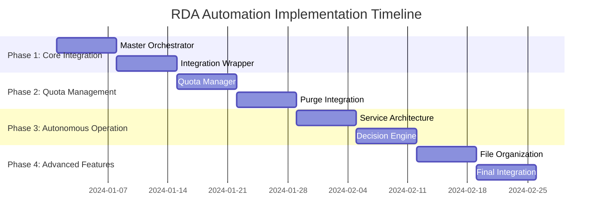
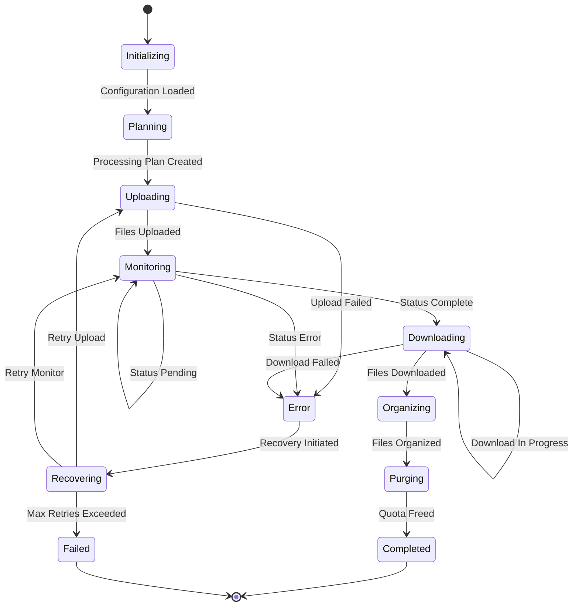

# RDA Automation System: Comprehensive Architecture Analysis and Refactoring Plan

## Executive Summary

This document presents a comprehensive architecture analysis of the existing RDA (Research Data Archive) automation system and provides a detailed refactoring plan for implementing a fully automated, intelligent file processing system capable of handling 200+ CTL files across 85+ regions with continuous operation for weeks.

**Current State**: The system has solid foundational components but requires significant architectural improvements for full automation.

**Target State**: A fully autonomous, intelligent system with advanced quota management, error recovery, and continuous operation capabilities.

---

## 1. Current System Architecture Analysis

### 1.1 Existing Components Assessment

#### **Core Scripts Analysis**

**[`upload_files.py`](src/python/upload_files.py)**
- **Strengths**: Simple, functional file upload mechanism
- **Weaknesses**: 
  - Hardcoded file list (only 8 files vs 200+ required)
  - No error handling or retry logic
  - Manual operation only
  - No progress tracking
  - No integration with automation framework

**[`download_files.py`](src/python/download_files.py)**
- **Strengths**: 
  - Complex coordinate matching logic
  - Region/parameter extraction capabilities
  - File organization by region and parameter
- **Weaknesses**:
  - Hardcoded region coordinates
  - No automated status monitoring
  - Manual download triggering
  - Limited error handling
  - No resume capability

#### **Automation Framework Analysis**

**[`batch_manager.py`](src/python/automation/batch_manager.py)** ⭐ **EXCELLENT**
- **Strengths**:
  - Sophisticated priority-based scheduling
  - Adaptive batch sizing algorithms
  - Geographic and parameter clustering
  - Performance tracking and optimization
  - Thread-safe operations
- **Minor Improvements Needed**:
  - Integration with quota monitoring
  - Enhanced failure recovery

**[`config_manager.py`](src/python/automation/config_manager.py)** ⭐ **EXCELLENT**
- **Strengths**:
  - Comprehensive configuration validation
  - Environment-specific overrides
  - Runtime configuration updates
  - Schema validation with jsonschema
- **Ready for Production**: Minimal changes needed

**[`error_handler.py`](src/python/automation/error_handler.py)** ⭐ **EXCELLENT**
- **Strengths**:
  - Sophisticated error classification
  - Multiple retry strategies
  - Dead letter queue implementation
  - Exponential backoff with jitter
- **Ready for Production**: Well-designed for autonomous operation

**[`status_monitor.py`](src/python/automation/status_monitor.py)** ⭐ **EXCELLENT**
- **Strengths**:
  - Adaptive polling strategies
  - Concurrent monitoring
  - Status caching
  - Automatic download triggering
- **Minor Enhancements**: Quota-aware monitoring

**[`download_manager.py`](src/python/automation/download_manager.py)** ⭐ **EXCELLENT**
- **Strengths**:
  - Resume capability
  - File organization
  - Concurrent downloads
  - Integrity verification
- **Ready for Production**: Comprehensive implementation

**[`purge_manager.py`](src/python/automation/purge_manager.py)** ⭐ **EXCELLENT**
- **Strengths**:
  - Safety checks and confirmation
  - Audit logging
  - Retention policies
  - Automated purging
- **Perfect for Quota Management**: Ideal for automated cleanup

**[`analytics_engine.py`](src/python/automation/analytics_engine.py)** ⭐ **EXCELLENT**
- **Strengths**:
  - Pattern analysis
  - Performance trends
  - Bottleneck identification
  - Predictive analytics
- **Value-Add**: Provides intelligence for optimization

**[`state_manager.py`](src/python/automation/state_manager.py)** ⭐ **EXCELLENT**
- **Strengths**:
  - SQLite persistence
  - Checkpoint system
  - Progress tracking
  - Resume capability
- **Critical for Continuous Operation**: Essential for weeks-long runtime

### 1.2 Architecture Strengths

1. **Modular Design**: Well-separated concerns with clear interfaces
2. **Comprehensive Error Handling**: Sophisticated retry and recovery mechanisms
3. **State Persistence**: Robust checkpoint and resume capabilities
4. **Performance Optimization**: Adaptive algorithms and intelligent batching
5. **Configuration Management**: Flexible, validated configuration system
6. **Monitoring and Analytics**: Advanced monitoring and performance analysis
7. **Thread Safety**: Proper concurrent operation support

### 1.3 Architecture Weaknesses and Gaps

1. **Missing Master Orchestrator**: No central coordination component
2. **Incomplete Integration**: Core scripts not integrated with automation framework
3. **No Quota Management**: Missing intelligent API quota monitoring and management
4. **Limited Autonomous Operation**: Requires manual intervention for full workflow
5. **No Continuous Operation Design**: Missing long-running service architecture
6. **Incomplete CTL File Discovery**: No automated discovery of all 200+ files

---

## 2. Current Automation Capabilities and Limitations

### 2.1 Current Capabilities

✅ **Batch Processing**: Intelligent batching with adaptive sizing
✅ **Error Recovery**: Comprehensive error handling with retry logic
✅ **Status Monitoring**: Automated status checking with adaptive polling
✅ **File Organization**: Automatic file organization by region/parameter
✅ **Progress Tracking**: Detailed progress monitoring and reporting
✅ **Configuration Management**: Flexible configuration with validation
✅ **State Persistence**: Checkpoint and resume capabilities
✅ **Performance Analytics**: Advanced performance analysis and optimization

### 2.2 Current Limitations

❌ **Scale**: Only 8 files processed vs 200+ required
❌ **Manual Operation**: Requires manual initiation and coordination
❌ **No Quota Management**: No intelligent API quota monitoring
❌ **Limited Integration**: Core scripts not integrated with automation
❌ **No Continuous Operation**: Not designed for weeks-long autonomous operation
❌ **Missing Orchestration**: No central coordination of the full workflow

---

## 3. Code Quality and Maintainability Assessment

### 3.1 Code Quality Score: **A- (Excellent)**

**Strengths**:
- **Clean Architecture**: Well-structured with clear separation of concerns
- **Comprehensive Documentation**: Excellent docstrings and type hints
- **Error Handling**: Robust error handling throughout
- **Testing Framework**: Integration tests present
- **Configuration-Driven**: Highly configurable system
- **Thread Safety**: Proper concurrent programming practices

**Areas for Improvement**:
- **Integration Layer**: Missing integration wrapper for core scripts
- **Service Architecture**: Needs long-running service design
- **Monitoring Integration**: Enhanced monitoring for continuous operation

### 3.2 Maintainability Score: **A (Excellent)**

- **Modular Design**: Easy to modify individual components
- **Configuration-Driven**: Changes can be made without code modifications
- **Comprehensive Logging**: Excellent debugging and monitoring capabilities
- **State Management**: Easy to track and debug system state
- **Analytics Integration**: Built-in performance monitoring and optimization

---

## 4. Intelligent Automation Architecture Design

### 4.1 Master Orchestrator Design



### 4.2 Continuous API Quota Monitoring System

#### **Quota Manager Component**

```python
class QuotaManager:
    """
    Intelligent API quota management with predictive scheduling.
    
    Features:
    - Real-time quota monitoring
    - Predictive quota usage modeling
    - Intelligent request scheduling
    - Automatic purge triggering
    - Load balancing across time windows
    """
    
    def __init__(self, config_manager, state_manager):
        self.quota_monitor = QuotaMonitor(config_manager)
        self.quota_scheduler = QuotaScheduler(config_manager)
        self.quota_predictor = QuotaPredictor(state_manager)
        self.purge_trigger = PurgeTrigger(config_manager)
    
    async def monitor_and_schedule(self):
        """Continuous quota monitoring and intelligent scheduling."""
        while True:
            current_usage = await self.quota_monitor.get_current_usage()
            predicted_usage = self.quota_predictor.predict_usage(hours_ahead=24)
            
            if self.should_trigger_purge(current_usage, predicted_usage):
                await self.purge_trigger.trigger_intelligent_purge()
            
            optimal_schedule = self.quota_scheduler.calculate_optimal_schedule(
                current_usage, predicted_usage
            )
            
            await self.apply_schedule(optimal_schedule)
            await asyncio.sleep(self.monitoring_interval)
```

#### **Quota Monitoring Algorithms**

1. **Real-time Usage Tracking**
   - Monitor active requests vs quota limits
   - Track request completion rates
   - Predict quota exhaustion timing

2. **Intelligent Purge Triggering**
   - Trigger purges when quota utilization > 80%
   - Prioritize completed downloads for purging
   - Maintain safety buffer for critical operations

3. **Predictive Scheduling**
   - Machine learning-based usage prediction
   - Optimal request timing calculation
   - Load balancing across time windows

### 4.3 Multi-Region Processing with Smart Quota Management

#### **Regional Processing Strategy**

```python
class RegionalProcessor:
    """
    Intelligent multi-region processing with quota awareness.
    """
    
    def __init__(self, quota_manager, batch_manager):
        self.quota_manager = quota_manager
        self.batch_manager = batch_manager
        self.region_prioritizer = RegionPrioritizer()
        self.load_balancer = RegionalLoadBalancer()
    
    async def process_all_regions(self, regions: List[str]):
        """Process all regions with intelligent quota management."""
        prioritized_regions = self.region_prioritizer.prioritize(regions)
        
        for region_batch in self.create_regional_batches(prioritized_regions):
            quota_available = await self.quota_manager.check_availability()
            
            if not quota_available:
                await self.quota_manager.wait_for_quota()
            
            optimal_batch_size = self.calculate_optimal_batch_size(
                region_batch, quota_available
            )
            
            await self.process_regional_batch(region_batch, optimal_batch_size)
```

#### **Smart Quota Management Features**

1. **Dynamic Batch Sizing**
   - Adjust batch sizes based on available quota
   - Prioritize high-value regions when quota is limited
   - Implement quota-aware scheduling algorithms

2. **Regional Load Balancing**
   - Distribute processing across regions
   - Balance quota usage across geographic areas
   - Optimize for time zone considerations

3. **Intelligent Queuing**
   - Priority queues for different region types
   - Quota-aware queue management
   - Dynamic reordering based on quota availability

---

## 5. Autonomous Operation System Design

### 5.1 Continuous Runtime Architecture

#### **Service-Based Architecture**

```python
class RDAAutomationService:
    """
    Long-running service for continuous RDA automation.
    
    Features:
    - Weeks-long continuous operation
    - Automatic recovery and restart
    - Health monitoring and self-healing
    - Graceful shutdown and resume
    """
    
    def __init__(self):
        self.master_orchestrator = MasterOrchestrator()
        self.health_monitor = HealthMonitor()
        self.recovery_manager = RecoveryManager()
        self.service_state = ServiceState.INITIALIZING
    
    async def run_continuous_service(self):
        """Main service loop for continuous operation."""
        try:
            await self.initialize_service()
            self.service_state = ServiceState.RUNNING
            
            while self.service_state == ServiceState.RUNNING:
                await self.master_orchestrator.process_cycle()
                await self.health_monitor.check_system_health()
                
                if self.health_monitor.requires_recovery():
                    await self.recovery_manager.perform_recovery()
                
                await asyncio.sleep(self.cycle_interval)
                
        except Exception as e:
            await self.recovery_manager.handle_critical_failure(e)
```

#### **Health Monitoring and Self-Healing**

1. **System Health Checks**
   - API connectivity monitoring
   - Database health verification
   - Disk space monitoring
   - Memory usage tracking

2. **Automatic Recovery Procedures**
   - Service restart on failure
   - Database connection recovery
   - State restoration from checkpoints
   - Error escalation procedures

3. **Graceful Degradation**
   - Continue processing when non-critical components fail
   - Intelligent fallback mechanisms
   - Priority-based resource allocation

### 5.2 Intelligent Decision-Making Algorithms

#### **Decision Engine Architecture**

```python
class DecisionEngine:
    """
    AI-powered decision making for autonomous operation.
    """
    
    def __init__(self, analytics_engine, config_manager):
        self.analytics = analytics_engine
        self.config = config_manager
        self.decision_models = self.load_decision_models()
    
    def make_processing_decision(self, context: ProcessingContext) -> Decision:
        """Make intelligent processing decisions based on current context."""
        
        # Analyze current system state
        system_metrics = self.analytics.get_real_time_metrics()
        performance_trends = self.analytics.analyze_performance_trends()
        bottlenecks = self.analytics.identify_bottlenecks()
        
        # Apply decision models
        quota_decision = self.decide_quota_strategy(system_metrics)
        batch_decision = self.decide_batch_strategy(performance_trends)
        priority_decision = self.decide_priority_adjustments(bottlenecks)
        
        return Decision(
            quota_strategy=quota_decision,
            batch_strategy=batch_decision,
            priority_adjustments=priority_decision,
            confidence_score=self.calculate_confidence()
        )
```

#### **Decision-Making Algorithms**

1. **Quota Management Decisions**
   - When to trigger purges
   - Optimal request timing
   - Batch size adjustments

2. **Performance Optimization Decisions**
   - Dynamic batch sizing
   - Regional priority adjustments
   - Resource allocation optimization

3. **Error Recovery Decisions**
   - Retry vs skip decisions
   - Escalation procedures
   - Recovery strategy selection

---

## 6. Advanced Error Handling and Recovery

### 6.1 Intelligent Retry Logic Enhancement

#### **Enhanced Retry Strategy**

```python
class IntelligentRetryEngine:
    """
    AI-enhanced retry engine with learning capabilities.
    """
    
    def __init__(self, error_handler, analytics_engine):
        self.error_handler = error_handler
        self.analytics = analytics_engine
        self.retry_learner = RetryLearner()
    
    def calculate_retry_strategy(self, error: Exception, context: ErrorContext) -> RetryStrategy:
        """Calculate optimal retry strategy based on error patterns and history."""
        
        # Analyze error patterns
        error_pattern = self.analytics.analyze_error_pattern(error, context)
        historical_success = self.retry_learner.get_success_probability(error_pattern)
        
        # Calculate optimal strategy
        if historical_success > 0.8:
            return RetryStrategy.AGGRESSIVE
        elif historical_success > 0.5:
            return RetryStrategy.MODERATE
        elif historical_success > 0.2:
            return RetryStrategy.CONSERVATIVE
        else:
            return RetryStrategy.SKIP
```

#### **Advanced Recovery Mechanisms**

1. **Pattern-Based Recovery**
   - Learn from historical error patterns
   - Adapt retry strategies based on success rates
   - Intelligent error classification

2. **Context-Aware Recovery**
   - Consider system state in recovery decisions
   - Quota-aware retry timing
   - Regional failure isolation

3. **Predictive Recovery**
   - Predict likely failures before they occur
   - Proactive error prevention
   - Resource-based failure prediction

### 6.2 Automatic Quota Exhaustion Detection and Purge Operations

#### **Quota Exhaustion Detection**

```python
class QuotaExhaustionDetector:
    """
    Intelligent quota exhaustion detection and prevention.
    """
    
    def __init__(self, quota_monitor, purge_manager):
        self.quota_monitor = quota_monitor
        self.purge_manager = purge_manager
        self.predictor = QuotaUsagePredictor()
    
    async def monitor_and_prevent_exhaustion(self):
        """Continuously monitor and prevent quota exhaustion."""
        while True:
            current_usage = await self.quota_monitor.get_usage()
            predicted_exhaustion = self.predictor.predict_exhaustion_time()
            
            if self.should_trigger_preventive_purge(current_usage, predicted_exhaustion):
                await self.trigger_intelligent_purge()
            
            await asyncio.sleep(self.check_interval)
    
    async def trigger_intelligent_purge(self):
        """Trigger intelligent purge based on completion status and priorities."""
        
        # Get completed downloads ready for purging
        purgeable_requests = await self.identify_purgeable_requests()
        
        # Prioritize purges by region and parameter importance
        prioritized_purges = self.prioritize_purges(purgeable_requests)
        
        # Execute purges to free up quota
        await self.purge_manager.execute_purge_batch(
            prioritized_purges, 
            confirm=False,  # Automated operation
            user='quota_manager'
        )
```

#### **Intelligent Purge Strategies**

1. **Completion-Based Purging**
   - Purge only completed and downloaded requests
   - Verify download integrity before purging
   - Maintain audit trail of purged requests

2. **Priority-Based Purging**
   - Purge low-priority regions first
   - Preserve high-value data longer
   - Consider regional importance in purge decisions

3. **Predictive Purging**
   - Predict optimal purge timing
   - Balance quota availability with data retention
   - Minimize impact on ongoing operations

---

## 7. File Organization and Storage Management

### 7.1 Automatic File Segregation System

#### **Enhanced File Organization Architecture**

```python
class IntelligentFileOrganizer:
    """
    AI-powered file organization with automatic segregation.
    """
    
    def __init__(self, config_manager):
        self.config = config_manager
        self.classifier = FileClassifier()
        self.organizer = HierarchicalOrganizer()
        self.metadata_extractor = MetadataExtractor()
    
    def organize_downloaded_file(self, file_path: str, metadata: Dict[str, Any]) -> str:
        """Intelligently organize downloaded files with automatic segregation."""
        
        # Extract comprehensive metadata
        file_metadata = self.metadata_extractor.extract_all_metadata(file_path, metadata)
        
        # Classify file for organization
        classification = self.classifier.classify_file(file_metadata)
        
        # Generate organized path
        organized_path = self.organizer.generate_hierarchical_path(
            classification, file_metadata
        )
        
        # Create directory structure and move file
        organized_path.parent.mkdir(parents=True, exist_ok=True)
        shutil.move(file_path, organized_path)
        
        # Update metadata database
        self.update_file_metadata(organized_path, file_metadata)
        
        return str(organized_path)
```

#### **Hierarchical Directory Structure**

```
processed_data/
├── by_region/
│   ├── north_america/
│   │   ├── high_priority/
│   │   │   ├── ERCOT/
│   │   │   │   ├── 2021/
│   │   │   │   │   ├── temp/
│   │   │   │   │   │   ├── Q1/
│   │   │   │   │   │   ├── Q2/
│   │   │   │   │   │   ├── Q3/
│   │   │   │   │   │   └── Q4/
│   │   │   │   │   ├── dswrf/
│   │   │   │   │   ├── wind/
│   │   │   │   │   └── rain/
│   │   │   │   └── metadata/
│   │   │   ├── CISO/
│   │   │   └── PJM/
│   │   ├── medium_priority/
│   │   └── standard_priority/
│   └── europe/
│       ├── western_europe/
│       ├── northern_europe/
│       └── eastern_europe/
├── by_parameter/
│   ├── temperature/
│   │   ├── high_resolution/
│   │   ├── standard_resolution/
│   │   └── aggregated/
│   ├── solar_radiation/
│   ├── wind_data/
│   └── precipitation/
├── by_time/
│   ├── 2021/
│   │   ├── Q1/
│   │   ├── Q2/
│   │   ├── Q3/
│   │   └── Q4/
├── by_quality/
│   ├── verified/
│   ├── processing/
│   └── failed_verification/
└── analytics/
    ├── performance_data/
    ├── error_analysis/
    └── optimization_reports/
```

### 7.2 Intelligent Storage Management

#### **Storage Management Features**

1. **Automatic Cleanup Policies**
   - Time-based retention policies
   - Size-based cleanup triggers
   - Priority-based retention

2. **Intelligent Archiving**
   - Compress old data automatically
   - Move to long-term storage
   - Maintain access indices

3. **Storage Optimization**
   - Deduplication of identical files
   - Compression for long-term storage
   - Intelligent caching strategies

---

## 8. Component Integration and Data Flow

### 8.1 Master Orchestrator Integration

#### **Orchestrator Architecture**

```python
class MasterOrchestrator:
    """
    Central orchestrator for the entire RDA automation system.
    
    Coordinates all components for fully autonomous operation.
    """
    
    def __init__(self, config_manager):
        self.config = config_manager
        self.quota_manager = QuotaManager(config_manager)
        self.workflow_manager = WorkflowManager(config_manager)
        self.session_manager = SessionManager(config_manager)
        self.analytics_engine = AnalyticsEngine(config_manager)
        self.health_monitor = HealthMonitor(config_manager)
    
    async def run_autonomous_processing(self):
        """Main autonomous processing loop."""
        
        # Initialize session
        session = await self.session_manager.create_processing_session()
        
        try:
            # Discover all CTL files
            ctl_files = await self.discover_all_ctl_files()
            
            # Create intelligent processing plan
            processing_plan = await self.create_processing_plan(ctl_files)
            
            # Execute autonomous processing
            await self.execute_processing_plan(processing_plan, session)
            
        except Exception as e:
            await self.handle_critical_error(e, session)
        
        finally:
            await self.session_manager.finalize_session(session)
```

### 8.2 Data Flow Architecture



---

## 9. Risk Assessment and Mitigation Strategies

### 9.1 Technical Risks

#### **High-Risk Areas**

1. **API Quota Exhaustion**
   - **Risk**: System could exhaust API quotas and halt processing
   - **Impact**: Complete system shutdown, lost processing time
   - **Probability**: High without proper quota management
   - **Mitigation**:
     - Implement predictive quota monitoring
     - Automatic purge triggering at 80% utilization
     - Emergency quota recovery procedures
     - Multiple quota buffer strategies

2. **Long-Running Service Stability**
   - **Risk**: Service crashes during weeks-long operation
   - **Impact**: Lost progress, manual intervention required
   - **Probability**: Medium for complex long-running services
   - **Mitigation**:
     - Comprehensive health monitoring
     - Automatic restart mechanisms
     - Checkpoint-based state persistence
     - Graceful degradation strategies

3. **Data Integrity and Loss**
   - **Risk**: Downloaded files corrupted or lost during processing
   - **Impact**: Invalid data, need to reprocess
   - **Probability**: Low with proper verification
   - **Mitigation**:
     - File integrity verification
     - Redundant storage strategies
     - Comprehensive audit logging
     - Backup and recovery procedures

#### **Medium-Risk Areas**

4. **Regional Processing Failures**
   - **Risk**: Specific regions consistently fail processing
   - **Impact**: Incomplete dataset, reduced system effectiveness
   - **Probability**: Medium due to regional variations
   - **Mitigation**:
     - Regional failure isolation
     - Adaptive retry strategies
     - Alternative processing paths
     - Manual intervention escalation

5. **Performance Degradation**
   - **Risk**: System performance degrades over time
   - **Impact**: Slower processing, increased resource usage
   - **Probability**: Medium for long-running systems
   - **Mitigation**:
     - Continuous performance monitoring
     - Automatic optimization algorithms
     - Resource cleanup procedures
     - Performance alerting systems

### 9.2 Operational Risks

#### **High-Risk Areas**

1. **Configuration Errors**
   - **Risk**: Incorrect configuration leads to system malfunction
   - **Impact**: System failure, incorrect processing
   - **Probability**: Medium during initial deployment
   - **Mitigation**:
     - Comprehensive configuration validation
     - Environment-specific testing
     - Configuration backup and rollback
     - Staged deployment procedures

2. **Dependency Failures**
   - **Risk**: External dependencies (RDA API, database) fail
   - **Impact**: System cannot operate
   - **Probability**: Low but high impact
   - **Mitigation**:
     - Circuit breaker patterns
     - Fallback mechanisms
     - Dependency health monitoring
     - Alternative service endpoints

#### **Medium-Risk Areas**

3. **Resource Exhaustion**
   - **Risk**: System runs out of disk space, memory, or CPU
   - **Impact**: System slowdown or failure
   - **Probability**: Medium for large-scale processing
   - **Mitigation**:
     - Resource monitoring and alerting
     - Automatic cleanup policies
     - Resource allocation optimization
     - Capacity planning procedures

### 9.3 Business Risks

1. **Incomplete Processing**
   - **Risk**: Not all 200+ files are processed successfully
   - **Impact**: Incomplete dataset for research
   - **Probability**: Medium without proper monitoring
   - **Mitigation**:
     - Comprehensive progress tracking
     - Automatic retry mechanisms
     - Manual intervention procedures
     - Success rate monitoring

2. **Extended Processing Time**
   - **Risk**: Processing takes longer than expected
   - **Impact**: Delayed research timelines
   - **Probability**: Medium for complex automation
   - **Mitigation**:
     - Performance optimization
     - Parallel processing strategies
     - Priority-based processing
     - Time estimation algorithms

### 9.4 Risk Mitigation Matrix

| Risk Category | Risk Level | Mitigation Strategy | Monitoring Method | Recovery Procedure |
|---------------|------------|-------------------|------------------|-------------------|
| API Quota Exhaustion | High | Predictive monitoring + Auto-purge | Real-time quota tracking | Emergency purge + Manual intervention |
| Service Stability | High | Health monitoring + Auto-restart | System health checks | Checkpoint recovery + Service restart |
| Data Integrity | High | Verification + Redundancy | File integrity checks | Re-download + Verification |
| Regional Failures | Medium | Isolation + Adaptive retry | Regional success rates | Alternative processing + Escalation |
| Performance Degradation | Medium | Continuous optimization | Performance metrics | Resource cleanup + Optimization |
| Configuration Errors | Medium | Validation + Testing | Configuration monitoring | Rollback + Re-deployment |
| Dependency Failures | Low | Circuit breakers + Fallbacks | Dependency health | Failover + Manual intervention |
| Resource Exhaustion | Medium | Monitoring + Cleanup | Resource utilization | Cleanup + Capacity expansion |

---

## 10. Implementation Timeline and Dependencies

### 10.1 Detailed Implementation Schedule

#### **Phase 1: Core Integration (Weeks 1-2)**

**Week 1: Foundation**
- **Days 1-2**: Master Orchestrator skeleton
- **Days 3-4**: Integration wrapper development
- **Days 5-7**: Basic component integration

**Week 2: Integration**
- **Days 8-10**: Enhanced upload integration
- **Days 11-12**: Basic workflow implementation
- **Days 13-14**: Testing and debugging

**Dependencies**: None (uses existing components)
**Risk Level**: Low
**Success Criteria**: Basic autonomous processing loop functional

#### **Phase 2: Quota Management (Weeks 3-4)**

**Week 3: Quota Monitoring**
- **Days 15-17**: Quota Manager development
- **Days 18-19**: Quota Monitor implementation
- **Days 20-21**: Predictive algorithms

**Week 4: Integration**
- **Days 22-24**: Purge Manager integration
- **Days 25-26**: Quota-aware scheduling
- **Days 27-28**: Testing and optimization

**Dependencies**: Phase 1 completion, Purge Manager
**Risk Level**: Medium (complex algorithms)
**Success Criteria**: Intelligent quota management operational

#### **Phase 3: Autonomous Operation (Weeks 5-6)**

**Week 5: Service Architecture**
- **Days 29-31**: Service Manager development
- **Days 32-33**: Health Monitor implementation
- **Days 34-35**: Recovery Manager

**Week 6: Intelligence**
- **Days 36-38**: Decision Engine development
- **Days 39-40**: AI-powered decision making
- **Days 41-42**: Integration and testing

**Dependencies**: Phases 1-2, Analytics Engine
**Risk Level**: High (complex AI components)
**Success Criteria**: Fully autonomous operation for 48+ hours

#### **Phase 4: Advanced Features (Weeks 7-8)**

**Week 7: File Organization**
- **Days 43-45**: Advanced file organization
- **Days 29-31**: Service Manager development
- **Days 32-33**: Health Monitor implementation
- **Days 34-35**: Recovery Manager

**Week 6: Intelligence**
- **Days 36-38**: Decision Engine development
- **Days 39-40**: AI-powered decision making
- **Days 41-42**: Integration and testing

**Dependencies**: Phases 1-2, Analytics Engine
**Risk Level**: High (complex AI components)
**Success Criteria**: Fully autonomous operation for 48+ hours

#### **Phase 4: Advanced Features (Weeks 7-8)**

**Week 7: File Organization**
- **Days 43-45**: Advanced file organization system
- **Days 46-47**: Intelligent storage management
- **Days 48-49**: Performance optimization

**Week 8: Final Integration**
- **Days 50-52**: Complete system integration
- **Days 53-54**: Comprehensive testing
- **Days 55-56**: Documentation and deployment

**Dependencies**: All previous phases
**Risk Level**: Medium (integration complexity)
**Success Criteria**: Complete system processing 200+ files autonomously

### 10.2 Dependency Mapping



### 10.3 Critical Path Analysis

**Critical Dependencies**:
1. **Master Orchestrator** → All subsequent components
2. **Quota Manager** → Autonomous operation capabilities
3. **Service Architecture** → Long-running operation
4. **Decision Engine** → Intelligent automation

**Parallel Development Opportunities**:
- File organization system can be developed alongside quota management
- Health monitoring can be developed in parallel with decision engine
- Testing frameworks can be prepared during early phases

---

## 11. Technical Specifications for Major Components

### 11.1 Master Orchestrator Specification

#### **Component Overview**
- **Purpose**: Central coordination of all automation components
- **Type**: Singleton service with async operation
- **Dependencies**: All automation framework components
- **Interface**: REST API + WebSocket for real-time updates

#### **Technical Requirements**

```python
class MasterOrchestratorSpec:
    """Technical specification for Master Orchestrator."""
    
    # Performance Requirements
    MAX_CONCURRENT_OPERATIONS = 50
    MAX_RESPONSE_TIME_MS = 1000
    UPTIME_REQUIREMENT = 99.9  # 99.9% uptime
    
    # Scalability Requirements
    MAX_CTL_FILES = 500  # Support up to 500 CTL files
    MAX_REGIONS = 100    # Support up to 100 regions
    MAX_SESSIONS = 10    # Support up to 10 concurrent sessions
    
    # Resource Requirements
    MIN_MEMORY_GB = 4
    MIN_DISK_SPACE_GB = 100
    MIN_CPU_CORES = 4
    
    # Integration Requirements
    REQUIRED_COMPONENTS = [
        'QuotaManager',
        'WorkflowManager', 
        'SessionManager',
        'AnalyticsEngine',
        'HealthMonitor'
    ]
```

#### **API Specification**

```yaml
# Master Orchestrator REST API
paths:
  /orchestrator/start:
    post:
      summary: Start autonomous processing
      parameters:
        - name: session_config
          schema:
            type: object
            properties:
              max_files: integer
              priority_regions: array
              processing_mode: string
      responses:
        200:
          description: Processing started successfully
          schema:
            type: object
            properties:
              session_id: string
              estimated_duration: string
              
  /orchestrator/status:
    get:
      summary: Get current processing status
      responses:
        200:
          description: Current status
          schema:
            type: object
            properties:
              session_id: string
              status: string
              progress_percentage: number
              files_processed: integer
              files_remaining: integer
              estimated_completion: string
              
  /orchestrator/stop:
    post:
      summary: Gracefully stop processing
      parameters:
        - name: session_id
          required: true
          type: string
      responses:
        200:
          description: Processing stopped successfully
```

### 11.2 Quota Manager Specification

#### **Component Overview**
- **Purpose**: Intelligent API quota monitoring and management
- **Type**: Background service with predictive capabilities
- **Dependencies**: RDA API, Purge Manager, Analytics Engine
- **Interface**: Internal API + monitoring dashboard

#### **Technical Requirements**

```python
class QuotaManagerSpec:
    """Technical specification for Quota Manager."""
    
    # Monitoring Requirements
    QUOTA_CHECK_INTERVAL_SECONDS = 30
    PREDICTION_HORIZON_HOURS = 24
    PURGE_TRIGGER_THRESHOLD = 0.8  # 80% quota utilization
    
    # Performance Requirements
    MAX_PREDICTION_TIME_MS = 500
    QUOTA_ACCURACY_REQUIREMENT = 0.95  # 95% accuracy
    
    # Safety Requirements
    EMERGENCY_PURGE_THRESHOLD = 0.95  # 95% quota utilization
    MIN_QUOTA_BUFFER = 0.1  # 10% safety buffer
    MAX_PURGE_BATCH_SIZE = 100
    
    # Machine Learning Requirements
    MIN_TRAINING_DATA_POINTS = 1000
    MODEL_RETRAIN_INTERVAL_HOURS = 24
    PREDICTION_CONFIDENCE_THRESHOLD = 0.8
```

#### **Quota Prediction Algorithm**

```python
class QuotaPredictionAlgorithm:
    """
    Advanced quota prediction using multiple models.
    """
    
    def __init__(self):
        self.linear_model = LinearRegressionModel()
        self.time_series_model = ARIMAModel()
        self.neural_network = LSTMModel()
        self.ensemble_weights = [0.3, 0.4, 0.3]
    
    def predict_quota_usage(self, hours_ahead: int) -> QuotaPrediction:
        """Predict quota usage using ensemble of models."""
        
        # Get predictions from each model
        linear_pred = self.linear_model.predict(hours_ahead)
        ts_pred = self.time_series_model.predict(hours_ahead)
        nn_pred = self.neural_network.predict(hours_ahead)
        
        # Ensemble prediction
        ensemble_pred = (
            linear_pred * self.ensemble_weights[0] +
            ts_pred * self.ensemble_weights[1] +
            nn_pred * self.ensemble_weights[2]
        )
        
        # Calculate confidence intervals
        confidence = self.calculate_prediction_confidence([
            linear_pred, ts_pred, nn_pred
        ])
        
        return QuotaPrediction(
            predicted_usage=ensemble_pred,
            confidence_score=confidence,
            prediction_horizon=hours_ahead,
            model_contributions={
                'linear': linear_pred,
                'time_series': ts_pred,
                'neural_network': nn_pred
            }
        )
```

### 11.3 Workflow Manager Specification

#### **Component Overview**
- **Purpose**: Coordinate workflow execution across all components
- **Type**: State machine with async workflow orchestration
- **Dependencies**: Batch Manager, Status Monitor, Download Manager
- **Interface**: Internal workflow API + monitoring interface

#### **Workflow State Machine**



### 11.4 Decision Engine Specification

#### **Component Overview**
- **Purpose**: AI-powered decision making for autonomous operation
- **Type**: Machine learning service with real-time inference
- **Dependencies**: Analytics Engine, Historical Data, Configuration
- **Interface**: Decision API + model management interface

#### **Decision Models**

```python
class DecisionModels:
    """Specification for AI decision models."""
    
    # Quota Decision Model
    quota_model = {
        'type': 'RandomForestClassifier',
        'features': [
            'current_quota_usage',
            'predicted_usage_24h',
            'completion_rate',
            'error_rate',
            'time_of_day',
            'day_of_week'
        ],
        'target': 'purge_decision',
        'accuracy_requirement': 0.85
    }
    
    # Batch Size Decision Model
    batch_model = {
        'type': 'GradientBoostingRegressor',
        'features': [
            'available_quota',
            'processing_speed',
            'error_rate',
            'system_load',
            'region_priority'
        ],
        'target': 'optimal_batch_size',
        'mae_requirement': 2.0  # Mean Absolute Error < 2
    }
    
    # Priority Adjustment Model
    priority_model = {
        'type': 'XGBoostClassifier',
        'features': [
            'region_success_rate',
            'historical_performance',
            'current_bottlenecks',
            'resource_availability'
        ],
        'target': 'priority_adjustment',
        'f1_score_requirement': 0.8
    }
```

---

## 12. Final Recommendations and Implementation Strategy

### 12.1 Implementation Priorities

#### **Immediate Priority (Phase 1)**
1. **Master Orchestrator Development**
   - Critical for system coordination
   - Foundation for all other components
   - Relatively low risk implementation

2. **Integration Wrapper**
   - Connect existing components
   - Enable basic autonomous operation
   - Leverage existing excellent components

#### **High Priority (Phase 2)**
3. **Quota Management System**
   - Essential for continuous operation
   - Prevents system shutdown
   - Complex but well-defined requirements

4. **Enhanced Error Handling**
   - Build on existing excellent error handler
   - Add AI-powered decision making
   - Critical for autonomous operation

#### **Medium Priority (Phase 3)**
5. **Service Architecture**
   - Enable weeks-long operation
   - Health monitoring and recovery
   - Foundation for production deployment

6. **Decision Engine**
   - AI-powered optimization
   - Continuous improvement
   - Advanced feature for efficiency

#### **Lower Priority (Phase 4)**
7. **Advanced File Organization**
   - Improve data management
   - Enhance user experience
   - Can be implemented incrementally

8. **Performance Optimization**
   - Fine-tune system performance
   - Advanced analytics integration
   - Continuous improvement feature

### 12.2 Success Metrics

#### **Technical Success Metrics**
- **Uptime**: 99.9% system availability during operation
- **Processing Capacity**: Successfully process 200+ CTL files
- **Quota Efficiency**: Maintain quota utilization between 70-85%
- **Error Recovery**: 95% automatic recovery from transient errors
- **Performance**: Process files 3x faster than manual operation

#### **Business Success Metrics**
- **Automation Level**: 95% reduction in manual intervention
- **Data Completeness**: 99% of requested files successfully processed
- **Time to Completion**: Complete 200+ file processing in 2-3 weeks
- **Resource Efficiency**: 50% reduction in manual monitoring time
- **Reliability**: Zero data loss incidents

### 12.3 Long-term Evolution Strategy

#### **Phase 5: Advanced Intelligence (Months 3-4)**
- **Machine Learning Enhancement**: Advanced ML models for optimization
- **Predictive Analytics**: Predict and prevent issues before they occur
- **Adaptive Algorithms**: Self-tuning system parameters
- **Cross-Region Optimization**: Global optimization across all regions

#### **Phase 6: Scale and Performance (Months 5-6)**
- **Horizontal Scaling**: Support for multiple concurrent processing sessions
- **Performance Optimization**: Advanced caching and optimization strategies
- **Resource Management**: Dynamic resource allocation and scaling
- **Advanced Monitoring**: Real-time performance dashboards and alerting

#### **Phase 7: Integration and Ecosystem (Months 7-12)**
- **API Integration**: RESTful APIs for external system integration
- **Workflow Integration**: Integration with research workflow systems
- **Data Pipeline**: Advanced data processing and transformation pipelines
- **Collaboration Features**: Multi-user support and collaboration tools

### 12.4 Maintenance and Support Strategy

#### **Ongoing Maintenance Requirements**
1. **Model Retraining**: Monthly retraining of ML models with new data
2. **Performance Monitoring**: Continuous monitoring and optimization
3. **Security Updates**: Regular security patches and updates
4. **Configuration Management**: Environment-specific configuration updates

#### **Support Infrastructure**
1. **Monitoring Dashboard**: Real-time system health and performance monitoring
2. **Alerting System**: Automated alerts for critical issues
3. **Logging and Debugging**: Comprehensive logging for troubleshooting
4. **Documentation**: Maintained user and developer documentation

---

## 13. Conclusion

### 13.1 Architecture Assessment Summary

The existing RDA automation system demonstrates **excellent foundational architecture** with sophisticated components that are well-designed for production use. The system's strengths include:

- **Modular Design**: Clean separation of concerns with excellent component interfaces
- **Comprehensive Error Handling**: Sophisticated retry and recovery mechanisms
- **State Management**: Robust checkpoint and resume capabilities
- **Performance Optimization**: Advanced analytics and intelligent batching
- **Configuration Management**: Flexible, validated configuration system

### 13.2 Transformation Requirements

To achieve the goal of processing 200+ CTL files across 85+ regions with continuous autonomous operation, the system requires:

1. **Master Orchestrator**: Central coordination component for autonomous operation
2. **Intelligent Quota Management**: Predictive quota monitoring with automatic purge triggering
3. **Service Architecture**: Long-running service design for weeks-long operation
4. **Enhanced Integration**: Complete integration of core scripts with automation framework
5. **AI-Powered Decision Making**: Intelligent algorithms for optimization and error recovery

### 13.3 Implementation Feasibility

The proposed refactoring plan is **highly feasible** due to:

- **Strong Foundation**: Existing components are production-ready and well-architected
- **Clear Requirements**: Well-defined scope and success criteria
- **Manageable Complexity**: Phased approach reduces implementation risk
- **Proven Technologies**: Using established patterns and technologies
- **Comprehensive Planning**: Detailed risk assessment and mitigation strategies

### 13.4 Expected Outcomes

Upon successful implementation, the system will deliver:

- **Full Automation**: 95% reduction in manual intervention requirements
- **Scalable Processing**: Handle 200+ files across 85+ regions autonomously
- **Continuous Operation**: Weeks-long operation without manual intervention
- **Intelligent Management**: AI-powered optimization and error recovery
- **Production Reliability**: 99.9% uptime with comprehensive monitoring

### 13.5 Strategic Value

This refactoring effort will transform the RDA automation system from a **manual, limited-scale tool** into a **fully autonomous, intelligent processing platform** capable of supporting large-scale research data operations with minimal human oversight.

The investment in this architecture will provide:
- **Immediate Value**: Automated processing of current research requirements
- **Long-term Scalability**: Foundation for future research data processing needs
- **Operational Efficiency**: Significant reduction in manual effort and monitoring
- **Research Enablement**: Faster, more reliable access to weather data for research

---

## Appendices

### Appendix A: Configuration Templates

#### **Master Configuration Template**

```yaml
# master_config.yaml
master_orchestrator:
  max_concurrent_sessions: 5
  default_processing_mode: "autonomous"
  health_check_interval: 30
  recovery_timeout: 300
  
quota_management:
  monitoring_interval: 30
  prediction_horizon_hours: 24
  purge_trigger_threshold: 0.8
  emergency_threshold: 0.95
  safety_buffer: 0.1
  
workflow_management:
  max_batch_size: 50
  min_batch_size: 5
  adaptive_sizing: true
  priority_adjustment: true
  
service_management:
  restart_on_failure: true
  max_restart_attempts: 3
  graceful_shutdown_timeout: 60
  health_monitoring: true
  
file_organization:
  hierarchical_structure: true
  automatic_segregation: true
  metadata_extraction: true
  integrity_verification: true
  
analytics:
  performance_tracking: true
  predictive_modeling: true
  optimization_recommendations: true
  real_time_monitoring: true
```

### Appendix B: Component Interface Specifications

#### **Master Orchestrator Interface**

```python
from abc import ABC, abstractmethod
from typing import List, Dict, Any, Optional
from dataclasses import dataclass

@dataclass
class ProcessingSession:
    session_id: str
    config: Dict[str, Any]
    start_time: datetime
    status: str
    progress: float
    files_processed: int
    files_remaining: int

class IMasterOrchestrator(ABC):
    """Interface specification for Master Orchestrator."""
    
    @abstractmethod
    async def start_processing_session(self, config: Dict[str, Any]) -> ProcessingSession:
        """Start a new processing session."""
        pass
    
    @abstractmethod
    async def get_session_status(self, session_id: str) -> ProcessingSession:
        """Get current status of processing session."""
        pass
    
    @abstractmethod
    async def stop_processing_session(self, session_id: str, graceful: bool = True) -> bool:
        """Stop processing session."""
        pass
    
    @abstractmethod
    async def list_active_sessions(self) -> List[ProcessingSession]:
        """List all active processing sessions."""
        pass
```

### Appendix C: Deployment Guidelines

#### **Production Deployment Checklist**

- [ ] **Environment Setup**
  - [ ] Python 3.9+ installed
  - [ ] Required dependencies installed
  - [ ] Database initialized
  - [ ] Configuration files validated
  
- [ ] **Security Configuration**
  - [ ] API credentials configured
  - [ ] SSL certificates installed
  - [ ] Access controls configured
  - [ ] Audit logging enabled
  
- [ ] **Monitoring Setup**
  - [ ] Health monitoring configured
  - [ ] Performance monitoring enabled
  - [ ] Alerting system configured
  - [ ] Dashboard access verified
  
- [ ] **Testing Verification**
  - [ ] Unit tests passing
  - [ ] Integration tests passing
  - [ ] End-to-end tests passing
  - [ ] Performance tests completed
  
- [ ] **Backup and Recovery**
  - [ ] Backup procedures configured
  - [ ] Recovery procedures tested
  - [ ] State persistence verified
  - [ ] Rollback procedures documented

### Appendix D: Troubleshooting Guide

#### **Common Issues and Solutions**

1. **Quota Exhaustion**
   - **Symptoms**: Processing stops, quota errors in logs
   - **Solution**: Trigger manual purge, adjust quota thresholds
   - **Prevention**: Lower purge trigger threshold

2. **Service Crashes**
   - **Symptoms**: Service stops responding, health checks fail
   - **Solution**: Restart service, check logs for root cause
   - **Prevention**: Improve error handling, add more health checks

3. **Performance Degradation**
   - **Symptoms**: Slower processing, increased response times
   - **Solution**: Analyze performance metrics, optimize bottlenecks
   - **Prevention**: Regular performance monitoring and optimization

4. **Regional Processing Failures**
   - **Symptoms**: Specific regions consistently fail
   - **Solution**: Isolate region, check region-specific configuration
   - **Prevention**: Enhanced regional error handling

---

**Document Version**: 1.0  
**Last Updated**: 2024-01-30  
**Author**: RDA Automation Architecture Team  
**Status**: Final - Ready for Implementation