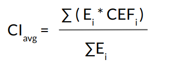

# CarbonCast
CarbonCast: Multi-Day Forecasting of Grid Carbon Intensity
([PDF](https://groups.cs.umass.edu/ramesh/wp-content/uploads/sites/3/2022/09/buildsys2022-final282.pdf)). An extended version of our paper appeared in ACM SIGEnergy Energy Informatics Review, and can be found [here](https://energy.acm.org/eir/multi-day-forecasting-of-electric-grid-carbon-intensity-using-machine-learning/).
<br>
CarbonCast provides average carbon intensity forecasts for up to 96 hours. This is an extension of [DACF](https://github.com/carbonfirst/DACF), which provides only day-ahead carbon intensity forecasts.

Version: 2.1 <br>
Authors: Diptyaroop Maji, Prashant Shenoy, Ramesh K Sitaraman <br>
Affiliation: University of Massachusetts, Amherst

<b>CarbonCast v3.0, which can provide forecasts in real-time, is now in the testing phase and can be found [here](https://github.com/carbonfirst/CarbonCast/tree/v3.0_real_time_service). Please feel free to use and report any issues. We are working to release it in the main branch soon.</b>


<!-- ## CarbonCast Architecture
### First tier
### Second Tier
-->

<!-- [TODO:] Update readme about weather, config, cef etc.. Include weather src files, update data files. -->
## 0. Disclaimer
We will be periodically updating this repo as we update/improve/extend CarbonCast. Even after cloning the repo, please check back in a while to see if anything is updated. <br>
If something is not working, please check whether some recent update has already fixed that. <br>
In case something is not working in the latest version, or if there are any doubts/questions/suggestions, please feel free to reach us at dmaji at cs dot umass dot edu.

### 0.1 Current status:
Code files: Up to date as of 03/11/2023. <br>
Data files: Up to date as of 01/10/2023. <br>
Latest stable commit: <br>

## 1. Regions covered 
* US (US region data collected from [EIA](https://www.eia.gov/electricity/gridmonitor/dashboard/electric_overview/US48/US48)):
    * California ([CISO](https://www.caiso.com/Pages/default.aspx))
    * Florida ([FPL](https://www.fpl.com/))
    * New England ([ISO-NE](https://www.iso-ne.com/). We refer the region as ISNE.)
    * New York ([NYISO](https://www.nyiso.com/))
    * Pennsylvania-Jersey-Maryland Interconnection ([PJM](https://www.pjm.com/))
    * Texas ([ERCOT](https://www.ercot.com/). We refer the region as ERCO)
    * Washington ([BPAT](https://www.bpa.gov/))
* Europe (European regions are monitored by [ENTSOE](https://transparency.entsoe.eu/)):
    * Germany (DE)
    * Netherlands (NL)
    * Spain (ES)
    * Sweden (SE)
    * Poland (PL)
* Australia (Data for Australian regions is available at [OpenNEM](https://opennem.org.au/energy/nem/?range=7d&interval=30m))
    * Queensland (AUS-QLD)
<!-- * Canada
    * Ontario ([IESO](). We refer the region as CA_ON) -->

## 2. Data Sources
US ISO electricity generation by source: [EIA hourly grid monitor](https://www.eia.gov/electricity/gridmonitor/dashboard/electric_overview/US48/US48)

European regions electricity generation by source: [ENTSOE](https://transparency.entsoe.eu/)

Australian regions electricity generation by source: [OpenNEM](https://opennem.org.au/energy/nem/?range=7d&interval=30m)

Weather forecasts: [GFS weather forecast archive](https://rda.ucar.edu/datasets/ds084.1/)

Day-ahead solar/wind Forecasts:
* CISO: [OASIS](http://oasis.caiso.com/mrioasis/logon.do)
* European regions: [ENTSOE](https://transparency.entsoe.eu/)
* We currently do not have solar/wind forecasts for other regions, or for periods beyond 24 hours. Hence, we generate them using ANN models along with 96-hour forecasts for other sources.

## 3. Background on carbon intensity

### 3.1 Carbon emission factor (CEF):
CEF of a source is the amount of carbon emitted into the atmosphere per unit of electricity generated by that source. There can be two types of CEFs for a source: <br>
* Direct emission factors: These are the operational emissions when a source is converted into electricity. <br>
* Lifecycle emission factors: These include operational as well as infrastructural emissions up the supply chain. <br>
(See paper for further details.)

### 3.2 Calculating average carbon intensity:
We use the following formula for calculating avg carbon intensity:<br>
    , where <br>
<br>
<i>CI<sub>avg</sub></i> = Average carbon intensity (real-time or forecast) of a region <br>
<i>E<sub>i</sub></i> = Electricity produced by source i. <br>
<i>CEF<sub>i</sub></i> = Carbon emission factor (lifecycle/direct) of source i. <br>

We have provided the file ``` carbonIntensityCalculator.py ``` to calculate both real-time/historical average CI values as well as carbon intensity forecasts from source prodution forecasts. Please refer to Section 4.4 for details.

## 4. Running CarbonCast with existing datasets and models

### 4.1 Installing dependencies:
CarbonCast requires Python3. <br>
Other required packages:
* Required python modules are listed in ```requirements.txt```.<br>
Run ```pip3 install -U -r requirements.txt``` for installing the dependecies.
* wgrib2 (for weather data). Please refer [here](https://www.cpc.ncep.noaa.gov/products/wesley/wgrib2/compile_questions.html) for compilation/installation details. If you are using MacOS and having trouble compiling wgrib2, please refer to [this](https://theweatherguy.net/blog/weather-links-info/how-to-install-and-compile-wgrib2-on-mac-os-10-14-6-mojave/) article. Once wgrib2 is installed, go to the grib2 directory and run the following command to access wgrib2 from anywhere in the terminal:
```cp -rfv wgrib2/wgrib2 /usr/local/bin/wgrib2```
<!-- * ``` pip3 install numpy, matplotlib, sklearn, datetime, matplotlib ``` -->

### 4.2 Running CarbonCast using saved models/Reproducing results from paper:
We have saved second-tier models for each region which you can use with existing & new datasets to get 96-hour CI forecasts. These models are trained with data from Jan-Dec 2020 and validated with data from Jan-Jun 2021, so that results similar to the paper can be obtained when tested over Jul-Dec 2021. Each region has 2 saved models --- one for lifecycle CEF & the other for direct CEF. If you are using new datasets, you may need to update the models with new training data or generate new models.<br>
To run CarbonCast using the saved model for any region, run: <br>
```python3 secondTierForecasts.py <configFileName> <-l/-d> <-s>```<br>
<b>Configuration file name:</b> <i>secondTierConfig.json</i> <br>
<b>Regions:</b> <i>CISO, PJM, ERCO, ISNE, NYISO, FPL, BPAT, SE, DE, ES, NL, PL, AUS_QLD.</i> You can specify the region(s) in the configuration file. <br>
<b><-l/-d>:</b> <i>Lifecycle/Direct.</i> Relevant saved model for the specified region(s) will be loaded.<br>
<b><-s>: </b> <i>Use saved model.</i> Parameter that tells CarbonCast to use saved models and not train a new model.


## 5 Running CarbonCast from scratch
To run CarbonCast from scratch (with new data/for new regions etc.), first install the dependencies mentioned in Section 4.1.

### 5.1 Getting Weather data:
The aggregated and cleaned weather forecasts that we have used for our regions are provided in ```data/```. If you need weather forecasts for other regions, or even for the same regions (e.g., if you want to use a different aggregation method or if you want to forecast for a different time period), the procedure is mentioned below.<br>
* We fetch weather data from the [GFS weather forecast archive](https://rda.ucar.edu/datasets/ds084.1/). You will need to register 
before you can get weather data. Once you have registered, do the following:
* GitHub repo of script to fetch weather data can be found [here](https://github.com/NCAR/rda-apps-clients). You can follow the instructions there and download weather forecasts in grib2 format. The repo has a sample [Jupyter Notebook](https://github.com/NCAR/rda-apps-clients/blob/main/src/python/rdams_client_example.ipynb) with step-by-step instructions. Remember to modify the notebook as required (e.g., changing the dataset id (dsid)).
* Otherwise, clone the above repo and add the following two files in the ```rda-apps-clients/src/python``` folder: <br>
    ``` src/weather/getWeatherData.py,  src/weather/ds084.1_control.ctl ``` <br>
```getWeatherData.py``` uses ``` ds084.1_control.ctl ``` as a template file to download 96-hour weather forecasting data for a particular region. Change the template file for different regions and weather variables (weather variables include wind speed, temperature, dewpoint temperature, solar irradiance (dswrf), and precipitation). The template file has instructions on how to modify it for different regions and weather variables. After you have configured the template file, run: ```python3 getWeatherData.py```<br>
* You may need to add your credentials in ```rda-apps-clients/src/python/rdams_client.py``` for API calls to work. To do that, add the following as the first line in ```get_authentication()```:<br>
```write_pw_file(<username>, <password>)```
* Once you have obtained the grib2 files, use the following files to aggregate and clean the data:<br>
```python3 dataCollectionScript.py``` -- this file uses code from [here](https://towardsdatascience.com/the-correct-way-to-average-the-globe-92ceecd172b7) for aggregating weather forecasts over a specified region. <br>
```python3 cleanWeatherData.py``` -- this file cleans the data and generates hourly files for the above specified weather variables.<br>
You will need to modify the relevant fields in the above two files to successfully parse & clean the weather data. <br>
If you are using any other weather aggregating method, please feel free to modify the above files as required.

### 5.2 Getting source production forecasts:
You will need to obtain, clean, & format the datasets before you can get source production forecasts. You may also need to modify the configuration file as required.<br>
For getting source production forecasts in the first-tier, run the following file:<br>
```python3 firstTierForecasts.py <configFileName> ```<br>
<b>Configuration file name:</b> <i>firstTierConfig.json</i> <br>
<b>Regions:</b> <i>CISO, PJM, ERCO, ISNE, NYISO, FPL, BPAT, SE, DE, ES, NL, PL, AUS_QLD</i> <br>
<b>Sources:</b> <i>coal, nat_gas, oil, solar, wind, hydro, unknown, geothermal, biomass, nuclear</i> <br>
You can get source production forecasts of multiple regions together. Just add the new regions in the "REGION" parameter.
<!-- A detailed description of how to configure is given in Section 3.5 -->

### 5.3 Calculating carbon intensity (real-time/historical/from source production forecasts):
For calculating real-time/historical carbon intensity from source data, or carbon intensity forecasts from the source production forecast data using the formula, run the following file: <br>
```python3 carbonIntensityCalculator.py <region> <-l/-d> <-f/-r> <num_sources>```<br>
<b>Regions:</b> <i>CISO, PJM, ERCO, ISNE, NYISO, FPL, BPAT, SE, DE, ES, NL, PL, AUS_QLD</i> <br>
<b><-l/-d>:</b> <i>Lifecycle/Direct</i> <br>
<b><-f/-r>:</b> <i>Forecast/Real-time (or, historical)</i> <br>
<b>num_sources:</b> <i>No. of electricity producting sources in that region.</i> <br>

### 5.4 Getting carbon intensity forecasts using CarbonCast:
For getting 96-hour average carbon intensity forecasts, run the following file: <br>
```python3 secondTierForecasts.py <configFileName> <-l/-d>```<br>
<b>Configuration file name:</b> <i>secondTierConfig.json</i> <br>
<b>Regions:</b> <i>CISO, PJM, ERCO, ISNE, NYISO, FPL, BPAT, SE, DE, ES, NL, PL, AUS_QLD</i> <br>
<b><-l/-d>:</b> <i>Lifecycle/Direct</i> <br>
You can get carbon intensity forecasts of multiple regions together. Just add the new regions in the "REGION" parameter.

<!-- ### 3.5 Configuring CarbonCast:
Change the firstTierConfig.json and secondTierConfig.json files for desired configurations. Below are the fields used in the file along with their meaning:<br>
PREDICTION_WINDOW_HOURS: Prediction window in hours. (Default: 96) -->

## 6. Developer mode

We welcome users to suggest modifications to improve CarbonCast and/or add new features or models to the existing codebase. Please feel free to contact us at dmaji at cs dot umass dot edu with suggestions (or even working patches!)
<!-- Use the developer branch to make edits and submit a change. -->

## 7. Citing CarbonCast
If you use CarbonCast, please consider citing our paper. The BibTex format is as follows: <br>
&nbsp; &nbsp; &nbsp; &nbsp;@inproceedings{maji2022carboncast,<br>
&nbsp; &nbsp; &nbsp; &nbsp;  title={CarbonCast: multi-day forecasting of grid carbon intensity},<br>
&nbsp; &nbsp; &nbsp; &nbsp;  author={Maji, Diptyaroop and Shenoy, Prashant and Sitaraman, Ramesh K},<br>
&nbsp; &nbsp; &nbsp; &nbsp;  booktitle={Proceedings of the 9th ACM International Conference on Systems for Energy-Efficient Buildings, Cities, and Transportation},<br>
&nbsp; &nbsp; &nbsp; &nbsp;  pages={198--207},<br>
&nbsp; &nbsp; &nbsp; &nbsp;  year={2022}<br>
&nbsp; &nbsp; &nbsp; &nbsp;}<br>

## 8. Acknowledgements
This work is part of the [CarbonFirst](http://carbonfirst.org/) project, supported by NSF grants 2105494, 2021693, and 2020888, and a grant from VMware.
