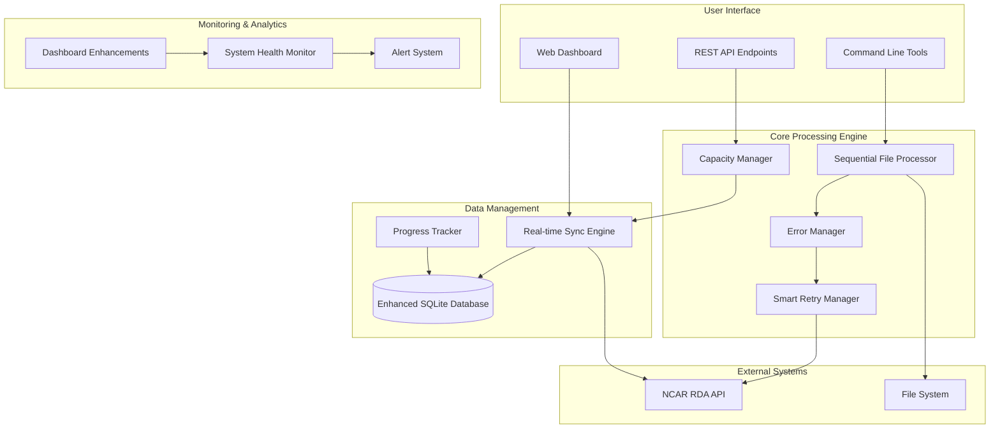

# Enhanced RDA Automation System

[](docs/Enhanced_RDA_Automation_System_Guide.md)
[](https://python.org)
[](LICENSE)
[](docs/)

> **Next-generation intelligent meteorological data automation system for NCAR Research Data Archive (RDA) with advanced sequential processing, smart retry mechanisms, real-time monitoring, and comprehensive error management.**

## 🚀 Quick Start

Get up and running in 5 minutes:

```bash
# 1. Clone and setup
git clone <repository-url>
cd rda-apps-clients
python -m venv venv
source venv/bin/activate  # On Windows: venv\Scripts\activate

# 2. Install dependencies
pip install -r requirements.txt

# 3. Configure RDA authentication
echo "your_rda_token_here" > rdams_token.txt

# 4. Initialize database
cd src/python
python -c "
from automation.enhanced_database_schema import create_enhanced_schema_manager
schema_manager = create_enhanced_schema_manager()
schema_manager.create_enhanced_tables()
print('✅ Database initialized successfully!')
"

# 5. Start the dashboard
python automation/dashboard.py --port 8080
```

Visit `http://localhost:8080` to see your dashboard! 🎉

**→ [Complete Setup Guide](docs/Enhanced_RDA_Automation_System_Guide.md)**

## 📖 Project Overview

The Enhanced RDA Automation System is a comprehensive solution for automating meteorological data collection from NCAR's Research Data Archive. It intelligently manages the entire workflow from data request to organized file delivery with enterprise-grade reliability and monitoring.

### 🎯 Key Capabilities

| Feature | Description | Benefit |
|---------|-------------|---------|
| **🔄 Sequential Processing** | Ordered file processing with resume capability and progress tracking | Controlled, reliable processing |
| **🧠 Smart Retry System** | Intelligent failure recovery with exponential backoff and circuit breaker | Automatic error resolution |
| **📊 Real-time Dashboard** | Live monitoring with WebSocket updates and system health scoring | Complete visibility |
| **⚡ Capacity Management** | Crisis resolution for RDA's 10-request limit with automated upload | Uninterrupted operation |
| **🔍 Error Tracking** | Comprehensive error detection, categorization, and automatic purging | Proactive issue management |
| **🗺️ Enhanced Data Sync** | Real-time synchronization with freshness indicators and auto-refresh | Always current data |
| **🛡️ Robust Architecture** | Component-based design with comprehensive logging and monitoring | Enterprise-grade reliability |
| **📈 Advanced Analytics** | Detailed progress tracking, performance metrics, and completion rates | Data-driven insights |

### 🌍 Supported Data

- **200+ CTL Files**: Comprehensive control file processing across 85+ regions
- **90+ Regions**: US grid operators (ERCOT, CISO, PJM, etc.) + European countries
- **Weather Variables**: Solar radiation (dswrf), wind, temperature, precipitation
- **File Organization**: Automatic `REGION_NAME/weather_variable/` structure
- **Data Sources**: NCEP GFS 0.25° Global Forecast Grids and more

### 🏆 Key Features to Highlight

- **Processes 200+ CTL files** across 85+ regions with intelligent automation
- **Intelligent quota management** for RDA's 10-request limit with crisis resolution
- **Real-time monitoring dashboard** with WebSocket updates and system health scoring
- **Advanced error handling and retry mechanisms** with exponential backoff and circuit breaker patterns
- **Comprehensive tracking and logging** with complete audit trail and analytics
- **REST API for integration** with external systems and custom applications
- **Weeks-long autonomous operation capability** with minimal manual intervention

## 📋 Prerequisites

### System Requirements
- **Python 3.7+** with pip package manager
- **RDA Account** with valid authentication token
- **4GB+ RAM** recommended for large batch processing
- **Stable Internet Connection** for RDA API access
- **10GB+ Disk Space** for downloads and logs

### RDA Account Setup
1. Create an account at [RDA](https://rda.ucar.edu/)
2. Generate an authentication token
3. Save token to `rdams_token.txt` in the project root

## 🛠️ Installation

### Step-by-Step Installation

```bash
# 1. Clone the repository
git clone <repository-url>
cd rda-apps-clients

# 2. Create virtual environment
python -m venv rda_automation_env
source rda_automation_env/bin/activate  # Windows: rda_automation_env\Scripts\activate

# 3. Install dependencies
pip install -r requirements.txt

# 4. Setup RDA authentication
echo "your_rda_token_here" > rdams_token.txt

# 5. Initialize database and configuration
cd src/python
python -c "
from automation.enhanced_database_schema import create_enhanced_schema_manager
schema_manager = create_enhanced_schema_manager()
schema_manager.create_enhanced_tables()
print('✅ Database initialized successfully!')
"

# 6. Verify installation
python -c "
from automation.sequential_file_processor import create_sequential_file_processor
from automation.dashboard import create_dashboard
print('✅ All components loaded successfully!')
print('🎉 System ready for use!')
"
```

### Verify Installation
```bash
cd src/python
python -c "
from automation.sequential_file_processor import create_sequential_file_processor, ProcessingConfig
config = ProcessingConfig()
processor = create_sequential_file_processor(config)
success, files, info = processor.discover_files()
print(f'✅ File discovery test: {\"PASSED\" if success else \"No files found (normal for new setup)\"}')
status = processor.get_processing_status()
print(f'✅ Status check: {status[\"current_state\"]}')
print('🎉 System test completed successfully!')
"
```

## ⚙️ Configuration

### Basic Configuration

The system uses `config/automation_config.json` for configuration:

```json
{
  "automation": {
    "max_concurrent_requests": 8,
    "check_interval_seconds": 300,
    "request_limit_safety_margin": 2,
    "auto_upload_enabled": true
  },
  "directories": {
    "base_download_dir": "./downloaded_files",
    "control_files_dir": "./control_files",
    "logs_dir": "./logs"
  },
  "dashboard": {
    "port": 8080,
    "auto_refresh_seconds": 30,
    "enable_real_time_sync": true
  }
}
```

### Environment Variables

```bash
# Required environment variables
export RDA_DB_PATH="src/python/data/automation_state.db"
export DASHBOARD_API_KEY="your-secure-api-key-here"
export ALLOWED_IPS="127.0.0.1,192.168.1.100"

# Optional performance tuning
export RDA_MAX_CONCURRENT_REQUESTS="10"
export RDA_CACHE_ENABLED="true"
export RDA_DEBUG_MODE="false"
```

**→ [Complete Configuration Guide](docs/Configuration_Reference.md)**

## 🚀 Usage

### Common Commands

#### System Status Commands
```bash
# Overall system status
python automation/dashboard.py --status

# Sequential processing status
python automation/sequential_file_processor.py --status

# Capacity status
python automation/capacity_manager.py --status

# Error statistics
python automation/error_manager.py --stats
```

#### Control Commands
```bash
# Start sequential processing
python automation/sequential_file_processor.py --start

# Stop processing
python automation/sequential_file_processor.py --stop

# Resume processing from session
python automation/sequential_file_processor.py --resume SESSION_ID

# Discover available files
python automation/sequential_file_processor.py --discover
```

#### Data Management Commands
```bash
# Sync data from RDA API
python automation/data_sync.py --sync

# Start continuous sync (every 5 minutes)
python automation/data_sync.py --continuous

# Check data freshness
curl http://localhost:8080/api/data-freshness
```

### Usage Scenarios

#### Scenario 1: Automated File Processing
```bash
# Place your control files in the control_files directory
ls control_files/

# Start sequential processing
python automation/sequential_file_processor.py --start

# Monitor progress in another terminal
python automation/sequential_file_processor.py --status
```

#### Scenario 2: Real-time Dashboard Monitoring
```bash
# Launch enhanced dashboard with real-time updates
python automation/dashboard.py --port 8080

# Visit http://localhost:8080 for real-time monitoring
```

#### Scenario 3: Smart Error Recovery
```bash
# Check for errors
python automation/error_manager.py --stats

# Start smart retry processing
python automation/smart_retry_manager.py --start-processing

# Monitor retry success
python automation/smart_retry_manager.py --status
```

## 🚀 Automation Startup

### Quick Startup Commands

```bash
# Start the complete automation system
cd src/python

# 1. Start the dashboard (runs in background)
nohup python automation/dashboard.py --port 8080 > logs/dashboard.log 2>&1 &

# 2. Start sequential file processing
python automation/sequential_file_processor.py --start

# 3. Enable capacity monitoring
python automation/capacity_manager.py --start-monitoring

# 4. Start smart retry processing
python automation/smart_retry_manager.py --start-processing
```

### Production Startup Script

```bash
#!/bin/bash
# production_startup.sh

echo "🚀 Starting Enhanced RDA Automation System..."

cd src/python

# Start dashboard
echo "📊 Starting dashboard..."
nohup python automation/dashboard.py --port 8080 > logs/dashboard.log 2>&1 &
DASHBOARD_PID=$!
echo "Dashboard started with PID: $DASHBOARD_PID"

# Wait for dashboard to initialize
sleep 5

# Start capacity monitoring
echo "⚡ Starting capacity monitoring..."
nohup python automation/capacity_manager.py --start-monitoring > logs/capacity.log 2>&1 &
CAPACITY_PID=$!
echo "Capacity monitoring started with PID: $CAPACITY_PID"

# Start smart retry processing
echo "🧠 Starting smart retry processing..."
nohup python automation/smart_retry_manager.py --start-processing > logs/retry.log 2>&1 &
RETRY_PID=$!
echo "Smart retry started with PID: $RETRY_PID"

# Start sequential processing
echo "🔄 Starting sequential file processing..."
python automation/sequential_file_processor.py --start

echo "✅ All systems started successfully!"
echo "📊 Dashboard: http://localhost:8080"
echo "📝 Logs: tail -f logs/*.log"
```

## 🏗️ Architecture Overview


```mermaid
graph TB
    subgraph "User Interface"
        WEB[Web Dashboard]
        CLI[Command Line Tools]
        API[REST API Endpoints]
    end
    
    subgraph "Core Processing Engine"
        SEQ[Sequential File Processor]
        CAP[Capacity Manager]
        ERR[Error Manager]
        RET[Smart Retry Manager]
    end
    
    subgraph "Data Management"
        SYNC[Real-time Sync Engine]
        DB[(Enhanced SQLite Database)]
        TRACK[Progress Tracker]
    end
    
    subgraph "Monitoring & Analytics"
        DASH[Dashboard Enhancements]
        HEALTH[System Health Monitor]
        ALERT[Alert System]
    end
    
    subgraph "External Systems"
        RDA[NCAR RDA API]
        FS[File System]
    end
    
    WEB --> SYNC
    CLI --> SEQ
    API --> CAP
    SEQ --> ERR
    ERR --> RET
    CAP --> SYNC
    SYNC --> DB
    TRACK --> DB
    DASH --> HEALTH
    HEALTH --> ALERT
    RET --> RDA
    SYNC --> RDA
    SEQ --> FS
```

### Component Relationships

- **Sequential File Processor** orchestrates ordered file processing with resume capability
- **Capacity Manager** handles RDA's 10-request limit with crisis resolution
- **Error Manager** detects and categorizes failures for retry processing
- **Smart Retry Manager** implements intelligent retry strategies with exponential backoff
- **Real-time Sync Engine** maintains fresh data with immediate updates
- **Enhanced Dashboard** provides comprehensive monitoring and control

**→ [Detailed Architecture](docs/developer-guides/architecture-overview.md)**

## 📡 API Reference

### Key Endpoints

#### Dashboard Summary
```bash
# Get comprehensive dashboard summary
curl -H "X-API-Key: your-api-key" http://localhost:8080/api/summary
```

#### Current Requests
```bash
# Get all current requests
curl -H "X-API-Key: your-api-key" http://localhost:8080/api/current-requests

# Filter by status
curl -H "X-API-Key: your-api-key" \
     "http://localhost:8080/api/current-requests?status=processing"
```

#### Real-time Sync
```bash
# Get current sync status
curl -H "X-API-Key: your-api-key" http://localhost:8080/api/sync-status

# Trigger immediate sync
curl -X POST -H "X-API-Key: your-api-key" \
     -H "Content-Type: application/json" \
     -d '{"reason": "manual_dashboard_refresh"}' \
     http://localhost:8080/api/trigger-sync
```

#### Error Tracking
```bash
# Get error summary
curl -H "X-API-Key: your-api-key" http://localhost:8080/api/error-tracking/summary

# Get live error feed
curl -H "X-API-Key: your-api-key" http://localhost:8080/api/error-tracking/live-feed
```

### Authentication

```bash
# Set API key environment variable
export DASHBOARD_API_KEY="your-secure-api-key"

# Include API key in requests
curl -H "X-API-Key: your-api-key" http://localhost:8080/api/summary
```

**→ [Complete API Reference](docs/API_Reference.md)**

## 🧪 Testing

### Run Test Mode
```bash
cd src/python
python -c "
from automation.sequential_file_processor import create_sequential_file_processor, ProcessingConfig
config = ProcessingConfig()
processor = create_sequential_file_processor(config)
success, files, info = processor.discover_files()
print(f'✅ File discovery test: {\"PASSED\" if success else \"No files found (normal for new setup)\"}')
status = processor.get_processing_status()
print(f'✅ Status check: {status[\"current_state\"]}')
print('🎉 System test completed successfully!')
"
```

### Full Test Suite
```bash
# Run comprehensive tests
pytest tests/ -v

# Run integration tests
pytest tests/test_integration.py -v

# Run performance tests
pytest tests/test_performance.py -v
```

### System Health Check
```bash
# Complete system health check
python -c "
import sys
sys.path.insert(0, 'src/python')
from automation.sequential_file_processor import create_sequential_file_processor
from automation.capacity_manager import create_capacity_manager
from automation.dashboard import create_dashboard

try:
    processor = create_sequential_file_processor()
    capacity_manager = create_capacity_manager()
    dashboard = create_dashboard()
    print('✅ All components imported successfully')
    print('✅ System is healthy')
except Exception as e:
    print(f'❌ System issue: {e}')
"
```

## 🚨 Troubleshooting

### Common Issues

| Issue | Solution |
|-------|----------|
| **Authentication Error** | Verify `rdams_token.txt` exists and contains valid token |
| **Dashboard Not Loading** | Check port 8080 availability: `lsof -i :8080` |
| **Request Limit Exceeded** | System handles automatically, check status with `--status` |
| **Processing Stuck** | Resume with `--resume` flag |
| **Database Errors** | Initialize database with schema manager |

### Quick Diagnostics
```bash
# Check system status
python automation/sequential_file_processor.py --status

# Check capacity status
python automation/capacity_manager.py --status

# Test system functionality
python -c "
from automation.sequential_file_processor import create_sequential_file_processor
processor = create_sequential_file_processor()
print('✅ System test passed')
"

# Check database connectivity
python -c "
import sqlite3
import os
db_path = 'src/python/data/automation_state.db'
if os.path.exists(db_path):
    conn = sqlite3.connect(db_path)
    cursor = conn.cursor()
    cursor.execute('SELECT COUNT(*) FROM sqlite_master WHERE type=\"table\"')
    tables = cursor.fetchone()[0]
    print(f'✅ Database found with {tables} tables')
    conn.close()
else:
    print('❌ Database not found')
"
```

### Emergency Procedures
```bash
# Emergency stop
touch EMERGENCY_STOP

# System reset (CAUTION: This will stop all processes)
pkill -f "python.*automation"

# Restart services
./production_startup.sh
```

**→ [Complete Troubleshooting Guide](docs/Troubleshooting_Guide.md)**

## 📚 Advanced Documentation

### Core Guides
- **[Enhanced System Guide](docs/Enhanced_RDA_Automation_System_Guide.md)** - Complete system overview and architecture
- **[Sequential File Processing](docs/Sequential_File_Processing_Guide.md)** - Ordered processing with resume capability
- **[Error Tracking & Smart Retry](docs/Error_Tracking_and_Smart_Retry_Guide.md)** - Intelligent error handling

### Technical References
- **[API Reference](docs/API_Reference.md)** - Complete REST API documentation
- **[Configuration Reference](docs/Configuration_Reference.md)** - All configuration options
- **[Troubleshooting Guide](docs/Troubleshooting_Guide.md)** - Comprehensive problem resolution
- **[GitHub Transfer Guide](docs/GitHub_Transfer_Guide.md)** - Complete guide for repository transfer and setup

### User Guides

### Admin Guides
- **[Deployment Guide](docs/admin-guides/deployment.md)** - Production deployment
- **[Maintenance Guide](docs/admin-guides/maintenance.md)** - System maintenance
- **[Monitoring Guide](docs/admin-guides/monitoring.md)** - Comprehensive monitoring setup

### Developer Guides
- **[Architecture Overview](docs/developer-guides/architecture-overview.md)** - System architecture

## 📈 Performance & Scalability

### Recommended Settings
- **Small batches** (< 50 files): Default settings
- **Medium batches** (50-200 files): Increase `max_concurrent_requests` to 7
- **Large batches** (200+ files): Increase to 10, monitor resources

### System Requirements
- **CPU**: Multi-core recommended
- **Memory**: 4GB+ RAM for large batches
- **Disk**: Sufficient space for downloads (1-5GB per request)
- **Network**: Stable internet for RDA API access

### Performance Monitoring
```bash
# Get capacity analytics
python automation/capacity_manager.py --analytics

# Get processing performance
python automation/sequential_file_processor.py --status

# Get retry performance
python automation/smart_retry_manager.py --status
```

## 🤝 Contributing

We welcome contributions! Here's how to get started:

1. **Fork the repository**
2. **Create a feature branch**: `git checkout -b feature/amazing-feature`
3. **Make your changes** following our coding standards
4. **Add tests** for new functionality
5. **Submit a pull request**

### Development Setup
```bash
# Clone your fork
git clone <your-fork-url>
cd rda-apps-clients

# Setup development environment
python -m venv dev_env
source dev_env/bin/activate
pip install -r requirements.txt

# Install development tools
pip install black flake8 pytest mypy

# Run tests
python -m pytest
```

**→ [Contributing Guidelines](CONTRIBUTING.md)**

## 📄 License

This project is part of the RDA Apps Clients suite for accessing NCAR Research Data Archive services.

**→ [License Details](LICENSE)**

## 🆘 Support & Contact

### Getting Help
- **📖 Documentation**: Start with our comprehensive guides in the `docs/` directory
- **🐛 Issues**: Report bugs via GitHub Issues
- **💬 Discussions**: Join GitHub Discussions for questions
- **📧 Contact**: [RDA Support](mailto:rdahelp@ucar.edu)

### Quick Help Commands
```bash
# System status
python automation/sequential_file_processor.py --status

# Resume processing
python automation/sequential_file_processor.py --resume

# Test functionality
python -c "
from automation.sequential_file_processor import create_sequential_file_processor
processor = create_sequential_file_processor()
print('✅ System test passed')
"

# Start monitoring dashboard
python automation/dashboard.py --port 8080
```

## 🏆 System Summary

The Enhanced RDA Automation System represents the next generation of intelligent meteorological data automation, featuring advanced sequential processing, smart retry mechanisms, real-time monitoring, and comprehensive error management. This enterprise-grade solution transforms complex data workflows into streamlined, automated processes.

### Enhanced Key Benefits
- 🔄 **Sequential Processing**: Ordered, controlled file processing with resume capability
- 🧠 **Smart Recovery**: Intelligent failure handling with exponential backoff and circuit breaker
- 📊 **Real-time Insights**: Live dashboard with WebSocket updates and system health scoring
- ⚡ **Crisis Management**: Automatic capacity management and crisis resolution
- 🔍 **Proactive Monitoring**: Comprehensive error tracking and automatic issue resolution
- 🗺️ **Enhanced Sync**: Real-time data synchronization with freshness indicators
- 🛡️ **Enterprise Architecture**: Robust, component-based design with comprehensive logging
- 📈 **Advanced Analytics**: Detailed metrics, progress tracking, and performance insights

### Advanced Capabilities
- **Sequential Processing Engine** with configurable ordering and resume capability
- **Smart Retry System** with exponential backoff and circuit breaker patterns
- **Real-time Dashboard** with WebSocket updates and system health monitoring
- **Capacity Management** with crisis detection and automated resolution
- **Comprehensive Error Management** with automatic detection and recovery
- **Enhanced Data Synchronization** with real-time updates and freshness tracking

**Enterprise-ready automation with intelligent processing, proactive monitoring, and comprehensive error management.**

---

<div align="center">

**[📖 Documentation](docs/) • [🔄 Sequential Processing](docs/Sequential_File_Processing_Guide.md) • [🧠 Smart Retry](docs/Error_Tracking_and_Smart_Retry_Guide.md) • [🆘 Troubleshooting](docs/Troubleshooting_Guide.md)**

</div>