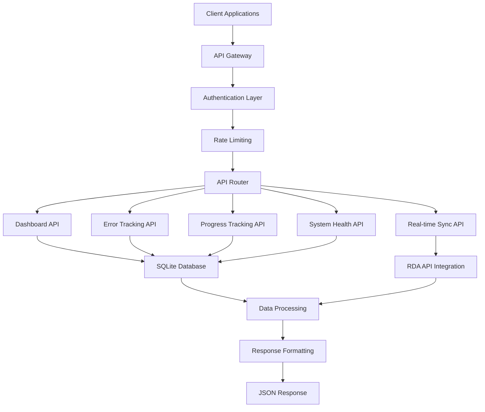

# API Reference

[](#api-overview)
[](#rest-endpoints)

> **Complete API reference for the Enhanced RDA Automation System. This guide covers all REST endpoints, request/response formats, authentication, and integration examples.**

## Table of Contents

1. [API Overview](#api-overview)
2. [Authentication](#authentication)
3. [Base URL and Versioning](#base-url-and-versioning)
4. [Response Formats](#response-formats)
5. [Error Handling](#error-handling)
6. [Dashboard API](#dashboard-api)
7. [Error Tracking API](#error-tracking-api)
8. [Progress Tracking API](#progress-tracking-api)
9. [System Health API](#system-health-api)
10. [Real-time Sync API](#real-time-sync-api)
11. [Regional Analysis API](#regional-analysis-api)
12. [Configuration API](#configuration-api)
13. [Webhook Integration](#webhook-integration)
14. [Rate Limiting](#rate-limiting)
15. [SDK and Client Libraries](#sdk-and-client-libraries)

## API Overview

The Enhanced RDA Automation System provides a comprehensive REST API for monitoring, controlling, and integrating with the meteorological data automation system.

### Key Features

| Feature | Description | Endpoints |
|---------|-------------|-----------|
| **Dashboard Data** | Real-time system metrics and status | `/api/summary`, `/api/current-requests` |
| **Error Tracking** | Comprehensive error monitoring and analysis | `/api/error-tracking/*` |
| **Progress Monitoring** | Processing progress and performance metrics | `/api/progress-tracking/*` |
| **System Health** | Health monitoring and alerting | `/api/system-health/*` |
| **Real-time Sync** | Data synchronization and freshness | `/api/sync-status`, `/api/trigger-sync` |
| **Regional Analysis** | Geographic performance insights | `/api/regional-metrics`, `/api/completed-regions` |
| **Configuration** | System configuration and management | `/api/dashboard/*` |

### API Architecture



## Authentication

### API Key Authentication

```bash
# Include API key in request headers
curl -H "X-API-Key: your-api-key-here" \
     http://localhost:8080/api/summary
```

### Environment Configuration

```bash
# Set API key environment variable
export DASHBOARD_API_KEY="your-secure-api-key"

# Set allowed IP addresses
export ALLOWED_IPS="127.0.0.1,192.168.1.100,10.0.0.50"
```

### Authentication Examples

```python
import requests

# Python example with API key
headers = {
    'X-API-Key': 'your-api-key-here',
    'Content-Type': 'application/json'
}

response = requests.get(
    'http://localhost:8080/api/summary',
    headers=headers
)

if response.status_code == 200:
    data = response.json()
    print(f"Total requests: {data['overview']['total_requests']}")
else:
    print(f"Error: {response.status_code} - {response.text}")
```

```javascript
// JavaScript example with API key
const apiKey = 'your-api-key-here';
const baseUrl = 'http://localhost:8080';

async function fetchDashboardSummary() {
    try {
        const response = await fetch(`${baseUrl}/api/summary`, {
            headers: {
                'X-API-Key': apiKey,
                'Content-Type': 'application/json'
            }
        });
        
        if (response.ok) {
            const data = await response.json();
            console.log('Total requests:', data.overview.total_requests);
        } else {
            console.error('API Error:', response.status, response.statusText);
        }
    } catch (error) {
        console.error('Network Error:', error);
    }
}
```

## Base URL and Versioning

### Base URL
```
http://localhost:8080/api
```

### API Versioning
Currently, the API uses implicit versioning. Future versions will include explicit versioning:
```
http://localhost:8080/api/v1/
http://localhost:8080/api/v2/
```

### Content Types
- **Request Content-Type**: `application/json`
- **Response Content-Type**: `application/json`
- **Character Encoding**: `UTF-8`

## Response Formats

### Standard Response Structure

```json
{
    "success": true,
    "data": {
        // Response data here
    },
    "timestamp": "2024-12-01T15:30:45.123Z",
    "meta": {
        "request_id": "req_12345",
        "processing_time_ms": 45,
        "api_version": "1.0"
    }
}
```

### Error Response Structure

```json
{
    "success": false,
    "error": {
        "code": "INVALID_REQUEST",
        "message": "The request parameters are invalid",
        "details": {
            "field": "region",
            "issue": "Invalid region code provided"
        }
    },
    "timestamp": "2024-12-01T15:30:45.123Z",
    "meta": {
        "request_id": "req_12345",
        "api_version": "1.0"
    }
}
```

### Pagination Response

```json
{
    "success": true,
    "data": [
        // Array of items
    ],
    "pagination": {
        "page": 1,
        "per_page": 50,
        "total_items": 1250,
        "total_pages": 25,
        "has_next": true,
        "has_prev": false
    },
    "timestamp": "2024-12-01T15:30:45.123Z"
}
```

## Error Handling

### HTTP Status Codes

| Status Code | Description | Usage |
|-------------|-------------|-------|
| `200` | OK | Successful request |
| `201` | Created | Resource created successfully |
| `400` | Bad Request | Invalid request parameters |
| `401` | Unauthorized | Invalid or missing API key |
| `403` | Forbidden | Insufficient permissions |
| `404` | Not Found | Resource not found |
| `429` | Too Many Requests | Rate limit exceeded |
| `500` | Internal Server Error | Server error |
| `503` | Service Unavailable | Service temporarily unavailable |

### Error Codes

| Error Code | Description | Resolution |
|------------|-------------|------------|
| `INVALID_API_KEY` | API key is invalid or missing | Provide valid API key |
| `RATE_LIMIT_EXCEEDED` | Too many requests | Wait and retry |
| `INVALID_REQUEST` | Request parameters are invalid | Check request format |
| `RESOURCE_NOT_FOUND` | Requested resource not found | Verify resource ID |
| `DATABASE_ERROR` | Database connection issue | Check system status |
| `SYNC_ERROR` | Data synchronization failed | Trigger manual sync |

### Error Handling Examples

```python
import requests
from requests.exceptions import RequestException

def handle_api_request(url, headers=None):
    """Handle API request with proper error handling."""
    
    try:
        response = requests.get(url, headers=headers, timeout=30)
        
        # Check HTTP status
        if response.status_code == 200:
            return response.json()
        elif response.status_code == 401:
            raise Exception("Authentication failed - check API key")
        elif response.status_code == 429:
            raise Exception("Rate limit exceeded - please wait")
        elif response.status_code == 500:
            raise Exception("Server error - please try again later")
        else:
            raise Exception(f"API error: {response.status_code}")
            
    except RequestException as e:
        raise Exception(f"Network error: {str(e)}")
    except ValueError as e:
        raise Exception(f"Invalid JSON response: {str(e)}")

# Usage example
try:
    data = handle_api_request(
        'http://localhost:8080/api/summary',
        headers={'X-API-Key': 'your-api-key'}
    )
    print(f"Success: {data}")
except Exception as e:
    print(f"Error: {e}")
```

## Dashboard API

### Get Dashboard Summary

**Endpoint:** `GET /api/summary`

**Description:** Get comprehensive dashboard summary with system metrics.

**Parameters:** None

**Response:**
```json
{
    "overview": {
        "total_requests": 1250,
        "queued_requests": 45,
        "processing_requests": 12,
        "completed_requests": 1180,
        "purged_requests": 13,
        "success_rate": 94.8,
        "progress_percentage": 94.4,
        "unique_regions": 8,
        "unique_variables": 4,
        "unique_datasets": 3
    },
    "status_distribution": {
        "completed": 1180,
        "processing": 12,
        "queued": 45,
        "purged": 13
    },
    "error_statistics": {
        "total_errors": 25,
        "critical_errors": 3,
        "error_rate_24h": 2.1
    },
    "sync_status": {
        "current_status": "active",
        "last_sync": "2024-12-01T15:30:00Z",
        "sync_count": 1450,
        "error_count": 2
    },
    "data_freshness": {
        "level": "fresh",
        "last_update": "2024-12-01T15:30:45Z",
        "age_seconds": 15,
        "is_fresh": true
    }
}
```

**Example:**
```bash
curl -H "X-API-Key: your-api-key" \
     http://localhost:8080/api/summary
```

### Get Current Requests

**Endpoint:** `GET /api/current-requests`

**Description:** Get list of current active requests with filtering options.

**Parameters:**
- `status` (optional): Filter by request status
- `region` (optional): Filter by region
- `parameter` (optional): Filter by weather parameter

**Response:**
```json
[
    {
        "id": 123,
        "request_index": "12345",
        "request_id": "67890",
        "dsid": "ds084.1",
        "status": "processing",
        "date_rqst": "2024-12-01T14:30:00Z",
        "date_ready": null,
        "region": "CISO",
        "variable_type": "dswrf",
        "processing_time_hours": 1.5,
        "rinfo_params": {
            "nlat": 42.0,
            "slat": 32.0,
            "wlon": -124.75,
            "elon": -113.5
        },
        "formatted_subset_info": {
            "date_range": {
                "start": "202401010000",
                "end": "202412312359"
            },
            "parameters": ["Downward Short-Wave Radiation Flux"],
            "spatial_bounds": {
                "north_lat": 42.0,
                "south_lat": 32.0,
                "west_lon": -124.75,
                "east_lon": -113.5
            }
        }
    }
]
```

**Examples:**
```bash
# Get all current requests
curl -H "X-API-Key: your-api-key" \
     http://localhost:8080/api/current-requests

# Filter by status
curl -H "X-API-Key: your-api-key" \
     "http://localhost:8080/api/current-requests?status=processing"

# Filter by region and parameter
curl -H "X-API-Key: your-api-key" \
     "http://localhost:8080/api/current-requests?region=CISO&parameter=dswrf"
```

### Get Regional Metrics

**Endpoint:** `GET /api/regional-metrics`

**Description:** Get performance metrics for each region.

**Parameters:** None

**Response:**
```json
[
    {
        "region": "CISO",
        "total_requests": 450,
        "completed_requests": 425,
        "queued_requests": 15,
        "purged_requests": 10,
        "processing_requests": 0,
        "success_rate": 97.7,
        "average_processing_time": 2.3,
        "most_common_variable": "dswrf",
        "date_range": "2024-01-01 to 2024-12-01"
    }
]
```

**Example:**
```bash
curl -H "X-API-Key: your-api-key" \
     http://localhost:8080/api/regional-metrics
```

### Get Weather Variable Metrics

**Endpoint:** `GET /api/weather-variable-metrics`

**Description:** Get performance metrics for each weather variable.

**Parameters:** None

**Response:**
```json
[
    {
        "variable_type": "dswrf",
        "total_requests": 520,
        "completed_requests": 495,
        "queued_requests": 20,
        "purged_requests": 5,
        "processing_requests": 0,
        "success_rate": 99.0,
        "average_processing_time": 1.8,
        "most_active_regions": ["CISO", "ERCOT", "PJM"],
        "date_range": "2024-01-01 to 2024-12-01"
    }
]
```

**Example:**
```bash
curl -H "X-API-Key: your-api-key" \
     http://localhost:8080/api/weather-variable-metrics
```

### Get Filter Options

**Endpoint:** `GET /api/filters`

**Description:** Get available filter options for requests.

**Parameters:** None

**Response:**
```json
{
    "regions": ["CISO", "ERCOT", "PJM", "MISO", "AZPS"],
    "variables": ["dswrf", "ugrd_vgrd", "tmp_dpt", "apcp"],
    "statuses": ["queued", "processing", "completed", "purged"]
}
```

**Example:**
```bash
curl -H "X-API-Key: your-api-key" \
     http://localhost:8080/api/filters
```

## Error Tracking API

### Get Error Summary

**Endpoint:** `GET /api/error-tracking/summary`

**Description:** Get comprehensive error summary and statistics.

**Parameters:**
- `time_window_hours` (optional): Time window in hours (default: 24)

**Response:**
```json
{
    "summary": {
        "total_errors": 45,
        "active_errors": 12,
        "critical_errors": 3,
        "resolved_errors": 33,
        "error_rate_24h": 2.1,
        "most_common_error_type": "HTTP_503",
        "error_trend": "decreasing"
    },
    "error_categories": {
        "network_errors": 18,
        "authentication_errors": 5,
        "rate_limit_errors": 12,
        "server_errors": 10
    },
    "regional_breakdown": {
        "CISO": 15,
        "ERCOT": 12,
        "PJM": 10,
        "MISO": 8
    },
    "time_window_hours": 24,
    "generated_at": "2024-12-01T15:30:45Z"
}
```

**Example:**
```bash
# Get 24-hour error summary
curl -H "X-API-Key: your-api-key" \
     http://localhost:8080/api/error-tracking/summary

# Get 48-hour error summary
curl -H "X-API-Key: your-api-key" \
     "http://localhost:8080/api/error-tracking/summary?time_window_hours=48"
```

### Get Live Error Feed

**Endpoint:** `GET /api/error-tracking/live-feed`

**Description:** Get live feed of recent errors with filtering options.

**Parameters:**
- `limit` (optional): Maximum number of errors to return (default: 50)
- `region` (optional): Filter by region
- `error_type` (optional): Filter by error type
- `severity` (optional): Filter by severity level

**Response:**
```json
{
    "errors": [
        {
            "id": 123,
            "request_id": "67890",
            "region": "CISO",
            "error_type": "HTTP_503",
            "error_message": "Service temporarily unavailable",
            "severity": "warning",
            "occurred_at": "2024-12-01T15:25:30Z",
            "retry_count": 2,
            "resolved": false,
            "resolution_notes": null
        }
    ],
    "total_errors": 45,
    "filtered_count": 12,
    "filters_applied": {
        "region": "CISO",
        "severity": "warning"
    }
}
```

**Examples:**
```bash
# Get recent errors
curl -H "X-API-Key: your-api-key" \
     http://localhost:8080/api/error-tracking/live-feed

# Get critical errors for CISO region
curl -H "X-API-Key: your-api-key" \
     "http://localhost:8080/api/error-tracking/live-feed?region=CISO&severity=critical&limit=20"
```

### Get Regional Error Health

**Endpoint:** `GET /api/error-tracking/regional-health`

**Description:** Get error health metrics for each region.

**Parameters:** None

**Response:**
```json
{
    "regional_health": [
        {
            "region": "CISO",
            "health_score": 85.5,
            "total_errors": 15,
            "critical_errors": 1,
            "error_rate": 1.2,
            "recovery_rate": 93.3,
            "last_error": "2024-12-01T14:30:00Z",
            "trend": "improving"
        }
    ],
    "overall_health_score": 87.2,
    "generated_at": "2024-12-01T15:30:45Z"
}
```

**Example:**
```bash
curl -H "X-API-Key: your-api-key" \
     http://localhost:8080/api/error-tracking/regional-health
```

### Get Error Trends

**Endpoint:** `GET /api/error-tracking/trends`

**Description:** Get error trend analysis over time.

**Parameters:**
- `hours_back` (optional): Hours to look back (default: 24)
- `interval_hours` (optional): Interval for data points (default: 1)

**Response:**
```json
{
    "trends": [
        {
            "timestamp": "2024-12-01T14:00:00Z",
            "error_count": 3,
            "critical_count": 0,
            "resolved_count": 2,
            "error_rate": 0.8
        }
    ],
    "summary": {
        "total_data_points": 24,
        "average_error_rate": 1.2,
        "peak_error_time": "2024-12-01T10:00:00Z",
        "trend_direction": "decreasing"
    },
    "parameters": {
        "hours_back": 24,
        "interval_hours": 1
    }
}
```

**Example:**
```bash
curl -H "X-API-Key: your-api-key" \
     "http://localhost:8080/api/error-tracking/trends?hours_back=48&interval_hours=2"
```

### Resolve Error

**Endpoint:** `POST /api/error-tracking/resolve/{error_id}`

**Description:** Mark an error as resolved with resolution notes.

**Parameters:**
- `error_id` (path): ID of the error to resolve

**Request Body:**
```json
{
    "resolution_notes": "Fixed network connectivity issue",
    "resolved_by": "admin_user"
}
```

**Response:**
```json
{
    "success": true,
    "error_id": 123,
    "resolved_at": "2024-12-01T15:30:45Z",
    "resolved_by": "admin_user",
    "resolution_notes": "Fixed network connectivity issue"
}
```

**Example:**
```bash
curl -X POST \
     -H "X-API-Key: your-api-key" \
     -H "Content-Type: application/json" \
     -d '{"resolution_notes": "Fixed network issue", "resolved_by": "admin"}' \
     http://localhost:8080/api/error-tracking/resolve/123
```

## Progress Tracking API

### Get Overall Progress

**Endpoint:** `GET /api/progress-tracking/overall`

**Description:** Get overall system progress metrics.

**Parameters:** None

**Response:**
```json
{
    "progress": {
        "total_files": 1250,
        "completed_files": 1180,
        "processing_files": 25,
        "failed_files": 45,
        "completion_percentage": 94.4,
        "processing_rate_per_hour": 12.5,
        "estimated_completion": "2024-12-01T18:30:00Z"
    },
    "performance": {
        "average_processing_time": 2.3,
        "fastest_processing_time": 0.5,
        "slowest_processing_time": 8.2,
        "success_rate": 96.4
    },
    "current_activity": {
        "active_regions": 3,
        "active_variables": 2,
        "concurrent_requests": 8
    },
    "generated_at": "2024-12-01T15:30:45Z"
}
```

**Example:**
```bash
curl -H "X-API-Key: your-api-key" \
     http://localhost:8080/api/progress-tracking/overall
```

### Get Regional Progress

**Endpoint:** `GET /api/progress-tracking/regional`

**Description:** Get progress breakdown by region.

**Parameters:** None

**Response:**
```json
{
    "regional_progress": [
        {
            "region": "CISO",
            "total_files": 450,
            "completed_files": 425,
            "processing_files": 15,
            "failed_files": 10,
            "completion_percentage": 94.4,
            "processing_rate": 15.2,
            "estimated_completion": "2024-12-01T17:00:00Z",
            "health_score": 92.5
        }
    ],
    "summary": {
        "total_regions": 5,
        "completed_regions": 2,
        "active_regions": 3,
        "average_completion": 89.2
    }
}
```

**Example:**
```bash
curl -H "X-API-Key: your-api-key" \
     http://localhost:8080/api/progress-tracking/regional
```

### Get Variable Progress

**Endpoint:** `GET /api/progress-tracking/variables`

**Description:** Get progress breakdown by weather variable.

**Parameters:** None

**Response:**
```json
{
    "variable_progress": [
        {
            "variable_type": "dswrf",
            "total_files": 520,
            "completed_files": 495,
            "processing_files": 20,
            "failed_files": 5,
            "completion_percentage": 95.2,
            "processing_rate": 18.5,
            "active_regions": ["CISO", "ERCOT"],
            "performance_score": 94.8
        }
    ],
    "summary": {
        "total_variables": 4,
        "completed_variables": 1,
        "active_variables": 3,
        "average_completion": 91.7
    }
}
```

**Example:**
```bash
curl -H "X-API-Key: your-api-key" \
     http://localhost:8080/api/progress-tracking/variables
```

### Get Progress Trends

**Endpoint:** `GET /api/progress-tracking/trends`

**Description:** Get progress trends over time.

**Parameters:**
- `hours_back` (optional): Hours to look back (default: 24)
- `interval_hours` (optional): Interval for data points (default: 1)

**Response:**
```json
{
    "trends": [
        {
            "timestamp": "2024-12-01T14:00:00Z",
            "completion_percentage": 92.1,
            "processing_rate": 14.2,
            "active_requests": 12,
            "completed_requests": 1150
        }
    ],
    "analysis": {
        "trend_direction": "increasing",
        "average_rate": 13.8,
        "peak_activity_time": "2024-12-01T10:00:00Z",
        "projected_completion": "2024-12-01T18:45:00Z"
    }
}
```

**Example:**
```bash
curl -H "X-API-Key: your-api-key" \
     "http://localhost:8080/api/progress-tracking/trends?hours_back=48&interval_hours=2"
```

### Create Progress Snapshot

**Endpoint:** `POST /api/progress-tracking/create-snapshot`

**Description:** Create a progress snapshot for historical tracking.

**Parameters:** None

**Request Body:**
```json
{
    "snapshot_type": "overall",
    "description": "End of day progress snapshot"
}
```

**Response:**
```json
{
    "success": true,
    "snapshot_id": "snap_20241201_153045",
    "snapshot_type": "overall",
    "created_at": "2024-12-01T15:30:45Z",
    "data": {
        "completion_percentage": 94.4,
        "total_files": 1250,
        "completed_files": 1180
    }
}
```

**Example:**
```bash
curl -X POST \
     -H "X-API-Key: your-api-key" \
     -H "Content-Type: application/json" \
     -d '{"snapshot_type": "overall", "description": "Daily snapshot"}' \
     http://localhost:8080/api/progress-tracking/create-snapshot
```

## System Health API

### Get Comprehensive System Health

**Endpoint:** `GET /api/system-health/comprehensive`

**Description:** Get comprehensive system health metrics and analysis.

**Parameters:** None

**Response:**
```json
{
    "system_overview": {
        "overall_health_score": 87.5,
        "data_freshness": {
            "level": "fresh",
            "last_update": "2024-12-01T15:30:00Z",
            "age_seconds": 45,
            "is_fresh": true
        },
        "sync_status": {
            "status": "active",
            "last_sync": "2024-12-01T15:30:00Z",
            "sync_count": 1450,
            "error_count": 2
        }
    },
    "error_health": {
        "total_errors": 25,
        "critical_errors": 3,
        "error_rate_24h": 2.1,
        "recovery_rate": 94.2
    },
    "retry_health": {
        "pending_items": 15,
        "success_rate": 89.5,
        "average_retry_time": 45.2
    },
    "progress_health": {
        "completion_percentage": 94.4,
        "processing_rate": 12.5,
        "performance_score": 91.8
    },
    "alerts": [
        {
            "level": "warning",
            "category": "errors",
            "title": "Elevated Error Rate",
            "message": "Error rate is above normal threshold",
            "action": "Review error patterns and investigate causes",
            "timestamp": "2024-12-01T15:25:00Z"
        }
    ],
    "generated_at": "2024-12-01T15:30:45Z"
}
```

**Example:**
```bash
curl -H "X-API-Key: your-api-key" \
     http://localhost:8080/api/system-health/comprehensive
```

## Real-time Sync API

### Get Sync Status

**Endpoint:** `GET /api/sync-status`

**Description:** Get current real-time sync engine status.

**Parameters:** None

**Response:**
```json
{
    "status": "active",
    "last_sync": "2024-12-01T15:30:00Z",
    "sync_count": 1450,
    "error_count": 2,
    "last_error": null,
    "data_freshness": {
        "level": "fresh",
        "age_seconds": 45,
        "warning_message": null,
        "is_fresh": true
    },
    "timestamp": "2024-12-01T15:30:45Z"
}
```

**Example:**
```bash
curl -H "X-API-Key: your-api-key" \
     http://localhost:8080/api/sync-status
```

### Get Data Freshness

**Endpoint:** `GET /api/data-freshness`

**Description:** Get detailed data freshness information.

**Parameters:** None

**Response:**
```json
{
    "level": "fresh",
    "last_update": "2024-12-01T15:30:00Z",
    "age_seconds": 45,
    "warning_message": null,
    "is_fresh": true,
    "thresholds": {
        "fresh": 0,
        "acceptable": 30,
        "stale": 300,
        "critical": 1800
    }
}
```

**Example:**
```bash
curl -H "X-API-Key: your-api-key" \
     http://localhost:8080/api/data-freshness
```

### Trigger Manual Sync

**Endpoint:** `POST /api/trigger-sync`

**Description:** Manually trigger immediate data synchronization.

**Parameters:** None

**Request Body:**
```json
{
    "reason": "manual_dashboard_refresh"
}
```

**Response:**
```json
{
    "success": true,
    "timestamp": "2024-12-01T15:30:45Z",
    "duration_seconds": 2.3,
    "total_requests": 1250,
    "error_message": null,
    "sync_trigger": "manual_dashboard_refresh"
}
```

**Example:**
```bash
curl -X POST \
     -H "X-API-Key: your-api-key" \
     -H "Content-Type: application/json" \
     -d '{"reason": "manual_refresh"}' \
     http://localhost:8080/api/trigger-sync
```

### Get Live Data

**Endpoint:** `GET /api/live-data`

**Description:** Get complete live data refresh with immediate sync.

**Parameters:** None

**Response:**
```json
{
    "sync_result": {
        "success": true,
        "timestamp": "2024-12-01T15:30:45Z",
        "duration_seconds": 2.3,
        "total_requests": 1250,
        "sync_trigger": "api_live_data"
    },
    "sync_status": {
        "current_status": "active",
        "sync_count": 1451,
        "error_count": 2
    },
    "data_freshness": {
        "level": "fresh",
        "last_update": "2024-12-01T15:30:45Z",
        "age_seconds": 0,
        "is_fresh": true
    },
    "summary": {
        // Complete dashboard summary data
    },
    "current_requests": [
        // Array of current requests
    ],
    "regional_metrics": [
        // Array of regional metrics
    ],
    "weather_variable_metrics": [
        // Array of weather variable metrics
    ],
    "timestamp": "2024-12-01T15:30:45Z"
}
```

**Example:**
```bash
curl -H "X-API-Key: your-api-key" \
     http://localhost:8080/api/live-data
```

## Regional Analysis API

### Get Completed Regions

**Endpoint:** `GET /api/completed-regions`

**Description:** Get completed regions data with filesystem-based analysis.

**Parameters:** None

**Response:**
```json
{
    "completed_regions": [
        {
            "region": "CISO",
            "region_name": "California ISO",
            "total_files": 450,
            "completed_files": 450,
            "downloaded_files": 450,
            "success_rate": 100.0,
            "completion_percentage": 100.0,
            "variable_breakdown": {
                "dswrf": 200,
                "wind": 150,
                "temp": 100
            },
            "first_discovered": "2024-01-01T00:00:00Z",
            "last_updated": "2024-12-01T15:00:00Z",
            "has_actual_downloads": true,
            "download_directory": "downloaded_files/CISO"
        }
    ],
    "statistics": {
        "total_completed_files": 1250,
        "total_downloaded_files": 1250,
        "unique_regions": 5,
        "unique_variables": 4,
        "regions_with_downloads": 5,
        "download_completion_rate": 100.0,
        "avg_processing_hours": 125.0
    },
    "timestamp": "2024-12-01T15:30:45Z",
    "data_source": "filesystem_scan"
}
```

**Example:**
```bash
curl -H "X-API-Key: your-api-key" \
     http://localhost:8080/api/completed-regions
```

### Get Unknown Regions

**Endpoint:** `GET /api/unknown-regions`

**Description:** Get status and data for unknown regions that need resolution.

**Parameters:** None

**Response:**
```json
{
    "status": {
        "total_unknown": 15,
        "resolved_count": 8,
        "pending_resolution": 7,
        "auto_resolution_rate": 73.3
    },
    "unknown_requests": [
        {
            "request_id": "67890",
            "request_index": "12345",
            "rinfo": "nlat=42;slat=32;wlon=-124.75;elon=-113.5",
            "subset_note": "California region data request",
            "assigned_name": "UNKNOWN_REGION_001",
            "resolved_region": null,
            "resolved_variable": null,
            "manual_override": false,
            "created_at": "2024-12-01T14:00:00Z",
            "updated_at": "2024-12-01T14:00:00Z",
            "complete_status_data": {
                // Complete RDA status data
            },
            "rinfo_params": {
                "nlat": 42.0,
                "slat": 32.0,
                "wlon": -124.75,
                "elon": -113.5
            },
            "formatted_subset_info": {
                "spatial_bounds": {
                    "north_lat": 42.0,
                    "south_lat": 32.0,
                    "west_lon": -124.75,
                    "east_lon": -113.5
                }
            }
        }
    ],
    "timestamp": "2024-12-01T15:30:45Z"
}
```

**Example:**
```bash
curl -H "X-API-Key: your-api-key" \
     http://localhost:8080/api/unknown-regions
```

### Resolve All Unknown Regions

**Endpoint:** `POST /api/unknown-regions/resolve-all`

**Description:** Automatically resolve all unknown regions using pattern matching.

**Parameters:** None

**Request Body:** None

**Response:**
```json
{
    "success": true,
    "resolved_count": 12,
    "failed_count": 3,
    "resolution_details": [
        {
            "request_id": "67890",
            "original_region": "UNKNOWN",
            "resolved_region": "CISO",
            "resolved_variable": "dswrf",
            "confidence_score": 0.95,
            "resolution_method": "coordinate_matching"
        }
    ],
    "timestamp": "2024-12-01T15:30:45Z"
}
```

**Example:**
```bash
curl -X POST \
     -H "X-API-Key: your-api-key" \
     http://localhost:8080/api/unknown-regions/resolve-all
```

### Manual Region Override

**Endpoint:** `POST /api/unknown-regions/manual-override`

**Description:** Manually override region assignment for specific request.

**Parameters:** None

**Request Body:**
```json
{
    "request_id": "67890",
    "region": "CISO",
    "variable": "dswrf",
    "override_by": "admin_user"
}
```

**Response:**
```json
{
    "success": true,
    "request_id": "67890",
    "original_region": "UNKNOWN",
    "new_region": "CISO",
    "new_variable": "dswrf",
    "override_by": "admin_user",
    "override_timestamp": "2024-12-01T15:30:45Z"
}
```

**Example:**
```bash
curl -X POST \
     -H "X-API-Key: your-api-key" \
     -H "Content-Type: application/json" \
     -d '{
       "request_id": "67890",
       "region": "CISO",
       "variable": "dswrf",
       "override_by": "admin_user"
     }' \
     http://localhost:8080/api/unknown-regions/manual-override
```

## Configuration API

### Get Dashboard Layout

**Endpoint:** `GET /api/dashboard/layout`

**Description:** Get dashboard layout configuration and widget settings.

**Parameters:** None

**Response:**
```json
{
    "widgets": [
        {
            "id": "overview_metrics",
            "type": "metrics_grid",
            "title": "Overview Metrics",
            "position": {"row": 1, "col": 1, "width": 12, "height": 2},
            "config": {
                "refresh_interval": 30,
                "show_trends": true,
                "metrics": ["total_requests", "success_rate", "processing_rate"]
            },
            "enabled": true
        },
        {
            "id": "error_summary",
            "type": "error_widget",
            "title": "Error Summary",
            "position": {"row": 2, "col": 1, "width": 6, "height": 3},
            "config": {
                "refresh_interval": 60,
                "show_critical_only": false,
                "max_items": 10
            },
            "enabled": true
        }
    ],
    "layout_config": {
        "grid_columns": 12,
        "auto_refresh": true,
        "theme": "default"
    }
}
```

**Example:**
```bash
curl -H "X-API-Key: your-api-key" \
     http://localhost:8080/api/dashboard/layout
```

### Get All Widget Data

**Endpoint:** `GET /api/dashboard/widgets`

**Description:** Get data for all dashboard widgets.

**Parameters:** None

**Response:**
```json
{
    "widgets": {
        "overview_metrics": {
            "data": {
                "total_requests": 1250,
                "success_rate": 94.8,
                "processing_rate": 12.5
            },
            "last_updated": "2024-12-01T15:30:45Z",
            "status": "active"
        },
        "error_summary": {
            "data": {
                "total_errors": 25,
                "critical_errors": 3,
                "recent_errors": [
                    // Array of recent errors
                ]
            },
            "last_updated": "2024-12-01T15:30:45Z",
            "status": "active"
        }
    },
    "generated_at": "2024-12-01T15:30:45Z"
}
```

**Example:**
```bash
curl -H "X-API-Key: your-api-key" \
     http://localhost:8080/api/dashboard/widgets
```

### Get Specific Widget Data

**Endpoint:** `GET /api/dashboard/widgets/{widget_id}`

**Description:** Get data for a specific dashboard widget.

**Parameters:**
- `widget_id` (path): ID of the widget

**Response:**
```json
{
    "widget_id": "error_summary",
    "data": {
        "total_errors": 25,
        "critical_errors": 3,
        "error_rate": 2.1,
        "recent_errors": [
            {
                "id": 123,
                "error_type": "HTTP_503",
                "message": "Service temporarily unavailable",
                "occurred_at": "2024-12-01T15:25:00Z"
            }
        ]
    },
    "config": {
        "refresh_interval": 60,
        "show_critical_only": false,
        "max_items": 10
    },
    "last_updated": "2024-12-01T15:30:45Z",
    "status": "active"
}
```

**Example:**
```bash
curl -H "X-API-Key: your-api-key" \
     http://localhost:8080/api/dashboard/widgets/error_summary
```

### Update Widget Configuration

**Endpoint:** `PUT /api/dashboard/widgets/{widget_id}/config`

**Description:** Update configuration for a specific widget.

**Parameters:**
- `widget_id` (path): ID of the widget

**Request Body:**
```json
{
    "refresh_interval": 30,
    "show_trends": true,
    "max_items": 15,
    "enabled": true
}
```

**Response:**
```json
{
    "success": true,
    "widget_id": "error_summary",
    "updated_config": {
        "refresh_interval": 30,
        "show_trends": true,
        "max_items": 15,
        "enabled": true
    },
    "updated_at": "2024-12-01T15:30:45Z"
}
```

**Example:**
```bash
curl -X PUT \
     -H "X-API-Key: your-api-key" \
     -H "Content-Type: application/json" \
     -d '{
       "refresh_interval": 30,
       "show_trends": true,
       "max_items": 15
     }' \
     http://localhost:8080/api/dashboard/widgets/error_summary/config
```

### Get Dashboard Alerts

**Endpoint:** `GET /api/dashboard/alerts`

**Description:** Get active dashboard alerts and notifications.

**Parameters:** None

**Response:**
```json
{
    "alerts": [
        {
            "id": "alert_001",
            "level": "warning",
            "category": "errors",
            "title": "Elevated Error Rate",
            "message": "Error rate is 15% above normal threshold",
            "action": "Review error patterns and investigate root causes",
            "timestamp": "2024-12-01T15:25:00Z",
            "acknowledged": false,
            "auto_resolve": false
        },
        {
            "id": "alert_002",
            "level": "critical",
            "category": "system_health",
            "title": "Low System Health Score",
            "message": "Overall health score dropped to 65/100",
            "action": "Immediate investigation required",
            "timestamp": "2024-12-01T15:20:00Z",
            "acknowledged": false,
            "auto_resolve": false
        }
    ],
    "total_alerts": 2,
    "critical_alerts": 1,
    "warning_alerts": 1,
    "info_alerts": 0,
    "generated_at": "2024-12-01T15:30:45Z"
}
```

**Example:**
```bash
curl -H "X-API-Key: your-api-key" \
     http://localhost:8080/api/dashboard/alerts
```

### Export Dashboard Configuration

**Endpoint:** `GET /api/dashboard/export-config`

**Description:** Export complete dashboard configuration for backup or migration.

**Parameters:** None

**Response:**
```json
{
    "dashboard_config": {
        "version": "1.0",
        "exported_at": "2024-12-01T15:30:45Z",
        "widgets": [
            // Complete widget configurations
        ],
        "layout_settings": {
            "grid_columns": 12,
            "auto_refresh": true,
            "theme": "default",
            "refresh_interval": 30
        },
        "alert_settings": {
            "enabled": true,
            "notification_channels": ["dashboard", "email"],
            "thresholds": {
                "error_rate": 5.0,
                "health_score": 70.0
            }
        },
        "api_settings": {
            "rate_limit": 1000,
            "timeout": 30,
            "retry_attempts": 3
        }
    }
}
```

**Example:**
```bash
curl -H "X-API-Key: your-api-key" \
     http://localhost:8080/api/dashboard/export-config
```

## Webhook Integration

### Register Webhook

**Endpoint:** `POST /api/webhooks/register`

**Description:** Register a webhook endpoint for receiving system notifications.

**Parameters:** None

**Request Body:**
```json
{
    "url": "https://your-app.com/webhook/rda-notifications",
    "events": ["error_critical", "system_health_low", "processing_complete"],
    "secret": "your-webhook-secret",
    "active": true,
    "retry_attempts": 3,
    "timeout_seconds": 30
}
```

**Response:**
```json
{
    "success": true,
    "webhook_id": "webhook_001",
    "url": "https://your-app.com/webhook/rda-notifications",
    "events": ["error_critical", "system_health_low", "processing_complete"],
    "created_at": "2024-12-01T15:30:45Z",
    "status": "active"
}
```

**Example:**
```bash
curl -X POST \
     -H "X-API-Key: your-api-key" \
     -H "Content-Type: application/json" \
     -d '{
       "url": "https://your-app.com/webhook",
       "events": ["error_critical", "system_health_low"],
       "secret": "your-secret"
     }' \
     http://localhost:8080/api/webhooks/register
```

### Webhook Event Types

| Event Type | Description | Payload |
|------------|-------------|---------|
| `error_critical` | Critical error occurred | Error details and context |
| `error_rate_high` | Error rate exceeded threshold | Error statistics |
| `system_health_low` | System health score below threshold | Health metrics |
| `processing_complete` | File processing completed | Processing results |
| `sync_failed` | Data synchronization failed | Sync error details |
| `capacity_exceeded` | System capacity exceeded | Capacity metrics |

### Webhook Payload Example

```json
{
    "event_type": "error_critical",
    "event_id": "evt_12345",
    "timestamp": "2024-12-01T15:30:45Z",
    "data": {
        "error_id": 123,
        "error_type": "HTTP_503",
        "error_message": "Service temporarily unavailable",
        "region": "CISO",
        "request_id": "67890",
        "severity": "critical",
        "occurred_at": "2024-12-01T15:30:00Z"
    },
    "system_info": {
        "system_health_score": 65.5,
        "total_active_requests": 25,
        "error_rate_24h": 8.2
    }
}
```

## Rate Limiting

### Rate Limit Headers

All API responses include rate limiting headers:

```http
X-RateLimit-Limit: 1000
X-RateLimit-Remaining: 995
X-RateLimit-Reset: 1638360000
X-RateLimit-Window: 3600
```

### Rate Limit Tiers

| Tier | Requests per Hour | Burst Limit | Description |
|------|-------------------|-------------|-------------|
| **Basic** | 1,000 | 50 | Standard API access |
| **Premium** | 5,000 | 100 | Enhanced API access |
| **Enterprise** | 10,000 | 200 | Full API access |

### Rate Limit Exceeded Response

```json
{
    "success": false,
    "error": {
        "code": "RATE_LIMIT_EXCEEDED",
        "message": "API rate limit exceeded",
        "details": {
            "limit": 1000,
            "window_seconds": 3600,
            "reset_time": "2024-12-01T16:00:00Z"
        }
    },
    "timestamp": "2024-12-01T15:30:45Z"
}
```

### Rate Limiting Best Practices

```python
import time
import requests
from datetime import datetime

class RDAAPIClient:
    def __init__(self, api_key, base_url="http://localhost:8080"):
        self.api_key = api_key
        self.base_url = base_url
        self.session = requests.Session()
        self.session.headers.update({'X-API-Key': api_key})
    
    def make_request(self, endpoint, method='GET', **kwargs):
        """Make API request with rate limiting handling."""
        
        url = f"{self.base_url}/api{endpoint}"
        
        while True:
            response = self.session.request(method, url, **kwargs)
            
            if response.status_code == 429:
                # Rate limit exceeded
                reset_time = int(response.headers.get('X-RateLimit-Reset', 0))
                current_time = int(time.time())
                wait_time = max(reset_time - current_time, 1)
                
                print(f"Rate limit exceeded. Waiting {wait_time} seconds...")
                time.sleep(wait_time)
                continue
            
            return response
    
    def get_dashboard_summary(self):
        """Get dashboard summary with rate limiting."""
        response = self.make_request('/summary')
        return response.json() if response.status_code == 200 else None

# Usage example
client = RDAAPIClient('your-api-key')
summary = client.get_dashboard_summary()
```

## SDK and Client Libraries

### Python SDK

```python
# Install the RDA API Python SDK
pip install rda-automation-sdk

# Usage example
from rda_automation_sdk import RDAClient

client = RDAClient(
    api_key='your-api-key',
    base_url='http://localhost:8080'
)

# Get dashboard summary
summary = client.dashboard.get_summary()
print(f"Total requests: {summary.overview.total_requests}")

# Get current requests with filtering
requests = client.dashboard.get_current_requests(
    status='processing',
    region='CISO'
)

# Get error tracking data
errors = client.error_tracking.get_live_feed(
    limit=20,
    severity='critical'
)

# Trigger manual sync
sync_result = client.sync.trigger_manual_sync(
    reason='scheduled_refresh'
)
```

### JavaScript SDK

```javascript
// Install the RDA API JavaScript SDK
npm install rda-automation-js-sdk

// Usage example
import { RDAClient } from 'rda-automation-js-sdk';

const client = new RDAClient({
    apiKey: 'your-api-key',
    baseUrl: 'http://localhost:8080'
});

// Get dashboard summary
const summary = await client.dashboard.getSummary();
console.log(`Total requests: ${summary.overview.totalRequests}`);

// Get current requests with filtering
const requests = await client.dashboard.getCurrentRequests({
    status: 'processing',
    region: 'CISO'
});

// Get error tracking data
const errors = await client.errorTracking.getLiveFeed({
    limit: 20,
    severity: 'critical'
});

// Set up real-time updates
client.realtime.subscribe('dashboard_updates', (data) => {
    console.log('Dashboard updated:', data);
});
```

### cURL Examples Collection

```bash
#!/bin/bash
# RDA API Examples Collection

API_KEY="your-api-key-here"
BASE_URL="http://localhost:8080/api"

# Dashboard endpoints
echo "=== Dashboard Summary ==="
curl -H "X-API-Key: $API_KEY" "$BASE_URL/summary"

echo -e "\n=== Current Requests ==="
curl -H "X-API-Key: $API_KEY" "$BASE_URL/current-requests"

echo -e "\n=== Regional Metrics ==="
curl -H "X-API-Key: $API_KEY" "$BASE_URL/regional-metrics"

# Error tracking endpoints
echo -e "\n=== Error Summary ==="
curl -H "X-API-Key: $API_KEY" "$BASE_URL/error-tracking/summary"

echo -e "\n=== Live Error Feed ==="
curl -H "X-API-Key: $API_KEY" "$BASE_URL/error-tracking/live-feed?limit=10"

# Progress tracking endpoints
echo -e "\n=== Overall Progress ==="
curl -H "X-API-Key: $API_KEY" "$BASE_URL/progress-tracking/overall"

# System health endpoints
echo -e "\n=== System Health ==="
curl -H "X-API-Key: $API_KEY" "$BASE_URL/system-health/comprehensive"

# Sync endpoints
echo -e "\n=== Sync Status ==="
curl -H "X-API-Key: $API_KEY" "$BASE_URL/sync-status"

echo -e "\n=== Trigger Manual Sync ==="
curl -X POST \
     -H "X-API-Key: $API_KEY" \
     -H "Content-Type: application/json" \
     -d '{"reason": "manual_test"}' \
     "$BASE_URL/trigger-sync"
```

---

## Summary

The Enhanced RDA Automation System API provides comprehensive programmatic access to all system functionality through a well-designed REST interface. Key highlights:

### Core Capabilities
- **Complete Dashboard Data**: Access to all metrics, status information, and analytics
- **Error Tracking**: Comprehensive error monitoring, analysis, and resolution
- **Progress Monitoring**: Real-time progress tracking and performance metrics
- **System Health**: Health monitoring, alerting, and diagnostic information
- **Real-time Sync**: Data synchronization control and freshness monitoring

### Key Features
- **RESTful Design**: Standard HTTP methods and status codes
- **JSON Responses**: Consistent, structured response formats
- **Authentication**: API key-based security with IP whitelisting
- **Rate Limiting**: Tiered rate limiting with proper headers
- **Error Handling**: Comprehensive error codes and messages
- **Webhook Support**: Real-time notifications for critical events

### Integration Options
- **Direct HTTP**: Use any HTTP client or library
- **Python SDK**: Full-featured Python client library
- **JavaScript SDK**: Browser and Node.js compatible library
- **cURL Examples**: Ready-to-use command-line examples

### Best Practices
- **Error Handling**: Implement proper error handling and retry logic
- **Rate Limiting**: Respect rate limits and implement backoff strategies
- **Authentication**: Secure API key storage and transmission
- **Monitoring**: Monitor API usage and performance

The API serves as the foundation for custom integrations, monitoring dashboards, automated workflows, and third-party system connections, providing complete programmatic control over the Enhanced RDA Automation System.

For additional information, see:
- [Error Tracking and Smart Retry Guide](Error_Tracking_and_Smart_Retry_Guide.md) - Error handling integration
- [Enhanced RDA Automation System Guide](Enhanced_RDA_Automation_System_Guide.md) - Complete system overview
- [Configuration Reference](Configuration_Reference.md) - Configuration options and settings