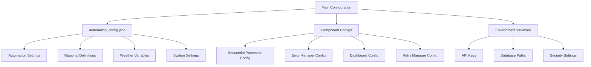

# Configuration Reference

[](#configuration-overview)
[](#configuration-files)

> **Complete configuration reference for the Enhanced RDA Automation System. This guide covers all configuration options, settings, and customization possibilities.**

## Table of Contents

1. [Configuration Overview](#configuration-overview)
2. [Configuration Files](#configuration-files)
3. [Automation Settings](#automation-settings)
4. [Upload Configuration](#upload-configuration)
5. [Directory Settings](#directory-settings)
6. [Regional Configuration](#regional-configuration)
7. [Weather Variables](#weather-variables)
8. [Dataset Configuration](#dataset-configuration)
9. [Logging Configuration](#logging-configuration)
10. [Safety Settings](#safety-settings)
11. [Component-Specific Configuration](#component-specific-configuration)
12. [Environment Variables](#environment-variables)
13. [Configuration Validation](#configuration-validation)
14. [Best Practices](#best-practices)

## Configuration Overview

The Enhanced RDA Automation System uses a hierarchical JSON-based configuration system that allows comprehensive customization of all system components and behaviors.

### Configuration Architecture



### Configuration Hierarchy

| Level | Description | Example |
|-------|-------------|---------|
| **System Level** | Core system settings | Database paths, logging, safety |
| **Component Level** | Individual component settings | Retry attempts, processing delays |
| **Regional Level** | Geographic region definitions | Coordinates, names, descriptions |
| **Variable Level** | Weather variable definitions | Units, aliases, descriptions |
| **Environment Level** | Runtime environment settings | API keys, security settings |

## Configuration Files

### Main Configuration File

**Location:** [`config/automation_config.json`](../config/automation_config.json)

**Structure:**
```json
{
  "automation": { /* Core automation settings */ },
  "upload": { /* File upload configuration */ },
  "directories": { /* Directory paths */ },
  "regions": { /* Regional definitions */ },
  "weather_variables": { /* Weather variable definitions */ },
  "datasets": { /* Dataset information */ },
  "logging": { /* Logging configuration */ },
  "safety": { /* Safety and validation settings */ }
}
```

### Component Configuration Files

| Component | Configuration File | Purpose |
|-----------|-------------------|---------|
| **Sequential Processor** | `ProcessingConfig` class | File processing settings |
| **Error Manager** | `PurgeConfig` class | Error handling configuration |
| **Smart Retry Manager** | `SmartRetryConfig` class | Retry strategy settings |
| **Dashboard** | `DashboardConfig` class | Dashboard and API settings |
| **Capacity Manager** | `CapacityConfig` class | Capacity management settings |

## Automation Settings

### Core Automation Configuration

```json
{
  "automation": {
    "max_concurrent_requests": 10,
    "check_interval_seconds": 300,
    "retry_attempts": 3,
    "retry_delay_seconds": 60,
    "download_timeout_seconds": 3600,
    "auto_purge_after_download": true,
    "auto_purge_failed_requests": true,
    "purge_retry_attempts": 2,
    "purge_retry_delay_seconds": 30,
    "request_limit_safety_margin": 2,
    "auto_upload_enabled": true,
    "status_check_interval_seconds": 180
  }
}
```

### Automation Settings Reference

| Setting | Type | Default | Description |
|---------|------|---------|-------------|
| `max_concurrent_requests` | integer | 10 | Maximum concurrent RDA requests |
| `check_interval_seconds` | integer | 300 | Interval between status checks (seconds) |
| `retry_attempts` | integer | 3 | Number of retry attempts for failed requests |
| `retry_delay_seconds` | integer | 60 | Delay between retry attempts (seconds) |
| `download_timeout_seconds` | integer | 3600 | Timeout for download operations (seconds) |
| `auto_purge_after_download` | boolean | true | Automatically purge completed requests |
| `auto_purge_failed_requests` | boolean | true | Automatically purge failed requests |
| `purge_retry_attempts` | integer | 2 | Retry attempts for purge operations |
| `purge_retry_delay_seconds` | integer | 30 | Delay between purge retries (seconds) |
| `request_limit_safety_margin` | integer | 2 | Safety margin for request limits |
| `auto_upload_enabled` | boolean | true | Enable automatic file upload |
| `status_check_interval_seconds` | integer | 180 | Status check frequency (seconds) |

### Production vs Development Settings

#### Production Configuration
```json
{
  "automation": {
    "max_concurrent_requests": 8,
    "check_interval_seconds": 600,
    "retry_attempts": 5,
    "retry_delay_seconds": 120,
    "download_timeout_seconds": 7200,
    "request_limit_safety_margin": 3,
    "status_check_interval_seconds": 300
  }
}
```

#### Development Configuration
```json
{
  "automation": {
    "max_concurrent_requests": 5,
    "check_interval_seconds": 60,
    "retry_attempts": 2,
    "retry_delay_seconds": 30,
    "download_timeout_seconds": 1800,
    "request_limit_safety_margin": 1,
    "status_check_interval_seconds": 60
  }
}
```

## Upload Configuration

### Upload Settings

```json
{
  "upload": {
    "dest_file": "./ds0841.1_control.ctl",
    "rate_limit_delay": 2.0,
    "auto_discover_incoming": true
  }
}
```

### Upload Settings Reference

| Setting | Type | Default | Description |
|---------|------|---------|-------------|
| `dest_file` | string | "./ds0841.1_control.ctl" | Destination file for uploads |
| `rate_limit_delay` | float | 2.0 | Delay between uploads (seconds) |
| `auto_discover_incoming` | boolean | true | Automatically discover incoming files |

### Advanced Upload Configuration

```json
{
  "upload": {
    "dest_file": "./ds0841.1_control.ctl",
    "rate_limit_delay": 2.0,
    "auto_discover_incoming": true,
    "batch_size": 10,
    "max_file_size_mb": 100,
    "allowed_extensions": [".ctl", ".txt"],
    "upload_timeout_seconds": 300,
    "retry_failed_uploads": true,
    "max_upload_retries": 3,
    "upload_retry_delay": 30
  }
}
```

## Directory Settings

### Directory Configuration

```json
{
  "directories": {
    "base_download_dir": "src/python/downloaded_files",
    "logs_dir": "./logs",
    "control_files_dir": "./control_files"
  }
}
```

### Directory Settings Reference

| Setting | Type | Default | Description |
|---------|------|---------|-------------|
| `base_download_dir` | string | "src/python/downloaded_files" | Base directory for downloaded files |
| `logs_dir` | string | "./logs" | Directory for log files |
| `control_files_dir` | string | "./control_files" | Directory for control files |

### Extended Directory Configuration

```json
{
  "directories": {
    "base_download_dir": "src/python/downloaded_files",
    "logs_dir": "./logs",
    "control_files_dir": "./control_files",
    "temp_dir": "./temp",
    "backup_dir": "./backups",
    "config_dir": "./config",
    "data_dir": "./data",
    "reports_dir": "./reports",
    "archive_dir": "./archive"
  }
}
```

### Directory Structure Best Practices

```bash
# Recommended directory structure
project_root/
├── config/                 # Configuration files
├── src/python/
│   ├── downloaded_files/   # Downloaded data files
│   ├── control_files/      # Control files for processing
│   ├── data/              # Database and state files
│   └── automation/        # Source code
├── logs/                  # Log files
├── temp/                  # Temporary files
├── backups/               # Database backups
├── reports/               # Generated reports
└── archive/               # Archived files
```

## Regional Configuration

### Regional Definitions

The system supports comprehensive regional definitions for electricity grid regions worldwide.

#### US Regional Examples

```json
{
  "regions": {
    "CISO": {
      "name": "California ISO",
      "description": "California Independent System Operator region",
      "coordinates": [42, 32, -124.75, -113.5]
    },
    "ERCOT": {
      "name": "Electric Reliability Council of Texas",
      "description": "Texas electricity grid region",
      "coordinates": [36.5, 25.25, -104.5, -93.25]
    },
    "PJM": {
      "name": "PJM Interconnection",
      "description": "Mid-Atlantic and Midwest electricity grid",
      "coordinates": [43, 34.25, -91, -73.5]
    }
  }
}
```

#### European Regional Examples

```json
{
  "regions": {
    "DE": {
      "name": "Germany",
      "description": "German electricity region",
      "coordinates": [55.25, 47.25, 5.75, 15]
    },
    "FR": {
      "name": "France",
      "description": "French electricity region",
      "coordinates": [51.25, 42.25, -5.25, 8.25]
    },
    "GB": {
      "name": "Great Britain",
      "description": "British electricity region",
      "coordinates": [61, 49.75, -8.25, 2.25]
    }
  }
}
```

### Regional Configuration Reference

| Field | Type | Description | Example |
|-------|------|-------------|---------|
| `name` | string | Full region name | "California ISO" |
| `description` | string | Region description | "California Independent System Operator region" |
| `coordinates` | array | [north_lat, south_lat, west_lon, east_lon] | [42, 32, -124.75, -113.5] |

### Adding Custom Regions

```json
{
  "regions": {
    "CUSTOM_REGION": {
      "name": "Custom Region Name",
      "description": "Description of the custom region",
      "coordinates": [north_lat, south_lat, west_lon, east_lon],
      "timezone": "America/Los_Angeles",
      "country": "US",
      "grid_operator": "Custom Grid Operator",
      "contact_info": {
        "email": "contact@customregion.com",
        "phone": "+1-555-0123"
      }
    }
  }
}
```

## Weather Variables

### Weather Variable Definitions

```json
{
  "weather_variables": {
    "dswrf": {
      "name": "Downward Short-Wave Radiation Flux",
      "description": "Solar radiation data",
      "units": "W/m^2",
      "aliases": ["DSWRF", "Downward shortwave radiation flux", "Solar radiation"]
    },
    "temp": {
      "name": "Temperature",
      "description": "Air temperature data",
      "units": "K",
      "aliases": ["tmp", "TMP", "Temperature", "TMP/DPT"]
    },
    "wind": {
      "name": "Wind Components",
      "description": "Wind speed and direction components",
      "units": "m/s",
      "aliases": ["ugrd", "vgrd", "UGRD", "VGRD", "U GRD", "V GRD", "u-component of wind", "v-component of wind", "U GRD/V GRD"]
    },
    "rain": {
      "name": "Precipitation",
      "description": "Total precipitation data",
      "units": "kg/m^2",
      "aliases": ["apcp", "APCP", "A PCP", "Total precipitation", "precipitation"]
    }
  }
}
```

### Weather Variable Reference

| Field | Type | Description | Example |
|-------|------|-------------|---------|
| `name` | string | Full variable name | "Downward Short-Wave Radiation Flux" |
| `description` | string | Variable description | "Solar radiation data" |
| `units` | string | Measurement units | "W/m^2" |
| `aliases` | array | Alternative names/identifiers | ["DSWRF", "Solar radiation"] |

### Adding Custom Weather Variables

```json
{
  "weather_variables": {
    "custom_var": {
      "name": "Custom Weather Variable",
      "description": "Description of custom variable",
      "units": "custom_unit",
      "aliases": ["CUSTOM", "Custom Variable"],
      "category": "atmospheric",
      "data_type": "continuous",
      "typical_range": {
        "min": 0,
        "max": 100
      },
      "quality_checks": {
        "range_check": true,
        "spike_detection": true,
        "missing_data_threshold": 0.1
      }
    }
  }
}
```

## Dataset Configuration

### Dataset Definitions

```json
{
  "datasets": {
    "ds084.1": {
      "name": "NCEP GFS 0.25 Degree Global Forecast Grids Historical Archive",
      "description": "High-resolution global weather forecast data"
    }
  }
}
```

### Extended Dataset Configuration

```json
{
  "datasets": {
    "ds084.1": {
      "name": "NCEP GFS 0.25 Degree Global Forecast Grids Historical Archive",
      "description": "High-resolution global weather forecast data",
      "resolution": "0.25 degree",
      "temporal_resolution": "6 hourly",
      "spatial_coverage": "global",
      "time_range": {
        "start": "2015-01-15",
        "end": "present"
      },
      "variables": ["dswrf", "temp", "wind", "rain"],
      "file_format": "GRIB2",
      "typical_file_size_mb": 150,
      "update_frequency": "daily",
      "data_provider": "NCEP",
      "access_restrictions": {
        "registration_required": true,
        "commercial_use": false
      }
    }
  }
}
```

## Logging Configuration

### Logging Settings

```json
{
  "logging": {
    "level": "INFO",
    "format": "%(asctime)s - %(name)s - %(levelname)s - %(message)s",
    "max_log_size_mb": 10,
    "backup_count": 5
  }
}
```

### Logging Configuration Reference

| Setting | Type | Default | Description |
|---------|------|---------|-------------|
| `level` | string | "INFO" | Logging level (DEBUG, INFO, WARNING, ERROR, CRITICAL) |
| `format` | string | Standard format | Log message format string |
| `max_log_size_mb` | integer | 10 | Maximum log file size in MB |
| `backup_count` | integer | 5 | Number of backup log files to keep |

### Advanced Logging Configuration

```json
{
  "logging": {
    "level": "INFO",
    "format": "%(asctime)s - %(name)s - %(levelname)s - %(message)s",
    "max_log_size_mb": 10,
    "backup_count": 5,
    "handlers": {
      "console": {
        "enabled": true,
        "level": "INFO",
        "format": "%(levelname)s - %(message)s"
      },
      "file": {
        "enabled": true,
        "level": "DEBUG",
        "filename": "logs/automation.log",
        "max_size_mb": 10,
        "backup_count": 5
      },
      "error_file": {
        "enabled": true,
        "level": "ERROR",
        "filename": "logs/errors.log",
        "max_size_mb": 5,
        "backup_count": 10
      },
      "syslog": {
        "enabled": false,
        "level": "WARNING",
        "facility": "local0",
        "address": ["localhost", 514]
      }
    },
    "loggers": {
      "rda_automation": {
        "level": "INFO",
        "handlers": ["console", "file"]
      },
      "rda_automation.dashboard": {
        "level": "DEBUG",
        "handlers": ["file"]
      },
      "rda_automation.error_manager": {
        "level": "WARNING",
        "handlers": ["console", "error_file"]
      }
    }
  }
}
```

## Safety Settings

### Safety Configuration

```json
{
  "safety": {
    "require_confirmation": true,
    "dry_run_mode": false,
    "max_files_per_download": 1000
  }
}
```

### Safety Settings Reference

| Setting | Type | Default | Description |
|---------|------|---------|-------------|
| `require_confirmation` | boolean | true | Require user confirmation for operations |
| `dry_run_mode` | boolean | false | Enable dry run mode (no actual operations) |
| `max_files_per_download` | integer | 1000 | Maximum files per download operation |

### Extended Safety Configuration

```json
{
  "safety": {
    "require_confirmation": true,
    "dry_run_mode": false,
    "max_files_per_download": 1000,
    "max_concurrent_operations": 5,
    "operation_timeout_minutes": 60,
    "auto_backup_before_operations": true,
    "validate_coordinates": true,
    "check_disk_space": true,
    "min_free_space_gb": 10,
    "max_request_rate_per_hour": 100,
    "enable_operation_logging": true,
    "require_api_key": true,
    "allowed_ip_ranges": ["127.0.0.1/32", "192.168.1.0/24"],
    "emergency_stop": {
      "enabled": true,
      "trigger_file": "./EMERGENCY_STOP",
      "check_interval_seconds": 30
    }
  }
}
```

## Component-Specific Configuration

### Sequential File Processor Configuration

```python
from automation.sequential_file_processor import ProcessingConfig, ProcessingMode

config = ProcessingConfig(
    # File discovery settings
    control_files_dir="src/python/control_files",
    processing_order="alphabetical",  # alphabetical, priority, region, variable
    
    # Processing settings
    processing_mode=ProcessingMode.SEQUENTIAL,
    max_concurrent_files=1,
    retry_failed_files=True,
    max_retries_per_file=3,
    
    # Timing settings
    file_submission_delay=5.0,
    status_check_interval=60,
    completion_check_interval=300,
    
    # Integration settings
    enable_capacity_management=True,
    enable_smart_retry=True,
    enable_data_sync=True,
    enable_progress_tracking=True,
    enable_completion_notifications=True,
    
    # Database settings
    db_path="src/python/data/automation_state.db",
    
    # Resume settings
    resume_session_id=None,
    resume_from_file=None
)
```

### Error Manager Configuration

```python
from automation.error_manager import PurgeConfig

config = PurgeConfig(
    max_retries=3,
    max_age_hours=24,
    error_patterns=[
        "HTTP 400: Unknown error",
        "HTTP 500: Internal Server Error",
        "Connection timeout",
        "Request timeout"
    ],
    enabled=True,
    auto_purge_interval_hours=6,
    backup_before_purge=True,
    notification_on_purge=True
)
```

### Smart Retry Manager Configuration

```python
from automation.smart_retry_manager import SmartRetryConfig

config = SmartRetryConfig(
    # Retry strategy
    max_retry_attempts=5,
    base_delay_seconds=60,
    max_delay_seconds=3600,
    exponential_base=2.0,
    jitter_factor=0.1,
    
    # Rate limiting
    rate_limit_requests_per_minute=30,
    rate_limit_window_size=60,
    
    # Capacity management
    capacity_threshold=8,
    capacity_check_interval=30,
    
    # Processing
    max_concurrent_retries=5,
    retry_batch_size=10,
    processing_interval=60,
    
    # Error classification
    transient_error_patterns=[
        "Connection timeout",
        "HTTP 503",
        "HTTP 502",
        "HTTP 504"
    ],
    persistent_error_patterns=[
        "HTTP 400",
        "HTTP 401",
        "HTTP 403",
        "HTTP 404"
    ],
    
    # Integration
    integrate_with_capacity_manager=True,
    integrate_with_error_manager=True,
    enable_detailed_logging=True,
    
    # Database
    db_path="src/python/data/automation_state.db"
)
```

### Dashboard Configuration

```python
from automation.dashboard import DashboardConfig

config = DashboardConfig(
    # Server settings
    host="0.0.0.0",
    port=8080,
    debug=False,
    
    # Database settings
    db_path="src/python/data/automation_state.db",
    auto_sync=True,
    
    # Real-time sync settings
    sync_config={
        'immediate_sync_on_access': True,
        'auto_refresh_stale_data': True,
        'freshness_thresholds': {
            'fresh': 0,
            'acceptable': 30,
            'stale': 300,
            'critical': 1800
        }
    },
    
    # Security settings
    api_key_required=True,
    allowed_ips=["127.0.0.1", "localhost"],
    
    # Performance settings
    cache_enabled=True,
    cache_timeout=300,
    max_concurrent_requests=100
)
```

### Capacity Manager Configuration

```python
from automation.capacity_manager import CapacityConfig

config = CapacityConfig(
    # Capacity limits
    max_requests=10,
    safety_margin=2,
    warning_threshold=8,
    critical_threshold=9,
    
    # Monitoring
    check_interval_seconds=30,
    enable_monitoring=True,
    
    # Crisis management
    enable_crisis_resolution=True,
    auto_upload_on_crisis=True,
    crisis_threshold=9,
    
    # Database
    db_path="src/python/data/automation_state.db"
)
```

## Environment Variables

### Required Environment Variables

```bash
# Database configuration
export RDA_DB_PATH="src/python/data/automation_state.db"

# API configuration
export DASHBOARD_API_KEY="your-secure-api-key-here"
export ALLOWED_IPS="127.0.0.1,192.168.1.100,10.0.0.50"

# RDA API credentials (if required)
export RDA_USERNAME="your-rda-username"
export RDA_PASSWORD="your-rda-password"
export RDA_API_KEY="your-rda-api-key"

# Directory paths
export RDA_CONTROL_FILES_DIR="./control_files"
export RDA_DOWNLOAD_DIR="./downloaded_files"
export RDA_LOGS_DIR="./logs"

# System settings
export RDA_MAX_CONCURRENT_REQUESTS="10"
export RDA_DEBUG_MODE="false"
export RDA_DRY_RUN="false"
```

### Optional Environment Variables

```bash
# Performance tuning
export RDA_CACHE_ENABLED="true"
export RDA_CACHE_TIMEOUT="300"
export RDA_MAX_WORKERS="4"

# Monitoring and alerting
export RDA_ENABLE_MONITORING="true"
export RDA_ALERT_EMAIL="admin@example.com"
export RDA_SLACK_WEBHOOK_URL="https://hooks.slack.com/..."

# Advanced features
export RDA_ENABLE_SMART_RETRY="true"
export RDA_ENABLE_CAPACITY_MANAGEMENT="true"
export RDA_ENABLE_ERROR_TRACKING="true"

# Security
export RDA_ENABLE_SSL="false"
export RDA_SSL_CERT_PATH="/path/to/cert.pem"
export RDA_SSL_KEY_PATH="/path/to/key.pem"
```

### Environment Variable Loading

```python
import os
from typing import Optional

def load_environment_config() -> dict:
    """Load configuration from environment variables."""
    
    config = {
        # Database settings
        'db_path': os.getenv('RDA_DB_PATH', 'src/python/data/automation_state.db'),
        
        # API settings
        'api_key': os.getenv('DASHBOARD_API_KEY'),
        'allowed_ips': os.getenv('ALLOWED_IPS', '127.0.0.1').split(','),
        
        # Directory settings
        'control_files_dir': os.getenv('RDA_CONTROL_FILES_DIR', './control_files'),
        'download_dir': os.getenv('RDA_DOWNLOAD_DIR', './downloaded_files'),
        'logs_dir': os.getenv('RDA_LOGS_DIR', './logs'),
        
        # System settings
        'max_concurrent_requests': int(os.getenv('RDA_MAX_CONCURRENT_REQUESTS', '10')),
        'debug_mode': os.getenv('RDA_DEBUG_MODE', 'false').lower() == 'true',
        'dry_run': os.getenv('RDA_DRY_RUN', 'false').lower() == 'true',
        
        # Feature flags
        'enable_smart_retry': os.getenv('RDA_ENABLE_SMART_RETRY', 'true').lower() == 'true',
        'enable_capacity_management': os.getenv('RDA_ENABLE_CAPACITY_MANAGEMENT', 'true').lower() == 'true',
        'enable_error_tracking': os.getenv('RDA_ENABLE_ERROR_TRACKING', 'true').lower() == 'true',
    }
    
    return config

# Usage example
env_config = load_environment_config()
```

## Configuration Validation

### Configuration Validation Schema

```python
import json
from typing import Dict, Any, List
from jsonschema import validate, ValidationError

def get_config_schema() -> Dict[str, Any]:
    """Get JSON schema for configuration validation."""
    
    return {
        "type": "object",
        "properties": {
            "automation": {
                "type": "object",
                "properties": {
                    "max_concurrent_requests": {"type": "integer", "minimum": 1, "maximum": 20},
                    "check_interval_seconds": {"type": "integer", "minimum": 30},
                    "retry_attempts": {"type": "integer", "minimum": 0, "maximum": 10},
                    "retry_delay_seconds": {"type": "integer", "minimum": 1},
                    "download_timeout_seconds": {"type": "integer", "minimum": 300},
                    "auto_purge_after_download": {"type": "boolean"},
                    "auto_purge_failed_requests": {"type": "boolean"}
                },
                "required": ["max_concurrent_requests", "check_interval_seconds"]
            },
            "directories": {
                "type": "object",
                "properties": {
                    "base_download_dir": {"type": "string", "minLength": 1},
                    "logs_dir": {"type": "string", "minLength": 1},
                    "control_files_dir": {"type": "string", "minLength": 1}
                },
                "required": ["base_download_dir", "logs_dir", "control_files_dir"]
            },
            "regions": {
                "type": "object",
                "patternProperties": {
                    "^[A-Z0-9_]+$": {
                        "type": "object",
                        "properties": {
                            "name": {"type": "string", "minLength": 1},
                            "description": {"type": "string"},
                            "coordinates": {
                                "type": "array",
                                "items": {"type": "number"},
                                "minItems": 4,
                                "maxItems": 4
                            }
                        },
                        "required": ["name", "coordinates"]
                    }
                }
            },
            "weather_variables": {
                "type": "object",
                "patternProperties": {
                    "^[a-z_]+$": {
                        "type": "object",
                        "properties": {
                            "name": {"type": "string", "minLength": 1},
                            "description": {"type": "string"},
                            "units": {"type": "string"},
                            "aliases": {
                                "type": "array",
                                "items": {"type": "string"}
                            }
                        },
                        "required": ["name", "units"]
                    }
                }
            },
            "logging": {
                "type": "object",
                "properties": {
                    "level": {
                        "type": "string",
                        "enum": ["DEBUG", "INFO", "WARNING", "ERROR", "CRITICAL"]
                    },
                    "max_log_size_mb": {"type": "integer", "minimum": 1},
                    "backup_count": {"type": "integer", "minimum": 0}
                }
            },
            "safety": {
                "type": "object",
                "properties": {
                    "require_confirmation": {"type": "boolean"},
                    "dry_run_mode": {"type": "boolean"},
                    "max_files_per_download": {"type": "integer", "minimum": 1}
                }
            }
        },
        "required": ["automation", "directories"]
    }

def validate_configuration(config: Dict[str, Any]) -> List[str]:
    """Validate configuration against schema."""
    
    schema = get_config_schema()
    errors = []
    
    try:
        validate(instance=config, schema=schema)
    except ValidationError as e:
        errors.append(f"Configuration validation error: {e.message}")
    
    # Additional custom validations
    if 'regions' in config:
        for region_code, region_data in config['regions'].items():
            coords = region_data.get('coordinates', [])
            if len(coords) == 4:
                north, south, west, east = coords
                if north <= south:
                    errors.append(f"Region {region_code}: North latitude must be greater than south latitude")
                if west >= east:
                    errors.append(f"Region {region_code}: West longitude must be less than east longitude")
    
    return errors

# Usage example
def load_and_
validate_config(config_path: str) -> Dict[str, Any]:
    """Load and validate configuration file."""
    
    try:
        with open(config_path, 'r') as f:
            config = json.load(f)
        
        errors = validate_configuration(config)
        if errors:
            raise ValueError(f"Configuration validation failed: {', '.join(errors)}")
        
        return config
    
    except FileNotFoundError:
        raise FileNotFoundError(f"Configuration file not found: {config_path}")
    except json.JSONDecodeError as e:
        raise ValueError(f"Invalid JSON in configuration file: {e}")

# Example usage
try:
    config = load_and_validate_config('config/automation_config.json')
    print("✅ Configuration loaded and validated successfully")
except Exception as e:
    print(f"❌ Configuration error: {e}")
```

### Configuration Testing

```python
import unittest
from typing import Dict, Any

class TestConfiguration(unittest.TestCase):
    """Test configuration validation and loading."""
    
    def setUp(self):
        """Set up test configuration."""
        self.valid_config = {
            "automation": {
                "max_concurrent_requests": 10,
                "check_interval_seconds": 300,
                "retry_attempts": 3,
                "retry_delay_seconds": 60,
                "download_timeout_seconds": 3600,
                "auto_purge_after_download": True,
                "auto_purge_failed_requests": True
            },
            "directories": {
                "base_download_dir": "src/python/downloaded_files",
                "logs_dir": "./logs",
                "control_files_dir": "./control_files"
            },
            "regions": {
                "TEST": {
                    "name": "Test Region",
                    "description": "Test region for validation",
                    "coordinates": [45.0, 40.0, -125.0, -120.0]
                }
            },
            "logging": {
                "level": "INFO",
                "max_log_size_mb": 10,
                "backup_count": 5
            },
            "safety": {
                "require_confirmation": True,
                "dry_run_mode": False,
                "max_files_per_download": 1000
            }
        }
    
    def test_valid_configuration(self):
        """Test that valid configuration passes validation."""
        errors = validate_configuration(self.valid_config)
        self.assertEqual(len(errors), 0, f"Valid configuration failed validation: {errors}")
    
    def test_missing_required_fields(self):
        """Test that missing required fields are detected."""
        invalid_config = self.valid_config.copy()
        del invalid_config['automation']['max_concurrent_requests']
        
        errors = validate_configuration(invalid_config)
        self.assertGreater(len(errors), 0, "Missing required field not detected")
    
    def test_invalid_coordinate_ranges(self):
        """Test that invalid coordinate ranges are detected."""
        invalid_config = self.valid_config.copy()
        invalid_config['regions']['TEST']['coordinates'] = [40.0, 45.0, -120.0, -125.0]  # Invalid ranges
        
        errors = validate_configuration(invalid_config)
        self.assertGreater(len(errors), 0, "Invalid coordinate ranges not detected")

if __name__ == '__main__':
    unittest.main()
```

## Best Practices

### Configuration Management Best Practices

#### 1. **Version Control**
```bash
# Keep configuration files in version control
git add config/automation_config.json
git commit -m "Update automation configuration"

# Use separate configs for different environments
config/
├── automation_config.json          # Base configuration
├── automation_config.dev.json      # Development overrides
├── automation_config.prod.json     # Production overrides
└── automation_config.test.json     # Testing overrides
```

#### 2. **Environment-Specific Configurations**
```python
import os
import json
from typing import Dict, Any

def load_environment_config(env: str = None) -> Dict[str, Any]:
    """Load configuration for specific environment."""
    
    if env is None:
        env = os.getenv('RDA_ENVIRONMENT', 'dev')
    
    # Load base configuration
    with open('config/automation_config.json', 'r') as f:
        config = json.load(f)
    
    # Load environment-specific overrides
    env_config_path = f'config/automation_config.{env}.json'
    if os.path.exists(env_config_path):
        with open(env_config_path, 'r') as f:
            env_config = json.load(f)
        
        # Merge configurations (env_config overrides base config)
        config = merge_configs(config, env_config)
    
    return config

def merge_configs(base: Dict[str, Any], override: Dict[str, Any]) -> Dict[str, Any]:
    """Recursively merge configuration dictionaries."""
    
    result = base.copy()
    
    for key, value in override.items():
        if key in result and isinstance(result[key], dict) and isinstance(value, dict):
            result[key] = merge_configs(result[key], value)
        else:
            result[key] = value
    
    return result
```

#### 3. **Configuration Security**
```python
import os
from cryptography.fernet import Fernet

class SecureConfigManager:
    """Manage encrypted configuration values."""
    
    def __init__(self, key_path: str = None):
        """Initialize with encryption key."""
        if key_path and os.path.exists(key_path):
            with open(key_path, 'rb') as f:
                key = f.read()
        else:
            key = os.getenv('RDA_CONFIG_KEY', '').encode()
        
        if not key:
            raise ValueError("No encryption key provided")
        
        self.cipher = Fernet(key)
    
    def encrypt_value(self, value: str) -> str:
        """Encrypt a configuration value."""
        return self.cipher.encrypt(value.encode()).decode()
    
    def decrypt_value(self, encrypted_value: str) -> str:
        """Decrypt a configuration value."""
        return self.cipher.decrypt(encrypted_value.encode()).decode()
    
    def load_secure_config(self, config_path: str) -> Dict[str, Any]:
        """Load configuration with encrypted values."""
        with open(config_path, 'r') as f:
            config = json.load(f)
        
        # Decrypt sensitive values
        if 'credentials' in config:
            for key, value in config['credentials'].items():
                if isinstance(value, str) and value.startswith('encrypted:'):
                    config['credentials'][key] = self.decrypt_value(value[10:])
        
        return config

# Usage example
secure_manager = SecureConfigManager('config/encryption.key')
config = secure_manager.load_secure_config('config/automation_config.json')
```

#### 4. **Configuration Backup and Recovery**
```python
import shutil
import datetime
from pathlib import Path

class ConfigBackupManager:
    """Manage configuration backups."""
    
    def __init__(self, backup_dir: str = 'config/backups'):
        """Initialize backup manager."""
        self.backup_dir = Path(backup_dir)
        self.backup_dir.mkdir(parents=True, exist_ok=True)
    
    def create_backup(self, config_path: str) -> str:
        """Create a timestamped backup of configuration."""
        config_file = Path(config_path)
        timestamp = datetime.datetime.now().strftime('%Y%m%d_%H%M%S')
        backup_name = f"{config_file.stem}_{timestamp}{config_file.suffix}"
        backup_path = self.backup_dir / backup_name
        
        shutil.copy2(config_path, backup_path)
        return str(backup_path)
    
    def restore_backup(self, backup_path: str, config_path: str) -> bool:
        """Restore configuration from backup."""
        try:
            shutil.copy2(backup_path, config_path)
            return True
        except Exception as e:
            print(f"Failed to restore backup: {e}")
            return False
    
    def list_backups(self, config_name: str = None) -> List[str]:
        """List available backups."""
        if config_name:
            pattern = f"{config_name}_*.json"
        else:
            pattern = "*.json"
        
        return sorted([str(p) for p in self.backup_dir.glob(pattern)], reverse=True)

# Usage example
backup_manager = ConfigBackupManager()
backup_path = backup_manager.create_backup('config/automation_config.json')
print(f"Configuration backed up to: {backup_path}")
```

#### 5. **Configuration Monitoring**
```python
import time
import threading
from watchdog.observers import Observer
from watchdog.events import FileSystemEventHandler

class ConfigChangeHandler(FileSystemEventHandler):
    """Handle configuration file changes."""
    
    def __init__(self, callback):
        """Initialize with callback function."""
        self.callback = callback
        self.last_modified = {}
    
    def on_modified(self, event):
        """Handle file modification events."""
        if event.is_directory:
            return
        
        if event.src_path.endswith('.json'):
            # Debounce rapid changes
            current_time = time.time()
            if (event.src_path not in self.last_modified or 
                current_time - self.last_modified[event.src_path] > 1.0):
                
                self.last_modified[event.src_path] = current_time
                self.callback(event.src_path)

class ConfigMonitor:
    """Monitor configuration files for changes."""
    
    def __init__(self, config_dir: str, reload_callback):
        """Initialize configuration monitor."""
        self.config_dir = config_dir
        self.reload_callback = reload_callback
        self.observer = Observer()
        self.handler = ConfigChangeHandler(self._on_config_change)
    
    def start_monitoring(self):
        """Start monitoring configuration directory."""
        self.observer.schedule(self.handler, self.config_dir, recursive=False)
        self.observer.start()
        print(f"Started monitoring configuration directory: {self.config_dir}")
    
    def stop_monitoring(self):
        """Stop monitoring configuration directory."""
        self.observer.stop()
        self.observer.join()
        print("Stopped configuration monitoring")
    
    def _on_config_change(self, file_path: str):
        """Handle configuration file changes."""
        print(f"Configuration file changed: {file_path}")
        try:
            self.reload_callback(file_path)
            print("Configuration reloaded successfully")
        except Exception as e:
            print(f"Failed to reload configuration: {e}")

# Usage example
def reload_config(file_path: str):
    """Reload configuration when file changes."""
    global current_config
    current_config = load_and_validate_config(file_path)

monitor = ConfigMonitor('config/', reload_config)
monitor.start_monitoring()
```

### Configuration Documentation Standards

#### 1. **Inline Documentation**
```json
{
  "_comment": "Enhanced RDA Automation System Configuration",
  "_version": "2.0.0",
  "_last_updated": "2024-01-15",
  
  "automation": {
    "_description": "Core automation engine settings",
    "max_concurrent_requests": {
      "_value": 10,
      "_description": "Maximum concurrent requests to RDA API",
      "_range": "1-20",
      "_impact": "Higher values increase throughput but may hit rate limits"
    },
    "check_interval_seconds": {
      "_value": 300,
      "_description": "Interval between status checks in seconds",
      "_minimum": 30,
      "_recommended": "300-600 for production"
    }
  }
}
```

#### 2. **Configuration Templates**
```json
{
  "_template": "development",
  "_description": "Development environment configuration template",
  
  "automation": {
    "max_concurrent_requests": 5,
    "check_interval_seconds": 60,
    "retry_attempts": 2,
    "download_timeout_seconds": 1800
  },
  
  "logging": {
    "level": "DEBUG",
    "max_log_size_mb": 5
  },
  
  "safety": {
    "require_confirmation": false,
    "dry_run_mode": true,
    "max_files_per_download": 100
  }
}
```

#### 3. **Configuration Migration**
```python
class ConfigMigrator:
    """Handle configuration migrations between versions."""
    
    MIGRATIONS = {
        '1.0.0': {
            'version': '2.0.0',
            'changes': [
                'Add safety.max_files_per_download',
                'Rename automation.max_requests to automation.max_concurrent_requests',
                'Add logging.backup_count'
            ],
            'migration_func': 'migrate_1_0_to_2_0'
        }
    }
    
    def migrate_config(self, config: Dict[str, Any], from_version: str) -> Dict[str, Any]:
        """Migrate configuration from one version to another."""
        
        if from_version not in self.MIGRATIONS:
            raise ValueError(f"No migration available from version {from_version}")
        
        migration = self.MIGRATIONS[from_version]
        migration_func = getattr(self, migration['migration_func'])
        
        migrated_config = migration_func(config)
        migrated_config['_version'] = migration['version']
        
        return migrated_config
    
    def migrate_1_0_to_2_0(self, config: Dict[str, Any]) -> Dict[str, Any]:
        """Migrate from version 1.0.0 to 2.0.0."""
        
        # Rename max_requests to max_concurrent_requests
        if 'automation' in config and 'max_requests' in config['automation']:
            config['automation']['max_concurrent_requests'] = config['automation'].pop('max_requests')
        
        # Add new safety settings
        if 'safety' not in config:
            config['safety'] = {}
        
        if 'max_files_per_download' not in config['safety']:
            config['safety']['max_files_per_download'] = 1000
        
        # Add logging backup_count
        if 'logging' in config and 'backup_count' not in config['logging']:
            config['logging']['backup_count'] = 5
        
        return config

# Usage example
migrator = ConfigMigrator()
old_config = load_config('config/automation_config_v1.json')
new_config = migrator.migrate_config(old_config, '1.0.0')
```

## Summary

This Configuration Reference provides comprehensive documentation for all configuration aspects of the Enhanced RDA Automation System:

### Key Configuration Areas
- **System Configuration**: Core automation, upload, and directory settings
- **Regional Configuration**: Geographic region definitions with coordinates
- **Weather Variables**: Meteorological variable definitions and aliases
- **Component Configuration**: Individual component settings and customization
- **Environment Variables**: Runtime environment configuration
- **Security Configuration**: Authentication, encryption, and access control

### Configuration Management Features
- **Validation**: JSON schema validation with custom business rules
- **Environment Support**: Development, testing, and production configurations
- **Security**: Encrypted sensitive values and secure key management
- **Backup & Recovery**: Automated configuration backups and restoration
- **Monitoring**: Real-time configuration change detection and reloading
- **Migration**: Version-aware configuration migration system

### Best Practices Covered
- Version control integration
- Environment-specific configurations
- Security and encryption
- Backup and recovery procedures
- Configuration monitoring and hot-reloading
- Documentation standards and templates
- Migration strategies for configuration updates

This reference serves as the definitive guide for configuring, customizing, and managing all aspects of the Enhanced RDA Automation System, ensuring reliable and secure operation across different environments and use cases.