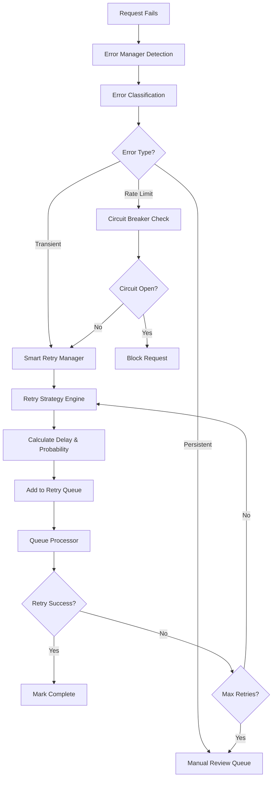
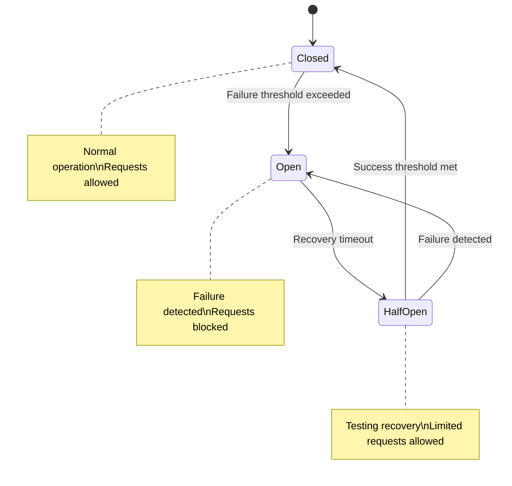

# Error Tracking and Smart Retry Guide

[](#advanced-error-handling)
[](#production-deployment)

> **Master the Enhanced RDA Automation System's intelligent error handling and smart retry mechanisms. This guide covers automatic error detection, classification, and recovery strategies.**

## Table of Contents

1. [Overview](#overview)
2. [Error Classification System](#error-classification-system)
3. [Smart Retry Manager](#smart-retry-manager)
4. [Error Manager](#error-manager)
5. [Circuit Breaker Pattern](#circuit-breaker-pattern)
6. [Configuration and Tuning](#configuration-and-tuning)
7. [Monitoring and Analytics](#monitoring-and-analytics)
8. [Advanced Usage Scenarios](#advanced-usage-scenarios)
9. [Troubleshooting](#troubleshooting)
10. [Best Practices](#best-practices)

## Overview

The Enhanced RDA Automation System includes sophisticated error handling capabilities that automatically detect, classify, and recover from various types of failures. The system uses multiple complementary approaches:

### Key Components

| Component | Purpose | Key Features |
|-----------|---------|--------------|
| **[Error Manager](../src/python/automation/error_manager.py)** | Error detection and purging | Automatic error detection, configurable purging criteria, audit logging |
| **[Smart Retry Manager](../src/python/automation/smart_retry_manager.py)** | Intelligent retry orchestration | Multi-strategy retry logic, circuit breaker integration, rate limiting |
| **[Retry Strategy Engine](../src/python/automation/retry_strategy_engine.py)** | Retry decision making | Exponential backoff, jitter, success probability calculation |
| **[Circuit Breaker Manager](../src/python/automation/circuit_breaker_manager.py)** | Failure detection and isolation | Automatic failure detection, recovery testing, service isolation |
| **[Retry Queue Processor](../src/python/automation/retry_queue_processor.py)** | Queue-based retry processing | Priority queuing, batch processing, status tracking |

### Error Handling Workflow



## Error Classification System

### Automatic Error Classification

The system automatically classifies errors into categories for appropriate handling:

#### Transient Errors (Retryable)
```python
TRANSIENT_ERROR_PATTERNS = [
    "Connection timeout",
    "HTTP 503",           # Service Unavailable
    "HTTP 502",           # Bad Gateway
    "HTTP 504",           # Gateway Timeout
    "Network unreachable",
    "Temporary failure",
    "Service temporarily unavailable"
]
```

**Characteristics:**
- Temporary network or service issues
- High probability of success on retry
- Handled with exponential backoff
- Automatic retry up to configured limits

#### Persistent Errors (Non-retryable)
```python
PERSISTENT_ERROR_PATTERNS = [
    "HTTP 400",           # Bad Request
    "HTTP 401",           # Unauthorized
    "HTTP 403",           # Forbidden
    "HTTP 404",           # Not Found
    "Invalid credentials",
    "Permission denied",
    "Validation error"
]
```

**Characteristics:**
- Configuration or authentication issues
- Low probability of success on retry
- Require manual intervention
- Automatically marked for review

#### Rate Limit Errors (Special Handling)
```python
RATE_LIMIT_PATTERNS = [
    "HTTP 429",           # Too Many Requests
    "Rate limit exceeded",
    "Request quota exceeded",
    "API limit reached"
]
```

**Characteristics:**
- API rate limiting
- Require longer delays
- Handled with extended backoff
- Circuit breaker integration

### Custom Error Classification

You can customize error classification by modifying the configuration:

```python
from automation.smart_retry_manager import SmartRetryConfig

config = SmartRetryConfig(
    transient_error_patterns=[
        "Connection timeout",
        "HTTP 503",
        "Custom transient error pattern"
    ],
    persistent_error_patterns=[
        "HTTP 400",
        "Invalid request format",
        "Custom persistent error pattern"
    ]
)
```

## Smart Retry Manager

The [`SmartRetryManager`](../src/python/automation/smart_retry_manager.py) is the central orchestrator for intelligent retry processing.

### Basic Usage

```python
from automation.smart_retry_manager import create_smart_retry_manager, SmartRetryConfig, RetryRequest

# Create configuration
config = SmartRetryConfig(
    max_retry_attempts=5,
    base_delay_seconds=60,
    exponential_base=2.0,
    jitter_factor=0.1,
    rate_limit_requests_per_minute=30
)

# Create smart retry manager
retry_manager = create_smart_retry_manager(config)

# Create retry request
retry_request = RetryRequest(
    request_id="req_001",
    region="CISO",
    variable_type="dswrf",
    file_path="/path/to/control_file.ctl",
    error_message="HTTP 503: Service temporarily unavailable",
    error_type="HTTP_503",
    attempt_number=1,
    max_attempts=5,
    priority=3
)

# Process retry request
result = retry_manager.process_retry_request(retry_request)

print(f"Retry scheduled: {result.retry_scheduled}")
print(f"Next retry time: {result.next_retry_time}")
print(f"Success probability: {result.success_probability:.3f}")
print(f"Eligibility score: {result.eligibility_score:.3f}")
```

### Advanced Configuration

```python
config = SmartRetryConfig(
    # Retry limits
    max_retry_attempts=5,
    base_delay_seconds=60,
    max_delay_seconds=3600,
    exponential_base=2.0,
    jitter_factor=0.1,
    
    # Rate limiting
    rate_limit_requests_per_minute=30,
    rate_limit_window_size=60,
    
    # Capacity management
    capacity_threshold=8,
    capacity_check_interval=30,
    
    # Processing settings
    max_concurrent_retries=5,
    retry_batch_size=10,
    processing_interval=60,
    
    # Integration settings
    integrate_with_capacity_manager=True,
    integrate_with_error_manager=True,
    enable_detailed_logging=True
)
```

### Batch Processing

Process multiple retry requests efficiently:

```python
# Create multiple retry requests
retry_requests = [
    RetryRequest(
        request_id=f"req_{i:03d}",
        region="CISO",
        variable_type="dswrf",
        file_path=f"/path/to/file_{i}.ctl",
        error_message="HTTP 503: Service temporarily unavailable",
        error_type="HTTP_503"
    )
    for i in range(10)
]

# Process batch
results = retry_manager.process_batch_retry_requests(retry_requests)

# Analyze results
successful_schedules = len([r for r in results if r.success])
print(f"Successfully scheduled {successful_schedules}/{len(results)} retries")
```

### Continuous Processing

Start continuous retry processing:

```python
# Start continuous processing
retry_manager.start_processing()

# Monitor status
while retry_manager.processing_active:
    status = retry_manager.get_system_status()
    print(f"Queue status: {status['queue_processor']['pending_items']} pending")
    time.sleep(30)

# Stop processing
retry_manager.stop_processing()
```

## Error Manager

The [`ErrorManager`](../src/python/automation/error_manager.py) handles automatic error detection and purging.

### Basic Error Detection

```python
from automation.error_manager import create_error_manager, PurgeConfig

# Create error manager with custom configuration
config = PurgeConfig(
    max_retries=3,
    max_age_hours=24,
    error_patterns=[
        "HTTP 400: Unknown error",
        "HTTP 500: Internal Server Error",
        "Connection timeout",
        "Request timeout"
    ],
    enabled=True
)

error_manager = create_error_manager(config=config)

# Detect error requests
error_requests = error_manager.detect_error_requests()
print(f"Found {len(error_requests)} failed requests")

# Get purge candidates
candidates = error_manager.get_purge_candidates()
print(f"Found {len(candidates)} requests meeting purge criteria")

for candidate in candidates:
    print(f"  - {candidate.region}_{candidate.parameter}")
    print(f"    Retries: {candidate.retry_count}")
    print(f"    Error: {candidate.error_message}")
```

### Automatic Purging with Resubmission

```python
# Get purge candidates
candidates = error_manager.get_purge_candidates()

if candidates:
    # Purge with resubmission data preparation
    purged_count, resubmission_data = error_manager.purge_error_requests(
        candidates, 
        create_backup=True
    )
    
    print(f"Purged {purged_count} error requests")
    print(f"Prepared {len(resubmission_data)} requests for resubmission")
    
    # Process resubmission data with retry manager
    if resubmission_data:
        retry_requests = []
        for data in resubmission_data:
            retry_request = RetryRequest(
                request_id=data['original_id'],
                region=data['region'],
                variable_type=data['parameter'],
                file_path=data['file_path'],
                error_message=data['original_error'],
                error_type="purged_retry"
            )
            retry_requests.append(retry_request)
        
        # Process with smart retry manager
        results = retry_manager.process_batch_retry_requests(retry_requests)
        successful_retries = len([r for r in results if r.success])
        print(f"Successfully scheduled {successful_retries} retries")
```

### Session-Based Error Management

```python
# Auto-purge specific session
session_id = "sequential_20241201_143022"
result = error_manager.auto_purge_session(session_id)

print(f"Session {session_id} purge results:")
print(f"  Purged: {result['purged_count']} requests")
print(f"  Resubmission data: {len(result['resubmission_data'])} items")
print(f"  Pre-purge errors: {result['pre_purge_stats']['total_failed_requests']}")
print(f"  Post-purge errors: {result['post_purge_stats']['total_failed_requests']}")
```

### Error Statistics and Analytics

```python
# Get comprehensive error statistics
stats = error_manager.get_error_statistics()

print("Error Statistics:")
print(f"  Total failed requests: {stats['total_failed_requests']}")
print(f"  Requests exceeding retries: {stats['requests_exceeding_retries']}")
print(f"  Average retry count: {stats['average_retry_count']}")
print(f"  Max retry count: {stats['max_retry_count']}")

print("\nError Pattern Counts:")
for pattern, count in stats['error_pattern_counts'].items():
    print(f"  {pattern}: {count}")
```

## Circuit Breaker Pattern

The [`CircuitBreakerManager`](../src/python/automation/circuit_breaker_manager.py) implements the circuit breaker pattern to prevent cascading failures.

### Circuit Breaker States



### Basic Usage

```python
from automation.circuit_breaker_manager import create_circuit_breaker_manager, CircuitBreakerConfig

# Create configuration
config = CircuitBreakerConfig(
    failure_threshold=5,        # Open after 5 failures
    recovery_timeout=300,       # Test recovery after 5 minutes
    success_threshold=3,        # Close after 3 successes
    half_open_max_calls=2       # Allow 2 test calls in half-open
)

# Create circuit breaker manager
cb_manager = create_circuit_breaker_manager(config)

# Check if request can be executed
region = "CISO"
service = "rda_api"

if cb_manager.can_execute_request(region, service):
    try:
        # Execute request
        response = make_rda_request()
        
        # Record success
        cb_manager.record_request_success(region, service, response_time=1.5)
        
    except Exception as e:
        # Record failure
        failure_type = classify_failure(e)
        cb_manager.record_request_failure(region, service, failure_type, response_time=0.0)
else:
    print(f"Circuit breaker is open for {region}/{service}")
```

### Advanced Circuit Breaker Management

```python
# Get circuit breaker status
status = cb_manager.get_circuit_status()

for circuit_id, circuit_info in status.items():
    print(f"Circuit {circuit_id}:")
    print(f"  State: {circuit_info['state']}")
    print(f"  Failure count: {circuit_info['failure_count']}")
    print(f"  Success count: {circuit_info['success_count']}")
    print(f"  Last failure: {circuit_info['last_failure_time']}")

# Force circuit state change (for testing)
cb_manager.force_circuit_state(region, service, "open")

# Reset circuit breaker
cb_manager.reset_circuit_breaker(region, service)
```

## Configuration and Tuning

### Smart Retry Configuration

```python
from automation.smart_retry_manager import SmartRetryConfig

# Production configuration
production_config = SmartRetryConfig(
    # Retry strategy
    max_retry_attempts=5,
    base_delay_seconds=60,
    max_delay_seconds=3600,
    exponential_base=2.0,
    jitter_factor=0.1,
    
    # Rate limiting
    rate_limit_requests_per_minute=20,  # Conservative for production
    rate_limit_window_size=60,
    
    # Capacity management
    capacity_threshold=8,               # Leave 2 slots for safety
    capacity_check_interval=30,
    
    # Processing
    max_concurrent_retries=3,           # Conservative concurrency
    retry_batch_size=5,                 # Smaller batches
    processing_interval=120,            # Check every 2 minutes
    
    # Error classification
    transient_error_patterns=[
        "Connection timeout",
        "HTTP 503",
        "HTTP 502",
        "HTTP 504",
        "Network unreachable",
        "Temporary failure"
    ],
    persistent_error_patterns=[
        "HTTP 400",
        "HTTP 401",
        "HTTP 403",
        "HTTP 404",
        "Invalid credentials",
        "Permission denied",
        "Validation error"
    ],
    
    # Integration
    integrate_with_capacity_manager=True,
    integrate_with_error_manager=True,
    enable_detailed_logging=True,
    enable_performance_monitoring=True
)
```

### Error Manager Configuration

```python
from automation.error_manager import PurgeConfig

# Aggressive purging configuration
aggressive_config = PurgeConfig(
    max_retries=2,                      # Purge after 2 retries
    max_age_hours=12,                   # Purge after 12 hours
    error_patterns=[
        "HTTP 400: Unknown error",
        "HTTP 500: Internal Server Error",
        "Connection timeout",
        "Request timeout",
        "Authentication failed",
        "Invalid request format"
    ],
    enabled=True
)

# Conservative purging configuration
conservative_config = PurgeConfig(
    max_retries=5,                      # More retry attempts
    max_age_hours=48,                   # Longer retention
    error_patterns=[
        "HTTP 500: Internal Server Error",
        "Connection timeout",
        "Request timeout"
    ],
    enabled=True
)
```

### Circuit Breaker Configuration

```python
from automation.circuit_breaker_manager import CircuitBreakerConfig

# Sensitive configuration (quick to open)
sensitive_config = CircuitBreakerConfig(
    failure_threshold=3,                # Open after 3 failures
    recovery_timeout=180,               # Test recovery after 3 minutes
    success_threshold=2,                # Close after 2 successes
    half_open_max_calls=1,              # Single test call
    failure_rate_threshold=0.5,         # 50% failure rate
    minimum_throughput=5                # Minimum calls before evaluation
)

# Robust configuration (slower to open)
robust_config = CircuitBreakerConfig(
    failure_threshold=10,               # Open after 10 failures
    recovery_timeout=600,               # Test recovery after 10 minutes
    success_threshold=5,                # Close after 5 successes
    half_open_max_calls=3,              # Multiple test calls
    failure_rate_threshold=0.8,         # 80% failure rate
    minimum_throughput=20               # Higher minimum throughput
)
```

## Monitoring and Analytics

### Real-time Monitoring

Monitor error handling and retry processing in real-time:

```python
# Get comprehensive system status
status = retry_manager.get_system_status()

print("Smart Retry Manager Status:")
print(f"  Processing active: {status['smart_retry_manager']['processing_active']}")
print(f"  Total requests: {status['smart_retry_manager']['metrics']['total_requests']}")
print(f"  Successful retries: {status['smart_retry_manager']['metrics']['successful_retries']}")
print(f"  Failed retries: {status['smart_retry_manager']['metrics']['failed_retries']}")

print("\nQueue Processor Status:")
print(f"  Pending items: {status['queue_processor']['pending_items']}")
print(f"  Processing items: {status['queue_processor']['processing_items']}")
print(f"  Success rate: {status['queue_processor']['success_rate']:.1f}%")

print("\nCircuit Breakers:")
for circuit_id, circuit_info in status['circuit_breakers'].items():
    print(f"  {circuit_id}: {circuit_info['state']}")
```

### Dashboard Integration

The enhanced dashboard provides comprehensive error tracking:

```bash
# Access error tracking dashboard
curl http://localhost:8080/api/error-tracking/summary

# Get live error feed
curl http://localhost:8080/api/error-tracking/live-feed?limit=20

# Get regional error health
curl http://localhost:8080/api/error-tracking/regional-health

# Get error trends
curl http://localhost:8080/api/error-tracking/trends?hours_back=24
```

### Performance Metrics

Track retry performance and optimization:

```python
# Get retry statistics
retry_stats = retry_manager.get_retry_statistics()

print("Retry Performance:")
print(f"  Total attempts: {retry_stats['metrics']['total_retries_attempted']}")
print(f"  Success rate: {retry_stats['metrics']['success_rate']:.1f}%")
print(f"  Average delay: {retry_stats['metrics']['average_retry_delay']:.1f}s")

print("\nStatus Distribution:")
for status, count in retry_stats['status_distribution'].items():
    print(f"  {status}: {count}")

print(f"\nRecent activity (24h): {retry_stats['recent_activity_24h']}")
```

## Advanced Usage Scenarios

### Scenario 1: Custom Retry Strategy

Implement custom retry logic for specific error types:

```python
from automation.retry_strategy_engine import RetryContext, ErrorCategory, ErrorSeverity

def custom_retry_strategy(context: RetryContext) -> bool:
    """Custom retry decision logic."""
    
    # Never retry authentication errors
    if context.error_category == ErrorCategory.AUTHENTICATION:
        return False
    
    # Aggressive retry for high-priority requests
    if context.priority_level >= 4:
        return context.attempt_number <= 7  # More attempts for high priority
    
    # Conservative retry for low system capacity
    if context.capacity_available < 3:
        return context.attempt_number <= 2  # Fewer attempts when capacity is low
    
    # Standard retry logic
    return context.attempt_number <= 5

# Apply custom strategy
retry_engine = create_retry_strategy_engine()
retry_engine.add_custom_strategy("custom", custom_retry_strategy)
```

### Scenario 2: Regional Circuit Breaker Management

Implement region-specific circuit breaker policies:

```python
# Configure different policies for different regions
region_configs = {
    "CISO": CircuitBreakerConfig(
        failure_threshold=3,    # California is sensitive
        recovery_timeout=180
    ),
    "ERCOT": CircuitBreakerConfig(
        failure_threshold=5,    # Texas is more robust
        recovery_timeout=300
    ),
    "PJM": CircuitBreakerConfig(
        failure_threshold=7,    # PJM handles more load
        recovery_timeout=600
    )
}

# Apply region-specific configurations
for region, config in region_configs.items():
    cb_manager.update_circuit_config(region, "rda_api", config)
```

### Scenario 3: Intelligent Error Pattern Learning

Implement machine learning-based error pattern recognition:

```python
from collections import defaultdict
import re

class ErrorPatternLearner:
    def __init__(self):
        self.error_patterns = defaultdict(list)
        self.success_rates = defaultdict(float)
    
    def learn_from_errors(self, error_requests):
        """Learn patterns from historical errors."""
        for error in error_requests:
            # Extract patterns from error messages
            patterns = self.extract_patterns(error.error_message)
            
            for pattern in patterns:
                self.error_patterns[pattern].append(error)
                
                # Calculate success rate for this pattern
                retries = [e for e in self.error_patterns[pattern] if e.retry_count > 0]
                successes = [e for e in retries if e.status == 'completed']
                
                if retries:
                    self.success_rates[pattern] = len(successes) / len(retries)
    
    def extract_patterns(self, error_message):
        """Extract meaningful patterns from error messages."""
        patterns = []
        
        # HTTP status codes
        http_match = re.search(r'HTTP (\d{3})', error_message)
        if http_match:
            patterns.append(f"HTTP_{http_match.group(1)}")
        
        # Timeout patterns
        if 'timeout' in error_message.lower():
            patterns.append("TIMEOUT")
        
        # Connection patterns
        if 'connection' in error_message.lower():
            patterns.append("CONNECTION")
        
        return patterns
    
    def should_retry(self, error_message):
        """Determine if error should be retried based on learned patterns."""
        patterns = self.extract_patterns(error_message)
        
        for pattern in patterns:
            if pattern in self.success_rates:
                if self.success_rates[pattern] > 0.3:  # 30% success threshold
                    return True
        
        return False

# Use the learner
learner = ErrorPatternLearner()
error_requests = error_manager.detect_error_requests()
learner.learn_from_errors(error_requests)

# Apply learned patterns to retry decisions
for error in new_error_requests:
    if learner.should_retry(error.error_message):
        # Schedule retry
        pass
```

### Scenario 4: Unified Error Recovery Workflow

Combine all error handling components in a unified workflow:

```python
from automation.retry_manager import create_unified_error_retry_workflow

def comprehensive_error_recovery(session_id=None):
    """Comprehensive error recovery workflow."""
    
    print("🔄 Starting comprehensive error recovery...")
    
    # Run unified workflow
    result = create_unified_error_retry_workflow(
        db_path="src/python/data/automation_state.db",
        session_id=session_id
    )
    
    if result['workflow_completed']:
        print("✅ Error recovery workflow completed successfully")
        print(f"📊 Purged: {result['purge_results']['purged_count']} requests")
        print(f"🔄 Retries scheduled: {result['retry_results']['scheduled']}")
        print(f"🧹 Expired cleaned: {result['expired_cleanup']}")
        
        # Display statistics
        error_stats = result['error_statistics']
        retry_stats = result['retry_statistics']
        
        print(f"\n📈 Error Statistics:")
        print(f"  Total failed: {error_stats.get('total_failed_requests', 0)}")
        print(f"  Exceeding retries: {error_stats.get('requests_exceeding_retries', 0)}")
        
        print(f"\n🔄 Retry Statistics:")
        print(f"  Success rate: {retry_stats.get('metrics', {}).get('success_rate', 0):.1f}%")
        print(f"  Average delay: {retry_stats.get('metrics', {}).get('average_retry_delay', 0):.1f}s")
        
    else:
        print(f"❌ Error recovery workflow failed: {result.get('error', 'Unknown error')}")
    
    return result

# Run comprehensive recovery
result = comprehensive_error_recovery()
```

## Troubleshooting

### Common Issues and Solutions

#### Issue: Retries Not Being Scheduled

**Symptoms:**
- Error requests detected but no retries scheduled
- Smart retry manager shows zero successful retries

**Diagnosis:**
```python
# Check error classification
error_requests = error_manager.detect_error_requests()
for error in error_requests[:5]:  # Check first 5
    print(f"Error: {error.error_message}")
    print(f"Retry count: {error.retry_count}")
    
    # Test classification
    category, severity = retry_manager._classify_error(
        error.error_message, 
        error.error_type or "unknown"
    )
    print(f"Classification: {category.value}, {severity.value}")
```

**Solutions:**
1. **Check Error Patterns:** Ensure error messages match configured patterns
2. **Verify Configuration:** Check that smart retry is enabled
3. **Review Capacity:** Ensure system has capacity for retries
4. **Check Circuit Breakers:** Verify circuit breakers aren't blocking retries

#### Issue: Circuit Breakers Opening Too Frequently

**Symptoms:**
- Frequent "Circuit breaker is open" messages
- Requests being blocked unnecessarily

**Diagnosis:**
```python
# Check circuit breaker status
status = cb_manager.get_circuit_status()
for circuit_id, info in status.items():
    if info['state'] == 'open':
        print(f"Open circuit: {circuit_id}")
        print(f"  Failure count: {info['failure_count']}")
        print(f"  Last failure: {info['last_failure_time']}")
```

**Solutions:**
1. **Adjust Thresholds:** Increase failure threshold
2. **Review Failure Types:** Check if failures are actually service issues
3. **Tune Recovery Time:** Adjust recovery timeout
4. **Reset Circuits:** Manually reset problematic circuits

#### Issue: High Retry Failure Rate

**Symptoms:**
- Many retries failing repeatedly
- Low retry success rate in statistics

**Diagnosis:**
```python
# Analyze retry patterns
retry_stats = retry_manager.get_retry_statistics()
print(f"Success rate: {retry_stats['metrics']['success_rate']:.1f}%")

# Check status distribution
for status, count in retry_stats['status_distribution'].items():
    print(f"{status}: {count}")

# Review recent failures
recent_failures = retry_manager.get_recent_failures(hours=24)
for failure in recent_failures:
    print(f"Failed retry: {failure['error_message']}")
```

**Solutions:**
1. **Review Error Classification:** Ensure transient errors are properly classified
2. **Adjust Retry Delays:** Increase base delay for better success rates
3. **Check System Health:** Verify RDA API is functioning properly
4. **Tune Retry Limits:** Adjust maximum retry attempts

### Diagnostic Commands

```bash
# Check error manager status
python automation/error_manager.py --stats

# Check smart retry manager status
python automation/smart_retry_manager.py --status

# Test unified workflow
python automation/retry_manager.py --test-workflow

# Check circuit breaker status
python -c "
from automation.circuit_breaker_manager import create_circuit_breaker_manager
cb_manager = create_circuit_breaker_manager()
status = cb_manager.get_circuit_status()
import json
print(json.dumps(status, indent=2))
"

# Verify error classification
python -c "
from automation.smart_retry_manager import create_smart_retry_manager
retry_manager = create_smart_retry_manager()
test_errors = [
    'HTTP 503: Service temporarily unavailable',
    'HTTP 400: Bad Request',
    'Connection timeout',
    'Invalid credentials'
]
for error in test_errors:
    category, severity = retry_manager._classify_error(error, 'test')
    print(f'{error} -> {category.value}, {severity.value}')
"
```

## Best Practices

### 1. Configuration Best Practices

#### Production Configuration
```python
# Use conservative settings for production
production_config = SmartRetryConfig(
    max_retry_attempts=3,               # Conservative retry limit
    base_delay_seconds=120,             # Longer initial delay
    exponential_base=1.5,               # Gentler exponential growth
    jitter_factor=0.2,                  # More jitter for distribution
    rate_limit_requests_per_minute=15,  # Conservative rate limiting
    capacity_threshold=7,               # Leave more capacity buffer
    enable_detailed_logging=False       # Reduce log volume in production
)
```

#### Development Configuration
```python
# Use aggressive settings for development/testing
development_config = SmartRetryConfig(
    max_retry_attempts=7,               # More retry attempts
    base_delay_seconds=30,              # Shorter delays for faster testing
    exponential_base=2.0,               # Standard exponential growth
    jitter_factor=0.1,                  # Less jitter for predictability
    rate_limit_requests_per_minute=60,  # Higher rate limit
    capacity_threshold=9,               # Use more capacity
    enable_detailed_logging=True        # Detailed logging for debugging
)
```

### 2. Monitoring Best Practices

#### Set Up Comprehensive Monitoring
```python
def setup_error_monitoring():
    """Set up comprehensive error monitoring."""
    
    # Monitor error rates
    def check_error_rates