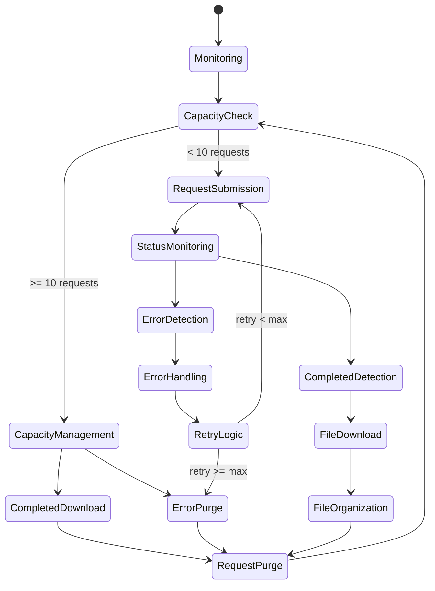
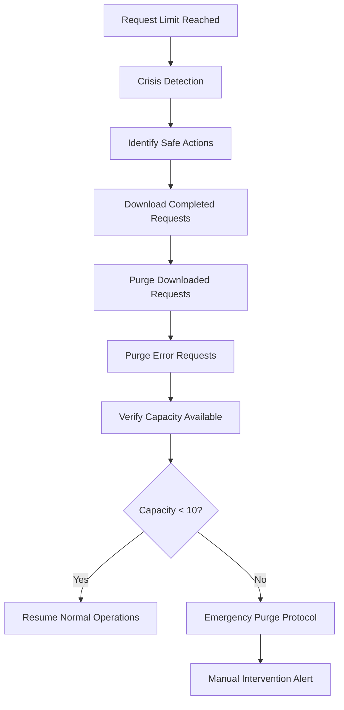
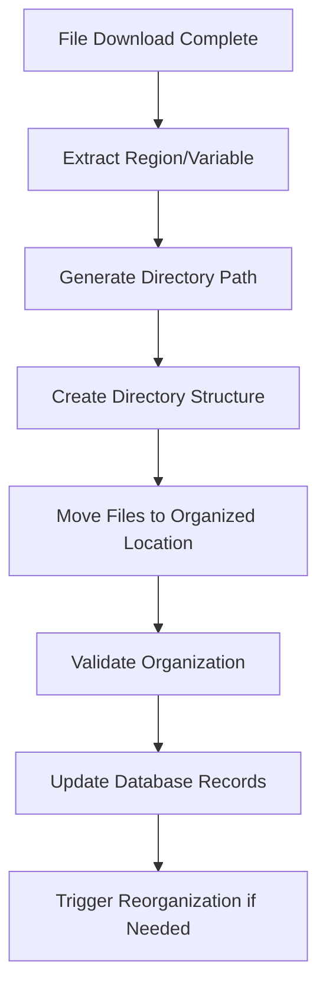
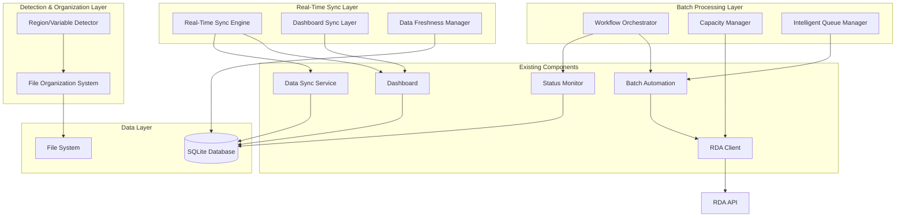
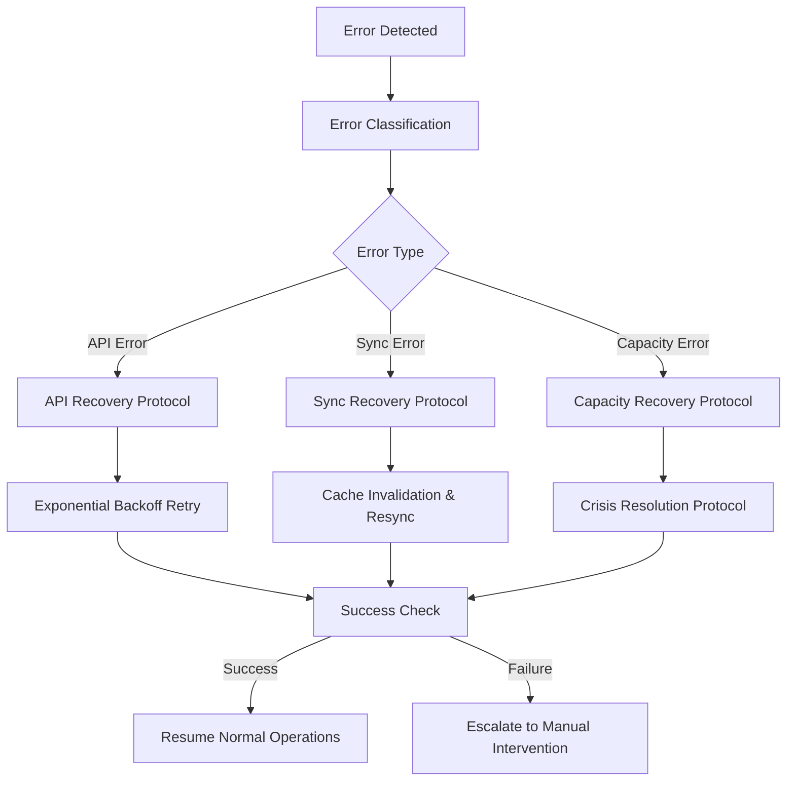
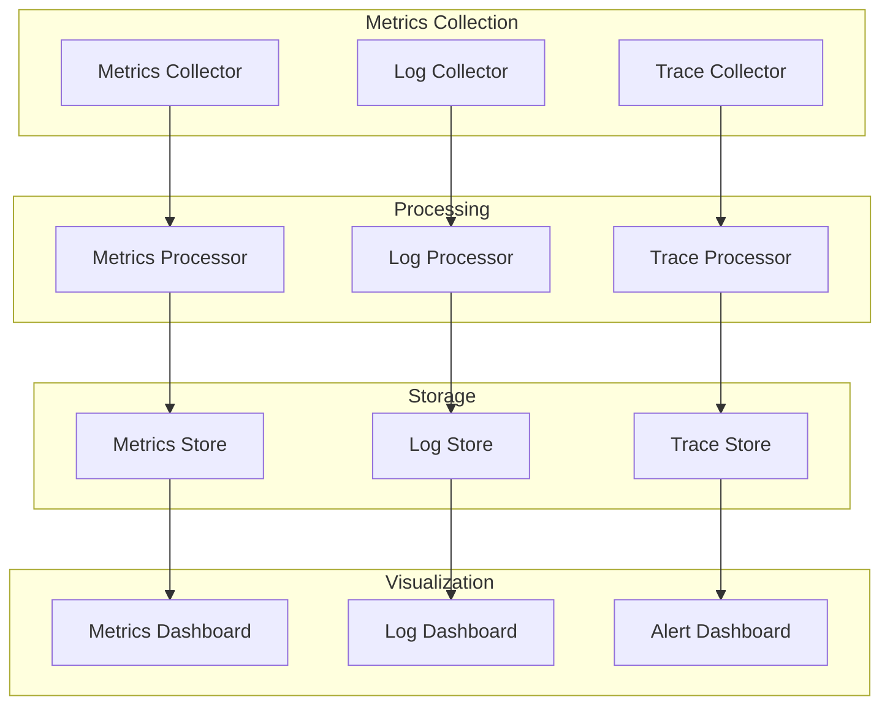

# Real-Time Data Synchronization and Automated Batch Processing Architecture

## Executive Summary

This document presents a comprehensive architectural design for enhancing the RDA automation system with real-time data synchronization capabilities and robust automated batch processing workflows. The design addresses critical gaps in the current system, specifically eliminating the 30-second cache timeout issue and implementing sophisticated capacity management for the 10-request limit constraint.

## Current System Analysis

### Existing Components
- **Status Monitor** (`status_monitor.py`): Monitors RDA request status with 5-minute intervals
- **Data Sync Service** (`data_sync.py`): Syncs data from RDA API to SQLite database
- **Dashboard** (`dashboard.py`): Web-based monitoring interface with 30-second cache
- **Batch Automation** (`batch_automation.py`): Automated control file processing
- **RDA Client** (`rdams_client.py`): Interface to RDA API

### Identified Gaps
1. **Cache Timeout Gap**: 30-second cache creates data staleness in dashboard
2. **Manual Sync Triggers**: No automatic sync when dashboard is accessed
3. **Request Limit Management**: Insufficient handling of 10-request constraint
4. **File Organization**: Inconsistent region/variable detection and organization
5. **Real-Time Updates**: No live status indicators or real-time sync capabilities

## Architecture Overview

The enhanced architecture introduces three main components:

1. **Real-Time Data Synchronization Layer**
2. **Automated Batch Processing Orchestrator**
3. **Enhanced Region/Variable Detection System**

## Real-Time Data Synchronization Architecture

### Core Components

#### 1. Real-Time Sync Engine
```
RealTimeSyncEngine
├── EventDrivenSyncTrigger
├── CacheInvalidationManager
├── WebSocketNotificationService
└── SyncStateManager
```

#### 2. Dashboard Integration Layer
```
DashboardSyncLayer
├── AccessTriggerInterceptor
├── LiveDataProvider
├── SyncStatusIndicator
└── AutoRefreshController
```

#### 3. Data Freshness Manager
```
DataFreshnessManager
├── FreshnessValidator
├── StaleDataDetector
├── SyncPriorityQueue
└── DataVersionController
```

### Sync Trigger Mechanisms

1. **Dashboard Access Trigger**: Automatic sync when dashboard is accessed
2. **Scheduled Sync**: Configurable intervals (default: 2 minutes)
3. **Event-Driven Sync**: Triggered by status changes
4. **Manual Sync**: User-initiated refresh
5. **Stale Data Sync**: Automatic sync when data exceeds freshness threshold

### Cache Elimination Strategy

Instead of relying on 30-second cache, implement:
- **Live Data Streaming**: Direct API calls with intelligent caching
- **Incremental Updates**: Only sync changed data
- **Background Refresh**: Continuous background data updates
- **Smart Caching**: Context-aware caching with immediate invalidation

## Automated Batch Processing Workflow Architecture

### Workflow State Machine



### Core Workflow Components

#### 1. Capacity Management System
```
CapacityManager
├── RequestCountMonitor
├── CompletedRequestDetector
├── AutoDownloadTrigger
├── SafePurgeController
└── CapacityThresholdManager
```

#### 2. Intelligent Queue Manager
```
IntelligentQueueManager
├── PriorityQueueController
├── RegionBasedScheduler
├── VariableTypeBalancer
└── SubmissionRateLimiter
```

#### 3. Automated Workflow Orchestrator
```
WorkflowOrchestrator
├── StateTransitionManager
├── EventProcessor
├── ActionDispatcher
└── WorkflowMonitor
```

### Enhanced 10-Request Limit Management

#### Capacity Management Strategies

1. **Proactive Monitoring**
   - Continuous monitoring of active request count
   - Predictive capacity planning
   - Early warning system for approaching limits

2. **Intelligent Purging**
   - Safe purging of completed and downloaded requests
   - Error request cleanup
   - Automated purge scheduling

3. **Download Acceleration**
   - Immediate download triggering for completed requests
   - Parallel download processing
   - Download queue optimization

4. **Request Prioritization**
   - Region-based priority scheduling
   - Variable type balancing
   - Critical request fast-tracking

#### Crisis Resolution Protocol



## Enhanced Region/Variable Detection System

### Detection Architecture

#### 1. Multi-Source Detection Engine
```
RegionVariableDetector
├── ControlFileAnalyzer
├── CoordinateBasedDetector
├── MetadataExtractor
├── PatternMatcher
└── FallbackDetector
```

#### 2. Enhanced Detection Logic

1. **Primary Detection**: Control file name parsing
   - Pattern: `REGION_VARIABLE_control.ctl`
   - Validation against known region/variable lists

2. **Secondary Detection**: Coordinate analysis
   - Geographic boundary matching
   - Region mapping from lat/lon coordinates
   - Enhanced coordinate-to-region algorithms

3. **Tertiary Detection**: Metadata analysis
   - RDA request metadata parsing
   - Parameter analysis for variable detection
   - Content-based classification

4. **Fallback Detection**: Pattern matching
   - Fuzzy string matching
   - Machine learning-based classification
   - Manual override capabilities

#### 3. File Organization System
```
FileOrganizationSystem
├── DirectoryStructureManager
├── FilePathGenerator
├── OrganizationValidator
└── ReorganizationService
```

### Organization Workflow



## System Integration Architecture

### Component Interaction Diagram



## Configuration Architecture

### Configuration Hierarchy

```yaml
real_time_sync:
  enabled: true
  sync_intervals:
    dashboard_access: 0  # Immediate
    scheduled: 120       # 2 minutes
    stale_threshold: 300 # 5 minutes
  cache_strategy:
    type: "smart_invalidation"
    max_age: 60
  websocket:
    enabled: true
    port: 8081

batch_processing:
  capacity_management:
    request_limit: 10
    safety_margin: 2
    crisis_threshold: 9
  workflow:
    check_interval: 60
    download_timeout: 3600
    retry_attempts: 3
  queue_management:
    priority_regions: ["ERCOT", "CISO", "PJM"]
    batch_size: 5

region_detection:
  detection_methods:
    - control_file_parsing
    - coordinate_analysis
    - metadata_extraction
  fallback_enabled: true
  validation_enabled: true
  
file_organization:
  base_directory: "./downloaded_files"
  structure_pattern: "{region}/{variable}"
  validation_enabled: true
  reorganization_enabled: true
```

## Error Handling and Recovery

### Error Handling Strategy

1. **Graceful Degradation**
   - Fallback to cached data when real-time sync fails
   - Reduced functionality mode during API outages
   - Manual override capabilities

2. **Automatic Recovery**
   - Retry mechanisms with exponential backoff
   - Circuit breaker patterns for API calls
   - Health check and auto-restart capabilities

3. **Error Notification**
   - Real-time error alerts
   - Dashboard error indicators
   - Log aggregation and monitoring

### Recovery Protocols



## Performance Considerations

### Optimization Strategies

1. **Database Optimization**
   - Indexed queries for real-time data access
   - Connection pooling
   - Query optimization

2. **API Rate Limiting**
   - Intelligent request throttling
   - Request batching where possible
   - Caching strategies

3. **Memory Management**
   - Efficient data structures
   - Memory leak prevention
   - Garbage collection optimization

4. **Concurrent Processing**
   - Thread pool management
   - Async/await patterns
   - Lock-free data structures where possible

## Security Considerations

### Security Measures

1. **API Security**
   - Secure token management
   - Request authentication
   - Rate limiting protection

2. **Data Security**
   - Database encryption
   - Secure file storage
   - Access control mechanisms

3. **Network Security**
   - HTTPS enforcement
   - WebSocket security
   - Input validation

## Monitoring and Observability

### Monitoring Architecture



### Key Metrics

1. **Sync Performance**
   - Sync latency
   - Sync success rate
   - Data freshness metrics

2. **Batch Processing**
   - Request throughput
   - Capacity utilization
   - Download success rate

3. **System Health**
   - API response times
   - Error rates
   - Resource utilization

## Deployment Architecture

### Deployment Strategy

1. **Phased Rollout**
   - Phase 1: Real-time sync enhancement
   - Phase 2: Batch processing improvements
   - Phase 3: Enhanced detection system

2. **Blue-Green Deployment**
   - Zero-downtime deployments
   - Rollback capabilities
   - A/B testing support

3. **Configuration Management**
   - Environment-specific configurations
   - Feature flags
   - Dynamic configuration updates

## Conclusion

This architecture provides a comprehensive solution for real-time data synchronization and automated batch processing while addressing the specific requirements:

1. **Eliminates 30-second cache timeout** through real-time sync triggers
2. **Implements robust 10-request limit management** with intelligent capacity management
3. **Enhances file organization** with improved region/variable detection
4. **Provides automated workflow orchestration** with state machine-driven processing
5. **Ensures system reliability** through comprehensive error handling and recovery

The design maintains compatibility with existing components while introducing significant enhancements for real-time capabilities and automated processing efficiency.