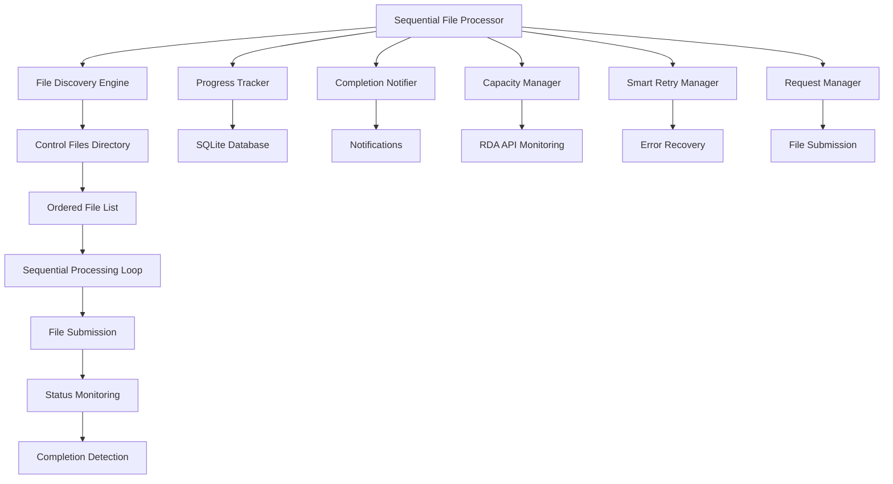

# Sequential File Processing Guide

[](#sequential-processing)
[](#production-deployment)

> **Master the Enhanced RDA Automation System's sequential file processing engine. This guide covers ordered file processing, resume capabilities, progress tracking, and advanced processing strategies.**

## Table of Contents

1. [Overview](#overview)
2. [Getting Started](#getting-started)
3. [Processing Configuration](#processing-configuration)
4. [File Discovery and Ordering](#file-discovery-and-ordering)
5. [Processing Modes](#processing-modes)
6. [Progress Tracking](#progress-tracking)
7. [Resume Capabilities](#resume-capabilities)
8. [Integration with Automation System](#integration-with-automation-system)
9. [Command Line Interface](#command-line-interface)
10. [Advanced Usage Scenarios](#advanced-usage-scenarios)
11. [Monitoring and Status](#monitoring-and-status)
12. [Troubleshooting](#troubleshooting)
13. [Best Practices](#best-practices)

## Overview

The Sequential File Processor is the core orchestration engine of the Enhanced RDA Automation System. It provides controlled, ordered processing of meteorological control files with comprehensive tracking, error handling, and resume capabilities.

### Key Features

| Feature | Description | Benefits |
|---------|-------------|----------|
| **Sequential Processing** | Processes files one at a time in specified order | Prevents system overload, ensures predictable execution |
| **Multiple Ordering Strategies** | Alphabetical, priority, region, variable-based ordering | Flexible processing based on requirements |
| **Resume Capability** | Resume interrupted processing sessions | Fault tolerance, no lost progress |
| **Real-time Progress Tracking** | Live monitoring of processing status | Complete visibility into processing state |
| **Capacity Management Integration** | Respects RDA's 10-request limit | Prevents API throttling and errors |
| **Smart Error Handling** | Automatic retry and error recovery | Robust processing with minimal manual intervention |
| **Completion Notifications** | Automatic notifications when processing completes | Timely awareness of processing completion |

### Architecture Overview



## Getting Started

### Basic Usage

```python
from automation.sequential_file_processor import (
    create_sequential_file_processor, 
    ProcessingConfig
)

# Create default configuration
config = ProcessingConfig()

# Create processor
processor = create_sequential_file_processor(config)

# Start processing
success = processor.start_processing()

if success:
    print("✅ Sequential processing started successfully")
    
    # Monitor until completion
    while processor.processing_active:
        status = processor.get_processing_status()
        print(f"Progress: {status['current_file_index']}/{status['total_files']}")
        time.sleep(30)
    
    # Get final results
    result = processor.get_processing_result()
    print(f"Processing completed: {result.success}")
    print(f"Files processed: {result.completed_files}/{result.total_files}")
else:
    print("❌ Failed to start processing")
```

### Quick Start with Command Line

```bash
# Start sequential processing with default settings
python automation/sequential_file_processor.py --start

# Start with custom settings
python automation/sequential_file_processor.py --start \
    --control-files-dir "path/to/control/files" \
    --processing-order "priority" \
    --submission-delay 10.0

# Check current status
python automation/sequential_file_processor.py --status

# Discover available files
python automation/sequential_file_processor.py --discover
```

## Processing Configuration

### Basic Configuration

```python
from automation.sequential_file_processor import ProcessingConfig, ProcessingMode

# Create basic configuration
config = ProcessingConfig(
    # File discovery settings
    control_files_dir="src/python/control_files",
    processing_order="alphabetical",  # alphabetical, priority, region, variable
    
    # Processing settings
    processing_mode=ProcessingMode.SEQUENTIAL,
    max_concurrent_files=1,  # Always 1 for sequential processing
    retry_failed_files=True,
    max_retries_per_file=3,
    
    # Timing settings
    file_submission_delay=5.0,  # Seconds between submissions
    status_check_interval=60,   # Status check frequency
    completion_check_interval=300,  # Completion check frequency
    
    # Integration settings
    enable_capacity_management=True,
    enable_smart_retry=True,
    enable_data_sync=True,
    enable_progress_tracking=True,
    enable_completion_notifications=True,
    
    # Database settings
    db_path="src/python/data/automation_state.db"
)
```

### Advanced Configuration

```python
# Production configuration with conservative settings
production_config = ProcessingConfig(
    control_files_dir="src/python/control_files",
    processing_order="priority",
    
    # Conservative timing for production
    file_submission_delay=10.0,  # Longer delay between files
    status_check_interval=120,   # Check status every 2 minutes
    completion_check_interval=600,  # Check completion every 10 minutes
    
    # Enhanced error handling
    retry_failed_files=True,
    max_retries_per_file=5,  # More retry attempts
    
    # Full integration enabled
    enable_capacity_management=True,
    enable_smart_retry=True,
    enable_data_sync=True,
    enable_progress_tracking=True,
    enable_completion_notifications=True,
    
    db_path="src/python/data/automation_state.db"
)

# Development configuration with faster processing
development_config = ProcessingConfig(
    control_files_dir="src/python/control_files",
    processing_order="alphabetical",
    
    # Faster timing for development
    file_submission_delay=2.0,   # Shorter delay
    status_check_interval=30,    # More frequent status checks
    completion_check_interval=120,  # More frequent completion checks
    
    # Standard error handling
    retry_failed_files=True,
    max_retries_per_file=3,
    
    # Selective integration for testing
    enable_capacity_management=False,  # Disable for faster testing
    enable_smart_retry=False,
    enable_data_sync=True,
    enable_progress_tracking=True,
    enable_completion_notifications=False,
    
    db_path="src/python/data/test_automation_state.db"
)
```

### Configuration from File

```python
import json

# Load configuration from JSON file
def load_config_from_file(config_path: str) -> ProcessingConfig:
    """Load processing configuration from JSON file."""
    
    with open(config_path, 'r') as f:
        config_data = json.load(f)
    
    # Create base configuration
    config = ProcessingConfig()
    
    # Update with loaded data
    for key, value in config_data.items():
        if hasattr(config, key):
            setattr(config, key, value)
    
    return config

# Example configuration file (config/sequential_processing.json)
config_example = {
    "control_files_dir": "src/python/control_files",
    "processing_order": "priority",
    "file_submission_delay": 8.0,
    "status_check_interval": 90,
    "completion_check_interval": 450,
    "max_retries_per_file": 4,
    "enable_capacity_management": True,
    "enable_smart_retry": True,
    "enable_completion_notifications": True
}

# Usage
config = load_config_from_file("config/sequential_processing.json")
processor = create_sequential_file_processor(config)
```

## File Discovery and Ordering

### Processing Orders

The system supports multiple file ordering strategies:

#### 1. Alphabetical Order (Default)
```python
config = ProcessingConfig(processing_order="alphabetical")

# Files processed in alphabetical order:
# - file_001.ctl
# - file_002.ctl
# - file_003.ctl
```

#### 2. Priority-Based Order
```python
config = ProcessingConfig(processing_order="priority")

# Files processed by priority (high to low):
# - urgent_file.ctl (priority: 5)
# - important_file.ctl (priority: 4)
# - normal_file.ctl (priority: 3)
```

#### 3. Region-Based Order
```python
config = ProcessingConfig(processing_order="region")

# Files processed by region:
# - CISO_file.ctl
# - ERCOT_file.ctl
# - PJM_file.ctl
```

#### 4. Variable-Based Order
```python
config = ProcessingConfig(processing_order="variable")

# Files processed by variable type:
# - dswrf_file.ctl (downward shortwave radiation)
# - tmp_file.ctl (temperature)
# - wind_file.ctl (wind data)
```

### File Discovery Process

```python
# Discover files with detailed information
processor = create_sequential_file_processor(config)

success, file_list, discovery_info = processor.discover_files()

if success:
    print(f"Discovered {len(file_list)} files:")
    
    # Display file information
    for i, filename in enumerate(file_list, 1):
        print(f"  {i:3d}. {filename}")
    
    # Display discovery statistics
    stats = discovery_info['discovery_stats']
    print(f"\nDiscovery Statistics:")
    print(f"  Total files found: {stats['total_files_found']}")
    print(f"  Valid files: {stats['valid_files']}")
    print(f"  Invalid files: {stats['invalid_files']}")
    print(f"  Processing order: {discovery_info['processing_order']}")
else:
    print(f"File discovery failed: {discovery_info.get('error', 'Unknown error')}")
```

### Custom File Filtering

```python
from automation.control_file_discovery import create_control_file_discovery

# Create custom file discovery with filtering
file_discovery = create_control_file_discovery(
    control_files_dir="src/python/control_files",
    db_path="src/python/data/automation_state.db"
)

# Get files with custom filtering
all_files = file_discovery.discover_control_files(include_invalid=False)

# Filter by region
ciso_files = [f for f in all_files if 'CISO' in f.filename]

# Filter by variable
temperature_files = [f for f in all_files if 'tmp' in f.variable_type]

# Filter by date range
from datetime import datetime, timedelta
recent_files = [
    f for f in all_files 
    if f.last_modified > datetime.now() - timedelta(days=7)
]

print(f"CISO files: {len(ciso_files)}")
print(f"Temperature files: {len(temperature_files)}")
print(f"Recent files: {len(recent_files)}")
```

## Processing Modes

### Sequential Mode (Default)

Sequential mode processes files one at a time in the specified order:

```python
config = ProcessingConfig(
    processing_mode=ProcessingMode.SEQUENTIAL,
    max_concurrent_files=1,  # Always 1 for sequential
    file_submission_delay=5.0  # Delay between files
)

processor = create_sequential_file_processor(config)

# Start sequential processing
processor.start_processing()

# Monitor progress
while processor.processing_active:
    status = processor.get_processing_status()
    current_file = status.get('current_file', 'None')
    progress = f"{status['current_file_index']}/{status['total_files']}"
    
    print(f"Processing: {current_file} ({progress})")
    time.sleep(30)
```

### Resume Mode

Resume interrupted processing sessions:

```python
# Resume from specific session ID
session_id = "sequential_20241201_143022"
success = processor.start_processing(resume_session_id=session_id)

if success:
    print(f"✅ Resumed processing session: {session_id}")
else:
    print(f"❌ Failed to resume session: {session_id}")
```

### Processing States

The processor transitions through several states:

```python
from automation.sequential_file_processor import ProcessorState

# Monitor state transitions
def monitor_processor_states(processor):
    """Monitor and log processor state transitions."""
    
    previous_state = None
    
    while processor.processing_active:
        current_state = processor.current_state
        
        if current_state != previous_state:
            print(f"State transition: {previous_state} -> {current_state.value}")
            
            if current_state == ProcessorState.DISCOVERING:
                print("  🔍 Discovering control files...")
            elif current_state == ProcessorState.PROCESSING:
                print("  📤 Processing files...")
            elif current_state == ProcessorState.MONITORING:
                print("  👁️ Monitoring file processing...")
            elif current_state == ProcessorState.COMPLETING:
                print("  🏁 Monitoring completion...")
            elif current_state == ProcessorState.COMPLETED:
                print("  🎉 Processing completed!")
            elif current_state == ProcessorState.ERROR:
                print("  ❌ Error encountered")
            
            previous_state = current_state
        
        time.sleep(10)

# Usage
monitor_processor_states(processor)
```

## Progress Tracking

### Real-time Progress Monitoring

```python
def monitor_processing_progress(processor):
    """Monitor detailed processing progress."""
    
    while processor.processing_active:
        status = processor.get_processing_status()
        
        # Basic progress information
        session_id = status.get('session_id', 'Unknown')
        current_state = status.get('current_state', 'Unknown')
        total_files = status.get('total_files', 0)
        current_index = status.get('current_file_index', 0)
        current_file = status.get('current_file', 'None')
        
        # Processing statistics
        stats = status.get('processing_stats', {})
        submitted = stats.get('files_submitted', 0)
        completed = stats.get('files_completed', 0)
        failed = stats.get('files_failed', 0)
        
        # Time information
        elapsed_hours = status.get('elapsed_time_hours', 0)
        
        print(f"\n📊 Processing Progress Report")
        print(f"=" * 50)
        print(f"Session ID: {session_id}")
        print(f"Current State: {current_state}")
        print(f"Current File: {current_file}")
        print(f"Progress: {current_index}/{total_files} files")
        print(f"Submitted: {submitted}, Completed: {completed}, Failed: {failed}")
        print(f"Elapsed Time: {elapsed_hours:.2f} hours")
        
        # Progress bar
        if total_files > 0:
            progress_percent = (current_index / total_files) * 100
            bar_length = 30
            filled_length = int(bar_length * current_index // total_files)
            bar = '█' * filled_length + '-' * (bar_length - filled_length)
            print(f"Progress: |{bar}| {progress_percent:.1f}%")
        
        time.sleep(60)  # Update every minute

# Usage
monitor_processing_progress(processor)
```

### Progress Tracking Integration

```python
from automation.processing_progress_tracker import create_processing_progress_tracker

# Access detailed progress tracking
session_id = "sequential_20241201_143022"
progress_tracker = create_processing_progress_tracker(
    db_path="src/python/data/automation_state.db",
    session_id=session_id
)

# Get overall progress
overall_progress = progress_tracker.get_overall_progress()

print(f"Session Progress:")
print(f"  Total files: {overall_progress.total_files}")
print(f"  Completed files: {overall_progress.completed_files}")
print(f"  Failed files: {overall_progress.failed_files}")
print(f"  Current phase: {overall_progress.current_phase.value}")
print(f"  Completion percentage: {overall_progress.completion_percentage:.1f}%")

# Get file-level progress
file_progress = progress_tracker.get_file_progress()

for file_info in file_progress:
    status_icon = {
        'pending': '⏳',
        'processing': '🔄',
        'completed': '✅',
        'failed': '❌'
    }.get(file_info.status.value, '❓')
    
    print(f"{status_icon} {file_info.filename}: {file_info.status.value}")
    if file_info.error_message:
        print(f"    Error: {file_info.error_message}")
```

## Resume Capabilities

### Automatic Resume Detection

```python
def find_resumable_sessions():
    """Find sessions that can be resumed."""
    
    from automation.processing_progress_tracker import find_incomplete_sessions
    
    incomplete_sessions = find_incomplete_sessions(
        db_path="src/python/data/automation_state.db"
    )
    
    print(f"Found {len(incomplete_sessions)} resumable sessions:")
    
    for session in incomplete_sessions:
        print(f"  Session: {session['session_id']}")
        print(f"    Started: {session['start_time']}")
        print(f"    Status: {session['status']}")
        print(f"    Progress: {session['completed_files']}/{session['total_files']}")
        print(f"    Last activity: {session['last_updated']}")
        print()
    
    return incomplete_sessions

# Find and resume the most recent session
incomplete_sessions = find_resumable_sessions()

if incomplete_sessions:
    latest_session = incomplete_sessions[0]  # Most recent
    session_id = latest_session['session_id']
    
    print(f"Resuming latest session: {session_id}")
    
    processor = create_sequential_file_processor()
    success = processor.start_processing(resume_session_id=session_id)
    
    if success:
        print("✅ Session resumed successfully")
    else:
        print("❌ Failed to resume session")
```

### Manual Resume with Validation

```python
def resume_with_validation(session_id: str):
    """Resume processing with validation checks."""
    
    # Validate session exists and is resumable
    from automation.processing_progress_tracker import validate_session_resumable
    
    is_resumable, validation_info = validate_session_resumable(
        db_path="src/python/data/automation_state.db",
        session_id=session_id
    )
    
    if not is_resumable:
        print(f"❌ Session cannot be resumed: {validation_info.get('reason', 'Unknown')}")
        return False
    
    print(f"✅ Session validation passed:")
    print(f"  Session ID: {session_id}")
    print(f"  Total files: {validation_info['total_files']}")
    print(f"  Completed files: {validation_info['completed_files']}")
    print(f"  Remaining files: {validation_info['remaining_files']}")
    print(f"  Last activity: {validation_info['last_updated']}")
    
    # Create processor and resume
    processor = create_sequential_file_processor()
    success = processor.start_processing(resume_session_id=session_id)
    
    return success

# Usage
session_id = "sequential_20241201_143022"
success = resume_with_validation(session_id)
```

### Resume from Specific File

```python
def resume_from_file(session_id: str, filename: str):
    """Resume processing from a specific file."""
    
    # Create configuration with resume settings
    config = ProcessingConfig(
        resume_session_id=session_id,
        resume_from_file=filename
    )
    
    processor = create_sequential_file_processor(config)
    
    # Start processing (will resume from specified file)
    success = processor.start_processing(resume_session_id=session_id)
    
    if success:
        print(f"✅ Resumed from file: {filename}")
        
        # Monitor progress
        while processor.processing_active:
            status = processor.get_processing_status()
            current_file = status.get('current_file', 'None')
            print(f"Currently processing: {current_file}")
            time.sleep(30)
    else:
        print(f"❌ Failed to resume from file: {filename}")
    
    return success

# Usage
resume_from_file("sequential_20241201_143022", "CISO_dswrf_2024.ctl")
```

## Integration with Automation System

### Capacity Management Integration

```python
# Sequential processor automatically integrates with capacity management
config = ProcessingConfig(
    enable_capacity_management=True,
    # Processor will automatically wait when capacity is near limit
)

processor = create_sequential_file_processor(config)

# Monitor capacity during processing
def monitor_capacity_integration(processor):
    """Monitor capacity management integration."""
    
    while processor.processing_active:
        # Get processor status
        status = processor.get_processing_status()
        
        # Get capacity status if available
        if processor.capacity_manager:
            capacity_status = processor.capacity_manager.get_current_capacity_status()
            
            print(f"Processing: {status.get('current_file', 'None')}")
            print(f"Capacity: {capacity_status.total_requests}/10 requests")
            print(f"Available slots: {10 - capacity_status.total_requests}")
            
            if capacity_status.total_requests >= 9:
                print("⚠️ Near capacity limit - processor will wait")
        
        time.sleep(60)

# Usage
monitor_capacity_integration(processor)
```

### Smart Retry Integration

```python
# Sequential processor integrates with smart retry system
config = ProcessingConfig(
    enable_smart_retry=True,
    retry_failed_files=True,
    max_retries_per_file=3
)

processor = create_sequential_file_processor(config)

# Monitor retry integration
def monitor_retry_integration(processor):
    """Monitor smart retry integration."""
    
    if not processor.retry_manager:
        print("Smart retry not enabled")
        return
    
    while processor.processing_active:
        # Get retry statistics
        retry_stats = processor.retry_manager.get_retry_statistics()
        
        print(f"Retry Statistics:")
        print(f"  Total retries: {retry_stats['metrics']['total_retries_attempted']}")
        print(f"  Success rate: {retry_stats['metrics']['success_rate']:.1f}%")
        print(f"  Pending retries: {retry_stats['queue_status']['pending_items']}")
        
        time.sleep(120)  # Check every 2 minutes

# Usage
monitor_retry_integration(processor)
```

### Data Sync Integration

```python
# Sequential processor integrates with real-time data sync
config = ProcessingConfig(
    enable_data_sync=True
)

processor = create_sequential_file_processor(config)

# Monitor data sync integration
def monitor_data_sync_integration(processor):
    """Monitor data sync integration."""
    
    if not processor.data_sync:
        print("Data sync not enabled")
        return
    
    while processor.processing_active:
        # Get sync status
        sync_status = processor.data_sync.get_sync_status()
        
        print(f"Data Sync Status:")
        print(f"  Last sync: {sync_status.get('last_sync_time', 'Never')}")
        print(f"  Sync active: {sync_status.get('sync_active', False)}")
        print(f"  Regions updated: {sync_status.get('regions_updated', 0)}")
        
        time.sleep(300)  # Check every 5 minutes

# Usage
monitor_data_sync_integration(processor)
```

## Command Line Interface

### Basic Commands

```bash
# Start sequential processing
python automation/sequential_file_processor.py --start

# Start with custom directory
python automation/sequential_file_processor.py --start \
    --control-files-dir "/path/to/control/files"

# Start with specific processing order
python automation/sequential_file_processor.py --start \
    --processing-order "priority"

# Start with custom timing
python automation/sequential_file_processor.py --start \
    --submission-delay 10.0 \
    --max-retries 5
```

### Resume Commands

```bash
# Resume specific session
python automation/sequential_file_processor.py --resume "sequential_20241201_143022"

# Resume with validation
python automation/sequential_file_processor.py --resume "sequential_20241201_143022" \
    --validate-session
```

### Status and Discovery Commands

```bash
# Check current processing status
python automation/sequential_file_processor.py --status

# Discover available control files
python automation/sequential_file_processor.py --discover

# Discover with specific order
python automation/sequential_file_processor.py --discover \
    --processing-order "region"

# Stop current processing
python automation/sequential_file_processor.py --stop
```

### Configuration File Usage

```bash
# Use configuration file
python automation/sequential_file_processor.py --start \
    --config-file "config/sequential_processing.json"

# Example configuration file (config/sequential_processing.json)
{
    "control_files_dir": "src/python/control_files",
    "processing_order": "priority",
    "file_submission_delay": 8.0,
    "status_check_interval": 90,
    "completion_check_interval": 450,
    "max_retries_per_file": 4,
    "enable_capacity_management": true,
    "enable_smart_retry": true,
    "enable_completion_notifications": true
}
```

### Advanced Command Examples

```bash
# Production processing with conservative settings
python automation/sequential_file_processor.py --start \
    --processing-order "priority" \
    --submission-delay 15.0 \
    --max-retries 5 \
    --config-file "config/production.json"

# Development processing with fast settings
python automation/sequential_file_processor.py --start \
    --processing-order "alphabetical" \
    --submission-delay 2.0 \
    --max-retries 2

# Process specific region files only
python automation/sequential_file_processor.py --start \
    --control-files-dir "src/python/control_files/CISO" \
    --processing-order "variable"
```

## Advanced Usage Scenarios

### Scenario 1: Batch Processing with Checkpoints

```python
def batch_processing_with_checkpoints():
    """Process files in batches with checkpoint saves."""
    
    config = ProcessingConfig(
        file_submission_delay=5.0,
        enable_progress_tracking=True
    )
    
    processor = create_sequential_file_processor(config)
    
    # Discover files
    success, file_list, _ = processor.discover_files()
    if not success:
        return
    
    # Process in batches of 10 files
    batch_size = 10
    total_batches = (len(file_list) + batch_size - 1) // batch_size
    
    for batch_num in range(total_batches):
        start_idx = batch_num * batch_size
        end_idx = min(start_idx + batch_size, len(file_list))
        batch_files = file_list[start_idx:end_idx]
        
        print(f"Processing batch {batch_num + 1}/{total_batches}")
        print(f"Files {start_idx + 1}-{end_idx}: {len(batch_files)} files")
        
        # Create batch-specific session
        session_id = f"batch_{batch_num + 1}_{datetime.now().strftime('%Y%m%d_%H%M%S')}"
        
        # Process batch
        success = processor.start_processing(resume_session_id=session_id)
        
        if success:
            # Wait for batch completion
            while processor.processing_active:
                time.sleep(30)
            
            # Get batch results
            result = processor.get_processing_result()
            print(f"Batch {batch_num + 1} completed: {result.completed_files}/{result.total_files}")
            
            # Save checkpoint
            checkpoint_data = {
                'batch_number': batch_num + 1,
                'session_id': session_id,
                'completed_files': result.completed_files,
                'failed_files': result.failed_files,
                'timestamp': datetime.now().isoformat()
            }
            
            with open(f"checkpoints/batch_{batch_num + 1}.json", 'w') as f:
                json.dump(checkpoint_data, f, indent=2)
        else:
            print(f"Failed to process batch {batch_num + 1}")
            break

# Usage
batch_processing_with_checkpoints()
```

### Scenario 2: Priority-Based Processing with Dynamic Reordering

```python
def priority_processing_with_reordering():
    """Process files with dynamic priority reordering."""
    
    from automation.control_file_discovery import create_control_file_discovery
    
    # Create file discovery
    file_discovery = create_control_file_discovery(
        control_files_dir="src/python/control_files",
        db_path="src/python/data/automation_state.db"
    )
    
    # Define priority rules
    def calculate_file_priority(file_info):
        """Calculate dynamic priority for a file."""
        priority = 0
        
        # Region-based priority
        region_priorities = {
            'CISO': 5,    # California - highest priority
            'ERCOT': 4,   # Texas - high priority
            'PJM': 3,     # PJM - medium priority
            'MISO': 2,    # MISO - low priority
        }
        
        for region, points in region_priorities.items():
            if region in file_info.filename:
                priority += points
                break
        
        # Variable-based priority
        variable_priorities = {
            'tmp': 3,     # Temperature - high priority
            'dswrf': 2,   # Solar radiation - medium priority
            'wind': 1,    # Wind - low priority
        }
        
        for variable, points in variable_priorities.items():
            if variable in file_info.variable_type:
                priority += points
                break
        
        # Time-based priority (newer files get higher priority)
        age_days = (datetime.now() - file_info.last_modified).days
        if age_days < 1:
            priority += 2  # Very recent
        elif age_days < 7:
            priority += 1  # Recent
        
        return priority
    
    # Discover and prioritize files
    all_files = file_discovery.discover_control_files(include_invalid=False)
    
    # Calculate priorities
    for file_info in all_files:
        file_info.priority = calculate_file_priority(file_info)
    
    # Sort by priority (highest first
            print(f"  Files processed: {current_file_count}")
            
            last_file_count = current_file_count
        
        time.sleep(60)  # Check every minute

# Usage
processor = create_sequential_file_processor(performance_config)
performance_thread = threading.Thread(target=monitor_performance_metrics, args=(processor,), daemon=True)
performance_thread.start()
processor.start_processing()
```

### 5. Backup and Recovery Best Practices

#### Implement Session Backup
```python
def backup_processing_session(processor, backup_dir: str = "backups"):
    """Create backup of current processing session."""
    
    if not processor.session_id:
        print("No active session to backup")
        return None
    
    # Create backup directory
    os.makedirs(backup_dir, exist_ok=True)
    
    # Get current status
    status = processor.get_processing_status()
    
    # Create backup data
    backup_data = {
        'backup_timestamp': datetime.now().isoformat(),
        'session_id': processor.session_id,
        'processing_status': status,
        'configuration': asdict(processor.config),
        'files_to_process': processor.files_to_process,
        'current_file_index': processor.current_file_index,
        'processing_stats': processor.processing_stats
    }
    
    # Save backup
    backup_filename = f"{backup_dir}/session_backup_{processor.session_id}_{datetime.now().strftime('%Y%m%d_%H%M%S')}.json"
    
    with open(backup_filename, 'w') as f:
        json.dump(backup_data, f, indent=2, default=str)
    
    print(f"✅ Session backup created: {backup_filename}")
    return backup_filename

# Usage - backup every hour during processing
def periodic_backup(processor):
    while processor.processing_active:
        time.sleep(3600)  # Every hour
        backup_processing_session(processor)

backup_thread = threading.Thread(target=periodic_backup, args=(processor,), daemon=True)
backup_thread.start()
```

---

## Summary

The Sequential File Processing Guide provides comprehensive documentation for the Enhanced RDA Automation System's core processing engine. Key takeaways:

### Core Capabilities
- **Sequential Processing**: Ordered, controlled file processing with multiple ordering strategies
- **Resume Functionality**: Fault-tolerant processing with session resume capabilities
- **Real-time Monitoring**: Complete visibility into processing status and progress
- **Integration**: Seamless integration with capacity management, error handling, and data sync

### Best Practices
- Use conservative settings for production environments
- Implement comprehensive monitoring and error handling
- Regular backups of processing sessions
- Performance optimization through proper configuration

### Getting Started
1. **Basic Usage**: Start with default configuration for simple sequential processing
2. **Advanced Configuration**: Customize timing, error handling, and integration settings
3. **Monitoring**: Implement real-time status monitoring and reporting
4. **Production Deployment**: Use robust error handling and backup strategies

The Sequential File Processor is the foundation of the Enhanced RDA Automation System, providing reliable, monitored, and resumable processing of meteorological control files with comprehensive integration across all system components.

For additional information, see:
- [Enhanced RDA Automation System Guide](Enhanced_RDA_Automation_System_Guide.md) - Complete system overview
- [Error Tracking and Smart Retry Guide](Error_Tracking_and_Smart_Retry_Guide.md) - Error handling details
- [Enhanced System Guide](Enhanced_RDA_Automation_System_Guide.md) - Getting started quickly