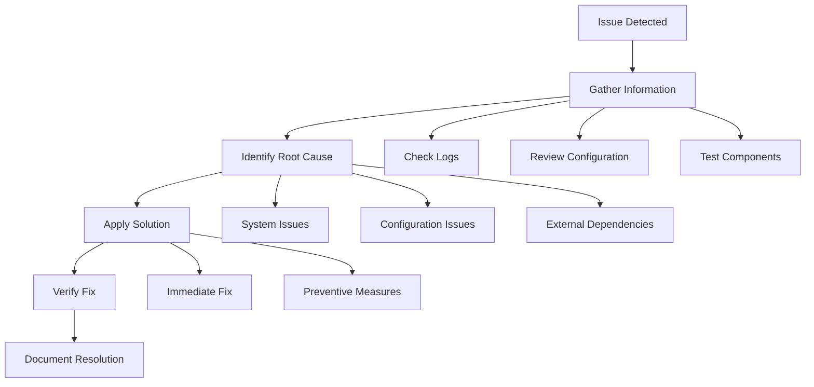

# Troubleshooting Guide

[](#troubleshooting-overview)
[](#diagnostic-procedures)

> **Comprehensive troubleshooting guide for the Enhanced RDA Automation System. This guide provides systematic approaches to diagnosing and resolving common issues.**

## Table of Contents

1. [Troubleshooting Overview](#troubleshooting-overview)
2. [Diagnostic Procedures](#diagnostic-procedures)
3. [Common Issues and Solutions](#common-issues-and-solutions)
4. [System Component Issues](#system-component-issues)
5. [Database Issues](#database-issues)
6. [Network and API Issues](#network-and-api-issues)
7. [Configuration Issues](#configuration-issues)
8. [Performance Issues](#performance-issues)
9. [Error Recovery Procedures](#error-recovery-procedures)
10. [Monitoring and Alerting](#monitoring-and-alerting)
11. [Advanced Debugging](#advanced-debugging)
12. [Support and Resources](#support-and-resources)

## Troubleshooting Overview

The Enhanced RDA Automation System includes comprehensive error handling, logging, and diagnostic capabilities to help identify and resolve issues quickly.

### Troubleshooting Philosophy



### Troubleshooting Levels

| Level | Description | Tools | Expertise Required |
|-------|-------------|-------|-------------------|
| **Level 1** | Basic issues, configuration problems | Logs, dashboard, configuration files | Basic |
| **Level 2** | Component failures, integration issues | Database tools, API testing, debugging | Intermediate |
| **Level 3** | Complex system issues, performance problems | Advanced debugging, profiling, system analysis | Advanced |
| **Level 4** | Critical system failures, data corruption | Low-level debugging, system recovery | Expert |

## Diagnostic Procedures

### Initial Diagnostic Checklist

#### 1. **System Health Check**
```bash
# Check system status
python3 -c "
import sys
sys.path.insert(0, 'src/python')

from automation.system_health import SystemHealthChecker

health_checker = SystemHealthChecker()
health_report = health_checker.comprehensive_health_check()

print('🏥 SYSTEM HEALTH REPORT')
print('=' * 50)
for component, status in health_report.items():
    icon = '✅' if status['healthy'] else '❌'
    print(f'{icon} {component}: {status[\"status\"]}')
    if not status['healthy'] and 'details' in status:
        print(f'   Details: {status[\"details\"]}')
"
```

#### 2. **Log Analysis**
```bash
# Check recent errors in logs
tail -n 100 logs/automation.log | grep -i error

# Check specific component logs
tail -n 50 logs/dashboard.log
tail -n 50 logs/sequential_processor.log
tail -n 50 logs/error_manager.log
```

#### 3. **Database Connectivity**
```python
import sqlite3
import os

def check_database_health():
    """Check database connectivity and integrity."""
    
    db_path = "src/python/data/automation_state.db"
    
    try:
        # Check if database file exists
        if not os.path.exists(db_path):
            return {"status": "error", "message": "Database file not found"}
        
        # Test connection
        conn = sqlite3.connect(db_path)
        cursor = conn.cursor()
        
        # Check table integrity
        cursor.execute("PRAGMA integrity_check")
        integrity_result = cursor.fetchone()[0]
        
        if integrity_result != "ok":
            return {"status": "error", "message": f"Database integrity check failed: {integrity_result}"}
        
        # Check key tables exist
        cursor.execute("SELECT name FROM sqlite_master WHERE type='table'")
        tables = [row[0] for row in cursor.fetchall()]
        
        required_tables = ['requests', 'regional_progress', 'error_log', 'retry_queue']
        missing_tables = [table for table in required_tables if table not in tables]
        
        if missing_tables:
            return {"status": "warning", "message": f"Missing tables: {missing_tables}"}
        
        conn.close()
        return {"status": "ok", "message": "Database is healthy"}
        
    except Exception as e:
        return {"status": "error", "message": f"Database error: {str(e)}"}

# Run database health check
result = check_database_health()
print(f"Database Status: {result['status']} - {result['message']}")
```

#### 4. **Configuration Validation**
```python
import json
from pathlib import Path

def validate_system_configuration():
    """Validate system configuration files."""
    
    config_issues = []
    
    # Check main configuration file
    config_path = Path("config/automation_config.json")
    if not config_path.exists():
        config_issues.append("Main configuration file missing")
    else:
        try:
            with open(config_path, 'r') as f:
                config = json.load(f)
            
            # Check required sections
            required_sections = ['automation', 'directories', 'logging']
            for section in required_sections:
                if section not in config:
                    config_issues.append(f"Missing configuration section: {section}")
            
            # Check directory paths exist
            if 'directories' in config:
                for dir_name, dir_path in config['directories'].items():
                    if not Path(dir_path).exists():
                        config_issues.append(f"Directory does not exist: {dir_name} -> {dir_path}")
                        
        except json.JSONDecodeError as e:
            config_issues.append(f"Invalid JSON in configuration: {e}")
        except Exception as e:
            config_issues.append(f"Configuration error: {e}")
    
    return config_issues

# Run configuration validation
issues = validate_system_configuration()
if issues:
    print("❌ Configuration Issues Found:")
    for issue in issues:
        print(f"  - {issue}")
else:
    print("✅ Configuration is valid")
```

## Common Issues and Solutions

### Issue 1: System Won't Start

#### **Symptoms:**
- Application fails to launch
- Import errors
- Configuration errors

#### **Diagnostic Steps:**
```bash
# Check Python environment
python3 --version
pip3 list | grep -E "(requests|sqlite|flask)"

# Test basic imports
python3 -c "
import sys
sys.path.insert(0, 'src/python')
try:
    from automation.sequential_file_processor import SequentialFileProcessor
    print('✅ Sequential processor imports OK')
except ImportError as e:
    print(f'❌ Import error: {e}')
"
```

#### **Solutions:**
1. **Missing Dependencies:**
   ```bash
   pip3 install -r requirements.txt
   ```

2. **Python Path Issues:**
   ```bash
   export PYTHONPATH="${PYTHONPATH}:$(pwd)/src/python"
   ```

3. **Configuration File Missing:**
   ```bash
   cp config/automation_config.json.example config/automation_config.json
   ```

### Issue 2: Database Connection Errors

#### **Symptoms:**
- "Database is locked" errors
- "No such table" errors
- Connection timeout errors

#### **Diagnostic Steps:**
```python
import sqlite3
import os

def diagnose_database_issues():
    """Diagnose common database issues."""
    
    db_path = "src/python/data/automation_state.db"
    
    # Check file permissions
    if os.path.exists(db_path):
        stat_info = os.stat(db_path)
        print(f"Database file permissions: {oct(stat_info.st_mode)[-3:]}")
        print(f"Database file size: {stat_info.st_size} bytes")
    else:
        print("❌ Database file does not exist")
        return
    
    # Check for lock files
    lock_files = [f"{db_path}-wal", f"{db_path}-shm", f"{db_path}-journal"]
    for lock_file in lock_files:
        if os.path.exists(lock_file):
            print(f"⚠️ Lock file exists: {lock_file}")
    
    # Test connection with timeout
    try:
        conn = sqlite3.connect(db_path, timeout=5.0)
        cursor = conn.cursor()
        cursor.execute("SELECT COUNT(*) FROM sqlite_master")
        count = cursor.fetchone()[0]
        print(f"✅ Database connection OK, {count} objects found")
        conn.close()
    except sqlite3.OperationalError as e:
        print(f"❌ Database connection failed: {e}")

diagnose_database_issues()
```

#### **Solutions:**
1. **Database Locked:**
   ```bash
   # Kill processes using the database
   lsof src/python/data/automation_state.db
   
   # Remove lock files (if safe)
   rm -f src/python/data/automation_state.db-wal
   rm -f src/python/data/automation_state.db-shm
   ```

2. **Missing Tables:**
   ```python
   from automation.database_manager import DatabaseManager
   
   db_manager = DatabaseManager()
   db_manager.initialize_database()
   ```

3. **Corrupted Database:**
   ```bash
   # Backup current database
   cp src/python/data/automation_state.db src/python/data/automation_state.db.backup
   
   # Repair database
   sqlite3 src/python/data/automation_state.db ".recover" | sqlite3 src/python/data/automation_state_recovered.db
   ```

### Issue 3: API Connection Failures

#### **Symptoms:**
- HTTP timeout errors
- Connection refused errors
- Authentication failures

#### **Diagnostic Steps:**
```python
import requests
import time

def test_api_connectivity():
    """Test API connectivity and response times."""
    
    # Test RDA API connectivity
    rda_endpoints = [
        "https://rda.ucar.edu/datasets/ds084.1/",
        "https://rda.ucar.edu/apps/request/"
    ]
    
    for endpoint in rda_endpoints:
        try:
            start_time = time.time()
            response = requests.get(endpoint, timeout=10)
            response_time = time.time() - start_time
            
            print(f"✅ {endpoint}")
            print(f"   Status: {response.status_code}")
            print(f"   Response time: {response_time:.2f}s")
            
        except requests.exceptions.Timeout:
            print(f"❌ {endpoint} - Timeout")
        except requests.exceptions.ConnectionError:
            print(f"❌ {endpoint} - Connection Error")
        except Exception as e:
            print(f"❌ {endpoint} - Error: {e}")

test_api_connectivity()
```

#### **Solutions:**
1. **Network Connectivity:**
   ```bash
   # Test basic connectivity
   ping -c 4 rda.ucar.edu
   
   # Test DNS resolution
   nslookup rda.ucar.edu
   
   # Check firewall/proxy settings
   curl -I https://rda.ucar.edu/
   ```

2. **Authentication Issues:**
   ```python
   # Verify credentials
   from automation.rda_client import RDAClient
   
   client = RDAClient()
   auth_status = client.test_authentication()
   print(f"Authentication status: {auth_status}")
   ```

3. **Rate Limiting:**
   ```python
   # Check current request count
   from automation.capacity_manager import CapacityManager
   
   capacity_manager = CapacityManager()
   current_requests = capacity_manager.get_current_request_count()
   print(f"Current active requests: {current_requests}")
   ```

### Issue 4: File Processing Stuck

#### **Symptoms:**
- Files remain in "processing" state
- No progress updates
- Sequential processor appears frozen

#### **Diagnostic Steps:**
```python
def diagnose_processing_issues():
    """Diagnose file processing issues."""
    
    from automation.sequential_file_processor import create_sequential_file_processor
    from automation.sequential_file_processor import ProcessingConfig
    
    config = ProcessingConfig()
    processor = create_sequential_file_processor(config)
    
    # Get current status
    status = processor.get_processing_status()
    print("📊 Processing Status:")
    print(f"  Current state: {status.get('current_state', 'unknown')}")
    print(f"  Files in queue: {status.get('queue_size', 0)}")
    print(f"  Current file: {status.get('current_file', 'none')}")
    print(f"  Progress: {status.get('progress_percentage', 0)}%")
    
    # Check for stuck files
    stuck_files = processor.get_stuck_files()
    if stuck_files:
        print("⚠️ Stuck files detected:")
        for file_info in stuck_files:
            print(f"  - {file_info['filename']}: {file_info['status']} for {file_info['duration']}s")
    
    # Check error queue
    error_queue = processor.get_error_queue()
    if error_queue:
        print("❌ Files in error state:")
        for error_info in error_queue:
            print(f"  - {error_info['filename']}: {error_info['error']}")

diagnose_processing_issues()
```

#### **Solutions:**
1. **Resume Processing:**
   ```python
   from automation.sequential_file_processor import create_sequential_file_processor
   from automation.sequential_file_processor import ProcessingConfig
   
   config = ProcessingConfig()
   processor = create_sequential_file_processor(config)
   
   # Resume from last checkpoint
   processor.resume_processing()
   ```

2. **Clear Stuck Files:**
   ```python
   # Reset stuck files
   processor.reset_stuck_files()
   
   # Or skip problematic files
   processor.skip_current_file()
   ```

3. **Restart Processing:**
   ```python
   # Stop current processing
   processor.stop_processing()
   
   # Clear queue and restart
   processor.clear_queue()
   processor.start_processing()
   ```

## System Component Issues

### Sequential File Processor Issues

#### **Common Problems:**
1. **File Discovery Failures**
2. **Processing Queue Corruption**
3. **Resume Functionality Not Working**

#### **Diagnostic Commands:**
```python
from automation.sequential_file_processor import create_sequential_file_processor
from automation.sequential_file_processor import ProcessingConfig

def diagnose_sequential_processor():
    """Comprehensive sequential processor diagnostics."""
    
    config = ProcessingConfig()
    processor = create_sequential_file_processor(config)
    
    # Test file discovery
    print("🔍 Testing file discovery...")
    success, files, info = processor.discover_files()
    print(f"Discovery result: {success}")
    print(f"Files found: {len(files) if files else 0}")
    if not success:
        print(f"Error: {info.get('error', 'Unknown')}")
    
    # Test database connectivity
    print("\n💾 Testing database connectivity...")
    db_status = processor.test_database_connection()
    print(f"Database status: {db_status}")
    
    # Check processing state
    print("\n📊 Current processing state...")
    state = processor.get_detailed_state()
    for key, value in state.items():
        print(f"  {key}: {value}")

diagnose_sequential_processor()
```

### Smart Retry Manager Issues

#### **Common Problems:**
1. **Retry Queue Overflow**
2. **Exponential Backoff Not Working**
3. **Circuit Breaker Stuck Open**

#### **Diagnostic Commands:**
```python
from automation.smart_retry_manager import SmartRetryManager

def diagnose_retry_manager():
    """Diagnose smart retry manager issues."""
    
    retry_manager = SmartRetryManager()
    
    # Check retry queue status
    queue_status = retry_manager.get_queue_status()
    print("🔄 Retry Queue Status:")
    print(f"  Pending retries: {queue_status.get('pending', 0)}")
    print(f"  Failed retries: {queue_status.get('failed', 0)}")
    print(f"  Max retries reached: {queue_status.get('max_retries_reached', 0)}")
    
    # Check circuit breaker status
    circuit_status = retry_manager.get_circuit_breaker_status()
    print(f"\n⚡ Circuit Breaker Status: {circuit_status.get('state', 'unknown')}")
    if circuit_status.get('state') == 'open':
        print(f"  Failure count: {circuit_status.get('failure_count', 0)}")
        print(f"  Next attempt in: {circuit_status.get('next_attempt_in', 0)}s")
    
    # Check recent retry attempts
    recent_attempts = retry_manager.get_recent_attempts(limit=10)
    print(f"\n📈 Recent retry attempts: {len(recent_attempts)}")
    for attempt in recent_attempts:
        status_icon = "✅" if attempt['success'] else "❌"
        print(f"  {status_icon} {attempt['timestamp']}: {attempt['request_id']} - {attempt['error']}")

diagnose_retry_manager()
```

### Dashboard Issues

#### **Common Problems:**
1. **Dashboard Not Loading**
2. **Real-time Updates Not Working**
3. **API Endpoints Returning Errors**

#### **Diagnostic Commands:**
```bash
# Test dashboard server
curl -I http://localhost:8080/

# Test API endpoints
curl -H "Authorization: Bearer YOUR_API_KEY" http://localhost:8080/api/status

# Check dashboard logs
tail -f logs/dashboard.log
```

## Database Issues

### Database Schema Issues

#### **Problem:** Missing or corrupted database schema

#### **Solution:**
```python
from automation.database_manager import DatabaseManager

def repair_database_schema():
    """Repair or recreate database schema."""
    
    db_manager = DatabaseManager()
    
    # Backup existing database
    backup_path = db_manager.create_backup()
    print(f"Database backed up to: {backup_path}")
    
    # Check and repair schema
    schema_issues = db_manager.validate_schema()
    if schema_issues:
        print("Schema issues found:")
        for issue in schema_issues:
            print(f"  - {issue}")
        
        # Repair schema
        db_manager.repair_schema()
        print("Schema repaired")
    else:
        print("Schema is valid")

repair_database_schema()
```

### Database Performance Issues

#### **Problem:** Slow database queries

#### **Solution:**
```python
def optimize_database():
    """Optimize database performance."""
    
    import sqlite3
    
    db_path = "src/python/data/automation_state.db"
    conn = sqlite3.connect(db_path)
    cursor = conn.cursor()
    
    # Analyze database
    cursor.execute("ANALYZE")
    
    # Vacuum database
    cursor.execute("VACUUM")
    
    # Rebuild indexes
    cursor.execute("REINDEX")
    
    # Update statistics
    cursor.execute("PRAGMA optimize")
    
    conn.commit()
    conn.close()
    
    print("Database optimization completed")

optimize_database()
```

## Network and API Issues

### RDA API Rate Limiting

#### **Problem:** Hitting RDA API rate limits

#### **Diagnostic:**
```python
from automation.capacity_manager import CapacityManager

def check_rate_limiting():
    """Check current rate limiting status."""
    
    capacity_manager = CapacityManager()
    
    # Get current request count
    current_requests = capacity_manager.get_current_request_count()
    max_requests = capacity_manager.get_max_requests()
    
    print(f"Current requests: {current_requests}/{max_requests}")
    
    if current_requests >= max_requests:
        print("⚠️ Rate limit reached")
        
        # Check when requests will be available
        next_available = capacity_manager.get_next_available_slot()
        print(f"Next available slot: {next_available}")
    else:
        print("✅ Rate limit OK")

check_rate_limiting()
```

#### **Solution:**
```python
# Enable crisis resolution
from automation.capacity_manager import CapacityManager

capacity_manager = CapacityManager()
capacity_manager.enable_crisis_resolution()

# Or manually purge completed requests
capacity_manager.purge_completed_requests()
```

### Network Connectivity Issues

#### **Problem:** Intermittent network failures

#### **Solution:**
```python
def test_network_resilience():
    """Test network resilience and failover."""
    
    import requests
    from requests.adapters import HTTPAdapter
    from urllib3.util.retry import Retry
    
    # Configure retry strategy
    retry_strategy = Retry(
        total=3,
        backoff_factor=1,
        status_forcelist=[429, 500, 502, 503, 504],
    )
    
    adapter = HTTPAdapter(max_retries=retry_strategy)
    session = requests.Session()
    session.mount("http://", adapter)
    session.mount("https://", adapter)
    
    # Test with retry logic
    try:
        response = session.get("https://rda.ucar.edu/", timeout=10)
        print(f"✅ Network test successful: {response.status_code}")
    except Exception as e:
        print(f"❌ Network test failed: {e}")

test_network_resilience()
```

## Configuration Issues

### Invalid Configuration Values

#### **Problem:** Configuration validation failures

#### **Solution:**
```python
from automation.config_validator import ConfigValidator

def fix_configuration_issues():
    """Identify and fix configuration issues."""
    
    validator = ConfigValidator()
    
    # Load and validate configuration
    config_path = "config/automation_config.json"
    validation_result = validator.validate_config_file(config_path)
    
    if validation_result['valid']:
        print("✅ Configuration is valid")
    else:
        print("❌ Configuration issues found:")
        for error in validation_result['errors']:
            print(f"  - {error}")
        
        # Auto-fix common issues
        fixed_config = validator.auto_fix_config(config_path)
        if fixed_config:
            print("🔧 Auto-fixed configuration issues")
        else:
            print("⚠️ Manual configuration fixes required")

fix_configuration_issues()
```

### Missing Configuration Files

#### **Problem:** Required configuration files missing

#### **Solution:**
```bash
# Create default configuration files
python3 -c "
from automation.config_manager import ConfigManager

config_manager = ConfigManager()
config_manager.create_default_configs()
print('Default configuration files created')
"
```

## Performance Issues

### High Memory Usage

#### **Problem:** System consuming excessive memory

#### **Diagnostic:**
```python
import psutil
import os

def diagnose_memory_usage():
    """Diagnose memory usage issues."""
    
    process = psutil.Process(os.getpid())
    memory_info = process.memory_info()
    
    print(f"Memory usage: {memory_info.rss / 1024 / 1024:.2f} MB")
    print(f"Virtual memory: {memory_info.vms / 1024 / 1024:.2f} MB")
    
    # Check for memory leaks
    import gc
    gc.collect()
    
    # Get object counts
    import sys
    object_counts = {}
    for obj in gc.get_objects():
        obj_type = type(obj).__name__
        object_counts[obj_type] = object_counts.get(obj_type, 0) + 1
    
    # Show top memory consumers
    sorted_objects = sorted(object_counts.items(), key=lambda x: x[1], reverse=True)
    print("\nTop object types by count:")
    for obj_type, count in sorted_objects[:10]:
        print(f"  {obj_type}: {count}")

diagnose_memory_usage()
```

#### **Solution:**
```python
def optimize_memory_usage():
    """Optimize memory usage."""
    
    import gc
    
    # Force garbage collection
    gc.collect()
    
    # Clear caches
    from automation.cache_manager import CacheManager
    cache_manager = CacheManager()
    cache_manager.clear_all_caches()
    
    # Optimize database connections
    from automation.database_manager import DatabaseManager
    db_manager = DatabaseManager()
    db_manager.optimize_connections()
    
    print("Memory optimization completed")

optimize_memory_usage()
```

### Slow Processing Performance

#### **Problem:** File processing is slower than expected

#### **Diagnostic:**
```python
import time
import cProfile

def profile_processing_performance():
    """Profile processing performance."""
    
    from automation.sequential_file_processor import create_sequential_file_processor
    from automation.sequential_file_processor import ProcessingConfig
    
    config = ProcessingConfig()
    processor = create_sequential_file_processor(config)
    
    # Profile file discovery
    start_time = time.time()
    success, files, info = processor.discover_files()
    discovery_time = time.time() - start_time
    
    print(f"File discovery time: {discovery_time:.2f}s")
    print(f"Files discovered: {len(files) if files else 0}")
    
    if files:
        # Profile single file processing
        test_file = files[0]
        start_time = time.time()
        
        # Use profiler for detailed analysis
        profiler = cProfile.Profile()
        profiler.enable()
        
        # Simulate processing
        processor.process_single_file(test_file, dry_run=True)
        
        profiler.disable()
        processing_time = time.time() - start_time
        
        print(f"Single file processing time: {processing_time:.2f}s")
        
        # Show profiling results
        profiler.print_stats(sort='cumulative')

profile_processing_performance()
```

## Error Recovery Procedures

### System Recovery After Crash

#### **Recovery Steps:**
1. **Assess System State**
   ```python
   def assess_system_state():
       """Assess system state after crash."""
       
       from automation.system_recovery import SystemRecovery
       
       recovery = SystemRecovery()
       
       # Check for crash indicators
       crash_indicators = recovery.check_crash_indicators()
       print("Crash indicators:")
       for indicator in crash_indicators:
           print(f"  - {indicator}")
       
       # Check data integrity
       integrity_status = recovery.check_data_integrity()
       print(f"Data integrity: {integrity_status}")
       
       # Check for incomplete operations
       incomplete_ops = recovery.find_incomplete_operations()
       print(f"Incomplete operations: {len(incomplete_ops)}")
   
   assess_system_state()
   ```

2. **Recover Processing State**
   ```python
   def recover_processing_state():
       """Recover processing state after crash."""
       
       from automation.sequential_file_processor import create_sequential_file_processor
       from automation.sequential_file_processor import ProcessingConfig
       
       config = ProcessingConfig()
       processor = create_sequential_file_processor(config)
       
       # Attempt to resume from last checkpoint
       resume_result = processor.resume_from_crash()
       
       if resume_result['success']:
           print("✅ Successfully resumed processing")
           print(f"Resumed from: {resume_result['resume_point']}")
       else:
           print("❌ Could not resume processing")
           print(f"Error: {resume_result['error']}")
           
           # Start fresh processing
           processor.start_fresh_processing()
           print("Started fresh processing session")
   
   recover_processing_state()
   ```

### Data Recovery Procedures

#### **Database Recovery:**
```python
def recover_database():
    """Recover database from backup."""
    
    from automation.database_manager import DatabaseManager
    import os
    from datetime import datetime
    
    db_manager = DatabaseManager()
    
    # List available backups
    backups = db_manager.list_backups()
    print("Available backups:")
    for backup in backups:
        print(f"  - {backup['filename']} ({backup['date']})")
    
    if backups:
        # Restore from most recent backup
        latest_backup = backups[0]
        
        # Create current database backup before restore
        current_backup = db_manager.create_backup(
            suffix=f"before_restore_{datetime.now().strftime('%Y%m%d_%H%M%S')}"
        )
        print(f"Current database backed up to: {current_backup}")
        
        # Restore from backup
        restore_result = db_manager.restore_from_backup(latest_backup['path'])
        
        if restore_result['success']:
            print("✅ Database restored successfully")
        else:
            print(f"❌ Database restore failed: {restore_result['error']}")
    else:
        print("No backups available for restore")

recover_database()
```

## Monitoring and Alerting

### Setting Up Monitoring

#### **System Health Monitoring:**
```python
from automation.monitoring import HealthMonitor
import time

def setup_health_monitoring():
    """Set up continuous health monitoring."""
    
    monitor = HealthMonitor()
    
    # Configure monitoring parameters
    monitor.configure({
        'check_interval': 60,  # seconds
        'alert_thresholds': {
            'memory_usage': 80,  # percent
            'disk_usage': 90,    # percent
            'error_rate': 5,     # errors per minute
            'response_time': 30  # seconds
        },
        'alert_channels': ['email', 'log', 'webhook']
    })
    
    # Start monitoring
    monitor.start_monitoring()
    print("Health monitoring started")
    
    # Monitor for a period (in production, this would run continuously)
    try:
        while True:
            time.sleep(60)
            status = monitor.get_current_status()
            print(f"System status: {status['overall_health']}")
            
            if status['alerts']:
                print("Active alerts:")
                for alert in status['alerts']:
                    print(f"  - {alert['severity']}: {alert['message']}")
    
    except KeyboardInterrupt:
        monitor.stop_monitoring()
        print("Monitoring stopped")

setup_health_monitoring()
```

### Alert Configuration

#### **Email Alerts:**
```python
def configure_email_alerts():
    """Configure email alerting."""
    
    from automation.alerting import EmailAlerter
    
    alerter = EmailAlerter()
    alerter.configure({
        'smtp_server': 'smtp.gmail.com',
        'smtp_port': 587,
        'username': 'your-email@gmail.com',
        'password': 'your-app-password',
        'recipients': ['admin@example.com', 'ops@example.com'],
        'alert_levels': ['ERROR', 'CRITICAL']
    })
    
    # Test alert
    alerter.send_
test_alert('System test alert', 'INFO')
    print("Test alert sent")

configure_email_alerts()
```

#### **Slack Alerts:**
```python
def configure_slack_alerts():
    """Configure Slack alerting."""
    
    from automation.alerting import SlackAlerter
    
    alerter = SlackAlerter()
    alerter.configure({
        'webhook_url': 'https://hooks.slack.com/services/YOUR/SLACK/WEBHOOK',
        'channel': '#rda-automation-alerts',
        'username': 'RDA Automation Bot',
        'alert_levels': ['WARNING', 'ERROR', 'CRITICAL']
    })
    
    # Test alert
    alerter.send_test_alert('System test alert', 'INFO')
    print("Test Slack alert sent")

configure_slack_alerts()
```

## Advanced Debugging

### Debug Mode Activation

#### **Enable Debug Logging:**
```python
import logging
import sys

def enable_debug_mode():
    """Enable comprehensive debug logging."""
    
    # Set up debug logging
    logging.basicConfig(
        level=logging.DEBUG,
        format='%(asctime)s - %(name)s - %(levelname)s - %(filename)s:%(lineno)d - %(message)s',
        handlers=[
            logging.FileHandler('logs/debug.log'),
            logging.StreamHandler(sys.stdout)
        ]
    )
    
    # Enable debug for specific modules
    debug_modules = [
        'automation.sequential_file_processor',
        'automation.smart_retry_manager',
        'automation.error_manager',
        'automation.dashboard',
        'automation.capacity_manager'
    ]
    
    for module in debug_modules:
        logger = logging.getLogger(module)
        logger.setLevel(logging.DEBUG)
        logger.debug(f"Debug logging enabled for {module}")
    
    print("Debug mode activated - check logs/debug.log for detailed information")

enable_debug_mode()
```

### Performance Profiling

#### **CPU Profiling:**
```python
import cProfile
import pstats
from pstats import SortKey

def profile_system_performance():
    """Profile system performance."""
    
    from automation.sequential_file_processor import create_sequential_file_processor
    from automation.sequential_file_processor import ProcessingConfig
    
    # Create profiler
    profiler = cProfile.Profile()
    
    # Profile the system
    profiler.enable()
    
    # Run system operations
    config = ProcessingConfig()
    processor = create_sequential_file_processor(config)
    
    # Simulate processing
    processor.discover_files()
    status = processor.get_processing_status()
    
    profiler.disable()
    
    # Save and analyze results
    profiler.dump_stats('logs/performance_profile.prof')
    
    # Print top functions by cumulative time
    stats = pstats.Stats(profiler)
    stats.sort_stats(SortKey.CUMULATIVE)
    stats.print_stats(20)
    
    print("Performance profile saved to logs/performance_profile.prof")

profile_system_performance()
```

#### **Memory Profiling:**
```python
def profile_memory_usage():
    """Profile memory usage over time."""
    
    import psutil
    import time
    import matplotlib.pyplot as plt
    from datetime import datetime
    
    # Memory monitoring
    memory_usage = []
    timestamps = []
    
    print("Starting memory profiling (press Ctrl+C to stop)...")
    
    try:
        while True:
            # Get current memory usage
            process = psutil.Process()
            memory_mb = process.memory_info().rss / 1024 / 1024
            
            memory_usage.append(memory_mb)
            timestamps.append(datetime.now())
            
            print(f"Memory usage: {memory_mb:.2f} MB")
            
            time.sleep(5)  # Sample every 5 seconds
            
    except KeyboardInterrupt:
        print("Memory profiling stopped")
        
        # Create memory usage plot
        plt.figure(figsize=(12, 6))
        plt.plot(timestamps, memory_usage)
        plt.title('Memory Usage Over Time')
        plt.xlabel('Time')
        plt.ylabel('Memory Usage (MB)')
        plt.xticks(rotation=45)
        plt.tight_layout()
        plt.savefig('logs/memory_usage_profile.png')
        plt.show()
        
        print("Memory usage profile saved to logs/memory_usage_profile.png")

profile_memory_usage()
```

### Database Debugging

#### **SQL Query Analysis:**
```python
def analyze_database_queries():
    """Analyze database query performance."""
    
    import sqlite3
    import time
    
    db_path = "src/python/data/automation_state.db"
    conn = sqlite3.connect(db_path)
    
    # Enable query timing
    conn.execute("PRAGMA query_only = ON")
    
    # Test common queries
    test_queries = [
        "SELECT COUNT(*) FROM requests",
        "SELECT COUNT(*) FROM regional_progress",
        "SELECT * FROM requests WHERE status = 'completed' LIMIT 10",
        "SELECT * FROM regional_progress ORDER BY last_updated DESC LIMIT 10",
        "SELECT COUNT(*) FROM error_log WHERE timestamp > datetime('now', '-1 day')"
    ]
    
    print("Database Query Performance Analysis:")
    print("=" * 50)
    
    for query in test_queries:
        start_time = time.time()
        cursor = conn.execute(query)
        results = cursor.fetchall()
        end_time = time.time()
        
        execution_time = (end_time - start_time) * 1000  # Convert to milliseconds
        
        print(f"Query: {query}")
        print(f"Execution time: {execution_time:.2f}ms")
        print(f"Results: {len(results)} rows")
        print("-" * 30)
    
    conn.close()

analyze_database_queries()
```

### Network Debugging

#### **API Request Tracing:**
```python
import requests
import time
from requests.adapters import HTTPAdapter
from urllib3.util.retry import Retry

def trace_api_requests():
    """Trace and debug API requests."""
    
    # Enable detailed logging
    import logging
    import http.client as http_client
    
    http_client.HTTPConnection.debuglevel = 1
    
    logging.basicConfig()
    logging.getLogger().setLevel(logging.DEBUG)
    requests_log = logging.getLogger("requests.packages.urllib3")
    requests_log.setLevel(logging.DEBUG)
    requests_log.propagate = True
    
    # Configure session with detailed logging
    session = requests.Session()
    
    # Add retry logic
    retry_strategy = Retry(
        total=3,
        backoff_factor=1,
        status_forcelist=[429, 500, 502, 503, 504],
    )
    
    adapter = HTTPAdapter(max_retries=retry_strategy)
    session.mount("http://", adapter)
    session.mount("https://", adapter)
    
    # Test API endpoints
    test_endpoints = [
        "https://rda.ucar.edu/datasets/ds084.1/",
        "https://rda.ucar.edu/apps/request/"
    ]
    
    for endpoint in test_endpoints:
        print(f"\n{'='*60}")
        print(f"Testing endpoint: {endpoint}")
        print(f"{'='*60}")
        
        try:
            start_time = time.time()
            response = session.get(endpoint, timeout=30)
            end_time = time.time()
            
            print(f"Status Code: {response.status_code}")
            print(f"Response Time: {(end_time - start_time):.2f}s")
            print(f"Response Headers: {dict(response.headers)}")
            
        except Exception as e:
            print(f"Request failed: {e}")

trace_api_requests()
```

## Support and Resources

### Log File Locations

| Component | Log File | Purpose |
|-----------|----------|---------|
| **Main System** | `logs/automation.log` | General system operations |
| **Sequential Processor** | `logs/sequential_processor.log` | File processing operations |
| **Dashboard** | `logs/dashboard.log` | Web interface and API |
| **Error Manager** | `logs/error_manager.log` | Error handling and purging |
| **Smart Retry** | `logs/smart_retry.log` | Retry operations |
| **Database** | `logs/database.log` | Database operations |
| **Debug** | `logs/debug.log` | Detailed debug information |

### Configuration Files

| File | Purpose | Location |
|------|---------|----------|
| **Main Config** | System configuration | `config/automation_config.json` |
| **Environment Config** | Environment variables | `.env` |
| **Logging Config** | Logging configuration | `config/logging.conf` |
| **Database Schema** | Database structure | `src/python/automation/schema.sql` |

### Diagnostic Commands Reference

#### **Quick Health Check:**
```bash
# System status
python3 -c "
import sys
sys.path.insert(0, 'src/python')
from automation.system_health import quick_health_check
quick_health_check()
"
```

#### **Database Status:**
```bash
# Database integrity
sqlite3 src/python/data/automation_state.db "PRAGMA integrity_check;"

# Table information
sqlite3 src/python/data/automation_state.db ".tables"
sqlite3 src/python/data/automation_state.db ".schema"
```

#### **Log Analysis:**
```bash
# Recent errors
grep -i error logs/automation.log | tail -20

# System warnings
grep -i warning logs/*.log | tail -20

# Performance issues
grep -i "slow\|timeout\|performance" logs/*.log | tail -20
```

### Emergency Procedures

#### **Emergency Stop:**
```bash
# Create emergency stop file
touch EMERGENCY_STOP

# Or use Python
python3 -c "
import sys
sys.path.insert(0, 'src/python')
from automation.emergency import emergency_stop
emergency_stop('User initiated emergency stop')
"
```

#### **System Reset:**
```bash
# Stop all processes
pkill -f "python.*automation"

# Clear temporary files
rm -rf temp/*
rm -f *.lock

# Reset database (CAUTION: This will lose data)
# cp src/python/data/automation_state.db src/python/data/automation_state.db.backup
# rm src/python/data/automation_state.db
# python3 -c "from automation.database_manager import DatabaseManager; DatabaseManager().initialize_database()"
```

### Getting Help

#### **Community Resources:**
- **Documentation**: Check all documentation files in the `docs/` directory
- **GitHub Issues**: Report bugs and request features
- **Stack Overflow**: Tag questions with `rda-automation`

#### **Professional Support:**
- **System Administrator**: Contact your system administrator for infrastructure issues
- **Database Administrator**: Contact DBA for database-related problems
- **Network Administrator**: Contact network team for connectivity issues

#### **Escalation Procedures:**

1. **Level 1 Issues** (Configuration, basic errors):
   - Check documentation
   - Review log files
   - Verify configuration

2. **Level 2 Issues** (Component failures, integration problems):
   - Run diagnostic scripts
   - Check system resources
   - Review error patterns

3. **Level 3 Issues** (System failures, data corruption):
   - Contact system administrator
   - Prepare detailed error reports
   - Consider emergency procedures

4. **Level 4 Issues** (Critical system failures):
   - Implement emergency stop
   - Contact emergency support
   - Prepare for system recovery

### Troubleshooting Checklist

#### **Before Reporting Issues:**
- [ ] Check system logs for error messages
- [ ] Verify configuration files are valid
- [ ] Test database connectivity
- [ ] Check network connectivity
- [ ] Review recent system changes
- [ ] Try basic recovery procedures
- [ ] Document error symptoms and steps to reproduce

#### **Information to Include in Bug Reports:**
- System configuration details
- Error messages and stack traces
- Log file excerpts
- Steps to reproduce the issue
- Expected vs. actual behavior
- System environment details
- Recent changes or updates

### Preventive Measures

#### **Regular Maintenance:**
```bash
# Weekly maintenance script
#!/bin/bash

echo "Starting weekly maintenance..."

# Rotate logs
find logs/ -name "*.log" -size +100M -exec gzip {} \;

# Clean temporary files
find temp/ -type f -mtime +7 -delete

# Optimize database
python3 -c "
import sys
sys.path.insert(0, 'src/python')
from automation.database_manager import DatabaseManager
db = DatabaseManager()
db.optimize_database()
print('Database optimized')
"

# Check system health
python3 -c "
import sys
sys.path.insert(0, 'src/python')
from automation.system_health import comprehensive_health_check
comprehensive_health_check()
"

echo "Weekly maintenance completed"
```

#### **Monitoring Setup:**
```python
def setup_preventive_monitoring():
    """Set up preventive monitoring to catch issues early."""
    
    from automation.monitoring import PreventiveMonitor
    
    monitor = PreventiveMonitor()
    
    # Configure monitoring rules
    monitor.add_rule('disk_space', threshold=90, action='alert')
    monitor.add_rule('memory_usage', threshold=85, action='alert')
    monitor.add_rule('error_rate', threshold=10, action='alert_and_throttle')
    monitor.add_rule('response_time', threshold=30, action='alert')
    monitor.add_rule('database_size', threshold=1000, action='alert_and_optimize')
    
    # Start monitoring
    monitor.start()
    print("Preventive monitoring started")

setup_preventive_monitoring()
```

## Summary

This Troubleshooting Guide provides comprehensive coverage of:

### **Diagnostic Capabilities**
- System health checks and status monitoring
- Database integrity and performance analysis
- Network connectivity and API testing
- Configuration validation and error detection
- Performance profiling and optimization

### **Issue Resolution**
- Common problems with step-by-step solutions
- Component-specific troubleshooting procedures
- Database recovery and repair procedures
- Network and API issue resolution
- Configuration problem fixes

### **Advanced Debugging**
- Debug mode activation and detailed logging
- Performance profiling for CPU and memory
- Database query analysis and optimization
- Network request tracing and debugging
- System recovery procedures

### **Support Infrastructure**
- Comprehensive logging and monitoring
- Alert configuration and notification systems
- Emergency procedures and system recovery
- Preventive maintenance and monitoring
- Professional support escalation procedures

This guide serves as the definitive resource for diagnosing, troubleshooting, and resolving issues in the Enhanced RDA Automation System, ensuring reliable operation and quick problem resolution.