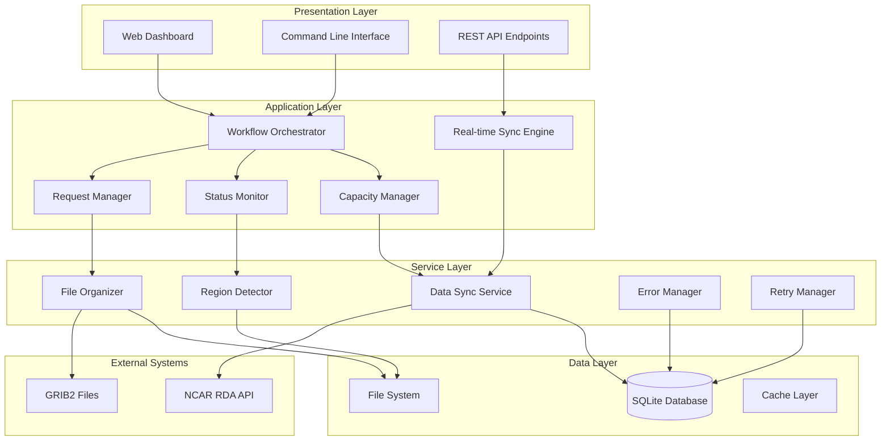
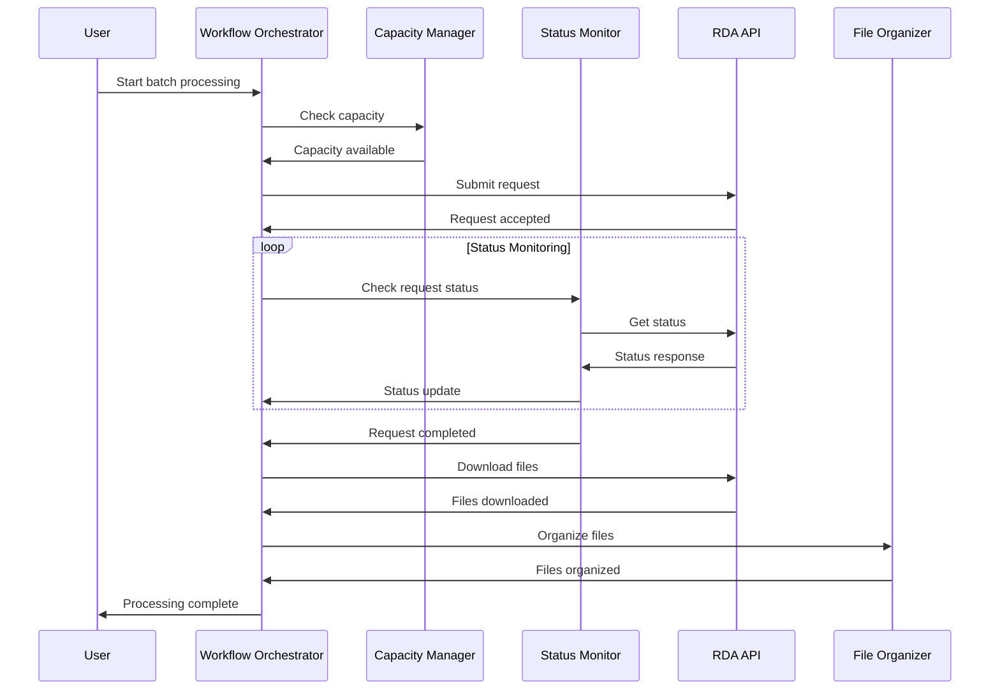
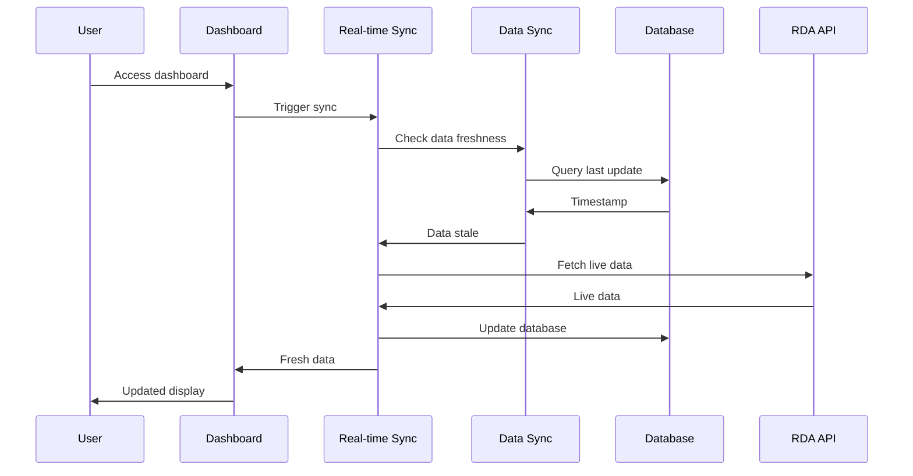

# Architecture Overview

This guide provides developers with a comprehensive understanding of the RDA Automation System's architecture, design patterns, and key components.

## 🏗️ System Architecture

### High-Level Architecture

The RDA Automation System follows a modular, service-oriented architecture with clear separation of concerns:



### Core Design Principles

1. **Modularity**: Each component has a single responsibility
2. **Loose Coupling**: Components communicate through well-defined interfaces
3. **High Cohesion**: Related functionality is grouped together
4. **Scalability**: System can handle increasing loads
5. **Reliability**: Built-in error handling and recovery
6. **Observability**: Comprehensive logging and monitoring

## 🔧 Core Components

### 1. Workflow Orchestrator

**Purpose**: Coordinates the entire automation workflow using a state machine pattern.

**Key Features**:
- State-driven workflow execution
- Event processing and action dispatching
- Parallel workflow support
- Checkpoint system for recovery

**Code Location**: [`src/python/automation/workflow_orchestrator.py`](../../src/python/automation/workflow_orchestrator.py)

```python
class WorkflowOrchestrator:
    def __init__(self, config: WorkflowConfig):
        self.current_state = WorkflowState.MONITORING
        self.state_handlers = self._setup_state_handlers()
    
    async def execute_main_workflow_cycle(self) -> WorkflowResult:
        # State machine execution logic
        pass
```

### 2. Capacity Manager

**Purpose**: Manages the 10-request limit constraint with intelligent capacity planning.

**Key Features**:
- Real-time capacity monitoring
- Crisis detection and resolution
- Predictive capacity management
- Safe request purging

**Code Location**: [`src/python/automation/capacity_manager.py`](../../src/python/automation/capacity_manager.py)

```python
class CapacityManager:
    def get_current_capacity_status(self) -> CapacityStatus:
        # Monitor current request count and capacity
        pass
    
    def execute_capacity_strategy(self, status: CapacityStatus) -> List[CapacityAction]:
        # Execute appropriate capacity management strategy
        pass
```

### 3. Real-time Sync Engine

**Purpose**: Provides real-time data synchronization eliminating cache timeout gaps.

**Key Features**:
- Dashboard access triggers
- Event-driven synchronization
- WebSocket notifications
- Smart caching with invalidation

**Code Location**: [`src/python/automation/real_time_sync_engine.py`](../../src/python/automation/real_time_sync_engine.py)

```python
class RealTimeSyncEngine:
    def perform_immediate_sync(self, trigger_reason: str) -> SyncResult:
        # Perform immediate data synchronization
        pass
    
    def sync_on_dashboard_access(self) -> SyncResult:
        # Trigger sync when dashboard is accessed
        pass
```

### 4. Status Monitor

**Purpose**: Monitors RDA request status and triggers appropriate actions.

**Key Features**:
- Continuous status checking
- Automatic download triggering
- Error detection and handling
- Integration with batch system

**Code Location**: [`src/python/automation/status_monitor.py`](../../src/python/automation/status_monitor.py)

```python
class StatusMonitor:
    def check_all_active_requests(self) -> Dict[str, StatusCheckResult]:
        # Check status of all active requests
        pass
    
    def process_status_results(self, results: Dict[str, StatusCheckResult]) -> Dict[str, Any]:
        # Process status results and trigger actions
        pass
```

### 5. Region/Variable Detector

**Purpose**: Intelligent detection of regions and weather variables from multiple sources.

**Key Features**:
- Multi-source detection (coordinates, control files, metadata)
- Confidence-based selection
- Fallback mechanisms
- Validation and verification

**Code Location**: [`src/python/automation/file_organization_manager.py`](../../src/python/automation/file_organization_manager.py)

```python
class EnhancedFileOrganizationManager:
    def detect_region_variable_multi_source(self, request_id: str, **kwargs) -> RegionVariableInfo:
        # Multi-source region/variable detection
        pass
```

## 🔄 Data Flow

### Request Processing Flow



### Real-time Sync Flow



## 🗄️ Database Schema

### Core Tables

#### rda_requests
```sql
CREATE TABLE rda_requests (
    request_id TEXT PRIMARY KEY,
    request_index TEXT,
    status TEXT NOT NULL,
    region TEXT,
    variable_type TEXT,
    rinfo TEXT,
    subset_info TEXT,
    title TEXT,
    description TEXT,
    created_at TIMESTAMP DEFAULT CURRENT_TIMESTAMP,
    updated_at TIMESTAMP DEFAULT CURRENT_TIMESTAMP,
    completed_at TIMESTAMP,
    downloaded_at TIMESTAMP,
    file_count INTEGER DEFAULT 0,
    file_size_bytes INTEGER DEFAULT 0,
    error_message TEXT,
    retry_count INTEGER DEFAULT 0,
    priority INTEGER DEFAULT 0
);
```

#### control_files_tracking
```sql
CREATE TABLE control_files_tracking (
    id INTEGER PRIMARY KEY AUTOINCREMENT,
    file_path TEXT UNIQUE NOT NULL,
    region TEXT NOT NULL,
    variable_type TEXT NOT NULL,
    status TEXT DEFAULT 'discovered',
    request_id TEXT,
    created_at TIMESTAMP DEFAULT CURRENT_TIMESTAMP,
    updated_at TIMESTAMP DEFAULT CURRENT_TIMESTAMP,
    processed_at TIMESTAMP,
    error_message TEXT,
    retry_count INTEGER DEFAULT 0
);
```

#### regional_progress
```sql
CREATE TABLE regional_progress (
    region TEXT PRIMARY KEY,
    total_files INTEGER DEFAULT 0,
    completed_files INTEGER DEFAULT 0,
    failed_files INTEGER DEFAULT 0,
    in_progress_files INTEGER DEFAULT 0,
    last_updated TIMESTAMP DEFAULT CURRENT_TIMESTAMP,
    completion_percentage REAL DEFAULT 0.0
);
```

## 🎯 Design Patterns

### 1. State Machine Pattern

Used in the Workflow Orchestrator for managing complex workflow states:

```python
class WorkflowState(Enum):
    MONITORING = "monitoring"
    CAPACITY_CHECK = "capacity_check"
    REQUEST_SUBMISSION = "request_submission"
    STATUS_MONITORING = "status_monitoring"
    # ... other states

class WorkflowOrchestrator:
    def transition_state(self, new_state: WorkflowState, reason: str = ""):
        old_state = self.current_state
        self.current_state = new_state
        self.logger.info(f"State transition: {old_state} -> {new_state} ({reason})")
```

### 2. Strategy Pattern

Used in the Capacity Manager for different capacity management strategies:

```python
class CapacityStrategy(ABC):
    @abstractmethod
    def execute(self, status: CapacityStatus) -> List[CapacityAction]:
        pass

class CrisisStrategy(CapacityStrategy):
    def execute(self, status: CapacityStatus) -> List[CapacityAction]:
        # Crisis-specific logic
        pass

class NormalStrategy(CapacityStrategy):
    def execute(self, status: CapacityStatus) -> List[CapacityAction]:
        # Normal operation logic
        pass
```

### 3. Observer Pattern

Used for event-driven communication between components:

```python
class EventBus:
    def __init__(self):
        self._subscribers = defaultdict(list)
    
    def subscribe(self, event_type: str, handler: Callable):
        self._subscribers[event_type].append(handler)
    
    async def publish(self, event: Event):
        for handler in self._subscribers[event.type]:
            await handler(event)
```

### 4. Factory Pattern

Used for creating configured instances of services:

```python
def create_status_monitor(db_path: str = None, **kwargs) -> StatusMonitor:
    config = MonitorConfig(**kwargs)
    return StatusMonitor(db_path or DEFAULT_DB_PATH, config)

def create_capacity_manager(**kwargs) -> CapacityManager:
    config = CapacityConfig(**kwargs)
    return CapacityManager(config)
```

## 🔌 Integration Points

### External API Integration

#### RDA API Client
```python
class RDAClient:
    def __init__(self, token: str, base_url: str = "https://rda.ucar.edu"):
        self.token = token
        self.base_url = base_url
        self.session = requests.Session()
    
    def get_status(self) -> Dict[str, Any]:
        # Get request status from RDA API
        pass
    
    def download_request(self, request_id: str, output_dir: str) -> bool:
        # Download files for completed request
        pass
```

### Database Integration

#### Connection Management
```python
class DatabaseManager:
    def __init__(self, db_path: str):
        self.db_path = db_path
        self._connection_pool = []
    
    def get_connection(self) -> sqlite3.Connection:
        # Get database connection from pool
        pass
    
    def execute_query(self, query: str, params: tuple = None) -> List[Dict]:
        # Execute query with connection pooling
        pass
```

### File System Integration

#### File Organization
```python
class FileOrganizer:
    def organize_files(self, source_path: str, region: str, variable: str) -> OrganizationResult:
        target_dir = self.base_dir / region / variable
        target_dir.mkdir(parents=True, exist_ok=True)
        
        # Move files to organized location
        moved_files = []
        for file_path in Path(source_path).rglob('*'):
            if file_path.is_file():
                target_file = target_dir / file_path.name
                shutil.move(str(file_path), str(target_file))
                moved_files.append(str(target_file))
        
        return OrganizationResult(success=True, moved_files=moved_files)
```

## 🚀 Performance Considerations

### Concurrency Model

The system uses a hybrid concurrency model:

1. **Thread-based**: For I/O-bound operations (file downloads, API calls)
2. **Process-based**: For CPU-bound operations (file processing)
3. **Async/await**: For coordinating concurrent operations

```python
import asyncio
import concurrent.futures

class ConcurrentProcessor:
    def __init__(self, max_workers: int = 5):
        self.executor = concurrent.futures.ThreadPoolExecutor(max_workers=max_workers)
    
    async def process_requests_concurrently(self, requests: List[str]) -> List[ProcessingResult]:
        loop = asyncio.get_event_loop()
        tasks = [
            loop.run_in_executor(self.executor, self.process_single_request, req)
            for req in requests
        ]
        return await asyncio.gather(*tasks)
```

### Caching Strategy

Multi-level caching for optimal performance:

```python
class CacheManager:
    def __init__(self):
        self.memory_cache = {}  # In-memory cache for frequently accessed data
        self.disk_cache = {}    # Disk-based cache for larger datasets
    
    def get(self, key: str, cache_level: str = "memory") -> Any:
        if cache_level == "memory":
            return self.memory_cache.get(key)
        elif cache_level == "disk":
            return self._load_from_disk(key)
    
    def set(self, key: str, value: Any, cache_level: str = "memory", ttl: int = 3600):
        if cache_level == "memory":
            self.memory_cache[key] = (value, time.time() + ttl)
        elif cache_level == "disk":
            self._save_to_disk(key, value, ttl)
```

### Database Optimization

```python
class OptimizedDatabase:
    def __init__(self, db_path: str):
        self.db_path = db_path
        self._setup_optimizations()
    
    def _setup_optimizations(self):
        with sqlite3.connect(self.db_path) as conn:
            # Enable WAL mode for better concurrency
            conn.execute('PRAGMA journal_mode=WAL')
            # Optimize performance settings
            conn.execute('PRAGMA synchronous=NORMAL')
            conn.execute('PRAGMA cache_size=10000')
            conn.execute('PRAGMA temp_store=MEMORY')
```

## 🔒 Security Architecture

### Authentication & Authorization

```python
class SecurityManager:
    def __init__(self, token_file: str):
        self.token_file = token_file
        self._validate_token_file_permissions()
    
    def _validate_token_file_permissions(self):
        stat_info = os.stat(self.token_file)
        if stat_info.st_mode & 0o077:
            raise SecurityError("Token file has insecure permissions")
    
    def get_secure_token(self) -> str:
        with open(self.token_file, 'r') as f:
            return f.read().strip()
```

### Input Validation

```python
class InputValidator:
    @staticmethod
    def validate_request_id(request_id: str) -> str:
        if not request_id or not re.match(r'^[a-zA-Z0-9_-]+$', request_id):
            raise ValueError("Invalid request ID format")
        return request_id
    
    @staticmethod
    def validate_file_path(file_path: str) -> str:
        # Prevent directory traversal attacks
        if '..' in file_path or file_path.startswith('/'):
            raise ValueError("Invalid file path")
        return file_path
```

## 📊 Monitoring & Observability

### Logging Architecture

```python
class StructuredLogger:
    def __init__(self, name: str):
        self.logger = logging.getLogger(name)
        self._setup_structured_logging()
    
    def log_event(self, event_type: str, **kwargs):
        log_data = {
            'timestamp': datetime.utcnow().isoformat(),
            'event_type': event_type,
            'component': self.logger.name,
            **kwargs
        }
        self.logger.info(json.dumps(log_data))
```

### Metrics Collection

```python
class MetricsCollector:
    def __init__(self):
        self.metrics = defaultdict(list)
    
    def record_metric(self, name: str, value: float, tags: Dict[str, str] = None):
        metric_data = {
            'timestamp': time.time(),
            'value': value,
            'tags': tags or {}
        }
        self.metrics[name].append(metric_data)
    
    def get_metric_summary(self, name: str, time_range: int = 3600) -> Dict:
        # Calculate summary statistics for metric
        pass
```

## 🧪 Testing Architecture

### Test Structure

```python
# Base test class with common functionality
class BaseTestCase:
    def setUp(self):
        self.test_db = ":memory:"
        self.test_config = self._create_test_config()
    
    def _create_test_config(self) -> Dict:
        return {
            "automation": {
                "max_concurrent_requests": 2,
                "check_interval_seconds": 10
            }
        }

# Component-specific test
class TestWorkflowOrchestrator(BaseTestCase):
    def setUp(self):
        super().setUp()
        self.orchestrator = WorkflowOrchestrator(self.test_config)
    
    @patch('automation.workflow_orchestrator.CapacityManager')
    def test_workflow_execution(self, mock_capacity_manager):
        # Test workflow execution with mocked dependencies
        pass
```

### Integration Testing

```python
class IntegrationTestSuite:
    def test_end_to_end_workflow(self):
        # Test complete workflow from request submission to file organization
        pass
    
    def test_real_time_sync_integration(self):
        # Test real-time sync with dashboard integration
        pass
```

## 📚 Extension Points

### Adding New Components

1. **Inherit from Base Classes**: Use provided base classes for consistency
2. **Implement Required Interfaces**: Follow established interface contracts
3. **Register with Event Bus**: Subscribe to relevant events
4. **Add Configuration**: Extend configuration schema
5. **Include Tests**: Add comprehensive test coverage

```python
class NewAutomationComponent(BaseService):
    def __init__(self, config: ComponentConfig):
        super().__init__()
        self.config = config
        self._setup_logging()
        self._register_event_handlers()
    
    def _register_event_handlers(self):
        self.event_bus.subscribe('request_completed', self.handle_request_completed)
    
    async def handle_request_completed(self, event: Event):
        # Handle request completion event
        pass
```

### Custom Region/Variable Detection

```python
class CustomRegionDetector(RegionDetectorInterface):
    def detect_region(self, context: DetectionContext) -> DetectionResult:
        # Custom region detection logic
        pass
    
    def get_confidence_score(self, result: DetectionResult) -> float:
        # Return confidence score for the detection
        pass
```

## 🔗 Related Documentation

- **[API Reference](api-reference.md)** - Detailed API documentation
- **[Component Specifications](../technical-appendices/component-specifications.md)** - Detailed component specs
- **[Implementation Details](../technical-appendices/implementation-details.md)** - Implementation guidelines
- **[Configuration Reference](../technical-appendices/configuration-reference.md)** - Complete configuration options

---

*This architecture overview provides the foundation for understanding and extending the RDA Automation System. For specific implementation details, refer to the linked documentation and source code.*