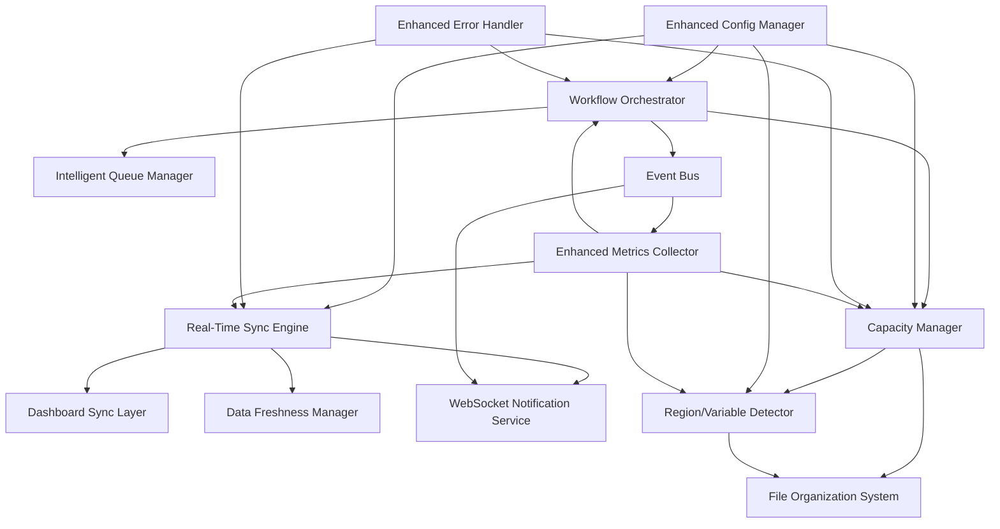

# Enhanced Component Specifications for Real-Time Data Sync and Batch Processing

## Real-Time Data Synchronization Components

### 1. Real-Time Sync Engine

#### Purpose
Orchestrates real-time data synchronization between RDA API and the dashboard, eliminating cache timeout gaps.

#### Core Responsibilities
- Manage sync triggers from multiple sources
- Coordinate data freshness validation
- Handle sync state transitions
- Provide WebSocket notifications for live updates

#### Interface Specification

```python
class RealTimeSyncEngine:
    def __init__(self, config: SyncConfig, db_path: str):
        """Initialize the real-time sync engine."""
        
    async def trigger_sync(self, trigger_type: SyncTriggerType, context: Dict) -> SyncResult:
        """Trigger a synchronization operation."""
        
    async def get_sync_status(self) -> SyncStatus:
        """Get current synchronization status."""
        
    def register_sync_callback(self, callback: Callable[[SyncEvent], None]):
        """Register callback for sync events."""
        
    async def start_background_sync(self):
        """Start background synchronization service."""
        
    async def stop_background_sync(self):
        """Stop background synchronization service."""
```

#### Configuration Parameters

```yaml
sync_engine:
  max_concurrent_syncs: 3
  sync_timeout_seconds: 30
  retry_attempts: 3
  retry_delay_seconds: 5
  websocket_enabled: true
  background_sync_interval: 120
```

#### Dependencies
- `RDADataSyncService` (existing)
- `WebSocketNotificationService` (new)
- `SyncStateManager` (new)
- SQLite database

### 2. Dashboard Sync Layer

#### Purpose
Integrates real-time sync capabilities directly into the dashboard interface.

#### Core Responsibilities
- Intercept dashboard access events
- Provide live data to dashboard components
- Display sync status indicators
- Handle auto-refresh logic

#### Interface Specification

```python
class DashboardSyncLayer:
    def __init__(self, sync_engine: RealTimeSyncEngine, dashboard_app: Flask):
        """Initialize dashboard sync integration."""
        
    def setup_access_triggers(self):
        """Setup automatic sync triggers on dashboard access."""
        
    async def get_live_data(self, data_type: str, filters: Dict = None) -> Dict:
        """Get live data with automatic sync if stale."""
        
    def get_sync_status_indicator(self) -> Dict:
        """Get current sync status for UI display."""
        
    def setup_websocket_endpoints(self):
        """Setup WebSocket endpoints for live updates."""
```

#### Integration Points
- Flask dashboard routes
- WebSocket connections
- Real-time sync engine
- Data freshness manager

### 3. Data Freshness Manager

#### Purpose
Manages data freshness validation and automatic sync triggering based on staleness.

#### Core Responsibilities
- Track data timestamps and freshness
- Detect stale data conditions
- Prioritize sync operations
- Manage data versioning

#### Interface Specification

```python
class DataFreshnessManager:
    def __init__(self, db_path: str, freshness_config: FreshnessConfig):
        """Initialize data freshness management."""
        
    def is_data_fresh(self, data_type: str, max_age_seconds: int = None) -> bool:
        """Check if data is within freshness threshold."""
        
    def mark_data_updated(self, data_type: str, timestamp: datetime = None):
        """Mark data as recently updated."""
        
    def get_stale_data_types(self) -> List[str]:
        """Get list of data types that are stale."""
        
    def get_data_age(self, data_type: str) -> timedelta:
        """Get age of specific data type."""
```

#### Freshness Thresholds

```yaml
freshness_thresholds:
  rda_requests: 60      # 1 minute
  regional_progress: 300 # 5 minutes
  control_files: 600    # 10 minutes
  error_statistics: 120 # 2 minutes
```

## Automated Batch Processing Components

### 4. Workflow Orchestrator

#### Purpose
Manages the complete automated batch processing workflow with state machine-driven execution.

#### Core Responsibilities
- Execute workflow state transitions
- Process workflow events
- Dispatch actions to appropriate components
- Monitor workflow health

#### Interface Specification

```python
class WorkflowOrchestrator:
    def __init__(self, config: WorkflowConfig, capacity_manager: CapacityManager):
        """Initialize workflow orchestrator."""
        
    async def start_workflow(self) -> WorkflowInstance:
        """Start a new workflow instance."""
        
    async def process_event(self, event: WorkflowEvent) -> WorkflowState:
        """Process a workflow event and transition state."""
        
    def get_workflow_status(self) -> WorkflowStatus:
        """Get current workflow status."""
        
    async def pause_workflow(self):
        """Pause workflow execution."""
        
    async def resume_workflow(self):
        """Resume paused workflow."""
```

#### State Machine Definition

```python
class WorkflowState(Enum):
    MONITORING = "monitoring"
    CAPACITY_CHECK = "capacity_check"
    REQUEST_SUBMISSION = "request_submission"
    STATUS_MONITORING = "status_monitoring"
    COMPLETED_DETECTION = "completed_detection"
    FILE_DOWNLOAD = "file_download"
    FILE_ORGANIZATION = "file_organization"
    REQUEST_PURGE = "request_purge"
    CAPACITY_MANAGEMENT = "capacity_management"
    ERROR_HANDLING = "error_handling"
    RETRY_LOGIC = "retry_logic"
```

### 5. Capacity Manager

#### Purpose
Manages the 10-request limit constraint with intelligent capacity planning and crisis resolution.

#### Core Responsibilities
- Monitor active request count
- Detect capacity constraints
- Execute crisis resolution protocols
- Manage safe purging operations

#### Interface Specification

```python
class CapacityManager:
    def __init__(self, config: CapacityConfig, rda_client: RDAClient):
        """Initialize capacity manager."""
        
    async def get_current_capacity(self) -> CapacityStatus:
        """Get current capacity status."""
        
    async def can_submit_request(self) -> bool:
        """Check if new request can be submitted."""
        
    async def resolve_capacity_crisis(self) -> CrisisResolutionResult:
        """Execute capacity crisis resolution protocol."""
        
    async def safe_purge_requests(self, request_ids: List[str]) -> PurgeResult:
        """Safely purge completed/error requests."""
        
    def register_capacity_callback(self, callback: Callable[[CapacityEvent], None]):
        """Register callback for capacity events."""
```

#### Capacity Management Rules

```python
class CapacityRules:
    MAX_REQUESTS = 10
    SAFETY_MARGIN = 2
    CRISIS_THRESHOLD = 9
    
    SAFE_TO_PURGE_STATUSES = ["completed", "error", "failed"]
    DOWNLOAD_REQUIRED_BEFORE_PURGE = ["completed"]
    IMMEDIATE_PURGE_ALLOWED = ["error", "failed"]
```

### 6. Intelligent Queue Manager

#### Purpose
Manages request submission queue with priority-based scheduling and load balancing.

#### Core Responsibilities
- Prioritize requests by region and variable type
- Balance submission load
- Implement rate limiting
- Optimize submission timing

#### Interface Specification

```python
class IntelligentQueueManager:
    def __init__(self, config: QueueConfig):
        """Initialize intelligent queue manager."""
        
    def add_request(self, request: QueuedRequest, priority: Priority = Priority.NORMAL):
        """Add request to submission queue."""
        
    async def get_next_request(self) -> Optional[QueuedRequest]:
        """Get next request for submission based on priority."""
        
    def get_queue_status(self) -> QueueStatus:
        """Get current queue status and statistics."""
        
    def set_region_priority(self, region: str, priority: Priority):
        """Set priority level for specific region."""
        
    def pause_submissions(self):
        """Pause all request submissions."""
        
    def resume_submissions(self):
        """Resume request submissions."""
```

#### Priority System

```python
class Priority(Enum):
    CRITICAL = 1
    HIGH = 2
    NORMAL = 3
    LOW = 4

class QueuedRequest:
    control_file: str
    region: str
    variable_type: str
    priority: Priority
    submission_attempts: int
    created_at: datetime
    scheduled_for: Optional[datetime]
```

## Enhanced Region/Variable Detection Components

### 7. Region/Variable Detector

#### Purpose
Provides enhanced, multi-source region and variable detection with high accuracy.

#### Core Responsibilities
- Analyze control files for region/variable information
- Perform coordinate-based region detection
- Extract metadata from RDA requests
- Provide fallback detection mechanisms

#### Interface Specification

```python
class RegionVariableDetector:
    def __init__(self, config: DetectionConfig):
        """Initialize region/variable detector."""
        
    def detect_from_control_file(self, control_file_path: str) -> DetectionResult:
        """Detect region/variable from control file."""
        
    def detect_from_coordinates(self, lat_min: float, lat_max: float, 
                               lon_min: float, lon_max: float) -> DetectionResult:
        """Detect region from coordinate bounds."""
        
    def detect_from_metadata(self, request_metadata: Dict) -> DetectionResult:
        """Detect region/variable from RDA request metadata."""
        
    def detect_with_fallback(self, sources: List[DetectionSource]) -> DetectionResult:
        """Detect using multiple sources with fallback logic."""
        
    def validate_detection(self, region: str, variable: str) -> ValidationResult:
        """Validate detected region/variable combination."""
```

#### Detection Methods

```python
class DetectionMethod(Enum):
    CONTROL_FILE_PARSING = "control_file_parsing"
    COORDINATE_ANALYSIS = "coordinate_analysis"
    METADATA_EXTRACTION = "metadata_extraction"
    PATTERN_MATCHING = "pattern_matching"
    MACHINE_LEARNING = "machine_learning"

class DetectionResult:
    region: str
    variable: str
    confidence: float
    method: DetectionMethod
    metadata: Dict
    validation_passed: bool
```

### 8. File Organization System

#### Purpose
Organizes downloaded files into the proper REGION_NAME/VARIABLE/ directory structure.

#### Core Responsibilities
- Generate proper directory paths
- Create directory structures
- Move files to organized locations
- Validate organization correctness

#### Interface Specification

```python
class FileOrganizationSystem:
    def __init__(self, config: OrganizationConfig, detector: RegionVariableDetector):
        """Initialize file organization system."""
        
    def organize_files(self, download_path: str, request_metadata: Dict) -> OrganizationResult:
        """Organize files from download path."""
        
    def generate_directory_path(self, region: str, variable: str) -> str:
        """Generate proper directory path for region/variable."""
        
    def validate_organization(self, file_path: str) -> ValidationResult:
        """Validate that file is properly organized."""
        
    def reorganize_if_needed(self, file_path: str) -> ReorganizationResult:
        """Reorganize file if not properly placed."""
```

#### Organization Rules

```python
class OrganizationRules:
    BASE_DIRECTORY = "./downloaded_files"
    STRUCTURE_PATTERN = "{region}/{variable}"
    
    VALID_REGIONS = [
        "ERCOT", "CISO", "PJM", "NYISO", "ISNE", "MISO", "SPP",
        "AZPS", "NEVP", "PACW", "WACM", "PSCO", "DUK", "FPL", "FPC"
    ]
    
    VALID_VARIABLES = [
        "dswrf", "wind", "rain", "temp"
    ]
```

## Integration and Communication Components

### 9. Event Bus System

#### Purpose
Provides decoupled communication between components using event-driven architecture.

#### Interface Specification

```python
class EventBus:
    def __init__(self):
        """Initialize event bus."""
        
    def subscribe(self, event_type: str, handler: Callable[[Event], None]):
        """Subscribe to specific event type."""
        
    def unsubscribe(self, event_type: str, handler: Callable[[Event], None]):
        """Unsubscribe from event type."""
        
    async def publish(self, event: Event):
        """Publish event to all subscribers."""
        
    def get_event_history(self, event_type: str = None) -> List[Event]:
        """Get history of events."""
```

#### Event Types

```python
class EventType(Enum):
    SYNC_TRIGGERED = "sync_triggered"
    SYNC_COMPLETED = "sync_completed"
    SYNC_FAILED = "sync_failed"
    CAPACITY_WARNING = "capacity_warning"
    CAPACITY_CRISIS = "capacity_crisis"
    REQUEST_SUBMITTED = "request_submitted"
    REQUEST_COMPLETED = "request_completed"
    REQUEST_FAILED = "request_failed"
    FILE_DOWNLOADED = "file_downloaded"
    FILE_ORGANIZED = "file_organized"
    WORKFLOW_STATE_CHANGED = "workflow_state_changed"
```

### 10. WebSocket Notification Service

#### Purpose
Provides real-time notifications to dashboard clients via WebSocket connections.

#### Interface Specification

```python
class WebSocketNotificationService:
    def __init__(self, port: int = 8081):
        """Initialize WebSocket notification service."""
        
    async def start_server(self):
        """Start WebSocket server."""
        
    async def stop_server(self):
        """Stop WebSocket server."""
        
    async def broadcast_notification(self, notification: Notification):
        """Broadcast notification to all connected clients."""
        
    async def send_to_client(self, client_id: str, notification: Notification):
        """Send notification to specific client."""
        
    def get_connected_clients(self) -> List[str]:
        """Get list of connected client IDs."""
```

#### Notification Types

```python
class NotificationType(Enum):
    DATA_UPDATED = "data_updated"
    SYNC_STATUS_CHANGED = "sync_status_changed"
    REQUEST_STATUS_CHANGED = "request_status_changed"
    CAPACITY_ALERT = "capacity_alert"
    ERROR_OCCURRED = "error_occurred"
    WORKFLOW_UPDATE = "workflow_update"

class Notification:
    type: NotificationType
    data: Dict
    timestamp: datetime
    client_filter: Optional[List[str]]
```

## Configuration Management

### 11. Enhanced Configuration Manager

#### Purpose
Manages configuration for all enhanced components with environment-specific settings.

#### Interface Specification

```python
class EnhancedConfigManager:
    def __init__(self, config_file: str, environment: str = "production"):
        """Initialize configuration manager."""
        
    def get_sync_config(self) -> SyncConfig:
        """Get real-time sync configuration."""
        
    def get_workflow_config(self) -> WorkflowConfig:
        """Get batch processing workflow configuration."""
        
    def get_capacity_config(self) -> CapacityConfig:
        """Get capacity management configuration."""
        
    def get_detection_config(self) -> DetectionConfig:
        """Get region/variable detection configuration."""
        
    def reload_config(self):
        """Reload configuration from file."""
        
    def validate_config(self) -> ValidationResult:
        """Validate configuration completeness and correctness."""
```

## Error Handling and Recovery Components

### 12. Enhanced Error Handler

#### Purpose
Provides comprehensive error handling with automatic recovery and escalation.

#### Interface Specification

```python
class EnhancedErrorHandler:
    def __init__(self, config: ErrorHandlingConfig):
        """Initialize enhanced error handler."""
        
    async def handle_error(self, error: Exception, context: ErrorContext) -> ErrorHandlingResult:
        """Handle error with appropriate recovery strategy."""
        
    def register_error_callback(self, error_type: Type[Exception], 
                               callback: Callable[[Exception, ErrorContext], None]):
        """Register callback for specific error type."""
        
    def get_error_statistics(self) -> ErrorStatistics:
        """Get error statistics and trends."""
        
    async def execute_recovery_protocol(self, protocol: RecoveryProtocol) -> RecoveryResult:
        """Execute specific recovery protocol."""
```

#### Recovery Strategies

```python
class RecoveryStrategy(Enum):
    RETRY_WITH_BACKOFF = "retry_with_backoff"
    FALLBACK_TO_CACHE = "fallback_to_cache"
    GRACEFUL_DEGRADATION = "graceful_degradation"
    CIRCUIT_BREAKER = "circuit_breaker"
    MANUAL_INTERVENTION = "manual_intervention"
    SYSTEM_RESTART = "system_restart"
```

## Monitoring and Observability Components

### 13. Enhanced Metrics Collector

#### Purpose
Collects comprehensive metrics for monitoring system performance and health.

#### Interface Specification

```python
class EnhancedMetricsCollector:
    def __init__(self, config: MetricsConfig):
        """Initialize metrics collector."""
        
    def record_sync_metrics(self, sync_result: SyncResult):
        """Record synchronization metrics."""
        
    def record_capacity_metrics(self, capacity_status: CapacityStatus):
        """Record capacity management metrics."""
        
    def record_workflow_metrics(self, workflow_event: WorkflowEvent):
        """Record workflow execution metrics."""
        
    def get_metrics_summary(self, time_range: TimeRange) -> MetricsSummary:
        """Get metrics summary for specified time range."""
        
    def export_metrics(self, format: MetricsFormat) -> str:
        """Export metrics in specified format."""
```

#### Key Metrics

```python
class MetricType(Enum):
    SYNC_LATENCY = "sync_latency"
    SYNC_SUCCESS_RATE = "sync_success_rate"
    DATA_FRESHNESS = "data_freshness"
    CAPACITY_UTILIZATION = "capacity_utilization"
    REQUEST_THROUGHPUT = "request_throughput"
    DOWNLOAD_SUCCESS_RATE = "download_success_rate"
    FILE_ORGANIZATION_ACCURACY = "file_organization_accuracy"
    ERROR_RATE = "error_rate"
    WORKFLOW_COMPLETION_TIME = "workflow_completion_time"
```

## Component Dependencies and Integration

### Dependency Graph



### Integration Requirements

1. **Database Integration**
   - All components must use the same SQLite database instance
   - Database schema must support new component requirements
   - Connection pooling for concurrent access

2. **Configuration Integration**
   - Centralized configuration management
   - Environment-specific configurations
   - Runtime configuration updates

3. **Error Handling Integration**
   - Consistent error handling across all components
   - Centralized error logging and reporting
   - Automatic recovery mechanisms

4. **Monitoring Integration**
   - Comprehensive metrics collection
   - Real-time monitoring dashboards
   - Alert and notification systems

This component specification provides the detailed interface definitions and integration requirements for implementing the enhanced real-time data synchronization and automated batch processing architecture.