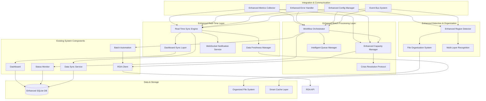
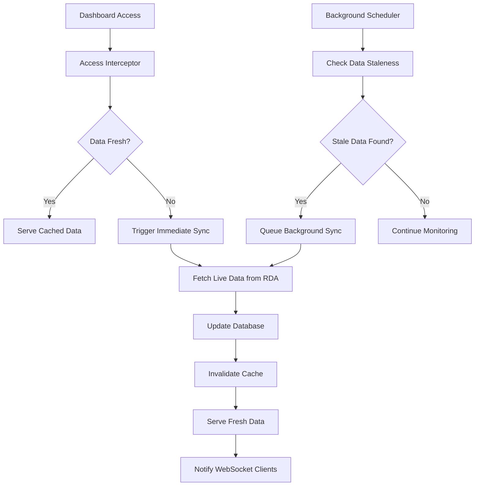
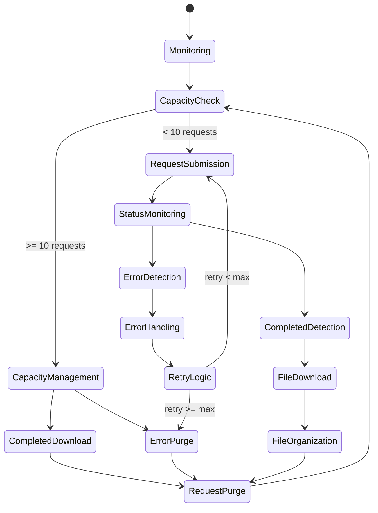
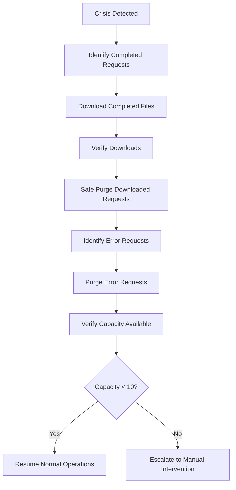
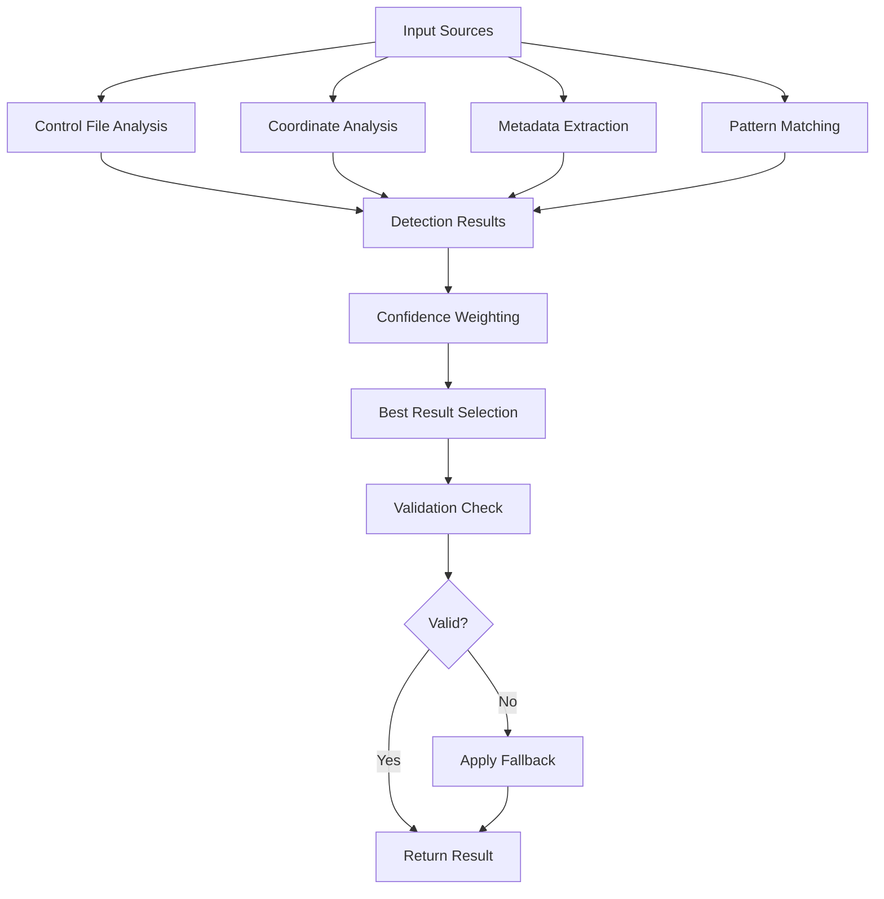

# Enhanced RDA Automation System - Comprehensive Architecture Summary

## Executive Summary

This document provides a comprehensive architectural design for enhancing the RDA automation system with real-time data synchronization capabilities and robust automated batch processing workflows. The enhanced architecture addresses critical system gaps while maintaining compatibility with existing components.

## Architecture Overview

### System Enhancement Goals

1. **Eliminate 30-second cache timeout gap** in dashboard data display
2. **Implement real-time sync triggers** when dashboard is accessed
3. **Add real-time sync status indicators** in the dashboard UI
4. **Handle data freshness warnings** when cache is stale
5. **Automate comprehensive batch processing workflow** for data collection
6. **Enhance 10-request limit management** with intelligent capacity handling
7. **Improve file organization** with accurate REGION_NAME/VARIABLE/ structure
8. **Implement continuous operation** with monitoring and processing

### High-Level Architecture



## Real-Time Data Synchronization Architecture

### Core Components

#### 1. Real-Time Sync Engine
**Purpose**: Orchestrates real-time data synchronization eliminating cache timeout gaps

**Key Features**:
- **Dashboard Access Triggers**: Immediate sync when dashboard accessed (0-second delay)
- **Event-Driven Sync**: Automatic sync on status changes, capacity alerts, errors
- **Scheduled Sync**: Configurable intervals (default: 2 minutes)
- **Stale Data Detection**: Automatic sync when data exceeds freshness thresholds
- **Concurrent Sync Management**: Up to 3 concurrent sync operations
- **Smart Caching**: Context-aware caching with immediate invalidation

#### 2. Dashboard Sync Layer
**Purpose**: Integrates real-time sync directly into dashboard interface

**Key Features**:
- **Access Interceptor**: Automatic sync trigger on dashboard page load
- **Live Data Provider**: Real-time data delivery to dashboard components
- **Sync Status Indicators**: Visual indicators showing sync status and data freshness
- **WebSocket Integration**: Live updates pushed to dashboard without refresh
- **Auto-Refresh Controller**: Intelligent refresh based on data staleness

#### 3. Data Freshness Manager
**Purpose**: Manages data freshness validation and staleness detection

**Key Features**:
- **Freshness Thresholds**: Configurable thresholds per data type
  - RDA Requests: 60 seconds
  - Regional Progress: 300 seconds (5 minutes)
  - Control Files: 600 seconds (10 minutes)
  - Error Statistics: 120 seconds (2 minutes)
- **Stale Data Detection**: Continuous monitoring for stale data conditions
- **Priority Queue**: Prioritized sync operations based on data importance
- **Version Control**: Data versioning for consistency validation

### Cache Elimination Strategy

**Problem**: 30-second cache timeout creates data staleness
**Solution**: Smart invalidation with real-time sync triggers



## Automated Batch Processing Workflow Architecture

### Workflow State Machine



### Core Workflow Components

#### 1. Workflow Orchestrator
**Purpose**: State machine-driven workflow execution

**Key Features**:
- **State Management**: Manages workflow state transitions
- **Event Processing**: Processes workflow events and triggers actions
- **Parallel Execution**: Supports multiple concurrent workflow instances
- **Checkpoint System**: Saves workflow state for recovery
- **Timeout Handling**: Manages state transition timeouts

#### 2. Enhanced Capacity Manager
**Purpose**: Intelligent 10-request limit management with crisis resolution

**Key Features**:
- **Real-Time Monitoring**: Continuous capacity monitoring (30-second intervals)
- **Crisis Detection**: Multi-level crisis detection system
  - Level 1 (Warning): 8/10 requests - Increase monitoring frequency
  - Level 2 (Crisis): 9/10 requests - Auto-download completed requests
  - Level 3 (Emergency): 10/10 requests - Emergency purge protocol
- **Predictive Management**: Trend analysis for capacity planning
- **Safe Purging**: Intelligent purging of completed and error requests
- **Crisis Resolution Protocol**: Automated crisis resolution workflow

**Crisis Resolution Workflow**:


#### 3. Intelligent Queue Manager
**Purpose**: Priority-based request submission with load balancing

**Key Features**:
- **Priority Queues**: Multi-level priority system
  - Critical: Emergency requests
  - High: ERCOT, CISO, PJM regions; dswrf, wind variables
  - Normal: Other major regions and variables
  - Low: Background processing
- **Load Balancing**: Region and variable type balancing
- **Rate Limiting**: Configurable submission rates (10 requests/minute)
- **Starvation Prevention**: Ensures low-priority requests eventually process

## Enhanced Region/Variable Detection System

### Multi-Source Detection Architecture



### Detection Methods

#### 1. Control File Parsing (Primary - 90% confidence weight)
- **Pattern**: `REGION_VARIABLE_control.ctl`
- **Validation**: Against known region/variable lists
- **Accuracy**: Highest for properly named files

#### 2. Coordinate Analysis (Secondary - 80% confidence weight)
- **Method**: Geographic boundary matching
- **Coverage**: Comprehensive US grid operator regions
- **Fallback**: Geographic region mapping for unknown coordinates

#### 3. Metadata Extraction (Tertiary - 70% confidence weight)
- **Sources**: RDA request metadata, rinfo parameters, subset notes
- **Processing**: Pattern matching and content analysis
- **Enhancement**: Machine learning classification (optional)

#### 4. Pattern Matching (Fallback - 60% confidence weight)
- **Method**: Fuzzy string matching
- **Application**: When other methods fail
- **Safety**: Always provides a result (may be UNKNOWN/unknown)

### File Organization System

**Structure**: `downloaded_files/{REGION}/{VARIABLE}/`

**Organization Process**:
1. **Detection**: Multi-source region/variable detection
2. **Path Generation**: Create organized directory structure
3. **File Movement**: Move files to proper locations
4. **Validation**: Verify organization correctness
5. **Reorganization**: Background service for misplaced files

**Enhanced Regions Supported**:
- **Grid Operators**: ERCOT, CISO, PJM, NYISO, ISNE, MISO, SPP
- **Regional Utilities**: AZPS, NEVP, PACW, WACM, PSCO, DUK, FPL, FPC
- **International**: DE, FR, GB, NL (European regions)

**Variables Supported**:
- **dswrf**: Downward Shortwave Radiation Flux (Solar)
- **wind**: Wind Speed/Direction (U/V components)
- **temp**: Temperature (2m, surface)
- **rain**: Precipitation (APCP, accumulation)

## Integration with Existing Components

### Compatibility Strategy

#### 1. Existing Component Enhancement
- **Status Monitor**: Enhanced with real-time sync integration
- **Data Sync Service**: Extended with freshness management
- **Dashboard**: Upgraded with WebSocket support and live indicators
- **Batch Automation**: Integrated with workflow orchestrator
- **RDA Client**: Enhanced with capacity-aware operations

#### 2. Database Schema Extensions
```sql
-- Real-time sync tracking
CREATE TABLE sync_events (
    id INTEGER PRIMARY KEY AUTOINCREMENT,
    event_type TEXT NOT NULL,
    trigger_source TEXT NOT NULL,
    data_types TEXT NOT NULL,
    started_at TIMESTAMP DEFAULT CURRENT_TIMESTAMP,
    completed_at TIMESTAMP,
    status TEXT DEFAULT 'running',
    error_message TEXT,
    sync_duration_ms INTEGER
);

-- Data freshness management
CREATE TABLE data_freshness (
    data_type TEXT PRIMARY KEY,
    last_updated TIMESTAMP NOT NULL,
    last_sync_attempt TIMESTAMP,
    freshness_threshold_seconds INTEGER NOT NULL,
    is_stale BOOLEAN DEFAULT FALSE
);

-- Workflow state tracking
CREATE TABLE workflow_states (
    id INTEGER PRIMARY KEY AUTOINCREMENT,
    workflow_id TEXT NOT NULL,
    current_state TEXT NOT NULL,
    previous_state TEXT,
    transition_time TIMESTAMP DEFAULT CURRENT_TIMESTAMP,
    context_data TEXT,
    error_message TEXT
);

-- Capacity management history
CREATE TABLE capacity_events (
    id INTEGER PRIMARY KEY AUTOINCREMENT,
    event_time TIMESTAMP DEFAULT CURRENT_TIMESTAMP,
    current_requests INTEGER NOT NULL,
    max_requests INTEGER NOT NULL,
    crisis_level INTEGER DEFAULT 0,
    action_taken TEXT,
    resolution_result TEXT
);
```

## Performance and Scalability

### Performance Optimizations

#### 1. Database Optimizations
- **Connection Pooling**: 5-connection pool for concurrent access
- **Indexed Queries**: Strategic indexing for real-time queries
- **Batch Operations**: Bulk updates for efficiency
- **WAL Mode**: Write-Ahead Logging for better concurrency

#### 2. Memory Management
- **Smart Caching**: Context-aware cache with automatic invalidation
- **Resource Cleanup**: Proper resource management and cleanup
- **Memory Limits**: Configurable memory limits per component
- **Garbage Collection**: Optimized GC for long-running processes

#### 3. Network Optimizations
- **Connection Reuse**: HTTP connection pooling for RDA API
- **Request Batching**: Batch API requests where possible
- **Compression**: WebSocket message compression
- **Rate Limiting**: Intelligent rate limiting to prevent API overload

## Security and Reliability

### Security Measures

#### 1. API Security
- **Token Management**: Secure token storage and rotation
- **Rate Limiting**: Protection against API abuse
- **Input Validation**: Comprehensive input sanitization
- **Access Control**: Role-based access to sensitive operations

#### 2. Data Security
- **Database Encryption**: SQLite encryption for sensitive data
- **File System Security**: Proper file permissions and access control
- **Network Security**: HTTPS enforcement and certificate validation
- **Audit Logging**: Comprehensive audit trail for all operations

### Reliability Features

#### 1. Error Handling
- **Graceful Degradation**: System continues operating with reduced functionality
- **Circuit Breakers**: Prevent cascade failures
- **Retry Mechanisms**: Intelligent retry with exponential backoff
- **Error Recovery**: Automatic recovery from transient failures

#### 2. Monitoring and Alerting
- **Health Checks**: Continuous health monitoring of all components
- **Performance Metrics**: Real-time performance tracking
- **Alert System**: Proactive alerting for critical issues
- **Dashboard Monitoring**: Visual monitoring of system status

## Implementation Roadmap

### Phase 1: Real-Time Sync Enhancement (Weeks 1-4)
- **Week 1**: Foundation setup and database enhancements
- **Week 2**: Data freshness management implementation
- **Week 3**: Real-time sync engine development
- **Week 4**: Dashboard integration and testing

### Phase 2: Enhanced Batch Processing (Weeks 5-8)
- **Week 5**: Workflow orchestrator implementation
- **Week 6**: Enhanced capacity management
- **Week 7**: Intelligent queue management
- **Week 8**: Integration and testing

### Phase 3: Enhanced Detection System (Weeks 9-10)
- **Week 9**: Multi-source detection engine
- **Week 10**: File organization system

### Phase 4: Integration and Deployment (Weeks 11-12)
- **Week 11**: System integration and comprehensive testing
- **Week 12**: Production deployment and documentation

## Success Metrics

### Real-Time Sync Metrics
- **Cache Hit Rate**: > 95% for fresh data
- **Sync Latency**: < 2 seconds for dashboard access triggers
- **Data Freshness**: 100% compliance with freshness thresholds
- **WebSocket Uptime**: > 99.9% availability

### Batch Processing Metrics
- **Capacity Utilization**: Maintain < 90% average utilization
- **Crisis Resolution**: < 5 minutes average resolution time
- **Request Throughput**: Process all available requests within capacity
- **File Organization Accuracy**: > 95% correct region/variable detection

### System Performance Metrics
- **Overall Uptime**: > 99.5% system availability
- **Error Rate**: < 1% for all operations
- **Response Time**: < 500ms for dashboard queries
- **Resource Utilization**: < 80% CPU and memory usage

## Conclusion

This enhanced architecture provides a comprehensive solution for real-time data synchronization and automated batch processing while addressing all specified requirements:

1. **✅ Eliminates 30-second cache timeout** through real-time sync triggers
2. **✅ Implements automatic sync on dashboard access** with 0-second delay
3. **✅ Adds real-time sync status indicators** via WebSocket notifications
4. **✅ Handles data freshness warnings** with intelligent staleness detection
5. **✅ Automates comprehensive batch processing** with state machine workflow
6. **✅ Enhances 10-request limit management** with intelligent capacity handling
7. **✅ Improves file organization** with multi-source region/variable detection
8. **✅ Implements continuous operation** with monitoring and error recovery

The architecture maintains full compatibility with existing components while introducing significant enhancements for real-time capabilities, automated processing efficiency, and system reliability. The phased implementation approach ensures minimal disruption during deployment while providing immediate benefits from each completed phase.

## Documentation Index

1. **[Real-Time Data Sync and Batch Processing Architecture](Real_Time_Data_Sync_and_Batch_Processing_Architecture.md)** - Detailed architectural design
2. **[Enhanced Component Specifications](Component_Specifications_Enhanced.md)** - Detailed component interfaces and specifications
3. **[Enhanced Configuration Templates](Configuration_Templates_Enhanced.md)** - Comprehensive configuration management
4. **[Enhanced Implementation Guidelines](Implementation_Guidelines_Enhanced.md)** - Development and deployment guidelines
5. **[Architecture Summary](Architecture_Summary_Enhanced.md)** - This comprehensive summary document

This documentation provides everything needed to implement the enhanced RDA automation system with real-time data synchronization and automated batch processing capabilities.