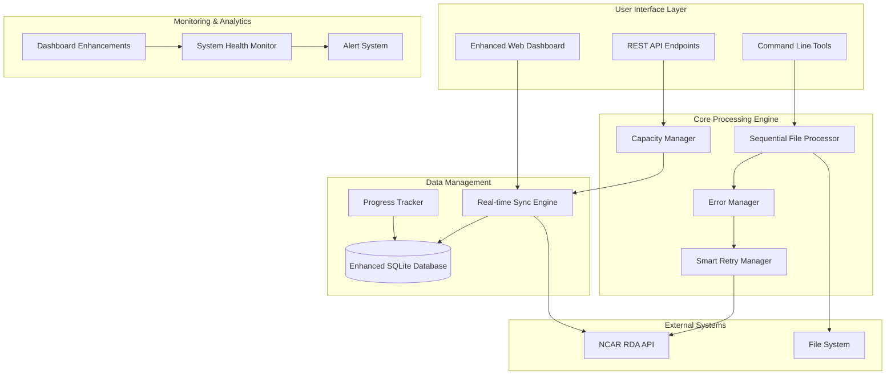
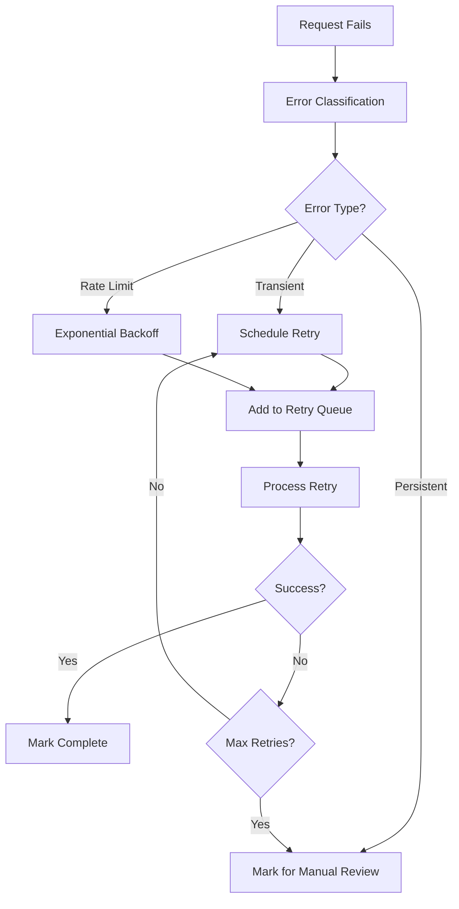

# Enhanced RDA Automation System Guide

[](docs/technical-appendices/verification-report.md)
[](https://python.org)
[](docs/)

> **Complete guide to the Enhanced RDA Automation System - intelligent meteorological data automation with advanced error handling, smart retry mechanisms, and real-time monitoring.**

## Table of Contents

1. [System Overview](#system-overview)
2. [New Features and Enhancements](#new-features-and-enhancements)
3. [Architecture Overview](#architecture-overview)
4. [Installation and Setup](#installation-and-setup)
5. [Core Components](#core-components)
6. [Usage Scenarios](#usage-scenarios)
7. [Configuration](#configuration)
8. [Monitoring and Dashboards](#monitoring-and-dashboards)
9. [Error Handling and Recovery](#error-handling-and-recovery)
10. [Performance and Scalability](#performance-and-scalability)
11. [Security Considerations](#security-considerations)
12. [Migration Guide](#migration-guide)
13. [Troubleshooting](#troubleshooting)
14. [API Reference](#api-reference)

## System Overview

The Enhanced RDA Automation System is a comprehensive solution for automating meteorological data collection from NCAR's Research Data Archive (RDA). It provides intelligent automation, advanced error handling, real-time monitoring, and scalable processing capabilities.

### Key Capabilities

| Feature | Description | Benefits |
|---------|-------------|----------|
| **🤖 Smart Automation** | Automated request processing with intelligent capacity management | Hands-off operation with 10-request limit handling |
| **🔄 Sequential Processing** | Ordered file processing with configurable strategies | Predictable, controlled data collection |
| **🚨 Advanced Error Handling** | Smart retry mechanisms with exponential backoff | Automatic recovery from transient failures |
| **📊 Real-time Monitoring** | Live dashboard with WebSocket updates | Complete visibility into system status |
| **🗺️ Intelligent Organization** | Auto-detection of 90+ regions and weather variables | Organized file structure without manual intervention |
| **⚡ Capacity Management** | Crisis resolution for API limits | Reliable operation under constraints |
| **🔍 Comprehensive Tracking** | Database-driven progress and error tracking | Full audit trail and analytics |

### Supported Data Sources

- **NCEP GFS 0.25° Global Forecast Grids** - High-resolution weather data
- **90+ Geographic Regions** - US grid operators (ERCOT, CISO, PJM, etc.) + European countries
- **Multiple Weather Variables** - Solar radiation (dswrf), wind, temperature, precipitation
- **Automatic File Organization** - `REGION_NAME/weather_variable/` structure

## New Features and Enhancements

### 🆕 Enhanced Error Tracking and Smart Retry System

The system now includes sophisticated error handling with intelligent retry mechanisms:

- **Smart Error Classification** - Automatic categorization of transient vs. persistent errors
- **Exponential Backoff** - Intelligent retry scheduling with jitter to prevent thundering herd
- **Circuit Breaker Pattern** - Automatic failure detection and recovery
- **Retry Queue Management** - Prioritized retry processing with success rate tracking

### 🆕 Sequential File Processing

New sequential processing engine for controlled, ordered file processing:

- **Configurable Processing Order** - Alphabetical, priority-based, region-based, or variable-based
- **Resume Capability** - Continue processing from interruption points
- **Progress Tracking** - Real-time progress monitoring with completion notifications
- **Integration with Existing Systems** - Seamless integration with capacity management

### 🆕 Enhanced Dashboard and Monitoring

Comprehensive real-time monitoring with advanced features:

- **Real-time Sync Engine** - Immediate data updates with freshness indicators
- **Advanced Error Analytics** - Error trend analysis and pattern detection
- **Regional Health Monitoring** - Per-region performance and error tracking
- **System Health Scoring** - Overall system health with alert generation

### 🆕 Intelligent Capacity Management

Advanced capacity management for the 10-request RDA limit:

- **Crisis Resolution** - Automatic handling when at capacity limit
- **Upload Automation** - Smart file submission when capacity allows
- **Priority Processing** - Intelligent request prioritization
- **Capacity Analytics** - Historical capacity usage and optimization

### 🆕 Enhanced Data Synchronization

Robust data synchronization with improved region detection:

- **Live API Integration** - Real-time data fetching from RDA API
- **Enhanced Region Mapping** - Comprehensive coordinate-based region detection
- **Data Freshness Tracking** - Automatic staleness detection and refresh
- **Robust Error Handling** - Fallback mechanisms for data sync failures

## Architecture Overview



### Component Relationships

- **Sequential File Processor** orchestrates ordered file processing
- **Capacity Manager** handles RDA's 10-request limit with crisis resolution
- **Error Manager** detects and categorizes failures for retry processing
- **Smart Retry Manager** implements intelligent retry strategies
- **Real-time Sync Engine** maintains fresh data with immediate updates
- **Enhanced Dashboard** provides comprehensive monitoring and control

## Installation and Setup

### Prerequisites

- **Python 3.7+** with pip package manager
- **RDA Account** with valid authentication token
- **4GB+ RAM** recommended for large batch processing
- **Stable Internet Connection** for RDA API access
- **SQLite 3.8+** (usually included with Python)

### Quick Installation

```bash
# 1. Clone the repository
git clone <repository-url>
cd rda-apps-clients

# 2. Create virtual environment
python -m venv rda_automation_env
source rda_automation_env/bin/activate  # Windows: rda_automation_env\Scripts\activate

# 3. Install dependencies
pip install -r requirements.txt

# 4. Setup RDA authentication
echo "your_rda_token_here" > rdams_token.txt

# 5. Initialize database and configuration
cd src/python
python -c "from automation.enhanced_database_schema import create_enhanced_schema_manager; create_enhanced_schema_manager().create_enhanced_tables()"

# 6. Verify installation
python -c "from automation.sequential_file_processor import create_sequential_file_processor; print('✅ Installation successful!')"
```

### Configuration Setup

Create or update [`config/automation_config.json`](config/automation_config.json):

```json
{
  "automation": {
    "max_concurrent_requests": 8,
    "check_interval_seconds": 300,
    "request_limit_safety_margin": 2,
    "auto_upload_enabled": true
  },
  "sequential_processing": {
    "processing_order": "alphabetical",
    "file_submission_delay": 5.0,
    "max_retries_per_file": 3,
    "enable_progress_tracking": true
  },
  "error_handling": {
    "max_retry_attempts": 5,
    "base_delay_seconds": 60,
    "exponential_base": 2.0,
    "enable_smart_retry": true
  },
  "directories": {
    "base_download_dir": "./downloaded_files",
    "control_files_dir": "./control_files",
    "logs_dir": "./logs"
  },
  "dashboard": {
    "port": 8080,
    "auto_refresh_seconds": 30,
    "enable_real_time_sync": true
  }
}
```

## Core Components

### 1. Sequential File Processor

The [`SequentialFileProcessor`](src/python/automation/sequential_file_processor.py) provides ordered, controlled file processing:

```python
from automation.sequential_file_processor import create_sequential_file_processor, ProcessingConfig

# Create configuration
config = ProcessingConfig(
    control_files_dir="./control_files",
    processing_order="alphabetical",
    file_submission_delay=5.0,
    max_retries_per_file=3
)

# Create processor
processor = create_sequential_file_processor(config)

# Start processing
success = processor.start_processing()
if success:
    print("Sequential processing started successfully")
    
    # Monitor progress
    while processor.processing_active:
        status = processor.get_processing_status()
        print(f"Progress: {status['current_file_index']}/{status['total_files']}")
        time.sleep(10)
```

**Key Features:**
- **Ordered Processing** - Files processed in configurable order
- **Resume Capability** - Continue from interruption points
- **Progress Tracking** - Real-time progress monitoring
- **Error Handling** - Automatic retry and error recovery
- **Integration** - Works with capacity management and retry systems

### 2. Smart Retry Manager

The [`SmartRetryManager`](src/python/automation/smart_retry_manager.py) implements intelligent failure recovery:

```python
from automation.smart_retry_manager import create_smart_retry_manager, SmartRetryConfig

# Create configuration
config = SmartRetryConfig(
    max_retry_attempts=5,
    base_delay_seconds=60,
    exponential_base=2.0,
    enable_circuit_breaker=True
)

# Create retry manager
retry_manager = create_smart_retry_manager(config)

# Process retry request
retry_request = RetryRequest(
    request_id="req_001",
    region="CISO",
    variable_type="dswrf",
    file_path="/path/to/file.ctl",
    error_message="HTTP 503: Service temporarily unavailable",
    error_type="HTTP_503"
)

result = retry_manager.process_retry_request(retry_request)
print(f"Retry scheduled: {result.retry_scheduled}")
print(f"Next retry: {result.next_retry_time}")
```

**Key Features:**
- **Intelligent Classification** - Automatic error categorization
- **Exponential Backoff** - Smart retry timing with jitter
- **Circuit Breaker** - Automatic failure detection and recovery
- **Success Tracking** - Retry success rate monitoring

### 3. Capacity Manager

The [`CapacityManager`](src/python/automation/capacity_manager.py) handles RDA's 10-request limit:

```python
from automation.capacity_manager import create_capacity_manager, CapacityConfig

# Create configuration
config = CapacityConfig(
    crisis_threshold=10,
    critical_threshold=9,
    enable_upload_automation=True,
    upload_capacity_threshold=8
)

# Create capacity manager
capacity_manager = create_capacity_manager(config)

# Start monitoring
capacity_manager.start_capacity_monitoring()

# Check current status
status = capacity_manager.get_current_capacity_status()
print(f"Capacity: {status.total_requests}/10 ({status.capacity_level.value})")
print(f"Available slots: {status.available_slots}")
```

**Key Features:**
- **Crisis Resolution** - Automatic handling at capacity limit
- **Upload Automation** - Smart file submission when capacity allows
- **Priority Processing** - Intelligent request prioritization
- **Analytics** - Capacity usage tracking and optimization

### 4. Enhanced Dashboard

The [`EnhancedRDADashboard`](src/python/automation/dashboard.py) provides comprehensive monitoring:

```python
from automation.dashboard import create_dashboard

# Create dashboard
dashboard = create_dashboard()

# Start dashboard server
dashboard.start_dashboard(host='0.0.0.0', port=8080)
```

**Access the dashboard at:** `http://localhost:8080`

**Key Features:**
- **Real-time Updates** - Live data with WebSocket notifications
- **Error Analytics** - Comprehensive error tracking and analysis
- **Regional Health** - Per-region performance monitoring
- **System Health** - Overall system health scoring and alerts

### 5. Error Manager

The [`ErrorManager`](src/python/automation/error_manager.py) provides automatic error detection and handling:

```python
from automation.error_manager import create_error_manager

# Create error manager
error_manager = create_error_manager()

# Detect error requests
error_requests = error_manager.detect_error_requests()
print(f"Found {len(error_requests)} failed requests")

# Get purge candidates
candidates = error_manager.get_purge_candidates()
print(f"Found {len(candidates)} requests for purging")

# Auto-purge with resubmission data
purged_count, resubmission_data = error_manager.purge_error_requests(candidates)
print(f"Purged {purged_count} requests, prepared {len(resubmission_data)} for retry")
```

## Usage Scenarios

### Scenario 1: Automated Sequential Processing

Process all control files in order with automatic error handling:

```bash
cd src/python

# Start sequential processing
python automation/sequential_file_processor.py --start \
    --control-files-dir ./control_files \
    --processing-order alphabetical \
    --submission-delay 5.0

# Monitor in another terminal
python automation/sequential_file_processor.py --status
```

### Scenario 2: Smart Error Recovery

Automatically detect and retry failed requests:

```bash
# Run unified error detection and retry workflow
python automation/smart_retry_manager.py --start-processing

# Check retry statistics
python automation/retry_manager.py --stats
```

### Scenario 3: Capacity-Aware Processing

Process files while respecting RDA's 10-request limit:

```bash
# Start capacity monitoring
python automation/capacity_manager.py --start-monitoring

# Trigger upload automation
python automation/capacity_manager.py --single-cycle
```

### Scenario 4: Real-time Monitoring

Monitor system status with live dashboard:

```bash
# Start enhanced dashboard
python automation/dashboard.py --port 8080

# Access at http://localhost:8080
```

### Scenario 5: Data Synchronization

Keep dashboard data fresh with live RDA API data:

```bash
# Perform full data sync
python automation/data_sync.py --sync

# Start continuous sync
python automation/data_sync.py --continuous
```

## Configuration

### Main Configuration File

The system uses [`config/automation_config.json`](config/automation_config.json) for centralized configuration:

```json
{
  "automation": {
    "max_concurrent_requests": 8,
    "check_interval_seconds": 300,
    "retry_attempts": 3,
    "request_limit_safety_margin": 2,
    "auto_upload_enabled": true
  },
  "sequential_processing": {
    "control_files_dir": "./control_files",
    "processing_order": "alphabetical",
    "file_submission_delay": 5.0,
    "max_retries_per_file": 3,
    "enable_progress_tracking": true,
    "enable_completion_notifications": true
  },
  "error_handling": {
    "max_retry_attempts": 5,
    "base_delay_seconds": 60,
    "max_delay_seconds": 3600,
    "exponential_base": 2.0,
    "jitter_factor": 0.1,
    "enable_smart_retry": true,
    "enable_circuit_breaker": true
  },
  "capacity_management": {
    "normal_threshold": 6,
    "approaching_threshold": 7,
    "critical_threshold": 9,
    "crisis_threshold": 10,
    "monitoring_interval": 60,
    "enable_upload_automation": true,
    "upload_capacity_threshold": 8,
    "upload_batch_size": 2
  },
  "dashboard": {
    "port": 8080,
    "auto_refresh_seconds": 30,
    "enable_real_time_sync": true,
    "sync_freshness_threshold": 300
  },
  "directories": {
    "base_download_dir": "./downloaded_files",
    "control_files_dir": "./control_files",
    "logs_dir": "./logs",
    "reports_dir": "./reports"
  }
}
```

### Component-Specific Configuration

Each component can be configured individually:

#### Sequential Processing Configuration

```python
from automation.sequential_file_processor import ProcessingConfig

config = ProcessingConfig(
    control_files_dir="./control_files",
    processing_order="alphabetical",  # alphabetical, priority, region, variable
    processing_mode=ProcessingMode.SEQUENTIAL,
    max_concurrent_files=1,
    file_submission_delay=5.0,
    retry_failed_files=True,
    max_retries_per_file=3,
    enable_capacity_management=True,
    enable_smart_retry=True,
    enable_progress_tracking=True
)
```

#### Smart Retry Configuration

```python
from automation.smart_retry_manager import SmartRetryConfig

config = SmartRetryConfig(
    max_retry_attempts=5,
    base_delay_seconds=60,
    max_delay_seconds=3600,
    exponential_base=2.0,
    jitter_factor=0.1,
    rate_limit_requests_per_minute=30,
    capacity_threshold=8,
    enable_circuit_breaker=True
)
```

#### Capacity Management Configuration

```python
from automation.capacity_manager import CapacityConfig

config = CapacityConfig(
    normal_threshold=6,
    approaching_threshold=7,
    critical_threshold=9,
    crisis_threshold=10,
    monitoring_interval=60,
    enable_upload_automation=True,
    upload_capacity_threshold=8,
    upload_batch_size=2,
    control_files_dir="./incoming"
)
```

## Monitoring and Dashboards

### Enhanced Web Dashboard

The enhanced dashboard provides comprehensive real-time monitoring:

**Features:**
- **Real-time Data Sync** - Live updates with freshness indicators
- **System Health Monitoring** - Overall health score and alerts
- **Error Analytics** - Error trends and pattern analysis
- **Regional Performance** - Per-region health and statistics
- **Capacity Monitoring** - Real-time capacity usage and alerts
- **Progress Tracking** - Sequential processing progress

**Access:** `http://localhost:8080` (configurable port)

### API Endpoints

The dashboard exposes comprehensive API endpoints:

#### System Status
```bash
# Get overall system summary
curl http://localhost:8080/api/summary

# Get real-time sync status
curl http://localhost:8080/api/sync-status

# Trigger manual sync
curl -X POST http://localhost:8080/api/trigger-sync
```

#### Error Tracking
```bash
# Get error summary
curl http://localhost:8080/api/error-tracking/summary

# Get live error feed
curl http://localhost:8080/api/error-tracking/live-feed

# Get regional error health
curl http://localhost:8080/api/error-tracking/regional-health
```

#### Progress Tracking
```bash
# Get overall progress
curl http://localhost:8080/api/progress-tracking/overall

# Get regional progress
curl http://localhost:8080/api/progress-tracking/regional

# Get variable progress
curl http://localhost:8080/api/progress-tracking/variables
```

### Command Line Monitoring

Monitor system status from command line:

```bash
# Check sequential processing status
python automation/sequential_file_processor.py --status

# Check capacity status
python automation/capacity_manager.py --status

# Check retry statistics
python automation/smart_retry_manager.py --status

# Check error statistics
python automation/error_manager.py --stats
```

## Error Handling and Recovery

### Error Classification

The system automatically classifies errors into categories:

- **Transient Errors** - Temporary issues that can be retried
  - Network timeouts
  - HTTP 503 Service Unavailable
  - Connection errors
  
- **Persistent Errors** - Issues requiring intervention
  - HTTP 400 Bad Request
  - HTTP 401 Unauthorized
  - HTTP 404 Not Found
  - Validation errors

- **Rate Limit Errors** - API rate limiting
  - HTTP 429 Too Many Requests
  - Request quota exceeded

### Smart Retry Strategies

The system implements multiple retry strategies:

#### Exponential Backoff
```
Retry 1: 60 seconds
Retry 2: 120 seconds (60 * 2^1)
Retry 3: 240 seconds (60 * 2^2)
Retry 4: 480 seconds (60 * 2^3)
Retry 5: 960 seconds (60 * 2^4)
```

#### Circuit Breaker Pattern
- **Closed State** - Normal operation
- **Open State** - Failures detected, requests blocked
- **Half-Open State** - Testing recovery

#### Jitter Addition
Random jitter (±10%) added to retry delays to prevent thundering herd effect.

### Error Recovery Workflow



### Manual Error Resolution

For persistent errors requiring manual intervention:

```bash
# List error requests
python automation/error_manager.py --stats

# Get detailed error information
python automation/error_manager.py --session-id SESSION_ID

# Manually resolve errors after fixing issues
python automation/error_manager.py --purge --session-id SESSION_ID
```

## Performance and Scalability

### System Requirements

| Component | Minimum | Recommended | Large Scale |
|-----------|---------|-------------|-------------|
| **CPU** | 2 cores | 4 cores | 8+ cores |
| **RAM** | 2GB | 4GB | 8GB+ |
| **Disk** | 10GB | 50GB | 200GB+ |
| **Network** | 10 Mbps | 50 Mbps | 100 Mbps+ |

### Performance Optimization

#### Database Optimization
```sql
-- Create indexes for better performance
CREATE INDEX IF NOT EXISTS idx_rda_requests_status ON rda_requests(status);
CREATE INDEX IF NOT EXISTS idx_rda_requests_region ON rda_requests(region);
CREATE INDEX IF NOT EXISTS idx_retry_attempts_status ON retry_attempts(status);
CREATE INDEX IF NOT EXISTS idx_retry_attempts_scheduled_time ON retry_attempts(scheduled_time);
```

#### Configuration Tuning
```json
{
  "automation": {
    "max_concurrent_requests": 8,  // Increase for better throughput
    "check_interval_seconds": 180  // Decrease for faster response
  },
  "sequential_processing": {
    "file_submission_delay": 2.0,  // Decrease for faster processing
    "max_concurrent_files": 3      // Increase for parallel processing
  },
  "capacity_management": {
    "monitoring_interval": 30      // Decrease for more responsive capacity management
  }
}
```

### Scalability Considerations

#### Horizontal Scaling
- **Multiple Instances** - Run multiple processors for different regions
- **Load Balancing** - Distribute processing across multiple machines
- **Database Sharding** - Split data by region or time period

#### Vertical Scaling
- **Memory Optimization** - Increase RAM for larger batch processing
- **CPU Optimization** - More cores for concurrent processing
- **Storage Optimization** - SSD storage for better database performance

### Performance Monitoring

Monitor system performance with built-in metrics:

```bash
# Get capacity analytics
python automation/capacity_manager.py --analytics

# Get processing performance
python automation/sequential_file_processor.py --status

# Get retry performance
python automation/smart_retry_manager.py --status
```

## Security Considerations

### Authentication and Authorization

#### RDA Token Security
```bash
# Store token securely
chmod 600 rdams_token.txt

# Use environment variables in production
export RDA_TOKEN="your_token_here"
```

#### Database Security
```bash
# Set appropriate file permissions
chmod 600 src/python/data/automation_state.db

# Regular backups
cp src/python/data/automation_state.db backups/automation_state_$(date +%Y%m%d).db
```

### Network Security

#### HTTPS Configuration
```python
# Use HTTPS in production
app.run(host='0.0.0.0', port=8443, ssl_context='adhoc')
```

#### Firewall Configuration
```bash
# Allow only necessary ports
ufw allow 8080/tcp  # Dashboard
ufw allow 22/tcp    # SSH
ufw deny incoming
ufw enable
```

### Data Protection

#### Sensitive Data Handling
- **Token Storage** - Never commit tokens to version control
- **Log Sanitization** - Remove sensitive data from logs
- **Data Encryption** - Encrypt sensitive configuration files

#### Audit Logging
```python
# Enable comprehensive audit logging
logging.basicConfig(
    level=logging.INFO,
    format='%(asctime)s - %(name)s - %(levelname)s - %(message)s',
    handlers=[
        logging.FileHandler('logs/audit.log'),
        logging.StreamHandler()
    ]
)
```

## Migration Guide

### Migrating from Previous Versions

#### Database Migration
```bash
# Backup existing database
cp src/python/data/automation_state.db src/python/data/automation_state_backup.db

# Run database migration
python -c "
from automation.enhanced_database_schema import create_enhanced_schema_manager
schema_manager = create_enhanced_schema_manager()
schema_manager.create_enhanced_tables()
print('Database migration completed')
"
```

#### Configuration Migration
```bash
# Update configuration file
cp config/automation_config.json config/automation_config_backup.json

# Add new configuration sections
python -c "
import json
with open('config/automation_config.json', 'r') as f:
    config = json.load(f)

# Add new sections
config['sequential_processing'] = {
    'processing_order': 'alphabetical',
    'file_submission_delay': 5.0,
    'enable_progress_tracking': True
}

config['error_handling'] = {
    'max_retry_attempts': 5,
    'enable_smart_retry': True
}

with open('config/automation_config.json', 'w') as f:
    json.dump(config, f, indent=2)

print('Configuration migration completed')
"
```

#### Code Migration
```python
# Old way
from batch_automation import BatchAutomationSystem
batch_system = BatchAutomationSystem()

# New way
from automation.sequential_file_processor import create_sequential_file_processor
processor = create_sequential_file_processor()
```

### Compatibility Notes

- **Python Version** - Requires Python 3.7+ (previously 3.6+)
- **Database Schema** - New tables added, existing tables preserved
- **API Changes** - New endpoints added, existing endpoints unchanged
- **Configuration** - New sections added, existing sections preserved

## Troubleshooting

### Common Issues

#### Installation Issues

**Issue:** Import errors after installation
```bash
# Solution: Verify Python path and virtual environment
python -c "import sys; print(sys.path)"
pip list | grep -E "(requests|sqlite|flask)"
```

**Issue:** Database initialization fails
```bash
# Solution: Check database permissions and path
ls -la src/python/data/
python -c "import sqlite3; print(sqlite3.version)"
```

#### Processing Issues

**Issue:** Sequential processing stuck
```bash
# Check processing status
python automation/sequential_file_processor.py --status

# Stop and restart processing
python automation/sequential_file_processor.py --stop
python automation/sequential_file_processor.py --start
```

**Issue:** Capacity limit reached
```bash
# Check capacity status
python automation/capacity_manager.py --status

# Run capacity management cycle
python automation/capacity_manager.py --single-cycle
```

#### Dashboard Issues

**Issue:** Dashboard not loading
```bash
# Check if port is available
lsof -i :8080

# Start dashboard with different port
python automation/dashboard.py --port 8081
```

**Issue:** Data not updating
```bash
# Trigger manual sync
curl -X POST http://localhost:8080/api/trigger-sync

# Check sync status
curl http://localhost:8080/api/sync-status
```

### Diagnostic Commands

```bash
# System health check
python -c "
from automation.sequential_file_processor import create_sequential_file_processor
from automation.capacity_manager import create_capacity_manager
from automation.smart_retry_manager import create_smart_retry_manager

print('✅ Sequential Processor: OK')
print('✅ Capacity Manager: OK')
print('✅ Smart Retry Manager: OK')
print('System health check passed!')
"

# Database integrity check
python -c "
import sqlite3
conn = sqlite3.connect('src/python/data/automation_state.db')
cursor = conn.cursor()
cursor.execute('PRAGMA integrity_check')
result = cursor.fetchone()
print(f'Database integrity: {result[0]}')
conn.close()
"

# Configuration validation
python -c "
import json
with open('config/automation_config.json', 'r') as f:
    config = json.load(f)
print('✅ Configuration file is valid JSON')
print(f'Configured components: {list(config.keys())}')
"
```

### Log Analysis

```bash
# View recent logs
tail -f logs/automation.log

# Search for errors
grep -i error logs/automation.log | tail -20

# Search for specific component logs
grep "sequential_file_processor" logs/automation.log | tail -10
```

### Getting Help

1. **Check Documentation** - Review relevant guide sections
2. **Search Logs** - Look for error messages and stack traces
3. **Run Diagnostics** - Use built-in diagnostic commands
4. **Check System Status** - Verify all components are running
5. **Review Configuration** - Ensure all settings are correct

For additional support:
- **GitHub Issues** - Report bugs and feature requests
- **Documentation** - Comprehensive guides and API reference
- **Community** - Join discussions and get help from other users

## API Reference

For complete API documentation, see [API Reference Guide](API_Reference.md).

### Quick API Reference

#### System Status
- `GET /api/summary` - Overall system summary
- `GET /api/sync-status` - Real-time sync status
- `POST /api/trigger-sync` - Manual sync trigger

#### Error Tracking
- `GET /api/error-tracking/summary` - Error summary
- `GET /api/error-tracking/live-feed` - Live error feed
- `GET /api/error-tracking/regional-health` - Regional error health

#### Progress Tracking
- `GET /api/progress-tracking/overall` - Overall progress
- `GET /api/progress-tracking/regional` - Regional progress
- `GET /api/progress-tracking/variables` - Variable progress

#### Dashboard
- `GET /api/dashboard/real-time-update` - Real-time dashboard data
- `GET /api/dashboard/alerts` - System alerts
- `GET /api/dashboard/metrics` - Performance metrics

---

##