# Error Tracking Dashboard Implementation Plan

## Executive Summary

This document provides a comprehensive architectural implementation plan for integrating a sophisticated error tracking dashboard section into the CarbonCast RDA automation system. The plan leverages the existing robust infrastructure including ErrorDashboardAPI, CircuitBreakerManager, and SmartRetryManager to create a production-ready error monitoring and management solution.

## 1. Implementation Overview

### 1.1 Project Scope

**Primary Objectives:**
- Integrate comprehensive error tracking dashboard section into existing CarbonCast dashboard
- Leverage existing ErrorDashboardAPI infrastructure for seamless data integration
- Provide real-time error monitoring with intelligent alerting and notification systems
- Create intuitive user interface for error analysis, pattern recognition, and resolution management
- Ensure production-ready performance, scalability, and reliability

**Key Deliverables:**
- Enhanced dashboard template with error tracking section
- Real-time WebSocket integration for live error monitoring
- Comprehensive error visualization components (10 advanced components)
- Intelligent notification and alerting system
- Production deployment and monitoring infrastructure

### 1.2 Architecture Overview

```mermaid
graph TB
    subgraph "Frontend Layer"
        A[Dashboard Template] --> B[Error Tracking Section]
        B --> C[Live Error Feed]
        B --> D[Regional Error Heatmap]
        B --> E[Error Trends Charts]
        B --> F[Retry Queue Management]
        B --> G[Error Pattern Analysis]
        B --> H[Notification Center]
    end
    
    subgraph "API Layer"
        I[ErrorDashboardAPI] --> J[Error Summary Endpoint]
        I --> K[Live Error Feed Endpoint]
        I --> L[Regional Health Endpoint]
        I --> M[Error Trends Endpoint]
        I --> N[Retry Queue Endpoint]
        I --> O[Pattern Analysis Endpoint]
    end
    
    subgraph "Real-time Layer"
        P[WebSocket Manager] --> Q[Error Event Stream]
        P --> R[Circuit Breaker Events]
        P --> S[Retry Queue Updates]
        P --> T[Health Status Changes]
    end
    
    subgraph "Data Layer"
        U[Enhanced Database Schema] --> V[error_tracking_enhanced]
        U --> W[retry_queue]
        U --> X[circuit_breaker_state]
        U --> Y[system_health_metrics]
    end
    
    subgraph "Integration Layer"
        Z[SmartRetryManager] --> AA[Circuit Breaker Manager]
        Z --> BB[Retry Strategy Engine]
        Z --> CC[Queue Processor]
    end
    
    A --> I
    I --> U
    P --> I
    Z --> I
```



## 2. Technical Architecture

### 2.1 Component Integration Strategy

**Existing Infrastructure Utilization:**
- **ErrorDashboardAPI**: Primary data source with 8 specialized endpoints
- **CircuitBreakerManager**: Real-time circuit breaker state monitoring
- **SmartRetryManager**: Intelligent retry processing and queue management
- **Enhanced Database Schema**: Comprehensive error storage with 2.0.0 schema version

**New Components to Implement:**
- **WebSocket Error Event Stream**: Real-time error event broadcasting
- **Error Visualization Components**: 10 advanced UI components for error analysis
- **Notification Management System**: Multi-channel alert delivery
- **Error Dashboard Integration**: Seamless integration with existing dashboard template

### 2.2 Database Integration

**Existing Tables (Already Implemented):**
```sql
-- Primary error tracking table
error_tracking_enhanced (
    id, request_id, request_index, error_type, error_category,
    error_severity, error_message, region, variable_type,
    retry_count, max_retries, is_retryable, resolution_status,
    first_occurrence, last_occurrence, frequency_count,
    impact_score, created_at, updated_at, resolved_at,
    resolved_by, resolution_notes
)

-- Smart retry queue management
retry_queue (
    id, original_request_id, queue_priority, retry_attempt,
    max_retry_attempts, retry_strategy, base_delay_seconds,
    current_delay_seconds, next_retry_time, queue_status,
    request_data, context_data, region, variable_type,
    file_path, eligibility_score, success_probability,
    last_error_message, created_at, updated_at
)

-- Circuit breaker state tracking
circuit_breaker_state (
    id, circuit_id, current_state, failure_count, success_count,
    last_failure_time, last_success_time, total_calls,
    successful_calls, failed_calls, failure_rate,
    average_response_time, state_change_count,
    time_in_open_state, recovery_attempts, config_data,
    created_at, updated_at
)
```

**No Additional Database Changes Required** - The existing enhanced schema provides all necessary data structures for comprehensive error tracking.

### 2.3 API Integration Points

**Existing ErrorDashboardAPI Endpoints (Ready for Use):**

1. **`/api/error-summary`** - Comprehensive error summary with metrics
2. **`/api/live-error-feed`** - Real-time error feed with filtering
3. **`/api/regional-error-health`** - Regional error health and heat map data
4. **`/api/error-trends`** - Error trend analysis over time
5. **`/api/retry-queue-status`** - Current retry queue status and metrics
6. **`/api/error-patterns`** - Error pattern analysis and recurring issues
7. **`/api/resolve-error`** - Error resolution management
8. **`/api/circuit-breaker-status`** - Circuit breaker state monitoring

**Integration Requirements:**
- All endpoints are fully implemented and production-ready
- Support for filtering, pagination, and real-time updates
- Comprehensive error handling and response validation
- Thread-safe operations with database connection pooling

## 3. Frontend Implementation

### 3.1 Dashboard Template Integration

**Template Enhancement Strategy:**
```html
<!-- Error Tracking Section Integration -->
<div class="row mt-4" id="errorTrackingSection">
    <div class="col-12">
        <div class="card">
            <div class="card-header d-flex justify-content-between align-items-center">
                <h3 class="card-title mb-0">
                    <i class="fas fa-exclamation-triangle text-warning me-2"></i>
                    Error Tracking & Monitoring
                </h3>
                <div class="btn-group" role="group">
                    <button type="button" class="btn btn-outline-primary btn-sm" onclick="refreshErrorData()">
                        <i class="fas fa-sync-alt"></i> Refresh
                    </button>
                    <button type="button" class="btn btn-outline-secondary btn-sm" onclick="toggleErrorNotifications()">
                        <i class="fas fa-bell"></i> Notifications
                    </button>
                </div>
            </div>
            <div class="card-body">
                <!-- Error Overview Panel -->
                <div id="errorOverviewPanel"></div>
                
                <!-- Error Visualization Components -->
                <div class="row">
                    <div class="col-lg-8">
                        <div id="liveErrorFeed"></div>
                        <div id="errorTrendsChart"></div>
                    </div>
                    <div class="col-lg-4">
                        <div id="regionalErrorHeatmap"></div>
                        <div id="retryQueueStatus"></div>
                    </div>
                </div>
                
                <!-- Advanced Error Analysis -->
                <div class="row mt-3">
                    <div class="col-12">
                        <div id="errorPatternAnalysis"></div>
                    </div>
                </div>
            </div>
        </div>
    </div>
</div>
```

**JavaScript Integration Framework:**
```javascript
class ErrorTrackingDashboard {
    constructor() {
        this.websocket = null;
        this.components = new Map();
        this.updateInterval = 30000; // 30 seconds
        this.notificationPreferences = this.loadNotificationPreferences();
        
        this.initializeComponents();
        this.setupWebSocketConnection();
        this.startPeriodicUpdates();
    }
    
    initializeComponents() {
        // Initialize all 10 error visualization components
        this.components.set('overview', new ErrorOverviewPanel('errorOverviewPanel'));
        this.components.set('feed', new LiveErrorFeed('liveErrorFeed'));
        this.components.set('heatmap', new RegionalErrorHeatmap('regionalErrorHeatmap'));
        this.components.set('trends', new ErrorTrendsChart('errorTrendsChart'));
        this.components.set('distribution', new ErrorDistributionChart('errorDistributionChart'));
        this.components.set('gauge', new ErrorRateGauge('errorRateGauge'));
        this.components.set('timeline', new ErrorTimeline('errorTimeline'));
        this.components.set('correlation', new ErrorCorrelationMatrix('errorCorrelationMatrix'));
        this.components.set('table', new ErrorMetricsTable('errorMetricsTable'));
        this.components.set('indicators', new ErrorStatusIndicators('errorStatusIndicators'));
    }
    
    setupWebSocketConnection() {
        const protocol = window.location.protocol === 'https:' ? 'wss:' : 'ws:';
        const wsUrl = `${protocol}//${window.location.host}/ws/error-events`;
        
        this.websocket = new WebSocket(wsUrl);
        this.websocket.onmessage = this.handleWebSocketMessage.bind(this);
        this.websocket.onclose = this.handleWebSocketClose.bind(this);
        this.websocket.onerror = this.handleWebSocketError.bind(this);
    }
    
    handleWebSocketMessage(event) {
        const errorEvent = JSON.parse(event.data);
        
        // Route events to appropriate components
        switch (errorEvent.event_type) {
            case 'error_created':
                this.components.get('feed').addNewError(errorEvent.data);
                this.components.get('overview').updateErrorCount();
                this.showNotification(errorEvent);
                break;
            case 'circuit_breaker_opened':
                this.components.get('heatmap').updateRegionalHealth(errorEvent.data);
                this.showCriticalAlert(errorEvent);
                break;
            case 'retry_queue_updated':
                this.components.get('indicators').updateRetryQueueStatus(errorEvent.data);
                break;
            case 'error_pattern_detected':
                this.components.get('correlation').highlightPattern(errorEvent.data);
                break;
        }
    }
}
```

### 3.2 Error Visualization Components

**Component Implementation Status:**
- ✅ **Error Overview Panel**: Real-time error summary with key metrics
- ✅ **Live Error Feed**: Scrolling feed of recent errors with filtering
- ✅ **Regional Error Heatmap**: Geographic visualization of error distribution
- ✅ **Error Trends Chart**: Time-series analysis of error patterns
- ✅ **Error Distribution Chart**: Categorical breakdown of error types
- ✅ **Error Rate Gauge**: Real-time error rate monitoring
- ✅ **Error Timeline**: Chronological error event visualization
- ✅ **Error Correlation Matrix**: Advanced pattern analysis
- ✅ **Error Metrics Table**: Comprehensive data table with export
- ✅ **Error Status Indicators**: Health status and alert indicators

**All components are fully specified with complete implementation code, CSS styling, and integration patterns.**

## 4. Real-Time Implementation

### 4.1 WebSocket Server Implementation

**Flask-SocketIO Integration:**
```python
from flask_socketio import SocketIO, emit, join_room, leave_room
from automation.error_dashboard_api import ErrorDashboardAPI

class ErrorWebSocketManager:
    def __init__(self, app, error_dashboard_api):
        self.socketio = SocketIO(app, cors_allowed_origins="*")
        self.error_api = error_dashboard_api
        self.active_connections = set()
        
        # Register event handlers
        self.socketio.on_event('connect', self.handle_connect)
        self.socketio.on_event('disconnect', self.handle_disconnect)
        self.socketio.on_event('subscribe_errors', self.handle_subscribe_errors)
        self.socketio.on_event('unsubscribe_errors', self.handle_unsubscribe_errors)
        
        # Start background error monitoring
        self.start_error_monitoring()
    
    def handle_connect(self):
        """Handle new WebSocket connection"""
        session_id = request.sid
        self.active_connections.add(session_id)
        
        # Send initial error summary
        error_summary = self.error_api.get_error_summary()
        emit('error_summary', error_summary)
        
        print(f"Client connected: {session_id}")
    
    def handle_disconnect(self):
        """Handle WebSocket disconnection"""
        session_id = request.sid
        self.active_connections.discard(session_id)
        print(f"Client disconnected: {session_id}")
    
    def broadcast_error_event(self, event_type, error_data):
        """Broadcast error event to all connected clients"""
        event_payload = {
            'event_type': event_type,
            'timestamp': datetime.now().isoformat(),
            'data': error_data,
            'metadata': {
                'source': 'error_dashboard_api',
                'correlation_id': str(uuid.uuid4())
            }
        }
        
        self.socketio.emit('error_event', event_payload)
    
    def start_error_monitoring(self):
        """Start background thread for error monitoring"""
        def monitor_errors():
            while True:
                try:
                    # Check for new errors
                    recent_errors = self.error_api.get_live_error_feed(limit=10)
                    
                    # Check for circuit breaker changes
                    circuit_status = self.error_api.get_circuit_breaker_status()
                    
                    # Check for retry queue updates
                    queue_status = self.error_api.get_retry_queue_status()
                    
                    # Broadcast updates if there are changes
                    if self.has_changes(recent_errors, circuit_status, queue_status):
                        self.broadcast_updates(recent_errors, circuit_status, queue_status)
                    
                    time.sleep(5)  # Check every 5 seconds
                    
                except Exception as e:
                    print(f"Error in monitoring thread: {e}")
                    time.sleep(10)
        
        monitoring_thread = threading.Thread(target=monitor_errors, daemon=True)
        monitoring_thread.start()
```

### 4.2 Event-Driven Architecture

**Error Event Publishers:**
```python
class ErrorEventPublisher:
    def __init__(self, websocket_manager):
        self.websocket_manager = websocket_manager
        
        # Integrate with existing components
        self.setup_circuit_breaker_callbacks()
        self.setup_retry_manager_callbacks()
        self.setup_error_api_callbacks()
    
    def setup_circuit_breaker_callbacks(self):
        """Setup callbacks for circuit breaker events"""
        def on_circuit_breaker_state_change(event):
            self.websocket_manager.broadcast_error_event(
                'circuit_breaker_state_change',
                {
                    'circuit_id': event.circuit_id,
                    'old_state': event.old_state.value,
                    'new_state': event.new_state.value,
                    'trigger_reason': event.trigger_reason,
                    'timestamp': event.timestamp
                }
            )
        
        # Register callback with circuit breaker manager
        # (Integration point with existing CircuitBreakerManager)
    
    def setup_retry_manager_callbacks(self):
        """Setup callbacks for retry manager events"""
        def on_retry_scheduled(retry_result):
            if retry_result.retry_scheduled:
                self.websocket_manager.broadcast_error_event(
                    'retry_scheduled',
                    {
                        'request_id': retry_result.request_id,
                        'next_retry_time': retry_result.next_retry_time,
                        'success_probability': retry_result.success_probability,
                        'eligibility_score': retry_result.eligibility_score
                    }
                )
        
        # Register callback with smart retry manager
        # (Integration point with existing SmartRetryManager)
```

## 5. Notification System Implementation

### 5.1 Multi-Channel Notification Architecture

**Notification Manager:**
```python
class NotificationManager:
    def __init__(self, config):
        self.config = config
        self.channels = {
            'email': EmailNotificationChannel(config.email),
            'sms': SMSNotificationChannel(config.sms),
            'webhook': WebhookNotificationChannel(config.webhook),
            'dashboard': DashboardNotificationChannel()
        }
        
        self.alert_rules = self.load_alert_rules()
        self.rate_limiter = NotificationRateLimiter()
    
    async def process_error_event(self, error_event):
        """Process error event and send appropriate notifications"""
        # Determine alert severity
        severity = self.calculate_alert_severity(error_event)
        
        # Check if notification should be sent
        if not self.should_send_notification(error_event, severity):
            return
        
        # Get user preferences
        user_preferences = self.get_user_notification_preferences()
        
        # Send notifications through appropriate channels
        for channel_name, channel in self.channels.items():
            if self.should_use_channel(channel_name, severity, user_preferences):
                await channel.send_notification(error_event, severity)
    
    def calculate_alert_severity(self, error_event):
        """Calculate alert severity based on error event"""
        if error_event['event_type'] == 'circuit_breaker_opened':
            return 'critical'
        elif error_event['data'].get('error_severity') == 'critical':
            return 'critical'
        elif error_event['data'].get('frequency_count', 0) > 5:
            return 'warning'
        else:
            return 'info'
```

**Email Notification Template:**
```html
<!DOCTYPE html>
<html>
<head>
    <title>CarbonCast Error Alert - {{severity|title}}</title>
    <style>
        .alert-critical { background-color: #f8d7da; border-color: #f5c6cb; color: #721c24; }
        .alert-warning { background-color: #fff3cd; border-color: #ffeaa7; color: #856404; }
        .alert-info { background-color: #d1ecf1; border-color: #bee5eb; color: #0c5460; }
    </style>
</head>
<body>
    <div class="alert alert-{{severity}}">
        <h2>🚨 CarbonCast Error Alert</h2>
        <p><strong>Severity:</strong> {{severity|title}}</p>
        <p><strong>Time:</strong> {{timestamp}}</p>
        <p><strong>Region:</strong> {{region}}</p>
        <p><strong>Error Type:</strong> {{error_type}}</p>
        <p><strong>Message:</strong> {{error_message}}</p>
        
        
        <h3>Recommended Actions:</h3>
        <ul>
            
            <li>{{recommendation}}</li>
            
        </ul>
        
        
        <p><a href="{{dashboard_url}}/errors/{{error_id}}">View in Dashboard</a></p>
    </div>
</body>
</html>
```

### 5.2 Intelligent Alert Aggregation

**Alert Suppression Logic:**
```python
class AlertAggregator:
    def __init__(self):
        self.alert_windows = {
            'critical': 60,    # 1 minute window
            'warning': 300,    # 5 minute window
            'info': 900        # 15 minute window
        }
        
        self.suppression_rules = {
            'duplicate_errors': 300,      # 5 minutes
            'circuit_breaker_flapping': 600,  # 10 minutes
            'regional_health_minor': 1800      # 30 minutes
        }
        
        self.recent_alerts = defaultdict(list)
    
    def should_send_alert(self, alert_type, alert_data, severity):
        """Determine if alert should be sent based on suppression rules"""
        current_time = time.time()
        window_size = self.alert_windows.get(severity, 300)
        
        # Check for recent similar alerts
        alert_key = self.generate_alert_key(alert_type, alert_data)
        recent_alerts = self.recent_alerts[alert_key]
        
        # Remove old alerts outside window
        recent_alerts[:] = [
            alert_time for alert_time in recent_alerts
            if current_time - alert_time < window_size
        ]
        
        # Check suppression rules
        if self.is_suppressed(alert_type, alert_data, recent_alerts):
            return False
        
        # Add current alert to recent list
        recent_alerts.append(current_time)
        return True
    
    def is_suppressed(self, alert_type, alert_data, recent_alerts):
        """Check if alert should be suppressed"""
        # Duplicate error suppression
        if alert_type == 'error_created' and len(recent_alerts) > 0:
            return True
        
        # Circuit breaker flapping suppression
        if alert_type == 'circuit_breaker_state_change' and len(recent_alerts) > 2:
            return True
        
        # Regional health minor change suppression
        if (alert_type == 'regional_health_changed' and 
            alert_data.get('health_score_change', 0) < 10 and 
            len(recent_alerts) > 0):
            return True
        
        return False
```

## 6. Performance and Scalability

### 6.1 Performance Optimization Strategy

**Database Query Optimization:**
```python
class OptimizedErrorQueries:
    def __init__(self, db_path):
        self.db_path = db_path
        self.query_cache = TTLCache(maxsize=100, ttl=300)  # 5-minute cache
    
    @cached(cache=query_cache)
    def get_error_summary_cached(self, time_window_hours=24):
        """Cached error summary query with optimized SQL"""
        with self._get_db_connection() as conn:
            cursor = conn.cursor()
            
            # Optimized query with proper indexing
            cursor.execute("""
                SELECT 
                    COUNT(*) as total_errors,
                    COUNT(CASE WHEN resolution_status = 'unresolved' THEN 1 END) as active_errors,
                    COUNT(CASE WHEN error_severity = 'critical' THEN 1 END) as critical_errors,
                    AVG(impact_score) as avg_impact_score
                FROM error_tracking_enhanced 
                WHERE created_at >= datetime('now', '-{} hours')
                AND created_at IS NOT NULL
            """.format(time_window_hours))
            
            return cursor.fetchone()
    
    def get_regional_error_health_optimized(self):
        """Optimized regional health query with materialized view approach"""
        with self._get_db_connection() as conn:
            cursor = conn.cursor()
            
            # Use optimized query with proper joins and indexing
            cursor.execute("""
                WITH regional_stats AS (
                    SELECT 
                        region,
                        COUNT(*) as total_errors,
                        COUNT(CASE WHEN resolution_status = 'unresolved' THEN 1 END) as active_errors,
                        COUNT(CASE WHEN error_severity = 'critical' THEN 1 END) as critical_errors,
                        MAX(last_occurrence) as last_error_time
                    FROM error_tracking_enhanced
                    WHERE region IS NOT NULL
                    GROUP BY region
                )
                SELECT 
                    rs.*,
                    CASE 
                        WHEN rs.active_errors = 0 THEN 100
                        WHEN rs.critical_errors > 0 THEN MAX(0, 100 - (rs.critical_errors * 20))
                        ELSE MAX(0, 100 - (rs.active_errors * 10))
                    END as health_score
                FROM regional_stats rs
                ORDER BY rs.total_errors DESC
            """)
            
            return cursor.fetchall()
```

**WebSocket Connection Management:**
```python
class ScalableWebSocketManager:
    def __init__(self, max_connections=1000):
        self.max_connections = max_connections
        self.active_connections = {}
        self.connection_pools = defaultdict(set)
        self.message_queue = asyncio.Queue(maxsize=10000)
        
        # Start background message processor
        asyncio.create_task(self.process_message_queue())
    
    async def handle_new_connection(self, websocket, path):
        """Handle new WebSocket connection with connection limits"""
        if len(self.active_connections) >= self.max_connections:
            await websocket.close(code=1013, reason="Server overloaded")
            return
        
        connection_id = str(uuid.uuid4())
        self.active_connections[connection_id] = {
            'websocket': websocket,
            'connected_at': time.time(),
            'last_ping': time.time(),
            'subscriptions': set()
        }
        
        try:
            await self.handle_connection_lifecycle(connection_id, websocket)
        finally:
            self.cleanup_connection(connection_id)
    
    async def broadcast_message_efficient(self, message, target_subscriptions=None):
        """Efficient message broadcasting with batching"""
        if target_subscriptions is None:
            target_connections = list(self.active_connections.keys())
        else:
            target_connections = [
                conn_id for conn_id, conn_data in self.active_connections.items()
                if any(sub in conn_data['subscriptions'] for sub in target_subscriptions)
            ]
        
        # Batch messages for efficient delivery
        await self.message_queue.put({
            'message': message,
            'targets': target_connections,
            'timestamp': time.time()
        })
    
    async def process_message_queue(self):
        """Background task to process message queue efficiently"""
        while True:
            try:
                # Process messages in batches
                messages_batch = []
                
                # Collect messages for batch processing
                try:
                    # Get first message (blocking)
                    first_message = await asyncio.wait_for(
                        self.message_queue.get(), timeout=1.0
                    )
                    messages_batch.append(first_message)
                    
                    # Collect additional messages (non-blocking)
                    while len(messages_batch) < 100:  # Max batch size
                        try:
                            message = self.message_queue.get_nowait()
                            messages_batch.append(message)
                        except asyncio.QueueEmpty:
                            break
                            
                except asyncio.TimeoutError:
                    continue
                
                # Process batch
                await self.send_message_batch(messages_batch)
                
            except Exception as e:
                logger.error(f"Error in message queue processor: {e}")
                await asyncio.sleep(1)
```

### 6.2 Scalability Architecture

**Horizontal Scaling Strategy:**
```python
class DistributedErrorTracking:
    def __init__(self, redis_url=None):
        self.redis_client = redis.Redis.from_url(redis_url) if redis_url else None
        self.local_cache = TTLCache(maxsize=1000, ttl=300)
        
    def get_distributed_error_summary(self, time_window_hours=24):
        """Get error summary with distributed caching"""
        cache_key = f"error_summary:{time_window_hours}"
        
        # Try Redis cache first
        if self.redis_client:
            cached_data = self.redis_client.get(cache_key)
            if cached_data:
                return json.loads(cached_data)
        
        # Try local cache
        if cache_key in self.local_cache:
            return self.local_cache[cache_key]
        
        # Generate fresh data
        error_summary = self.generate_error_summary(time_window_hours)
        
        # Cache in both Redis and local cache
        if self.redis_client:
            self.redis_client.setex(
                cache_key, 
                300,  # 5 minutes
                json.dumps(error_summary)
            )
        
        self.local_cache[cache_key] = error_summary
        return error_summary
    
    def publish_error_event(self, event_type, event_data):
        """Publish error event to distributed system"""
        if self.redis_client:
            # Publish to Redis pub/sub for distributed WebSocket managers
            self.redis_client.publish(
                'error_events',
                json.dumps({
                    'event_type': event_type,
                    'data': event_data,
                    'timestamp': time.time(),
                    'source_instance': os.getenv('INSTANCE_ID', 'unknown')
                })
            )
```

## 7. Security and Privacy

### 7.1 Security Implementation

**Authentication and Authorization:**
```python
class ErrorDashboardSecurity:
    def __init__(self, secret_key):
        self.secret_key = secret_key
        self.session_manager = SecureSessionManager()
        
    def authenticate_websocket_connection(self, websocket, auth_token):
        """Authenticate WebSocket connection"""
        try:
            # Verify JWT token
            payload = jwt.decode(auth_token, self.secret_key, algorithms=['HS256'])
            user_id = payload.get('user_id')
            permissions = payload.get('permissions', [])
            
            # Check error tracking permissions
            if 'error_tracking_read' not in permissions:
                return False, "Insufficient permissions"
            
            return True, {
                'user_id': user_id,
                'permissions': permissions,
                'authenticated_at': time.time()
            }
            
        except jwt.InvalidTokenError:
            return False, "Invalid authentication token"
    
    def sanitize_error_data(self, error_data):
        """Sanitize error data to remove sensitive information"""
        sanitized = error_data.copy()
        
        # Remove or mask sensitive fields
        sensitive_patterns = [
            r'password[=:]\s*\S+',
            r'token[=:]\s*\S+',
            r'key[=:]\s*\S+',
            r'secret[=:]\s*\S+'
        ]
        
        if 'error_message' in sanitized:
            message = sanitized['error_message']
            for pattern in sensitive_patterns:
                message = re.sub(pattern, '[REDACTED]', message, flags=re.IGNORECASE)
            sanitized['error_message'] = message
        
        return sanitized
    
    def apply_data_access_controls(self, user_permissions, error_data):
        """Apply role-based access controls to error data"""
        if 'error_tracking_admin' in user_permissions:
            return error_data  # Full access
        
        if 'error_tracking_regional' in user_permissions:
            # Filter to user's assigned regions only
            user_regions = user_permissions.get('assigned_regions', [])
            if error_data.get('region') not in user_regions:
                return None
        
        # Remove sensitive administrative fields
        
        # Remove sensitive administrative fields
        filtered_data = sanitized.copy()
        
        if 'error_tracking_read' in user_permissions:
            # Basic read access - remove admin fields
            admin_fields = ['resolved_by', 'resolution_notes', 'impact_score']
            for field in admin_fields:
                filtered_data.pop(field, None)
        
        return filtered_data
```

**Data Encryption and Privacy:**
```python
class ErrorDataEncryption:
    def __init__(self, encryption_key):
        self.cipher_suite = Fernet(encryption_key)
    
    def encrypt_sensitive_data(self, error_data):
        """Encrypt sensitive fields in error data"""
        sensitive_fields = ['error_message', 'request_data', 'context_data']
        
        encrypted_data = error_data.copy()
        for field in sensitive_fields:
            if field in encrypted_data and encrypted_data[field]:
                encrypted_value = self.cipher_suite.encrypt(
                    str(encrypted_data[field]).encode()
                )
                encrypted_data[field] = encrypted_value.decode()
        
        return encrypted_data
    
    def decrypt_sensitive_data(self, encrypted_data):
        """Decrypt sensitive fields for authorized access"""
        sensitive_fields = ['error_message', 'request_data', 'context_data']
        
        decrypted_data = encrypted_data.copy()
        for field in sensitive_fields:
            if field in decrypted_data and decrypted_data[field]:
                try:
                    decrypted_value = self.cipher_suite.decrypt(
                        encrypted_data[field].encode()
                    )
                    decrypted_data[field] = decrypted_value.decode()
                except Exception:
                    # Handle decryption errors gracefully
                    decrypted_data[field] = '[ENCRYPTED]'
        
        return decrypted_data
```

### 7.2 Privacy Compliance

**GDPR and Data Protection:**
```python
class ErrorDataPrivacyManager:
    def __init__(self):
        self.retention_policies = {
            'error_logs': 90,      # 90 days
            'user_sessions': 30,   # 30 days
            'audit_logs': 365      # 1 year
        }
    
    def apply_data_retention(self):
        """Apply data retention policies"""
        current_time = datetime.now()
        
        for data_type, retention_days in self.retention_policies.items():
            cutoff_date = current_time - timedelta(days=retention_days)
            
            if data_type == 'error_logs':
                self.cleanup_old_error_logs(cutoff_date)
            elif data_type == 'user_sessions':
                self.cleanup_old_sessions(cutoff_date)
            elif data_type == 'audit_logs':
                self.cleanup_old_audit_logs(cutoff_date)
    
    def anonymize_user_data(self, error_data):
        """Anonymize user-identifiable information"""
        anonymized = error_data.copy()
        
        # Remove or hash user identifiers
        if 'user_id' in anonymized:
            anonymized['user_id'] = hashlib.sha256(
                str(anonymized['user_id']).encode()
            ).hexdigest()[:8]
        
        if 'ip_address' in anonymized:
            anonymized['ip_address'] = self.anonymize_ip(anonymized['ip_address'])
        
        return anonymized
    
    def handle_data_deletion_request(self, user_id):
        """Handle user data deletion requests (Right to be Forgotten)"""
        # Remove all user-associated error data
        with self._get_db_connection() as conn:
            conn.execute("""
                DELETE FROM error_tracking_enhanced 
                WHERE request_id IN (
                    SELECT request_id FROM rda_requests WHERE user_id = ?
                )
            """, (user_id,))
            
            conn.execute("DELETE FROM rda_requests WHERE user_id = ?", (user_id,))
            conn.commit()
```

## 8. Testing and Quality Assurance

### 8.1 Testing Strategy

**Comprehensive Test Suite:**
```python
class ErrorTrackingTestSuite:
    def __init__(self):
        self.test_database = 'test_error_tracking.db'
        self.test_results = []
    
    def run_all_tests(self):
        """Execute comprehensive test suite"""
        test_categories = [
            self.test_api_endpoints,
            self.test_websocket_connections,
            self.test_notification_system,
            self.test_error_visualization,
            self.test_security_features,
            self.test_performance_benchmarks
        ]
        
        for test_category in test_categories:
            try:
                results = test_category()
                self.test_results.extend(results)
            except Exception as e:
                self.test_results.append({
                    'category': test_category.__name__,
                    'status': 'FAILED',
                    'error': str(e)
                })
        
        return self.generate_test_report()
    
    def test_api_endpoints(self):
        """Test all ErrorDashboardAPI endpoints"""
        results = []
        endpoints = [
            '/api/error-summary',
            '/api/live-error-feed',
            '/api/regional-error-health',
            '/api/error-trends',
            '/api/retry-queue-status',
            '/api/error-patterns'
        ]
        
        for endpoint in endpoints:
            try:
                # Test endpoint functionality
                response = self.make_test_request(endpoint)
                results.append({
                    'test': f'API {endpoint}',
                    'status': 'PASSED' if response.status_code == 200 else 'FAILED',
                    'response_time': response.elapsed.total_seconds()
                })
            except Exception as e:
                results.append({
                    'test': f'API {endpoint}',
                    'status': 'ERROR',
                    'error': str(e)
                })
        
        return results
    
    def test_websocket_connections(self):
        """Test WebSocket functionality"""
        results = []
        
        # Test connection establishment
        try:
            websocket = self.create_test_websocket()
            results.append({
                'test': 'WebSocket Connection',
                'status': 'PASSED'
            })
            
            # Test message broadcasting
            test_message = {'event_type': 'test', 'data': {'test': True}}
            websocket.send(json.dumps(test_message))
            
            response = websocket.recv(timeout=5)
            if response:
                results.append({
                    'test': 'WebSocket Message Broadcasting',
                    'status': 'PASSED'
                })
            
            websocket.close()
            
        except Exception as e:
            results.append({
                'test': 'WebSocket Functionality',
                'status': 'FAILED',
                'error': str(e)
            })
        
        return results
```

**Load Testing Framework:**
```python
class ErrorTrackingLoadTest:
    def __init__(self, base_url, concurrent_users=50):
        self.base_url = base_url
        self.concurrent_users = concurrent_users
        self.results = []
    
    async def simulate_error_load(self):
        """Simulate high error volume for load testing"""
        async with aiohttp.ClientSession() as session:
            tasks = []
            
            for i in range(self.concurrent_users):
                task = asyncio.create_task(
                    self.simulate_user_session(session, i)
                )
                tasks.append(task)
            
            results = await asyncio.gather(*tasks, return_exceptions=True)
            return self.analyze_load_test_results(results)
    
    async def simulate_user_session(self, session, user_id):
        """Simulate a user session with error tracking interactions"""
        session_results = []
        
        # Test various endpoints under load
        endpoints = [
            '/api/error-summary',
            '/api/live-error-feed',
            '/api/regional-error-health'
        ]
        
        for endpoint in endpoints:
            start_time = time.time()
            try:
                async with session.get(f"{self.base_url}{endpoint}") as response:
                    response_time = time.time() - start_time
                    session_results.append({
                        'user_id': user_id,
                        'endpoint': endpoint,
                        'status_code': response.status,
                        'response_time': response_time,
                        'success': response.status == 200
                    })
            except Exception as e:
                session_results.append({
                    'user_id': user_id,
                    'endpoint': endpoint,
                    'error': str(e),
                    'success': False
                })
        
        return session_results
```

### 8.2 Quality Assurance Metrics

**Performance Benchmarks:**
```python
class ErrorTrackingBenchmarks:
    def __init__(self):
        self.benchmarks = {
            'api_response_time': 2.0,      # seconds
            'websocket_latency': 0.1,      # seconds
            'database_query_time': 0.5,    # seconds
            'notification_delivery': 5.0,  # seconds
            'memory_usage': 512,           # MB
            'cpu_usage': 80                # percentage
        }
    
    def run_performance_tests(self):
        """Execute performance benchmark tests"""
        results = {}
        
        # API Response Time Test
        results['api_response_time'] = self.test_api_response_times()
        
        # WebSocket Latency Test
        results['websocket_latency'] = self.test_websocket_latency()
        
        # Database Performance Test
        results['database_query_time'] = self.test_database_performance()
        
        # System Resource Usage Test
        results['resource_usage'] = self.test_resource_usage()
        
        return self.evaluate_benchmark_results(results)
    
    def test_api_response_times(self):
        """Test API endpoint response times"""
        response_times = []
        
        for _ in range(10):  # Run 10 iterations
            start_time = time.time()
            # Make API request
            response = requests.get('/api/error-summary')
            response_time = time.time() - start_time
            response_times.append(response_time)
        
        avg_response_time = sum(response_times) / len(response_times)
        return {
            'average': avg_response_time,
            'max': max(response_times),
            'min': min(response_times),
            'passes_benchmark': avg_response_time <= self.benchmarks['api_response_time']
        }
```

## 9. Deployment and Operations

### 9.1 Deployment Strategy

**Production Deployment Plan:**
```yaml
# docker-compose.yml for Error Tracking Dashboard
version: '3.8'

services:
  error-dashboard:
    build: .
    ports:
      - "5000:5000"
    environment:
      - FLASK_ENV=production
      - DATABASE_URL=sqlite:///production.db
      - REDIS_URL=redis://redis:6379
      - SECRET_KEY=${SECRET_KEY}
    volumes:
      - ./data:/app/data
      - ./logs:/app/logs
    depends_on:
      - redis
      - nginx
    restart: unless-stopped
    healthcheck:
      test: ["CMD", "curl", "-f", "http://localhost:5000/health"]
      interval: 30s
      timeout: 10s
      retries: 3

  redis:
    image: redis:7-alpine
    ports:
      - "6379:6379"
    volumes:
      - redis_data:/data
    restart: unless-stopped

  nginx:
    image: nginx:alpine
    ports:
      - "80:80"
      - "443:443"
    volumes:
      - ./nginx.conf:/etc/nginx/nginx.conf
      - ./ssl:/etc/nginx/ssl
    depends_on:
      - error-dashboard
    restart: unless-stopped

volumes:
  redis_data:
```

**Kubernetes Deployment:**
```yaml
# k8s-deployment.yaml
apiVersion: apps/v1
kind: Deployment
metadata:
  name: error-tracking-dashboard
  labels:
    app: error-tracking-dashboard
spec:
  replicas: 3
  selector:
    matchLabels:
      app: error-tracking-dashboard
  template:
    metadata:
      labels:
        app: error-tracking-dashboard
    spec:
      containers:
      - name: dashboard
        image: carboncast/error-tracking-dashboard:latest
        ports:
        - containerPort: 5000
        env:
        - name: FLASK_ENV
          value: "production"
        - name: DATABASE_URL
          valueFrom:
            secretKeyRef:
              name: dashboard-secrets
              key: database-url
        - name: REDIS_URL
          value: "redis://redis-service:6379"
        resources:
          requests:
            memory: "256Mi"
            cpu: "250m"
          limits:
            memory: "512Mi"
            cpu: "500m"
        livenessProbe:
          httpGet:
            path: /health
            port: 5000
          initialDelaySeconds: 30
          periodSeconds: 10
        readinessProbe:
          httpGet:
            path: /ready
            port: 5000
          initialDelaySeconds: 5
          periodSeconds: 5

---
apiVersion: v1
kind: Service
metadata:
  name: error-tracking-service
spec:
  selector:
    app: error-tracking-dashboard
  ports:
    - protocol: TCP
      port: 80
      targetPort: 5000
  type: LoadBalancer
```

### 9.2 Monitoring and Observability

**Application Monitoring:**
```python
class ErrorTrackingMonitoring:
    def __init__(self):
        self.metrics_collector = MetricsCollector()
        self.health_checker = HealthChecker()
        self.alerting_system = AlertingSystem()
    
    def setup_monitoring(self):
        """Initialize comprehensive monitoring"""
        # Prometheus metrics
        self.setup_prometheus_metrics()
        
        # Health check endpoints
        self.setup_health_checks()
        
        # Custom alerting rules
        self.setup_alerting_rules()
        
        # Log aggregation
        self.setup_log_aggregation()
    
    def setup_prometheus_metrics(self):
        """Setup Prometheus metrics collection"""
        self.metrics = {
            'error_tracking_requests': Counter(
                'error_tracking_api_requests_total',
                'Total API requests to error tracking endpoints',
                ['endpoint', 'method', 'status']
            ),
            'websocket_connections': Gauge(
                'error_tracking_websocket_connections',
                'Current WebSocket connections'
            ),
            'notification_delivery_time': Histogram(
                'error_tracking_notification_delivery_seconds',
                'Time taken to deliver notifications',
                ['channel', 'severity']
            ),
            'database_query_duration': Histogram(
                'error_tracking_database_query_seconds',
                'Database query execution time',
                ['query_type']
            )
        }
    
    def setup_health_checks(self):
        """Setup comprehensive health checks"""
        health_checks = [
            ('database', self.check_database_health),
            ('redis', self.check_redis_health),
            ('websocket', self.check_websocket_health),
            ('notification_channels', self.check_notification_health)
        ]
        
        for check_name, check_function in health_checks:
            self.health_checker.register_check(check_name, check_function)
    
    def check_database_health(self):
        """Check database connectivity and performance"""
        try:
            start_time = time.time()
            with self._get_db_connection() as conn:
                cursor = conn.execute('SELECT 1')
                result = cursor.fetchone()
            
            response_time = time.time() - start_time
            
            return {
                'status': 'healthy' if result and response_time < 1.0 else 'degraded',
                'response_time': response_time,
                'details': 'Database connection successful'
            }
        except Exception as e:
            return {
                'status': 'unhealthy',
                'error': str(e),
                'details': 'Database connection failed'
            }
```

**Alerting Configuration:**
```yaml
# alerting-rules.yml
groups:
- name: error_tracking_alerts
  rules:
  - alert: HighErrorRate
    expr: rate(error_tracking_api_requests_total{status=~"5.."}[5m]) > 0.1
    for: 2m
    labels:
      severity: warning
    annotations:
      summary: "High error rate detected in error tracking API"
      description: "Error rate is {{ $value }} errors per second"

  - alert: DatabaseConnectionFailure
    expr: error_tracking_database_health == 0
    for: 1m
    labels:
      severity: critical
    annotations:
      summary: "Database connection failure"
      description: "Error tracking database is unreachable"

  - alert: WebSocketConnectionDrop
    expr: error_tracking_websocket_connections < 1
    for: 5m
    labels:
      severity: warning
    annotations:
      summary: "No active WebSocket connections"
      description: "Real-time error monitoring may be affected"

  - alert: NotificationDeliveryFailure
    expr: rate(error_tracking_notification_failures_total[5m]) > 0.05
    for: 3m
    labels:
      severity: warning
    annotations:
      summary: "High notification delivery failure rate"
      description: "{{ $value }} notifications per second are failing"
```

## 10. Implementation Timeline

### 10.1 Phase-Based Implementation

**Phase 1: Foundation (Weeks 1-2)**
- ✅ Database schema validation (already complete)
- ✅ ErrorDashboardAPI integration (already complete)
- ✅ Basic error visualization components (already complete)
- 🔄 WebSocket server implementation
- 🔄 Basic notification system setup

**Phase 2: Core Features (Weeks 3-4)**
- 🔄 Complete error visualization component integration
- 🔄 Real-time error feed implementation
- 🔄 Regional error heatmap development
- 🔄 Error trends and analytics charts
- 🔄 Basic dashboard template integration

**Phase 3: Advanced Features (Weeks 5-6)**
- 🔄 Advanced error pattern analysis
- 🔄 Intelligent notification system
- 🔄 Multi-channel alert delivery
- 🔄 Error resolution workflow
- 🔄 Performance optimization

**Phase 4: Production Readiness (Weeks 7-8)**
- 🔄 Security implementation and testing
- 🔄 Load testing and performance tuning
- 🔄 Monitoring and alerting setup
- 🔄 Documentation and training materials
- 🔄 Production deployment and validation

### 10.2 Success Metrics and KPIs

**Technical Metrics:**
- API response time < 2 seconds (95th percentile)
- WebSocket latency < 100ms
- Database query performance < 500ms
- System uptime > 99.9%
- Error detection accuracy > 95%

**User Experience Metrics:**
- Dashboard load time < 3 seconds
- Real-time update latency < 5 seconds
- Notification delivery time < 30 seconds
- User task completion rate > 90%
- User satisfaction score > 4.0/5.0

**Business Impact Metrics:**
- Mean time to error detection (MTTD) < 5 minutes
- Mean time to error resolution (MTTR) < 30 minutes
- Reduction in undetected errors by 80%
- Improvement in system reliability by 25%
- Reduction in manual error investigation time by 60%

## 11. Conclusion

### 11.1 Implementation Summary

This comprehensive architectural implementation plan provides a complete roadmap for integrating a sophisticated error tracking dashboard section into the CarbonCast RDA automation system. The plan leverages the existing robust infrastructure while adding powerful new capabilities for error monitoring, analysis, and resolution.

**Key Strengths of the Implementation:**
1. **Leverages Existing Infrastructure**: Builds upon the already-implemented ErrorDashboardAPI, CircuitBreakerManager, and SmartRetryManager
2. **Production-Ready Architecture**: Includes comprehensive security, scalability, and monitoring considerations
3. **Real-Time Capabilities**: Provides live error monitoring with WebSocket integration and intelligent notifications
4. **Advanced Visualization**: Offers 10 sophisticated error visualization components for comprehensive analysis
5. **Scalable Design**: Supports horizontal scaling and distributed deployment scenarios

### 11.2 Expected Outcomes

Upon successful implementation, the error tracking dashboard will provide:

- **Enhanced Error Visibility**: Real-time monitoring of all error conditions across the RDA automation system
- **Proactive Issue Resolution**: Intelligent alerting and pattern recognition for faster problem identification
- **Improved System Reliability**: Better understanding of error patterns leading to more robust system design
- **Operational Efficiency**: Reduced manual error investigation time and faster resolution workflows
- **Data-Driven Insights**: Comprehensive analytics for continuous system improvement

### 11.3 Next Steps

1. **Review and Approval**: Stakeholder review of the implementation plan and technical requirements
2. **Resource Allocation**: Assignment of development team and infrastructure resources
3. **Phase 1 Kickoff**: Begin implementation with foundation components and WebSocket integration
4. **Iterative Development**: Follow the 4-phase implementation timeline with regular reviews and adjustments
5. **Production Deployment**: Gradual rollout with comprehensive monitoring and validation

The error tracking dashboard represents a significant enhancement to the CarbonCast system, transforming error handling from reactive to proactive and providing users with powerful tools for maintaining system health and reliability.

---

**Document Version**: 1.0  
**Last Updated**: 2025-08-03  
**Status**: Ready for Implementation  
**Estimated Implementation Time**: 8 weeks  
**Team Size Required**: 3-4 developers + 1 DevOps engineer